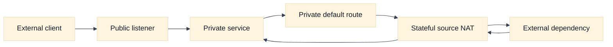
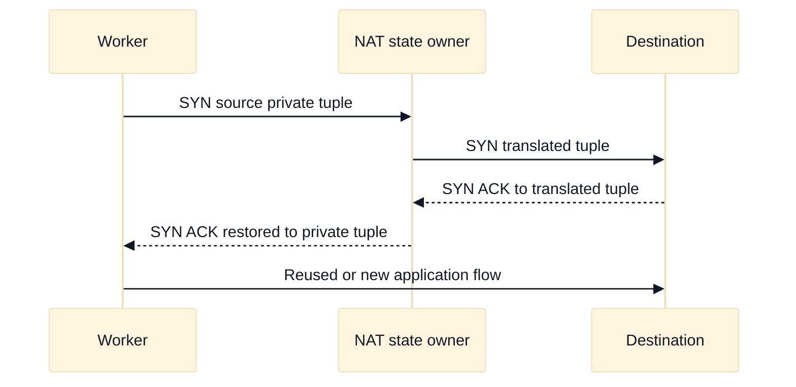

# Internet Ingress, NAT, and Egress

## A. Purpose, learning objectives, and assumptions

This topic prepares an SDE2 or Staff candidate to reason about Internet reachability as a set of independent contracts. A workload can have a route toward the Internet and still be unable to connect because address translation, policy, DNS, return traffic, service binding, or port capacity is wrong. Conversely, a public address can make a service reachable without making it safe. The interview goal is to explain the path, identify the state owner, and propose evidence before changing a rule.

By the end, you should be able to:

- distinguish public exposure, private egress, ingress forwarding, and source NAT;
- trace forward and reverse paths for IPv4 and IPv6;
- explain why NAT is not a firewall and why a private address is not automatically secure;
- estimate whether concurrent flows can exhaust translated ports or egress capacity;
- compare AWS and GCP terminology without treating similarly named products as equivalent; and
- build a bounded, evidence-led diagnosis for an ingress or egress failure.

**Prerequisites:** Review [`book/topics/24-nat-conntrack-and-snat.md`](../book/topics/24-nat-conntrack-and-snat.md) for protocol mechanics and [`book/02-addressing-subnetting-routing.md`](../book/02-addressing-subnetting-routing.md) for routing foundations. Assumptions: examples use fictional `203.0.113.0/24` and `198.51.100.0/24` addresses, a single application flow, and current provider behavior that must be verified for the selected region, service mode, and release. The examples are educational design exercises, not production change procedures.

## B. Vendor-neutral model: four different paths

Start with four questions: who initiates the connection, which address is visible on each leg, which device owns connection state, and what policy controls the path? Ingress is traffic initiated outside the trust boundary toward a service. Egress is traffic initiated by an internal workload toward an external destination. Return traffic is part of the same flow, but it may encounter a different route or policy if the design is asymmetric.

For IPv4, a private workload generally needs either a translated source address, an application proxy, or a private connection to reach a destination that cannot route private addresses. Source NAT changes the source tuple, often from `(10.20.4.17, 42310)` to `(203.0.113.20, 51001)`. The translator records the mapping so the response can be reversed. It does not, by itself, decide whether the application is authorized to connect, whether DNS returned the right address, or whether the destination is healthy.

Destination NAT or a reverse-proxy listener can map an externally visible destination to an internal service. A reverse proxy may terminate TLS, add an authenticated forwarding header, create a new backend connection, and apply application policy. A packet-forwarding design may preserve more of the transport flow but offers fewer application-level controls. Make this distinction explicit when asked for “a public IP.” The address is only one step in the path.

NAT capacity is often a tuple-capacity problem rather than a requests-per-second problem. A single translated source address has a finite set of source ports per destination tuple. Many short-lived connections, retries, large fan-out, or a small destination set can exhaust that space. Connection reuse and multiple egress addresses can help, but each adds operational cost and does not correct a broken return path.

IPv6 changes the address model but not the need for policy. A globally routable IPv6 address can avoid IPv4 source NAT, but it still needs explicit ingress and egress authorization, route advertisement, DNS correctness, and observability. Do not say “IPv6 is secure because it does not need NAT.” Say that reachability and authorization remain separate.

## C. AWS and GCP comparison

| Label | AWS example | GCP example | Interview boundary |
|---|---|---|---|
| **Vendor terminology** | Internet Gateway, NAT Gateway, and egress-only Internet Gateway | External address/forwarding resources and Cloud NAT | Compare the address family, route, state, and policy behavior of the selected design. |
| **Fact** | A NAT Gateway is commonly used for IPv4-initiated egress from private subnets through a route to the gateway. | Cloud NAT provides managed source translation for eligible private resources; routing and firewall policy remain separate concerns. | Verify eligible source types, regional scope, logging, port allocation, and pricing in current documentation. |
| **Fact** | An egress-only Internet Gateway supports outbound IPv6 connections while preventing unsolicited inbound initiation through that gateway path. | IPv6 egress and ingress behavior depends on the chosen subnet, address, route, and firewall configuration. | Never infer IPv6 policy from IPv4 NAT behavior. |
| **Inference** | A public-facing load balancer can be the ingress policy and TLS boundary while private targets use separate return routing. | The same architectural separation may apply, but product-specific source preservation and health-check behavior must be verified. | Draw the two legs and state where identity changes. |

AWS names several distinct components: an Internet Gateway connects a VPC to the Internet, a NAT Gateway commonly provides managed IPv4 source translation for private-subnet egress, and an egress-only Internet Gateway is the IPv6-specific outbound pattern. These are vendor terms, not a promise that every workload or address type can use every component.

GCP Cloud NAT is a managed translation service associated with a regional network design, while external addresses, forwarding rules, load balancers, routes, and firewall policies determine how traffic enters or leaves. GCP’s use of global VPC concepts and regional subnets creates a different scope model from AWS subnet-associated route tables. A strong comparison names the exact resource and scope instead of saying “AWS NAT equals GCP NAT.”

For either provider, verify: whether the workload has a default route, whether the route targets the intended egress service, whether the translated address is allowed by the destination, whether ephemeral port allocation is sufficient, whether health checks use an allowed source range, and whether logs contain enough flow and translation evidence. Pricing and quotas are also design inputs, especially for high-volume egress.

## D. Worked scenario and calculation

Fictional workers in three private zones call one external payment endpoint. Peak application demand is 2,400 requests per second, each request lasts 300 ms, and 8% of calls open a new TCP connection rather than using an existing pool. A rough average number of in-flight requests is `2,400 * 0.3 = 720`. New connection rate is approximately `2,400 * 0.08 = 192 connections/second`. If connections remain open for 20 seconds on average, the rough concurrent new-connection population is `192 * 20 = 3,840`.

That calculation is not a provider limit. It tells the candidate what to measure: per-destination translated-port use, connection reuse, idle timeout, retry amplification, number of egress addresses, and behavior during a zone loss. If one zone is lost, the remaining workers may create more connections and a retry storm may increase demand. The design should reserve headroom and expose a signal before failures become payment errors.

For ingress, place the public listener at the deliberate trust boundary, terminate or pass through TLS according to identity requirements, and route to private targets. For egress, give workers only the route and destination permissions they need, use a stable egress identity if the partner allowlists addresses, and retain a way to distinguish a policy denial from translation exhaustion. Do not make the payment provider reachable from every subnet merely because a shared NAT exists.

## E. Failure, evidence, and falsifiers

| Hypothesis | Evidence to collect | Falsifier |
|---|---|---|
| No usable egress route | Workload route, subnet association, next-hop status, destination prefix | A controlled flow reaches the intended translation service with the same source class. |
| Translation capacity is exhausted | Concurrent mappings, allocated ports, new-flow errors, retry rate, per-destination distribution | New flows succeed while the measured mapping population and port allocation remain well below limits. |
| Egress policy denies the flow | Firewall/policy decision, source identity, destination and port, policy revision | A policy-equivalent control flow succeeds and logs an allow decision. |
| Return traffic is asymmetric or filtered | Forward and reverse routes, translated tuple, state table, return ACL evidence | Both legs follow the expected state owner and a packet capture shows the response restored to the worker. |
| Ingress service is unhealthy | DNS answer, listener/TLS log, target health, backend logs, dependency timing | A request with the same SNI, path, headers, and source class succeeds end to end. |

Collect evidence for one time window and one request identifier where possible. A timeout is not proof of a NAT failure: the destination may have accepted the packet and failed later. Conversely, a successful DNS lookup is not proof of reachability. A falsifier should test the specific hypothesis, not merely produce another green dashboard.

## F. Exercises

### F1. Timed whiteboard: private workers and a public API

In 20 minutes, design egress for workers in three zones that call a partner API with an IP allowlist. Show DNS, route selection, translation, policy, return state, observability, and behavior after one zone fails. State whether you prefer one shared egress pool or zone-local egress and explain the blast radius, cost, and failover trade-off. Follow up by asking what changes for IPv6 and what evidence proves that the partner saw the expected source address.

### F2. Evidence-led debugging: intermittent outbound timeouts

Workers succeed for five minutes and then experience 12% timeouts. Build an ordered investigation: compare new and reused connection rates, inspect translated-port and mapping pressure, correlate flow logs with destination responses, check route and policy changes, and measure retries. Propose one reversible experiment with a bounded observation window. The interviewer should reject “increase the NAT size” unless the candidate first identifies the measured bottleneck and considers connection pooling or destination fan-out.

## G. Interview questions and direct answers

1. **Does NAT provide security?**

   **Answer:** NAT changes address identity and maintains translation state; it is not a complete authorization policy. Inbound behavior may be restricted as a consequence of state, but explicit firewall rules, service authentication, and least-privilege egress are still required. Treat reachability and authorization as separate interview dimensions.

2. **Why can private workloads fail to reach the Internet?**

   **Answer:** They may lack a default route, use the wrong next hop, be denied by policy, have no usable translation capacity, fail DNS, or receive a response on an asymmetric path. Trace the workload route, translation state, destination response, and return route in order instead of assuming the missing public address is the only cause.

3. **How would you recognize NAT port exhaustion?**

   **Answer:** New connections fail or time out while existing connections continue, often concentrated on a destination or translated address. Correlate new-flow errors, concurrent mappings, per-destination allocation, connection reuse, and retries. Add addresses or change pooling only after confirming the measured allocation pressure.

4. **What changes when moving from IPv4 to IPv6?**

   **Answer:** IPv6 can remove the need for IPv4 source translation, but it does not remove routing, firewall, DNS, identity, or observability requirements. Re-evaluate ingress exposure, egress policy, address ownership, dual-stack behavior, and application assumptions rather than carrying an IPv4 NAT design over unchanged.

5. **How do you make a partner allowlist reliable?**

   **Answer:** Give the partner a deliberately owned egress identity, document which workloads may use it, monitor translation and route health, and define a tested fallback address process. Avoid depending on an incidental public address. Include change control, provider limits, regional failure behavior, and a verification signal that the partner observed the intended source.

6. **How would you design a shared egress platform for many teams?**

   **Answer:** Establish tenant boundaries, approved destinations, identity-to-network policy, address allocation, quota and cost ownership, logging, and failure isolation. Offer a paved path for ordinary HTTP/S calls while allowing exceptional protocols through review. Define per-tenant budgets and a region-loss plan; a shared NAT that silently couples every team is a platform blast-radius problem.

### Staff follow-up

Ask: “The platform team proposes a single global egress pool because it is cheaper. What would you challenge?” A Staff answer should ask about data residency, partner allowlists, regional failure, port and throughput headroom, tenant isolation, attribution, incident ownership, and rollback. It should quantify the savings and compare them with the cost of correlated failure, not reject centralization reflexively.

## H. References and evidence labels

- **Fact / Vendor terminology:** [AWS NAT gateways](https://docs.aws.amazon.com/vpc/latest/userguide/vpc-nat-gateway.html).
- **Fact / Vendor terminology:** [AWS egress-only Internet gateways](https://docs.aws.amazon.com/vpc/latest/userguide/egress-only-internet-gateway.html).
- **Fact / Vendor terminology:** [Google Cloud Cloud NAT overview](https://cloud.google.com/nat/docs/overview).
- **Inference method:** [NAT, conntrack, and SNAT](../book/topics/24-nat-conntrack-and-snat.md).
- **Inference method:** [Addressing, subnetting, and routing](../book/02-addressing-subnetting-routing.md).

Provider statements above are labeled **Fact** or **Vendor terminology** when they describe documented concepts. Design conclusions are **Inference**. Verify current limits, supported source types, regional scope, IPv6 behavior, and pricing in the provider documentation for the selected account, project, region, and release.
