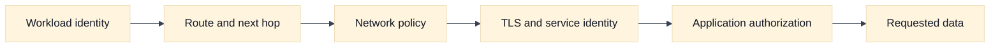
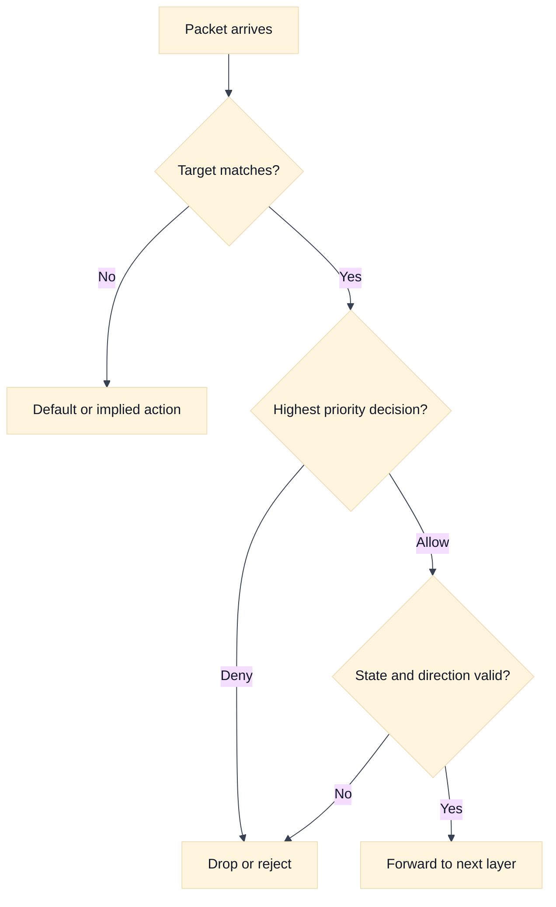

# Firewalls, Security Groups, and Network ACLs

## A. Purpose, learning objectives, and assumptions

This topic develops a precise way to discuss cloud network policy in SDE2 and Staff interviews. The key distinction is between reachability, authorization, and application identity. A route can make a packet reachable; a policy can allow or deny a flow; and an application can still reject the request. Candidates often lose clarity by calling every policy a firewall or by assuming that “deny” has the same stateful behavior everywhere.

By the end, you should be able to:

- place policy enforcement on a packet path and identify its state owner;
- distinguish stateful rules, stateless rules, ordered rules, and identity-aware controls;
- build a least-privilege dependency matrix from application requirements;
- compare AWS security groups and network ACLs with GCP firewall policies without false equivalence;
- diagnose return-port, rule-order, source-identity, and policy-drift failures; and
- design a multi-team policy platform with ownership, review, evidence, and rollback.

**Prerequisites:** Review [`book/topics/19-firewalls-security-groups-nacls.md`](../book/topics/19-firewalls-security-groups-nacls.md) for the provider-neutral policy model and [`book/17-network-security-waf-zero-trust.md`](../book/17-network-security-waf-zero-trust.md) for application and workload identity. Assumptions: addresses and service names are fictional; provider semantics and quotas must be verified for the exact product and release; examples are for learning, not an operational change procedure.

## B. Vendor-neutral model: policy is a chain of decisions

Begin with a five-tuple: protocol, source address, source port, destination address, and destination port. Then add direction, interface or workload identity, connection state, and application context. A policy may match only some of these dimensions. If a candidate says “the firewall allows the service,” ask which service port, from which source, in which direction, under which state, and at which attachment point.

Stateful policy tracks an accepted flow and usually permits the corresponding return traffic without requiring a separate reverse rule. Stateless policy evaluates packets independently, so the return direction and ephemeral ports may need explicit treatment. Neither model is inherently safer. Stateful rules reduce operational mistakes for established flows, while stateless rules can provide explicit, inspectable boundaries when carefully managed.

Policy order matters when rules are first-match, priority-based, or evaluated through a combination of hierarchical and local layers. A broad allow before a narrow deny can defeat the intended segmentation. A narrow deny may be shadowed by a higher-priority organization policy. Some systems combine multiple independent policy objects rather than using a single ordered list. The interview answer must name the evaluation model rather than assuming “last rule wins.”

Use a dependency matrix before writing rules. Rows are clients or workload identities; columns are services and ports. For each allowed edge, record purpose, protocol, expected direction, authentication method, owner, expiration, and evidence. Default deny is useful only if required dependencies such as DNS, time synchronization, identity endpoints, logging, and health checks are deliberately modeled. A policy that blocks every dependency can create a false sense of security while making diagnosis impossible.

Network policy is not application authorization. An allowed TCP connection does not prove that a caller is entitled to read data. A denied connection can be intentional even when the application would have rejected it. Explain the layers separately: routing, network policy, transport establishment, TLS or service identity, application authorization, and response.

## C. AWS and GCP comparison

| Label | AWS example | GCP example | Interview boundary |
|---|---|---|---|
| **Vendor terminology** | Security groups and network ACLs | VPC firewall rules, hierarchical firewall policies, and related policy layers | Do not call them interchangeable implementations of one “cloud firewall.” |
| **Fact** | AWS security groups are associated with network interfaces and are commonly discussed as stateful controls. | GCP VPC firewall rules are associated with network targets through provider-specific targeting and priority semantics. | Verify target selection, priority, implied behavior, and logging for the selected policy layer. |
| **Fact** | AWS network ACLs are subnet-level controls and are commonly treated as stateless, ordered packet filters. | GCP firewall policy layers and VPC rules have their own scope and evaluation model. | Explicitly reason about return traffic and rule evaluation instead of transferring NACL assumptions. |
| **Inference** | A security-group allow does not guarantee application authorization or a successful route. | A GCP firewall allow has the same conceptual limitation. | Reachability is a prerequisite, not proof of permission. |

In AWS terminology, a security group is attached to an elastic network interface and is generally stateful. A network ACL is associated with a subnet and is generally modeled as an ordered, stateless filter. These differences affect how return traffic, ephemeral ports, and deny rules are designed. They do not make a security group an application identity system.

In GCP, VPC firewall rules and hierarchical firewall policies have provider-specific targeting, priorities, scope, implied behavior, and logging. A GCP rule is not a direct synonym for an AWS security group or NACL. The useful comparison dimensions are attachment or target selection, direction, priority, state behavior, identity support, logging, and ownership. State the version and policy layer when exact behavior matters.

For either provider, ask who can change policy, how changes are reviewed, how unused rules are found, how emergency access expires, and whether logs distinguish no-match, deny, and application rejection. A mature answer also considers control-plane failure: an existing data-plane rule may continue to operate while a new policy deployment is delayed or partially applied.

## D. Worked scenario and policy matrix

Fictional `checkout` workloads need HTTPS to `payments`, DNS to a resolver, and telemetry to a collector. `payments` accepts HTTPS only from the checkout workload identity or its private service boundary. Operators need time-limited administrative access from a controlled bastion. No workload should accept unsolicited inbound traffic from the public Internet.

The first design artifact is a matrix:

| Source | Destination | Protocol | Purpose | Boundary and evidence |
|---|---|---|---|---|
| Checkout | Payments | TCP/443 | Payment request | Workload identity, policy decision, application audit ID |
| Checkout | Resolver | UDP/TCP/53 | Name resolution | Resolver logs and client query ID |
| Checkout | Telemetry | TCP/443 | Metrics and traces | Collector authentication and delivery backlog |
| Bastion | Checkout admin endpoint | TCP/22 or approved admin protocol | Time-limited support | Ticket, identity, session log, expiry |

Do not start with “allow the subnet.” Start with the narrow source set and the destination contract. If a load balancer or NAT changes the visible source, preserve the original identity through an authenticated mechanism or make the proxy the explicit policy boundary. Do not trust an arbitrary client-supplied header.





## E. Failure, evidence, and falsifiers

| Hypothesis | Evidence to collect | Falsifier |
|---|---|---|
| Rule does not target the workload | Effective policy, target selector, interface or tag identity, deployment revision | The effective policy shows the intended rule matching the exact source and destination. |
| Return traffic is denied | Reverse tuple, state model, ephemeral-port rule, subnet policy, flow decision | A controlled flow completes with the same direction and state under the same policy. |
| Rule order or hierarchy shadows the allow | Full priority chain, inherited policies, first matching decision, change history | The intended allow is the effective highest-priority decision. |
| Source identity changed at a proxy or NAT | Packet/header evidence at the enforcement point and trusted identity configuration | The enforcement point observes the expected authenticated source identity. |
| Network policy allows but app rejects | TLS identity, application status, authorization audit, request ID | The application records a successful authorization for the same request. |
| Policy drift caused intermittent behavior | Configuration snapshots by zone, rollout status, object version, time correlation | All instances have the same effective policy and the symptom persists unchanged. |

Flow logs can show that a decision was made, but they may not explain an application rejection or a missing control-plane update. Collect the effective policy at the workload, not only the intended source file. A green deployment pipeline is not a falsifier for policy drift unless it proves convergence at every relevant attachment point.

## F. Exercises

### F1. Timed whiteboard: least privilege for a three-tier service

In 25 minutes, design policy for a public API, private order service, database, resolver, telemetry collector, and operator access path. Show inbound and return traffic, policy attachment points, source identity changes, default-deny behavior, and emergency access expiry. Follow up by introducing a reverse proxy that hides client addresses. A strong answer identifies which policy is network-level and which authorization remains in the application.

### F2. Evidence-led debugging: one zone returns connection resets

Only one zone reports connection resets from `checkout` to `payments`; the application owners say no deployment occurred. Gather effective policy, target selection, route, flow logs, return-port evidence, proxy source identity, and policy rollout state. Form two competing hypotheses and define one falsifier for each before proposing a change. Then describe how to roll back a policy safely without opening the service to the entire network.

## G. Interview questions and direct answers

1. **What is the difference between a stateful and stateless network policy?**

   **Answer:** A stateful policy tracks an accepted flow and commonly permits its reverse traffic automatically. A stateless policy evaluates packets independently, so reverse traffic and ephemeral ports may need explicit rules. The exact behavior is provider-specific; stateful does not mean application-aware and stateless does not mean insecure.

2. **Why can an allowed rule still produce an application failure?**

   **Answer:** The rule proves only that a network path was permitted at that enforcement point. TLS identity, service authentication, application authorization, dependency health, or response handling can fail afterward. Correlate the network decision with transport, TLS, and application records using the same time and request identity.

3. **How do you avoid broad subnet-based rules?**

   **Answer:** Build a dependency matrix and express the narrowest stable source identity, destination, protocol, and purpose. Where a proxy or NAT changes addresses, make that component an explicit trust boundary and use authenticated workload identity. Add owner, expiry, evidence, and review metadata so the rule can be removed safely.

4. **How would you debug a rule that appears to be ignored?**

   **Answer:** Inspect the effective policy and target match, then evaluate hierarchy and priority, route direction, state behavior, and source identity. Compare intended configuration with the deployed revision at the failing instance. Test with a bounded control flow and use logs to distinguish no-match, deny, transport failure, and application rejection.

5. **How should a platform team manage policy for many services?**

   **Answer:** Provide typed policy interfaces, ownership, review, validation, staged rollout, effective-state checks, expiry, and per-team observability. Enforce non-negotiable organization boundaries centrally while allowing service teams to own local dependencies. Measure unused rules, deny rates, rollout convergence, and incident blast radius rather than counting rules as a security metric.

6. **How do you balance default deny with operability?**

   **Answer:** Inventory required dependencies before enforcement, start with observable reporting, add narrow allows, and stage by workload or zone. Preserve an audited break-glass path with automatic expiry. Default deny is a control objective; it becomes reliable only when DNS, identity, telemetry, updates, health checks, and rollback are included in the design.

### Leadership follow-up

Ask: “Security wants one central policy team to approve every network rule. What would you propose?” A Staff answer should separate global guardrails from local ownership, define a risk-based exception path, automate static and effective-policy checks, publish service contracts, and measure lead time and incident outcomes. Central review without clear interfaces can create shadow changes and emergency broad access.

## H. Advanced policy review: effective decisions and rollback safety

### H.1 Packet and request tuple walk-through

Assume `checkout` at `10.91.4.27:53001` calls `payments` at `10.92.8.14:443`. Walk `(10.91.4.27:53001 -> 10.92.8.14:443, TCP)` through route selection, interface or subnet policy, security-group or firewall evaluation, inspection, listener, and reverse state. Then add the request tuple: SNI, authenticated workload identity, tenant, method, path, and request ID. If a proxy or NAT changes the source, the policy at the next boundary must be evaluated against the new observed source or an authenticated identity.

A SYN permitted by one stateful control does not prove that a stateless control permits the return packet. Conversely, a flow record showing a deny at an enforcement point does not explain whether the rule missed, was shadowed by priority, or matched an unexpected source. State the policy layer, target selector, direction, and effective revision for every conclusion.

### H.2 Assumptions to calculation

Suppose a service has 1,200 dependencies, each requiring two directional policy observations during a staged default-deny rollout. The minimum evidence matrix is `1,200 x 2 = 2,400` dependency-direction checks, before health checks, DNS, telemetry, and administrative paths. If the team can validate 150 checks per review cycle, the base inventory requires 16 cycles; adding a 25% uncertainty reserve means planning for 20 cycles. The calculation is a planning estimate, not a policy quota.

For a stateful flow, assume 8,000 concurrent connections per zone and a 15% failover surge. A surviving zone must plan for `8,000 x 1.15 = 9,200` connections plus provider and inspection headroom. Falsify a capacity hypothesis with stable effective policy and connection counts below the tested threshold; falsify a target-selection hypothesis by showing the exact workload matched the intended rule in the failing zone.

### H.3 Provider non-equivalence and verification boundary

AWS security groups are interface-associated and commonly treated as stateful, while AWS network ACLs are subnet-level ordered filters with different return-traffic reasoning. GCP VPC firewall rules and hierarchical firewall policies have their own targeting, scope, priority, and evaluation semantics. Similar words such as “firewall,” “security group,” or “network ACL” do not establish equivalent attachment or state behavior.

Label documented behavior as **Fact** or **Vendor terminology**, and the recommendation to use layered policy as **Inference**. Verify effective policy, inherited hierarchy, target selection, implied behavior, logging, statefulness, quotas, and rollout semantics for the selected AWS/GCP account, project, region, and release. A provider comparison is incomplete until it explains what evidence the platform exposes for an actual tuple.

### H.4 Evidence, blast radius, and rollback

Interpret evidence by the question it can answer. A configured rule proves desired intent; effective-policy output proves what should match; a flow decision proves an observed packet reached that evaluator; a server log proves the request passed earlier controls. An absent flow log is not automatically a deny. Correlate timestamps, interface or target identity, source after translation, protocol, port, and rule revision.

Policy changes have a blast radius defined by target selection and shared hierarchy, not just by the file being edited. A high-priority shared deny may affect every region; a broad allow may expose every tenant. Stage with report-only or a narrow canary where supported, snapshot effective state, and preserve an audited break-glass path with expiry. Rollback should restore the prior policy version and verify convergence, but existing connections, cached decisions, and data already returned may outlive the rollback. Include those residual effects in the incident plan.

### H.5 Follow-up interview questions and substantive answers

**Follow-up 1: The rule says allow, but the request is denied. What do you inspect?**

**Answer:** I inspect whether the rule targeted the actual interface, tag, service account, or workload; whether a higher-priority or inherited rule won; whether the source changed at a proxy; and whether the denial occurred at another policy layer. I compare desired and effective state and use a bounded control flow with the same tuple. The word “allow” is not evidence of a match.

**Follow-up 2: Is default deny always the safest design?**

**Answer:** It is a strong objective for unknown traffic, but unsafe rollout can disable DNS, health checks, telemetry, updates, or recovery access. I would inventory dependencies, observe before enforcing, stage by failure domain, and define a narrow audited break-glass path. Safety includes recoverability and evidence, not only the deny default.

**Follow-up 3: How do you roll back a policy that exposed data?**

**Answer:** Stop or narrow the exposure first, preserve logs and effective policy, identify affected identities and data, and restore a known-good policy with verified convergence. Then rotate credentials or tokens if needed and assess data access separately. A network rollback limits future packets but cannot erase already observed data.

## J. AWS setup and use

This lab creates a security group with a narrow source rule and inspects the default network ACL. It intentionally does not associate a custom NACL with a live subnet. Read [AWS security groups](https://docs.aws.amazon.com/vpc/latest/userguide/vpc-security-groups.html) and [AWS network ACLs](https://docs.aws.amazon.com/vpc/latest/userguide/vpc-network-acls.html) before changing an environment. **Cost and state warning:** policy mutations can interrupt live traffic even when the control-plane call is free. Use a sandbox, a test security group, and the reserved documentation ranges below; never copy an open rule into production.

### J.1 Prerequisites and create a narrow security group

The caller needs permission to describe and create security groups and authorize or revoke security-group rules. `SOURCE_SG_ID` represents an approved test client group; a security-group reference expresses a workload relationship more safely than an arbitrary broad CIDR.

```bash
export AWS_PROFILE=AWS_PROFILE
export AWS_REGION=AWS_REGION
export VPC_ID=VPC_ID
export SOURCE_SG_ID=SOURCE_SG_ID
export DESTINATION_SG_NAME=interview-api-sg

aws sts get-caller-identity --profile "$AWS_PROFILE"
DESTINATION_SG_ID=$(aws ec2 create-security-group \
  --profile "$AWS_PROFILE" --region "$AWS_REGION" \
  --group-name "$DESTINATION_SG_NAME" \
  --description 'Educational API policy; source group only' --vpc-id "$VPC_ID" \
  --tag-specifications 'ResourceType=security-group,Tags=[{Key=Name,Value=interview-api-sg}]' \
  --query 'GroupId' --output text)

aws ec2 authorize-security-group-ingress \
  --profile "$AWS_PROFILE" --region "$AWS_REGION" \
  --group-id "$DESTINATION_SG_ID" --protocol tcp --port 443 \
  --source-group "$SOURCE_SG_ID"
```

The rule means “allow TCP 443 from interfaces in `SOURCE_SG_ID` to interfaces using `DESTINATION_SG_ID`,” subject to the actual AWS rule semantics and other controls. It does not attach to a subnet, does not authorize the operator’s IAM identity, and does not create a listener.

### J.2 Verify state and compare the NACL layer

```bash
aws ec2 describe-security-groups --profile "$AWS_PROFILE" --region "$AWS_REGION" \
  --group-ids "$DESTINATION_SG_ID" \
  --query 'SecurityGroups[0].{Id:GroupId,Vpc:VpcId,Ingress:IpPermissions,Egress:IpPermissionsEgress}'
aws ec2 describe-network-acls --profile "$AWS_PROFILE" --region "$AWS_REGION" \
  --filters "Name=vpc-id,Values=$VPC_ID" \
  --query 'NetworkAcls[].{Id:NetworkAclId,Associations:Associations,Entries:Entries}'
```

Expected evidence is the intended VPC, source-group reference, TCP/443 port, and an association between any test interface and the destination group. For a real request, inspect both stateful security-group decisions and the subnet’s stateless NACL entries, including ephemeral return ports. A listed “allow” is not proof that the rule targeted the actual interface or that another policy layer allowed the packet.

### J.3 Cleanup, rollback, and AWS troubleshooting follow-up

```bash
aws ec2 revoke-security-group-ingress --profile "$AWS_PROFILE" --region "$AWS_REGION" \
  --group-id "$DESTINATION_SG_ID" --protocol tcp --port 443 \
  --source-group "$SOURCE_SG_ID"
aws ec2 delete-security-group --profile "$AWS_PROFILE" --region "$AWS_REGION" \
  --group-id "$DESTINATION_SG_ID"
```

Delete only after confirming no interface uses the group. For a live rollback, restore the reviewed prior rule set and verify effective state; do not blindly delete a group that may be shared. **Question:** the AWS security-group rule allows TCP 443, but the client sees a timeout. **Answer:** I check the actual ENI attachments, subnet route and NACL, return-path ephemeral ports, target listener, flow evidence, and whether the source was translated by a proxy or NAT. I also confirm that the rule’s VPC and source-group reference are the intended ones. The rule’s existence alone does not prove a match.

## K. GCP setup and use

Google Cloud VPC firewall rules are evaluated with provider-specific priority and targeting semantics. This lab creates a narrow ingress rule targeted by a network tag and then uses configuration analysis for a precise path. Consult [Google Cloud VPC firewall rules](https://cloud.google.com/firewall/docs/firewalls). **Cost and state warning:** firewall changes can immediately allow or deny traffic in `PROJECT_ID`; Connectivity Tests and firewall logging may have usage implications. Use a sandbox network and a test-only target tag.

### K.1 Prerequisites and create a targeted rule

The caller needs permission to create, describe, and delete firewall rules. `NETWORK_NAME` must be a custom VPC and `TARGET_TAG` must be attached only to an approved ephemeral test VM. The source range is intentionally limited to the fictional subnet range.

```bash
export PROJECT_ID=PROJECT_ID
export NETWORK_NAME=NETWORK_NAME
export TARGET_TAG=interview-api
export SOURCE_RANGE=10.253.1.0/24
export FIREWALL_RULE=interview-api-allow-https

gcloud auth list
gcloud config set project "$PROJECT_ID"
gcloud compute firewall-rules create "$FIREWALL_RULE" \
  --project="$PROJECT_ID" --network="$NETWORK_NAME" \
  --direction=INGRESS --priority=900 --action=ALLOW \
  --rules=tcp:443 --source-ranges="$SOURCE_RANGE" \
  --target-tags="$TARGET_TAG" \
  --description='Educational rule; target only a fictional test VM'
```

The rule does nothing for a VM without `TARGET_TAG`, and it is only one layer in the decision. For a least-privilege alternative, target a service account when the organization’s policy model supports it and document why the chosen target is stable.

### K.2 Verify effective state and use Connectivity Tests

```bash
gcloud compute firewall-rules describe "$FIREWALL_RULE" --project="$PROJECT_ID" \
  --format='yaml(name,network,direction,priority,sourceRanges,allowed,targetTags,disabled)'
gcloud compute instances describe TEST_VM_NAME --project="$PROJECT_ID" --zone=ZONE \
  --format='yaml(name,networkInterfaces[].network,networkInterfaces[].subnetwork,tags.items,serviceAccounts[].email)'
gcloud network-management connectivity-tests create interview-firewall-test \
  --project="$PROJECT_ID" --source-instance="projects/$PROJECT_ID/zones/ZONE/instances/TEST_VM_NAME" \
  --destination-instance="projects/$PROJECT_ID/zones/ZONE/instances/TEST_DESTINATION_VM_NAME" \
  --destination-port=443 --protocol=TCP --round-trip
```

Replace the VM placeholders only with approved test endpoints. Expected evidence is a matching target tag or service account, the intended priority and source range, the correct network, and a Connectivity Test trace that names the decisive route or firewall rule. A rule listed by name does not prove it was selected; higher-priority or hierarchical policies may win.

### K.3 Cleanup, rollback, and GCP troubleshooting follow-up

```bash
gcloud compute firewall-rules delete "$FIREWALL_RULE" --project="$PROJECT_ID"
```

For a live rollback, disable or replace the rule through the reviewed change process, confirm convergence, and preserve logs. **Question:** a GCP firewall rule is `ALLOW`, but Connectivity Tests reports a block. **Answer:** I inspect target tags or service-account targeting, rule priority and direction, hierarchical firewall policies, source identity after any proxy, the selected route, and the exact project/network. I compare the test trace with flow logs. An allow rule that does not target the endpoint is not an effective allow.

## I. References and evidence labels

- **Fact / Vendor terminology:** [AWS security groups](https://docs.aws.amazon.com/vpc/latest/userguide/vpc-security-groups.html).
- **Fact / Vendor terminology:** [AWS network ACLs](https://docs.aws.amazon.com/vpc/latest/userguide/vpc-network-acls.html).
- **Fact / Vendor terminology:** [Google Cloud VPC firewall rules](https://cloud.google.com/firewall/docs/firewalls).
- **Inference method:** [Firewalls, security groups, and NACLs](../book/topics/19-firewalls-security-groups-nacls.md).
- **Inference method:** [Network security, WAF, and zero trust](../book/17-network-security-waf-zero-trust.md).
- **Provider setup:** [AWS security-group rules](https://docs.aws.amazon.com/vpc/latest/userguide/security-group-rules.html) and [Google Cloud firewall rules](https://cloud.google.com/firewall/docs/firewalls).

Provider behavior is labeled **Fact** or **Vendor terminology** when it describes documented concepts. Architectural recommendations are **Inference**. Confirm exact priority, state, targeting, logging, quota, and pricing behavior in current official documentation for the account, project, region, and release.
