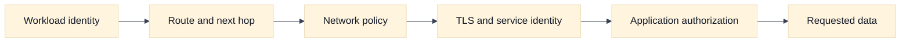
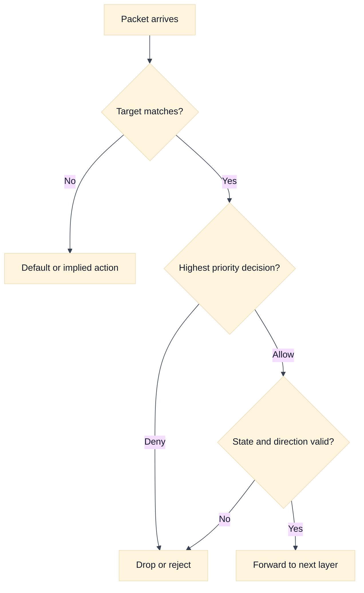

# Firewalls, Security Groups, and Network ACLs

## A. Purpose, learning objectives, and assumptions

This topic develops a precise way to discuss cloud network policy in SDE2 and Staff interviews. The key distinction is between reachability, authorization, and application identity. A route can make a packet reachable; a policy can allow or deny a flow; and an application can still reject the request. Candidates often lose clarity by calling every policy a firewall or by assuming that “deny” has the same stateful behavior everywhere.

By the end, you should be able to:

- place policy enforcement on a packet path and identify its state owner;
- distinguish stateful rules, stateless rules, ordered rules, and identity-aware controls;
- build a least-privilege dependency matrix from application requirements;
- compare AWS security groups and network ACLs with GCP firewall policies without false equivalence;
- diagnose return-port, rule-order, source-identity, and policy-drift failures; and
- design a multi-team policy platform with ownership, review, evidence, and rollback.

**Prerequisites:** Review [`book/topics/19-firewalls-security-groups-nacls.md`](../book/topics/19-firewalls-security-groups-nacls.md) for the provider-neutral policy model and [`book/17-network-security-waf-zero-trust.md`](../book/17-network-security-waf-zero-trust.md) for application and workload identity. Assumptions: addresses and service names are fictional; provider semantics and quotas must be verified for the exact product and release; examples are for learning, not an operational change procedure.

## B. Vendor-neutral model: policy is a chain of decisions

Begin with a five-tuple: protocol, source address, source port, destination address, and destination port. Then add direction, interface or workload identity, connection state, and application context. A policy may match only some of these dimensions. If a candidate says “the firewall allows the service,” ask which service port, from which source, in which direction, under which state, and at which attachment point.

Stateful policy tracks an accepted flow and usually permits the corresponding return traffic without requiring a separate reverse rule. Stateless policy evaluates packets independently, so the return direction and ephemeral ports may need explicit treatment. Neither model is inherently safer. Stateful rules reduce operational mistakes for established flows, while stateless rules can provide explicit, inspectable boundaries when carefully managed.

Policy order matters when rules are first-match, priority-based, or evaluated through a combination of hierarchical and local layers. A broad allow before a narrow deny can defeat the intended segmentation. A narrow deny may be shadowed by a higher-priority organization policy. Some systems combine multiple independent policy objects rather than using a single ordered list. The interview answer must name the evaluation model rather than assuming “last rule wins.”

Use a dependency matrix before writing rules. Rows are clients or workload identities; columns are services and ports. For each allowed edge, record purpose, protocol, expected direction, authentication method, owner, expiration, and evidence. Default deny is useful only if required dependencies such as DNS, time synchronization, identity endpoints, logging, and health checks are deliberately modeled. A policy that blocks every dependency can create a false sense of security while making diagnosis impossible.

Network policy is not application authorization. An allowed TCP connection does not prove that a caller is entitled to read data. A denied connection can be intentional even when the application would have rejected it. Explain the layers separately: routing, network policy, transport establishment, TLS or service identity, application authorization, and response.

## C. AWS and GCP comparison

| Label | AWS example | GCP example | Interview boundary |
|---|---|---|---|
| **Vendor terminology** | Security groups and network ACLs | VPC firewall rules, hierarchical firewall policies, and related policy layers | Do not call them interchangeable implementations of one “cloud firewall.” |
| **Fact** | AWS security groups are associated with network interfaces and are commonly discussed as stateful controls. | GCP VPC firewall rules are associated with network targets through provider-specific targeting and priority semantics. | Verify target selection, priority, implied behavior, and logging for the selected policy layer. |
| **Fact** | AWS network ACLs are subnet-level controls and are commonly treated as stateless, ordered packet filters. | GCP firewall policy layers and VPC rules have their own scope and evaluation model. | Explicitly reason about return traffic and rule evaluation instead of transferring NACL assumptions. |
| **Inference** | A security-group allow does not guarantee application authorization or a successful route. | A GCP firewall allow has the same conceptual limitation. | Reachability is a prerequisite, not proof of permission. |

In AWS terminology, a security group is attached to an elastic network interface and is generally stateful. A network ACL is associated with a subnet and is generally modeled as an ordered, stateless filter. These differences affect how return traffic, ephemeral ports, and deny rules are designed. They do not make a security group an application identity system.

In GCP, VPC firewall rules and hierarchical firewall policies have provider-specific targeting, priorities, scope, implied behavior, and logging. A GCP rule is not a direct synonym for an AWS security group or NACL. The useful comparison dimensions are attachment or target selection, direction, priority, state behavior, identity support, logging, and ownership. State the version and policy layer when exact behavior matters.

For either provider, ask who can change policy, how changes are reviewed, how unused rules are found, how emergency access expires, and whether logs distinguish no-match, deny, and application rejection. A mature answer also considers control-plane failure: an existing data-plane rule may continue to operate while a new policy deployment is delayed or partially applied.

## D. Worked scenario and policy matrix

Fictional `checkout` workloads need HTTPS to `payments`, DNS to a resolver, and telemetry to a collector. `payments` accepts HTTPS only from the checkout workload identity or its private service boundary. Operators need time-limited administrative access from a controlled bastion. No workload should accept unsolicited inbound traffic from the public Internet.

The first design artifact is a matrix:

| Source | Destination | Protocol | Purpose | Boundary and evidence |
|---|---|---|---|---|
| Checkout | Payments | TCP/443 | Payment request | Workload identity, policy decision, application audit ID |
| Checkout | Resolver | UDP/TCP/53 | Name resolution | Resolver logs and client query ID |
| Checkout | Telemetry | TCP/443 | Metrics and traces | Collector authentication and delivery backlog |
| Bastion | Checkout admin endpoint | TCP/22 or approved admin protocol | Time-limited support | Ticket, identity, session log, expiry |

Do not start with “allow the subnet.” Start with the narrow source set and the destination contract. If a load balancer or NAT changes the visible source, preserve the original identity through an authenticated mechanism or make the proxy the explicit policy boundary. Do not trust an arbitrary client-supplied header.

## E. Failure, evidence, and falsifiers

| Hypothesis | Evidence to collect | Falsifier |
|---|---|---|
| Rule does not target the workload | Effective policy, target selector, interface or tag identity, deployment revision | The effective policy shows the intended rule matching the exact source and destination. |
| Return traffic is denied | Reverse tuple, state model, ephemeral-port rule, subnet policy, flow decision | A controlled flow completes with the same direction and state under the same policy. |
| Rule order or hierarchy shadows the allow | Full priority chain, inherited policies, first matching decision, change history | The intended allow is the effective highest-priority decision. |
| Source identity changed at a proxy or NAT | Packet/header evidence at the enforcement point and trusted identity configuration | The enforcement point observes the expected authenticated source identity. |
| Network policy allows but app rejects | TLS identity, application status, authorization audit, request ID | The application records a successful authorization for the same request. |
| Policy drift caused intermittent behavior | Configuration snapshots by zone, rollout status, object version, time correlation | All instances have the same effective policy and the symptom persists unchanged. |

Flow logs can show that a decision was made, but they may not explain an application rejection or a missing control-plane update. Collect the effective policy at the workload, not only the intended source file. A green deployment pipeline is not a falsifier for policy drift unless it proves convergence at every relevant attachment point.

## F. Exercises

### F1. Timed whiteboard: least privilege for a three-tier service

In 25 minutes, design policy for a public API, private order service, database, resolver, telemetry collector, and operator access path. Show inbound and return traffic, policy attachment points, source identity changes, default-deny behavior, and emergency access expiry. Follow up by introducing a reverse proxy that hides client addresses. A strong answer identifies which policy is network-level and which authorization remains in the application.

### F2. Evidence-led debugging: one zone returns connection resets

Only one zone reports connection resets from `checkout` to `payments`; the application owners say no deployment occurred. Gather effective policy, target selection, route, flow logs, return-port evidence, proxy source identity, and policy rollout state. Form two competing hypotheses and define one falsifier for each before proposing a change. Then describe how to roll back a policy safely without opening the service to the entire network.

## G. Interview questions and direct answers

1. **What is the difference between a stateful and stateless network policy?**

   **Answer:** A stateful policy tracks an accepted flow and commonly permits its reverse traffic automatically. A stateless policy evaluates packets independently, so reverse traffic and ephemeral ports may need explicit rules. The exact behavior is provider-specific; stateful does not mean application-aware and stateless does not mean insecure.

2. **Why can an allowed rule still produce an application failure?**

   **Answer:** The rule proves only that a network path was permitted at that enforcement point. TLS identity, service authentication, application authorization, dependency health, or response handling can fail afterward. Correlate the network decision with transport, TLS, and application records using the same time and request identity.

3. **How do you avoid broad subnet-based rules?**

   **Answer:** Build a dependency matrix and express the narrowest stable source identity, destination, protocol, and purpose. Where a proxy or NAT changes addresses, make that component an explicit trust boundary and use authenticated workload identity. Add owner, expiry, evidence, and review metadata so the rule can be removed safely.

4. **How would you debug a rule that appears to be ignored?**

   **Answer:** Inspect the effective policy and target match, then evaluate hierarchy and priority, route direction, state behavior, and source identity. Compare intended configuration with the deployed revision at the failing instance. Test with a bounded control flow and use logs to distinguish no-match, deny, transport failure, and application rejection.

5. **How should a platform team manage policy for many services?**

   **Answer:** Provide typed policy interfaces, ownership, review, validation, staged rollout, effective-state checks, expiry, and per-team observability. Enforce non-negotiable organization boundaries centrally while allowing service teams to own local dependencies. Measure unused rules, deny rates, rollout convergence, and incident blast radius rather than counting rules as a security metric.

6. **How do you balance default deny with operability?**

   **Answer:** Inventory required dependencies before enforcement, start with observable reporting, add narrow allows, and stage by workload or zone. Preserve an audited break-glass path with automatic expiry. Default deny is a control objective; it becomes reliable only when DNS, identity, telemetry, updates, health checks, and rollback are included in the design.

### Staff follow-up

Ask: “Security wants one central policy team to approve every network rule. What would you propose?” A Staff answer should separate global guardrails from local ownership, define a risk-based exception path, automate static and effective-policy checks, publish service contracts, and measure lead time and incident outcomes. Central review without clear interfaces can create shadow changes and emergency broad access.

## H. References and evidence labels

- **Fact / Vendor terminology:** [AWS security groups](https://docs.aws.amazon.com/vpc/latest/userguide/vpc-security-groups.html).
- **Fact / Vendor terminology:** [AWS network ACLs](https://docs.aws.amazon.com/vpc/latest/userguide/vpc-network-acls.html).
- **Fact / Vendor terminology:** [Google Cloud VPC firewall rules](https://cloud.google.com/firewall/docs/firewalls).
- **Inference method:** [Firewalls, security groups, and NACLs](../book/topics/19-firewalls-security-groups-nacls.md).
- **Inference method:** [Network security, WAF, and zero trust](../book/17-network-security-waf-zero-trust.md).

Provider behavior is labeled **Fact** or **Vendor terminology** when it describes documented concepts. Architectural recommendations are **Inference**. Confirm exact priority, state, targeting, logging, quota, and pricing behavior in current official documentation for the account, project, region, and release.
