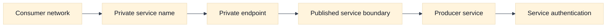
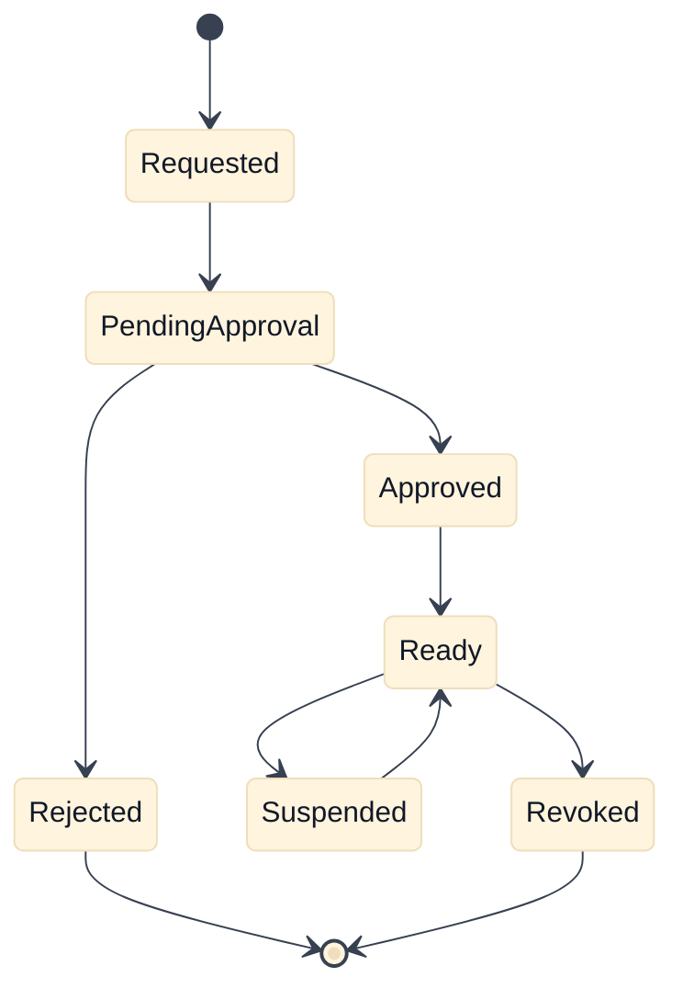

# Private Connectivity and Service Publishing

## A. Purpose, learning objectives, and assumptions

Private connectivity is often described too broadly. Peering, transit, VPN, private service endpoints, and service publishing solve different problems. This topic teaches candidates to select among them by asking whether the consumer needs network reachability or access to one service, who owns each side, whether address spaces overlap, how DNS should resolve, and how authorization is granted.

By the end, you should be able to:

- distinguish network-to-network connectivity from consumer-to-service publication;
- model producer and consumer ownership, approval, DNS, source identity, and failure domains;
- select peering, transit, VPN, or a private service endpoint from explicit constraints;
- compare AWS PrivateLink and GCP Private Service Connect without claiming semantic identity;
- diagnose private DNS, endpoint provisioning, authorization, and return-path failures; and
- design a multi-tenant private service platform with safe onboarding and revocation.

**Prerequisites:** Review [`book/topics/37-cloud-networking-primitives.md`](../book/topics/37-cloud-networking-primitives.md) for portable concepts and [`book/02-addressing-subnetting-routing.md`](../book/02-addressing-subnetting-routing.md) for route behavior. Assumptions: examples use fictional organizations and reserved documentation addresses. Product scope, regional behavior, endpoint types, source translation, quotas, and pricing must be verified in current official documentation. This module is a learning guide, not a provider change runbook.

## B. Vendor-neutral model: connect the needed boundary

Network connectivity joins routing domains. If two networks can route to one another, that does not mean every service should be reachable or that every consumer is authorized. A service-publishing design exposes a bounded service interface to approved consumers. The provider can control acceptance, endpoint lifecycle, protocol, identity, and deprecation without giving the consumer broad routes to the producer network.

Peering is appropriate when two network owners need selected or broad private reachability and can coordinate address planning, routes, policy, and lifecycle. It is often non-transitive or has limited route propagation, so a chain of peerings should not be assumed to form a transit network. Transit or hub-and-spoke designs centralize routing and policy but increase dependency on the hub and require careful blast-radius management.

VPN and dedicated private links connect network domains across an underlay. They introduce tunnel or circuit state, routing convergence, MTU considerations, encryption or provider handoff, and ownership on both sides. They are good answers when many services or protocols require network reachability, but they may expose more of the producer’s address space than a single service endpoint should.

Private service publication is service-oriented. The consumer creates or receives a private endpoint, resolves a service name to that endpoint, and sends traffic through a provider-managed abstraction. The producer approves or rejects consumers; the endpoint may have a regional or zonal scope; and the provider may translate the source address. Therefore, application authorization must not rely solely on the original consumer address unless the product explicitly preserves it and the design authenticates it.

Use a decision sequence in interviews: (1) How many services and protocols? (2) Which team owns each boundary? (3) Are CIDRs overlapping? (4) Must consumers discover one service or route to a network? (5) What is the required source identity? (6) What are the availability, region, cost, quota, and revocation requirements? (7) What evidence proves the endpoint is approved, resolved, reachable, and authorized?

## C. AWS and GCP comparison

| Label | AWS example | GCP example | Interview boundary |
|---|---|---|---|
| **Vendor terminology** | AWS PrivateLink interface endpoint and endpoint service | Private Service Connect endpoint, published service, and service attachment | Both are service-oriented private publication patterns; names do not prove identical behavior. |
| **Fact** | A producer can publish a service through an endpoint service and consumers can connect through private endpoints under provider-specific acceptance rules. | A producer can publish a service through a service attachment and consumers can connect through PSC endpoints or related consumer constructs. | Verify approval, regional scope, DNS, source translation, and endpoint type. |
| **Inference** | Service publication can reduce consumer route exposure compared with broad network connectivity. | The same architectural inference applies when the selected PSC mode exposes only the intended service. | Confirm which addresses and protocols are actually reachable. |
| **Fact** | PrivateLink behavior depends on endpoint type, load balancer integration, private DNS, and service configuration. | PSC behavior depends on service attachment, endpoint configuration, forwarding or DNS choices, and producer policy. | Compare configuration contracts, not marketing categories. |

AWS PrivateLink commonly uses an endpoint service backed by a provider-side service and consumer-side interface endpoints. The provider may control acceptance and permitted principals. The exact source visibility, DNS behavior, regional constraints, and load-balancer integration are product details that must be verified before using client IP as an authorization signal.

GCP Private Service Connect commonly uses a published service attachment and a consumer endpoint. The producer and consumer relationships, endpoint addressing, DNS, acceptance policy, and regional behavior are distinct concepts. A PSC endpoint is not automatically a general route to the producer VPC. Conversely, a private endpoint that resolves successfully may still be pending approval or blocked by service policy.

Peering and transit remain separate alternatives in both ecosystems. Use them when the requirement is network reachability across multiple services or protocols; use private publication when the contract is a bounded service. State the trade-off: service endpoints simplify consumer exposure and producer revocation, while transit can simplify many-to-many routing but increases shared blast radius and policy complexity.

## D. Worked scenario and endpoint lifecycle

Fictional platform team `payments-platform` publishes a private HTTPS API to 40 application teams. Teams are spread across two regions, some have overlapping RFC1918 ranges, and the producer must revoke one team without changing all others. The endpoint should resolve to a private address, expose only TCP/443, and preserve application identity through mTLS or a signed token rather than trusting a source address.

The design favors service publication over full network peering. Define an onboarding contract: consumer identity, region, endpoint name, allowed protocol, producer approval, DNS zone association, health behavior, quota, cost owner, and revocation procedure. If the service is stateful or regional, document what endpoint failover means. A consumer endpoint may remain available while the backend is unhealthy, so health must be visible at both provider and consumer boundaries.

The lifecycle is part of the security model. “Created” is not “approved,” “approved” is not “DNS visible,” and “DNS visible” is not “healthy.” A platform should expose each state and its owner. Revocation should prevent new authorization while allowing a documented drain period if business semantics require it.

## E. Failure, evidence, and falsifiers

| Hypothesis | Evidence to collect | Falsifier |
|---|---|---|
| Endpoint is not approved or ready | Endpoint lifecycle, producer acceptance, consumer status, change history | Both sides report ready and the same endpoint identity is used by the test. |
| Private DNS points to the wrong service | Resolver path, zone association, answer, TTL, client location | Authoritative and client answers resolve to the intended endpoint address. |
| Consumer route or policy blocks the endpoint | Effective route, endpoint target, firewall decision, protocol and port | A controlled connection from the same consumer identity reaches the endpoint. |
| Producer backend is unhealthy | Provider health, target logs, backend dependency state, endpoint metrics | Direct provider-side health and an endpoint request succeed under the same contract. |
| Source identity assumption is wrong | Source seen at producer, translation behavior, mTLS/token audit | Producer validates an authenticated identity independent of untrusted source address. |
| Region or quota scope was misunderstood | Endpoint and service region, allocation/quota state, documentation version | A same-scope control endpoint works and quota is demonstrably available. |

Debug the name, endpoint state, route, policy, producer acceptance, and application authentication as separate layers. A successful TCP handshake does not prove that the consumer reached the intended tenant or that the producer authorized the request. Conversely, an application denial does not prove that private connectivity is broken.

## F. Exercises

### F1. Timed whiteboard: partner API with overlapping CIDRs

In 25 minutes, choose among peering, transit, VPN, and private service publication for a partner API. The partner has overlapping private ranges, needs HTTPS only, requires per-tenant revocation, and cannot accept a route to your entire network. Show DNS, endpoint lifecycle, approval, policy, source identity, and failure handling. Follow up by asking how the design changes if the partner needs database replication and several non-HTTP protocols.

### F2. Evidence-led debugging: private name resolves but requests fail

A consumer’s private DNS name resolves to a private address, but requests time out. Build an evidence plan that checks endpoint readiness, route, policy, producer health, return traffic, MTU or TLS behavior, and application authorization. State one falsifier for each of two competing hypotheses. Propose a safe test that does not grant broad network access or bypass producer approval.

## G. Interview questions and direct answers

1. **When is private service publication better than peering?**

   **Answer:** It is better when consumers need one bounded service, producer-controlled approval and revocation, or isolation from the producer’s broader routes. Peering is more appropriate when both sides need intentional network reachability across many services. Confirm protocol, source identity, region, DNS, cost, and lifecycle requirements before choosing.

2. **Does a private endpoint prove that a service is reachable?**

   **Answer:** No. It proves that an endpoint object or address exists. The endpoint may be pending approval, have a wrong private DNS association, lack a route or policy allow, target an unhealthy backend, or fail TLS or application authentication. Validate each state with evidence from both consumer and producer sides.

3. **Why can overlapping CIDRs matter less for service publication?**

   **Answer:** A service-oriented endpoint can avoid requiring broad route exchange between consumer and producer networks. The exact benefit depends on endpoint and source translation behavior, and application identity still matters. If the design requires arbitrary network reachability, overlapping ranges remain a major routing and migration constraint.

4. **What should the producer authenticate?**

   **Answer:** The producer should authenticate the consumer or workload using a trusted mechanism such as mTLS, a signed token, or provider-supported identity. A source address may be useful as a network signal but is unsafe as the sole application identity when an endpoint, proxy, or translation layer can change it.

5. **How do you operate a private service platform at scale?**

   **Answer:** Define a versioned service contract covering endpoint type, DNS, regions, health, quotas, cost, authentication, approval, revocation, and support ownership. Automate onboarding and effective-state checks, isolate tenants, expose producer and consumer evidence, and test failure and deprecation paths. Measure adoption, error budget, stale endpoints, and time to revoke.

6. **How would you choose between central transit and many private endpoints?**

   **Answer:** Compare the required reachability graph, service count, protocol diversity, ownership, isolation, route scale, failure domains, cost, and policy complexity. Transit can reduce endpoint sprawl but centralizes blast radius. Private endpoints reduce route exposure but add lifecycle and quota management. Make the decision reversible where practical and document the boundary.

### Staff follow-up

Ask: “A business unit wants every consumer connected to the producer network for convenience.” A Staff answer should challenge the requirement, offer a service contract, quantify blast radius and operational cost, define exceptions for genuine network-level needs, and establish an exit path. It should include the customer experience of onboarding and revocation, not only packet reachability.

## H. References and evidence labels

- **Fact / Vendor terminology:** [AWS PrivateLink concepts](https://docs.aws.amazon.com/vpc/latest/privatelink/concepts.html).
- **Fact / Vendor terminology:** [AWS interface VPC endpoints](https://docs.aws.amazon.com/vpc/latest/privatelink/vpc-endpoints-access.html).
- **Fact / Vendor terminology:** [Google Cloud Private Service Connect](https://cloud.google.com/vpc/docs/private-service-connect).
- **Inference method:** [Cloud networking primitives](../book/topics/37-cloud-networking-primitives.md).
- **Inference method:** [Addressing, subnetting, and routing](../book/02-addressing-subnetting-routing.md).

Provider concepts are labeled **Fact** or **Vendor terminology**; design conclusions are **Inference**. Verify endpoint type, source visibility, acceptance, DNS, regional scope, supported protocols, quotas, and pricing in current official documentation for the selected account, project, region, and release.
