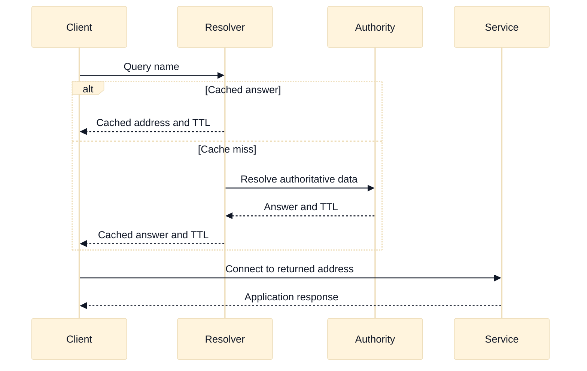

# DNS and Service Discovery

## A. Purpose, learning objectives, and assumptions

DNS is both a naming system and a distributed control-plane dependency. A correct answer in an SDE2 or Staff interview must separate authoritative data, recursive resolution, caching, endpoint selection, connection establishment, and application health. “DNS works” can mean only that one resolver returned one record. It does not prove that every client received the intended answer, that the address is reachable, or that the service is healthy.

By the end, you should be able to:

- trace a recursive query through client, resolver, cache, and authority;
- design public, private, split-horizon, forwarding, and service-discovery boundaries;
- explain TTL, negative caching, stale data, weighted answers, and client behavior;
- compare AWS Route 53 patterns with Google Cloud DNS patterns without false equivalence;
- debug wrong-region, stale-private-zone, delegation, and endpoint-lifecycle failures; and
- design discovery ownership and SLOs for a multi-team platform.

**Prerequisites:** Review [`book/06-dns-resolution-and-operations.md`](../book/06-dns-resolution-and-operations.md), [`docs/06-ddi.md`](../docs/06-ddi.md), and [`book/topics/20-service-discovery-configuration.md`](../book/topics/20-service-discovery-configuration.md). Assumptions: names use fictional `.test` domains and addresses are reserved documentation ranges. Provider behavior, resolver features, routing policies, and limits must be verified for the exact account, project, region, and release. This is an interview-prep guide, not a production DNS change runbook.

## B. Vendor-neutral model: name resolution is not health

When a client requests `api.payments.test`, identify the client stub, configured recursive resolver, cache state, authoritative server, response policy, and resulting connection path. A resolver may answer from cache without contacting authority. A client library may cache longer or shorter than the DNS TTL. An application may resolve once at startup and retain the address while an operator believes a record change has propagated.

Authoritative data says what an owner publishes. Recursive resolution retrieves and caches that data for clients. Split-horizon DNS returns different answers based on the resolver’s view or client context, often separating private and public service paths. Forwarding sends selected names to another resolver or authority. Every boundary needs an owner and a failure signal. If a private resolver forwards a name to a public resolver, confirm that the answer is safe and that the query path does not violate data or tenancy requirements.

TTL is a cache-control hint, not a command that every client obeys exactly. Positive answers and negative answers can have different caching behavior. Lowering a TTL shortly before a change may not affect clients that already cached the previous value. A low TTL may increase resolver load and cost without improving failover if clients pin connections or libraries cache independently. Discuss both DNS convergence and connection convergence.

Service discovery adds registration and lifecycle. A service may register an address, port, protocol, health state, and metadata; a client chooses an endpoint; and a control plane reconciles desired membership with actual backends. DNS-based discovery is not the same as a load balancer: it may return multiple addresses, while selection, retries, health checking, and connection reuse remain client responsibilities. Use a load balancer when the service contract needs centralized transport or application policy.

For a failover design, state the detection owner, decision interval, answer policy, stale-data behavior, client retry behavior, data safety, and rollback. A DNS answer can successfully steer a new client while existing long-lived connections remain on the old endpoint. Staff answers quantify the resulting user-visible convergence rather than promising instant failover.

## C. AWS and GCP comparison

| Label | AWS example | GCP example | Interview boundary |
|---|---|---|---|
| **Vendor terminology** | Route 53 hosted zones, private hosted zones, Resolver endpoints, and routing policies | Cloud DNS public/private zones, forwarding, peering, and policies | Compare authority, resolver path, visibility, and ownership. |
| **Fact** | Route 53 can host public and private zones and provides resolver-related constructs for VPC DNS integration. | Cloud DNS supports public and private zones plus forwarding and peering patterns with provider-specific scope. | Verify attachment, forwarding, inbound/outbound paths, and regional or global behavior. |
| **Fact** | Route 53 routing policies can influence answers, but answer selection does not replace endpoint health or application state. | Cloud DNS policies and related integrations have their own answer and health semantics. | Verify the selected feature instead of assuming policy names match. |
| **Inference** | A private endpoint requires coordinated private DNS and client resolver visibility. | The same architectural inference applies to GCP private service endpoints. | A private answer is useful only when clients can route to and authorize the returned address. |

AWS Route 53 terminology includes public hosted zones, private hosted zones associated with VPCs, and Resolver endpoints used for forwarding or hybrid resolution. Routing policies can influence which answers clients receive, but the candidate should still ask how health is measured, how cached answers behave, and how clients reuse connections.

Google Cloud DNS terminology includes public and private managed zones, forwarding zones, and peering or policy mechanisms. Scope and attachment differ by construct. A GCP private zone is not automatically visible to every VPC or on-premises resolver, and a forwarding rule is not automatically an authoritative record. Verify the query path and the effective resolver configuration.

The portable comparison is: who is authoritative, which clients can see the zone, where recursion occurs, how forwarding is selected, what health signal changes an answer, what TTL is published, and who owns records. Keep vendor facts separate from design inference. Provider product labels and feature limits can change, so current official documentation is part of the production decision.

## D. Worked scenario and query path

Fictional clients inside `app.test` should resolve `api.payments.test` to a private endpoint at `198.51.100.40`, while Internet clients should receive a public entry address at `203.0.113.40`. The private endpoint can be revoked per consumer, and a regional failover should direct new private clients to a secondary service when health and data-safety conditions are met.

Design two explicit views with ownership and evidence. The private resolver must be associated with the intended client networks, and its answer must point to an address reachable through the client route and allowed by policy. Public authority must not accidentally leak private addresses. During failover, update the decision input only after the secondary endpoint is ready. The runbook should identify existing TTLs, client cache behavior, long-lived connections, and a rollback condition.

The evidence chain is intentionally longer than “dig returned an address.” Capture the resolver used, query view, answer, TTL, authority or cache state, selected endpoint, route, policy decision, TLS identity, and application response. A correct answer with an unreachable address is a DNS success and a service failure.

## E. Failure, evidence, and falsifiers

| Hypothesis | Evidence to collect | Falsifier |
|---|---|---|
| Client used the wrong DNS view | Resolver address, zone association, search path, query context, answer | The client used the intended resolver and received the intended view. |
| Stale positive or negative cache | Record TTL, negative TTL, cache timestamps, client-library behavior | Independent resolver paths and a fresh query show the same current answer. |
| Delegation or forwarding is broken | Authority chain, forwarding rule, resolver logs, response code | Authority and resolver both answer correctly for the same name. |
| Answer is correct but address is unreachable | Route, policy, endpoint state, transport and TLS logs | A same-context control client reaches and authenticates to the returned address. |
| Health-driven failover is unsafe or delayed | Health inputs, decision timestamps, TTL, open connections, data state | The answer changed only after the target met readiness and safety gates. |
| Record ownership or automation drifted | Zone ownership, deployment revision, audit trail, desired versus effective record | Independent ownership and effective state match the intended record. |

Use at least two resolver paths when investigating propagation. Compare authoritative data with recursive answers and note the time of each observation. A public lookup may tell you nothing about a private zone. A resolver answer may be valid according to TTL while the application remains unhealthy because connections are pooled or the endpoint’s certificate does not match the name.

## F. Exercises

### F1. Timed whiteboard: split-horizon private service

In 25 minutes, design public and private resolution for an API that has a public browser client, private workloads, and an on-premises caller connected through a hybrid link. Show authoritative zones, recursive resolvers, forwarding, TTL, endpoint addresses, policy, certificate names, and ownership. Follow up by asking how a private endpoint is revoked for one consumer and how you prove that public DNS never returns the private address.

### F2. Evidence-led debugging: failover did not reach clients

An operator says the primary record was changed, but half of clients still connect to the old region after 30 minutes. Separate authority, recursive cache, client-library cache, existing connections, and health-driven routing. Collect timestamps and define a falsifier for “DNS propagation is slow.” Then propose a safe failover test that does not lower TTL blindly or send writes to an unready secondary.

## G. Interview questions and direct answers

1. **What does a successful DNS lookup prove?**

   **Answer:** It proves that one resolver returned an answer for one client context at one time. It does not prove that all clients see the same view, that the address is reachable, that policy allows it, that TLS matches, or that the service is healthy. Validate each subsequent layer separately.

2. **Why might lowering TTL not produce fast failover?**

   **Answer:** Existing caches may retain the previous answer, clients may cache independently, applications may resolve only at startup, and existing connections may remain open. Failover convergence is the maximum of DNS, client, connection, and application behavior. Measure those components instead of treating TTL as a universal deadline.

3. **When would you use service discovery instead of a load balancer?**

   **Answer:** Use discovery when clients can select among endpoint instances and own retry or locality behavior. Use a load balancer when centralized transport termination, health enforcement, application routing, source handling, or policy is required. A discovery record does not automatically provide those load-balancer contracts.

4. **How do you debug a private name that resolves publicly?**

   **Answer:** Identify the client’s actual resolver and search path, verify private-zone visibility or association, inspect forwarding and precedence, and compare the effective answer with the authoritative private record. Then check route and policy. Do not fix it by publishing private addresses in a public zone.

5. **How should teams own DNS records?**

   **Answer:** Assign a clear zone and record owner, define service registration and deletion contracts, validate names and targets, log changes, and expose effective state. Platform teams should provide safe primitives and delegation boundaries; service teams should own lifecycle and health semantics. Stale records and unbounded TTLs are operational debt.

6. **How would you design DNS failover for a stateful service?**

   **Answer:** Start with data ownership and write safety, then define readiness, fencing, health signals, answer policy, TTL, client behavior, RTO/RPO, and rollback. Route new clients only after the secondary is safe. Treat DNS steering as one step; it cannot make stale writes, open connections, or unreplicated state safe.

### Staff follow-up

Ask: “Product wants a five-second DNS failover guarantee.” A Staff answer should challenge the guarantee’s scope, measure resolver and client behavior, discuss connection reuse and health decision latency, define what “failed over” means for reads and writes, and offer a testable SLO. It should also explain the cost and load impact of very low TTLs.

## H. Advanced DNS review: cache behavior, identity, and failover

### H.1 Packet and request tuple walk-through

Assume a client at `10.111.4.21` requests `payments.internal.test`. The first tuple is a DNS query from the client’s configured resolver, such as `(10.111.4.21:53000 -> 10.111.0.53:53, UDP)`, but the application tuple comes later: `(10.111.4.21:49152 -> 10.112.8.14:443, TCP)` with SNI `payments.internal.test` and request ID `d-621`. Trace both. The resolver’s answer and TTL determine the destination candidate; the route and policy determine reachability; TLS validates the name and certificate; service discovery or load balancing determines the backend; application health determines whether the request succeeds.

If the client uses a sidecar, node-local cache, forwarding resolver, or split-horizon view, record every answer and cache boundary. A public answer can be syntactically correct yet wrong for a private client. A private answer can be correct while the endpoint is pending or unreachable. The key interview distinction is that name resolution chooses an address; it does not attest to route, authorization, health, or freshness.

### H.2 Assumptions to calculation

Suppose a service has a 30-second authoritative TTL, a resolver cache that honors it, a client library that resolves at process start, and existing TCP connections that last up to 120 seconds. A DNS failover cannot be promised in 30 seconds: new lookups may converge around 30 seconds, process-start clients may not re-resolve at all, and existing connections can persist for up to 120 seconds. A conservative client-visible bound is at least `max(30, 120)` seconds, plus health decision and retry time, subject to measurement.

For service discovery, assume 200 instances and 20 clients each refreshing every 15 seconds. That is about `200 / 15 = 13.3` registration observations per second if spread evenly, but a control-plane event or synchronized refresh can create a burst. The estimate informs rate-limit and cache design; verify actual resolver, registry, and provider policy limits. Falsify a stale-cache hypothesis with independent clients using a fresh query and observing the same new answer.

### H.3 Provider non-equivalence and verification boundary

Route 53 private hosted zones, Resolver endpoints, routing policies, Cloud DNS private zones, forwarding, peering, and policies provide related capabilities with different visibility, attachment, health, scope, and ownership semantics. A Route 53 routing policy is not automatically equivalent to a Cloud DNS policy, and a private zone association does not imply that every workload uses the intended resolver. AWS and GCP load-balancer health integrations and failover behavior also differ by selected product.

Use **Fact** or **Vendor terminology** for provider constructs and **Inference** for the portable model that DNS is a control-plane dependency with cache delay. Verify authoritative answers, resolver path, zone visibility, forwarding precedence, health inputs, TTL/negative caching, regional scope, quotas, and pricing in the exact AWS/GCP environment. State the provider feature mode and client behavior before promising a recovery time.

### H.4 Evidence, blast radius, and rollback

Interpret DNS evidence by vantage point and time: client resolver configuration, cache timestamp, recursive response, authoritative response, record version, and application lookup behavior. An `NXDOMAIN` may be cached negatively; a correct answer from an external resolver does not falsify a private-view problem. A new DNS answer falsifies only the stale-answer hypothesis for that client and lookup path, not the open-connection or authorization hypotheses.

DNS changes have a broad blast radius because one record can redirect many clients, regions, tenants, or data operations. Before changing a high-value record, define old and new targets, readiness and fencing conditions, TTL effects, client refresh behavior, and rollback authority. Use a canary name or small client cohort where possible. Rollback means restoring the prior answer and ensuring the old target is still safe; it does not instantly terminate clients holding the new answer or make unsafe writes disappear. For stateful failover, data ownership must be solved before DNS steering.

### H.5 Follow-up interview questions and substantive answers

**Follow-up 1: Why did a five-second TTL not produce five-second failover?**

**Answer:** The TTL controls eligible cache lifetime, not process behavior, negative caching, health-decision latency, connection reuse, or retry timing. I would measure the resolver path, client lookup frequency, open connections, and health transition timestamps. I would define a testable client-visible SLO instead of promising a TTL-sized outage window.

**Follow-up 2: When is service discovery better than a load balancer?**

**Answer:** Discovery is useful when clients can select instances, understand locality, and own retries and health interpretation. A load balancer is better when centralized TLS, transport policy, health enforcement, draining, or application routing is required. I would compare failure semantics and observability, because a list of addresses is not a load-balancer contract.

**Follow-up 3: How do you roll back a bad DNS migration?**

**Answer:** Restore the prior record or routing policy, keep the old service healthy, identify clients that cached the new answer, and monitor both targets until caches and connections converge. If writes or credentials crossed the wrong boundary, involve application and security owners. DNS rollback limits future selection; it cannot reverse completed requests or erase cached data.

## I. References and evidence labels

- **Fact / Vendor terminology:** [Amazon Route 53 developer guide](https://docs.aws.amazon.com/Route53/latest/DeveloperGuide/Welcome.html).
- **Fact / Vendor terminology:** [Amazon Route 53 private hosted zones](https://docs.aws.amazon.com/Route53/latest/DeveloperGuide/hosted-zones-private.html).
- **Fact / Vendor terminology:** [Google Cloud DNS overview](https://cloud.google.com/dns/docs/overview).
- **Fact / Vendor terminology:** [Google Cloud DNS forwarding](https://cloud.google.com/dns/docs/zones/forwarding-zones).
- **Inference method:** [DNS resolution and operations](../book/06-dns-resolution-and-operations.md).
- **Inference method:** [Service discovery and configuration](../book/topics/20-service-discovery-configuration.md).

Provider concepts are labeled **Fact** or **Vendor terminology**; architecture and troubleshooting conclusions are **Inference**. Confirm zone visibility, resolver behavior, routing policy, health integration, TTL limits, regional scope, and pricing in current official documentation for the selected account, project, region, and release.
