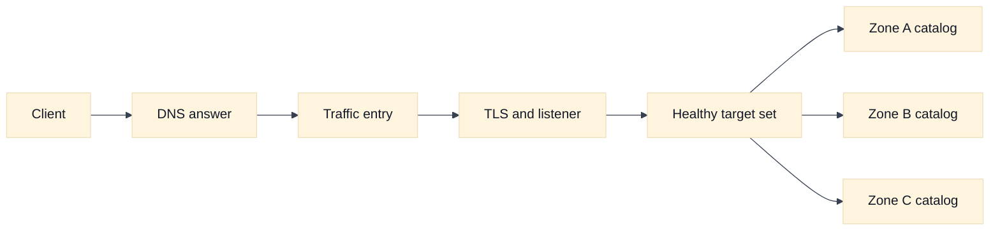
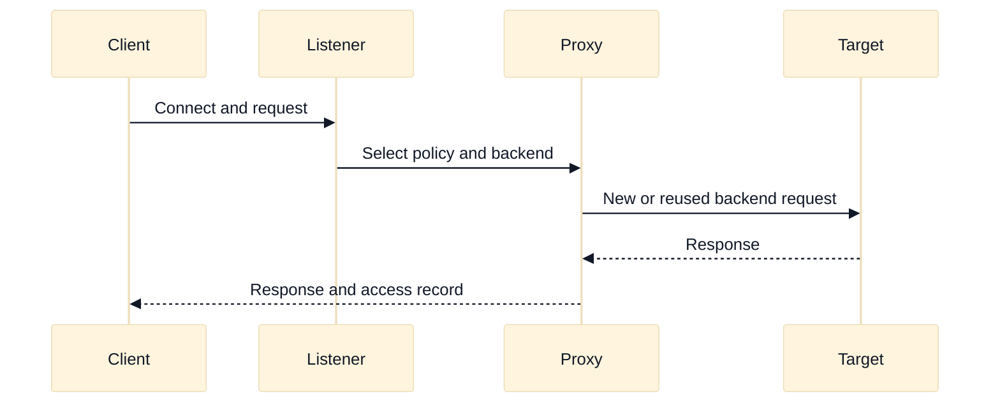

# Load Balancing and Traffic Entry

## A. Purpose and learning objectives

This topic prepares an engineer to reason about traffic entry as a chain of contracts, not as a product-selection exercise. A load balancer may terminate TLS, choose a target, preserve or replace source identity, perform health checks, and enforce a failure policy. Each behavior changes what a downstream service can observe and what evidence an interviewer expects you to gather. The examples use `198.51.100.0/24`, `203.0.113.0/24`, and fictional names.

By the end, you should be able to:

- Trace an HTTP or TCP request across DNS, an entry point, a listener, a target group, and a workload.
- Select an L4, L7, proxy, or inline-inspection design from traffic requirements rather than a vendor label.
- Explain health-check, draining, source-address, TLS, and cross-zone contracts.
- Compare the relevant AWS and GCP mechanisms while naming non-equivalences and version boundaries.
- Build an evidence-led diagnosis when the balancer reports healthy targets but clients fail.

Prerequisites are the repository topics on DNS, routing, NAT, firewalls, and reverse proxies. Review [`book/09-reverse-proxies-and-load-balancing.md`](../book/09-reverse-proxies-and-load-balancing.md) and [`docs/03-f5-ltm.md`](../docs/03-f5-ltm.md) first; this module adds cloud ownership, provisioning, and failure-domain reasoning.

## B. Mental model: traffic entry is several contracts

Start with the client-visible name. DNS returns an address or an alias, but it does not prove that a listener exists, that the chosen address is reachable, or that the application is healthy. A global traffic director, DNS policy, or anycast edge may select a region before a regional load balancer selects a zone and target. Keep those decisions separate on a whiteboard.

An L4 load balancer makes a decision from transport metadata such as protocol, destination port, and connection state. It can preserve opaque application bytes and is useful for protocols that do not fit HTTP. An L7 proxy parses application messages, can route by host or path, and usually creates one client-side connection and one target-side connection. That split affects source IP, TLS ownership, timeout behavior, retries, and observability.

Health is a contract with assumptions. A TCP check proves that something completed a TCP handshake. An HTTP check proves that an endpoint returned an expected response under the checker’s source identity, path, headers, and timeout. Neither proves that a particular customer request will succeed. A strong answer says which dependency the check covers and which dependencies it intentionally does not cover.

The target-selection algorithm is also a contract. Round robin, least outstanding requests, hashing, locality, and weighted choices optimize different objectives. A retry can multiply work, and a slow target can look healthy if the check is cheap. Draining protects in-flight work during removal, but its duration must be related to application and client timeout budgets. A candidate who says “the load balancer automatically handles it” has not identified the state owner.

## C. AWS and GCP comparison

The following statements are deliberately labeled.

| Label | AWS example | GCP example | Interview boundary |
|---|---|---|---|
| **Vendor terminology** | Application Load Balancer (ALB), Network Load Balancer (NLB), Gateway Load Balancer (GWLB) | Application Load Balancer, proxy or passthrough Network Load Balancer, and related forwarding rules | Compare packet behavior and control points, not matching names. |
| **Fact** | AWS load balancer listeners, target groups, health checks, and security controls are configured through VPC-scoped resources. | GCP load balancing uses forwarding rules, proxies or passthrough paths, backends, and health checks with scope that varies by product. | Verify the selected product’s scope, address type, and regional/global behavior. |
| **Inference** | A proxy can hide the client address from a target unless an explicitly trusted forwarding mechanism is used. | The same inference applies to a GCP proxy path, but the header and source behavior must be checked for the product. | Preserve source identity only with an authenticated, bounded trust design. |

An AWS ALB is an HTTP-aware proxy and is appropriate when host, path, header, or TLS policy drives routing. An AWS NLB is commonly considered when TCP/UDP behavior, static addresses, or connection-level performance is central. An AWS GWLB is a service-insertion pattern, not simply a faster NLB. On GCP, an Application Load Balancer is an HTTP-aware proxy family, while Network Load Balancers can be proxy-based or passthrough depending on the selected design. These are vendor terms, not interchangeable guarantees.

For an interview, state the dimensions you will verify: internet-facing versus internal, global versus regional, IPv4/IPv6, TLS termination, source preservation, health-check source ranges, backend protocol, cross-zone or cross-region distribution, idle timeout, logging, and pricing. Product capabilities and names change, so a production decision requires the current AWS or GCP documentation for the chosen region and release.

## D. Worked scenario and calculation

Fictional service `catalog.example.test` receives 12,000 requests per second. Each request is approximately 40 KiB, the p95 response time is 150 ms, and the design has three zones. The interviewer asks for an entry architecture and a first capacity estimate.

The average in-flight application requests are approximately `12,000 * 0.150 = 1,800`. If traffic is evenly distributed, each zone begins near 4,000 requests per second and 600 in-flight requests. Plan for loss of one zone: the remaining two zones would each receive about 6,000 requests per second, before retry amplification. If a client or proxy retries 2% of failed requests, a rough peak workload is `12,000 / (1 - 0.02)`, or about 12,245 requests per second. This is not a capacity approval; it is a prompt to measure connection limits, target concurrency, bandwidth, and failure headroom.

Use an HTTP-aware entry point if host/path routing and TLS policy are needed. Put targets in at least three zones, use a health endpoint that checks the dependencies needed for safe serving, and define a drain period longer than normal request completion but bounded by deployment time. Avoid promising exact product limits from memory. Ask whether the 40 KiB is request, response, or total payload and whether compression changes network cost.

## E. Failure, evidence, and falsifiers

| Hypothesis | Evidence to collect | Falsifier |
|---|---|---|
| DNS selected an unintended entry point | Resolver answer, TTL, client location, change history | Authoritative and client answers agree with the intended address. |
| Listener or TLS policy rejects clients | Handshake result, certificate/SNI, listener logs | A controlled client completes the same handshake and request. |
| Health checks are misleading | Check path, status, source policy, target logs, dependency state | A request from the checker’s path and identity succeeds end to end. |
| Source identity was lost or spoofable | Packet/header evidence at the target and trusted proxy configuration | Target receives the expected authenticated identity under a controlled test. |
| A zone or target is overloaded | Per-zone requests, latency, connections, queueing, and retry rate | Load and queue metrics remain balanced while the symptom persists. |

Use correlated timestamps and request identifiers. A “healthy” dashboard is not a falsifier for an application failure unless its check has the same protocol, path, identity, and dependency assumptions as the failed request.

## F. Exercises

### F1. Timed whiteboard: three protocols, one platform

In 25 minutes, design entry for HTTPS catalog traffic, raw TCP database administration, and an inline inspection requirement. Draw client DNS, public and private boundaries, TLS ownership, listener type, target health, and return traffic. State where source identity changes. Follow up by removing one zone, then ask what evidence proves that draining is working. A strong answer names at least two alternatives and explains why each fails a stated requirement.

### F2. Evidence-led debugging and rollout

During a canary, the load balancer reports all targets healthy, but 15% of clients receive 502 responses. Build an ordered evidence plan: client timing, DNS answer, TLS and listener logs, balancer target status, backend access logs, dependency latency, and retry counts. Do not change routing until a hypothesis has a falsifier. Then describe a rollback gate using error rate, p95 latency, target saturation, and a fixed observation window. The learning goal is to demonstrate controlled reasoning rather than memorized commands.

## G. Interview questions and direct answers

### G1. SDE2 questions

1. **Why can a health check pass while users receive errors?**

   **Answer:** The check may use a different path, method, source identity, headers, timeout, or dependency set. It can prove that a shallow endpoint responds while the real request hits a missing route, authorization rule, overloaded dependency, or TLS mismatch. Compare the exact request contract and correlate target logs.

2. **When would you choose L4 over L7?**

   **Answer:** Choose L4 when the protocol is opaque or connection semantics matter more than application routing. Choose L7 when host/path/header policy, HTTP-aware observability, or TLS termination is required. Confirm that the L4 choice does not move essential policy and retries into an uncontrolled client or target layer.

3. **What does draining protect?**

   **Answer:** Draining stops new assignments to a target while allowing existing work to finish, subject to timeout and connection behavior. It protects in-flight requests during deployment or failure handling, but it cannot save requests that already exceed the application, proxy, or client timeout budget.

4. **How would you debug a 502?**

   **Answer:** Separate client-to-entry from entry-to-target. Inspect DNS and TLS, listener logs, target selection, backend connection errors, target response timing, and dependency failures in one time window. Determine whether the balancer generated the response or forwarded it, then test the leading hypothesis with a bounded control.

### G2. Staff-level questions

5. **How do you design a load-balancing platform used by many teams?**

   **Answer:** Define an interface for names, certificates, listeners, health contracts, ownership, quotas, logs, and safe rollout. Provide paved paths for common HTTP and TCP cases, but make exceptions explicit. Measure availability by customer journey, limit blast radius per tenant, publish cost allocation, and require an evidence-backed rollback plan. The platform owns guardrails and observability; service teams own application health semantics.

6. **How do you reason about global entry during a regional failure?**

   **Answer:** Start with state ownership, not the global product. Establish whether reads, writes, sessions, certificates, dependencies, and capacity can move. Define detection, fencing, promotion, DNS or traffic steering, RTO/RPO, and failback separately. A global front door can redirect packets while the application remains unable to serve safely; that is a routing success but an availability failure.

## H. References and evidence labels

- **Fact / Vendor terminology:** [AWS Elastic Load Balancing documentation](https://docs.aws.amazon.com/elasticloadbalancing/).
- **Fact / Vendor terminology:** [AWS Gateway Load Balancer](https://docs.aws.amazon.com/elasticloadbalancing/latest/gateway/introduction.html).
- **Fact / Vendor terminology:** [Google Cloud Load Balancing overview](https://cloud.google.com/load-balancing/docs/load-balancing-overview).
- **Inference method:** [Reverse proxies and load balancing](../book/09-reverse-proxies-and-load-balancing.md).
- **Inference method:** [F5 LTM examples](../docs/03-f5-ltm.md).

Provider-specific claims above are labeled **Fact** or **Vendor terminology** where they describe a documented concept; design conclusions are labeled **Inference**. Confirm exact product behavior, limits, regional availability, and pricing in current official documentation before applying it to an account or project.
