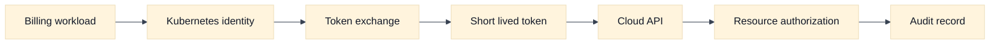
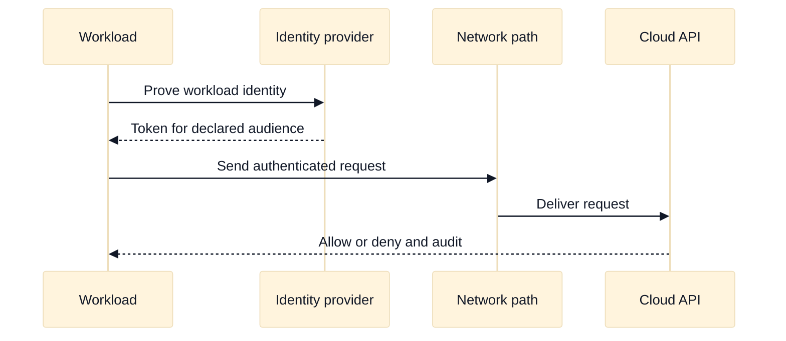

# IAM and Workload Identity

## A. Purpose and learning objectives

Cloud networking interviews often fail candidates who treat reachability as authorization. A packet can arrive at an API and still be rejected because the caller lacks the right identity, audience, condition, or resource permission. Conversely, a perfect IAM policy cannot fix a blocked route. This topic connects network path, credential exchange, and authorization without collapsing them into one control.

You should be able to:

- Separate human identity, workload identity, network identity, and application identity.
- Trace a short-lived credential from a workload to a cloud API and name every trust decision.
- Diagnose “network allowed, IAM denied” and “IAM allowed, network unreachable” independently.
- Compare AWS and GCP workload-identity patterns without treating product names as equivalent.
- Design least privilege, auditable delegation with bounded failure and rotation behavior.

Prerequisites are routing, firewalls, DNS, and the zero-trust material in [`book/17-network-security-waf-zero-trust.md`](../book/17-network-security-waf-zero-trust.md). This module assumes a Kubernetes workload may call a cloud API, but its model also applies to virtual machines and serverless runtimes.

## B. Mental model: four identities and three decisions

Human identity answers who is operating the platform. Workload identity answers which software instance may request a token. Network identity describes where traffic came from and which path it used. Application identity describes the end user, tenant, or service principal carried inside the request. These identities can correlate, but none is a substitute for another.

Credential exchange has three decisions: can the workload prove it is the named principal, may the identity provider issue a token for the requested audience, and may the destination authorize that token for the resource and action? A network policy is a separate reachability gate. It may protect the token endpoint or API endpoint, but it does not itself grant API permission.

Prefer short-lived credentials. A static key turns compromise into a long-lived incident and makes ownership difficult to prove. Federation can bind a workload’s signed identity to a cloud role or service account. Check token audience, issuer, subject, expiration, clock skew, and policy conditions. A token that is valid cryptographically can still be unsafe if it is accepted by the wrong audience or maps many tenants to one broad role.

Metadata services deserve special attention. A workload with access to a metadata endpoint may be able to obtain credentials if the runtime does not isolate requests. The design should constrain metadata paths, use the platform’s supported identity integration, and log issuance and use. Treat “the pod can reach the API” and “the pod can obtain the intended token” as two separate test cases.

## C. AWS and GCP comparison

| Label | AWS example | GCP example | Interview boundary |
|---|---|---|---|
| **Vendor terminology** | IAM roles, IAM policies, IAM Roles for Service Accounts (IRSA), and EKS Pod Identity | IAM, service accounts, and Workload Identity Federation for GKE | Similar goals do not imply the same token exchange or attachment model. |
| **Fact** | AWS IAM evaluates identity and resource policies with conditions and explicit deny behavior; EKS supports documented workload-to-role integrations. | Google Cloud IAM grants roles to principals on resources or hierarchy levels; GKE supports Workload Identity Federation for GKE. | Verify current cluster mode, identity provider, and supported integration. |
| **Inference** | A role attached to a node can create a larger blast radius than a role mapped to one workload. | A broadly granted service account can create the same class of blast radius. | Use the narrowest principal and resource scope that supports the workload. |

On AWS, **Vendor terminology** includes IAM roles, IRSA, and EKS Pod Identity. These are distinct mechanisms with different configuration and operational flows; do not promise that one is available for every EKS version or deployment mode. On GCP, Workload Identity Federation for GKE maps Kubernetes identities to Google service accounts without requiring static service-account keys in the workload. Exact subject mappings and supported configurations are release-dependent.

For both providers, ask: what issues the token, what audience is accepted, what resource policy is evaluated, what network path reaches the API, what audit record ties the call to a workload, and how revocation behaves? **Inference:** if an answer cannot identify those owners, it has not yet established least privilege.

## D. Worked scenario and evidence chain

Fictional workload `invoice-worker` in namespace `billing` must read one object prefix and publish metrics. It runs 40 replicas and calls the provider API at a peak of 20 requests per second. The design prohibits static keys.

Write the expected chain: Kubernetes service identity -> federation or role-association mechanism -> short-lived token with an API audience -> network path to the provider endpoint -> IAM evaluation for the exact bucket/object or metrics action -> audit record. If tokens last 15 minutes, a rough upper-bound refresh rate is `40 / 900`, or 0.045 refreshes per second, ignoring startup bursts. That calculation is useful for identifying a token-service bottleneck, but it does not choose a token lifetime. Balance compromise exposure, clock skew, refresh load, and revocation expectations.

The least-privilege policy should allow only the required read prefix and metric publication. A test should prove that `invoice-worker` cannot list unrelated objects, assume a second role, or call an administrative API. A separate test should deny the API route while retaining identity permissions; this proves the diagnosis can distinguish network failure from authorization failure.

## E. Failure, evidence, and falsifiers

| Hypothesis | Evidence | Falsifier |
|---|---|---|
| The workload cannot reach the token issuer | DNS, route, firewall, proxy, and token endpoint timing | A request from the same network identity obtains a token. |
| Token audience or issuer is wrong | Decoded non-secret claims, issuer metadata, API error | The same token is accepted by the intended API. |
| Principal mapping is broader or different than expected | Provider audit principal, federation mapping, pod identity | Audit shows the exact intended principal and scope. |
| Resource policy denies the action | Request action/resource, policy evaluation evidence, explicit deny | A minimal control action succeeds and proves policy scope. |
| Metadata credentials leaked across workloads | Runtime metadata access logs and identity mappings | Isolation test shows another workload cannot obtain the role. |

Never paste bearer tokens into an interview transcript or debugging artifact. Demonstrate the claim with metadata, redacted logs, policy simulation, or a controlled denied request.

## F. Exercises

### F1. Timed whiteboard: tenant-scoped worker

In 20 minutes, draw identity and network paths for two namespaces, `billing` and `support`, that call separate cloud resources. Include token issuer, audience, policy boundary, audit record, and the effect of a compromised pod. Follow up by asking how a deployment changes the principal and how a key rotation differs from federation. A strong answer distinguishes a namespace label from a cryptographically enforced identity condition.

### F2. Evidence-led rollout

A migration removes static credentials from 200 workers. Five percent fail only after rollout. Design a canary and evidence sequence: compare service-account subject, token audience, endpoint reachability, clock skew, provider denial, and audit principal. Set a rollback gate that preserves the old path only for a bounded cohort and duration. Explain how you would prove the old credential cannot remain usable after decommissioning.

## G. Interview questions and direct answers

### G1. SDE2 questions

1. **Does a security group or firewall rule grant a workload access to an API?**

   **Answer:** No. It can permit packets to reach the endpoint. The API still evaluates a credential, principal, action, resource, and conditions. Diagnose the network and authorization gates separately and correlate the provider audit record with the workload identity.

2. **Why are short-lived credentials preferred?**

   **Answer:** They reduce the useful lifetime of stolen material and create clearer issuance and use records. They still require correct audience, issuer, rotation, clock, and revocation design. Short-lived does not mean safe if every workload receives the same broad role.

3. **What should you inspect for an access-denied error?**

   **Answer:** Confirm the request reached the provider, identify the principal in the audit record, inspect the requested action and exact resource, evaluate explicit denies and conditions, and compare the token audience. Do not widen a policy before proving which predicate failed.

4. **How does workload identity differ from application identity?**

   **Answer:** Workload identity identifies the software calling a cloud API; application identity may identify an end user or tenant inside that request. A service may be allowed to call an API while still needing application-level authorization for each customer.

### G2. Staff-level questions

5. **How would you make identity a platform capability for many teams?**

   **Answer:** Provide a default federation path, constrained templates, ownership metadata, policy review, audit dashboards, and a break-glass process with expiry. Keep service teams responsible for required actions and data classification while the platform owns trust plumbing and safe defaults. Measure adoption, denied-call resolution time, stale principals, and blast radius.

6. **How do you handle a provider outage in the identity path?**

   **Answer:** Separate existing-token behavior from token refresh. Define cached-token lifetime, safe degradation, queue limits, and recovery behavior; do not silently mint or distribute static credentials. Establish an SLO for credential issuance, monitor refresh failure before expiry, and document which operations are safe to pause.

## H. Advanced design review: trust chains, blast radius, and recovery

### H1. Analyze the complete trust chain

An interview answer becomes materially stronger when it writes down the trust chain as predicates instead of saying “the pod has a role.” For `invoice-worker`, the chain might be: the scheduler places an approved workload; the identity integration binds its service identity to a provider principal; the token issuer validates issuer, subject, audience, and time; the network path reaches the token or API endpoint; the provider evaluates action, resource, conditions, and explicit denies; the application applies tenant authorization; and audit telemetry records the resulting principal. A failure at any predicate should produce a different evidence signature.

Use a table in a design review with columns for **claim**, **enforcer**, **evidence**, **failure mode**, and **owner**. “Only billing workers can read invoice objects” is not one claim: workload admission, identity mapping, IAM resource scope, object-prefix policy, and application tenant checks may each enforce part of it. This decomposition prevents a common Staff-level mistake—assigning a security property to a network control that cannot enforce it.

### H2. Calculate refresh pressure and compromise exposure

Suppose 200 replicas use 20-minute tokens, restart uniformly over a 10-minute deployment, and refresh at 80% of token lifetime. A steady-state upper estimate is `200 / 1,200 = 0.17` refreshes per second. During the rollout, however, 200 replicas may request credentials in a short burst. If 50 replicas start in each of four minutes, the identity service sees about `50 / 60 = 0.83` initial exchanges per second before retries and sidecars. The point is not to assert a provider throughput limit; it is to expose burst assumptions and ask which quota or dependency is tested.

Token lifetime is a trade-off. Longer tokens reduce refresh traffic and make a provider outage less disruptive, but increase the usable window after compromise. Shorter tokens reduce exposure but amplify clock-skew sensitivity, startup storms, and dependency coupling. Define a maximum tolerated stale-credential window, a refresh jitter policy, a clock-health signal, and behavior when refresh fails. Existing tokens may continue to work while new tokens cannot be issued; the application should distinguish those states rather than treating all authorization errors as network failures.

### H3. Provider behavior boundaries and evidence interpretation

AWS and GCP both support delegated workload access, but the binding, token exchange, principal representation, policy hierarchy, and audit fields are provider-specific. **Fact:** the cited provider documentation describes the supported mechanism. **Inference:** the design is least-privilege only if the mapping is narrow, auditable, and tested against an unauthorized resource. A successful API call proves one authorization path worked; it does not prove that a sibling namespace, node, or compromised service cannot use the same principal.

For a denial, collect evidence in this order: endpoint reachability and DNS; token acquisition result; token issuer, subject, audience, and expiry; provider audit principal; requested action and resource; policy evaluation or denial reason; and application tenant context. A falsifier for “the network blocks access” is a provider audit record showing the request arrived and was denied. A falsifier for “IAM is wrong” is a successful call from the same principal and resource with the same conditions. Do not widen a role while any of these fields is unknown.

### H4. Ownership, rollback, and incident containment

The platform team should own federation plumbing, admission defaults, identity-provider availability, policy linting, and audit delivery. Service teams should own the action/resource contract and application authorization. Security should own threat models and review standards, while the resource owner decides data sensitivity. Shared ownership without a named escalation path often results in a broad temporary role becoming permanent.

During migration from static credentials, rollback can reintroduce the original compromise risk. A safe rollback uses a bounded cohort, a time limit, an emergency principal with only the previous required actions, and an explicit revocation deadline. Disable or quarantine the failed mapping only after confirming whether existing tokens remain valid. The rollback gate should include both availability—successful required calls—and safety—negative tests for unrelated resources, role assumption, metadata access, and cross-namespace use. Preserve audit evidence before deleting the old principal.

### H5. Follow-up interview questions and substantive answers

1. **A workload can reach the API and receives `AccessDenied`, but the provider audit log names the node role. What does that imply?**

   **Answer:** The intended workload federation path may not be active, or the request may be falling back to node credentials. I would inspect credential-provider configuration, environment precedence, metadata access, token subject, and the exact audit principal. The immediate containment is to prevent unintended metadata access and narrow the node role, but I would preserve service availability while proving which credential source the SDK selected.

2. **How do you design for an identity-provider outage without weakening authorization?**

   **Answer:** Separate already-issued-token validity from token refresh. Set a tested token lifetime and refresh margin, add jitter, queue non-critical work, and fail closed for operations that require new authority. A bounded read-only degradation may be acceptable if data freshness and tenant boundaries remain clear. Static emergency keys are not a recovery plan; a pre-reviewed, time-bound break-glass path with audit is safer.

3. **Why is a namespace-to-role mapping insufficient for multi-tenant authorization?**

   **Answer:** Namespace membership identifies a workload grouping, not necessarily the end user, tenant, or object being accessed. A compromised workload may use every permission granted to that role. Combine narrow workload identity with resource-level conditions, application authorization, tenant-aware audit records, and negative tests. The right question is not only “which role?” but “which principal may perform which action on which resource under which context?”

## I. References and evidence labels

- **Fact / Vendor terminology:** [AWS IAM roles for service accounts](https://docs.aws.amazon.com/eks/latest/userguide/iam-roles-for-service-accounts.html).
- **Fact / Vendor terminology:** [Amazon EKS Pod Identity](https://docs.aws.amazon.com/eks/latest/userguide/pod-identities.html).
- **Fact / Vendor terminology:** [Google Cloud IAM overview](https://cloud.google.com/iam/docs/overview).
- **Fact / Vendor terminology:** [Workload Identity Federation for GKE](https://cloud.google.com/kubernetes-engine/docs/concepts/workload-identity).
- **Inference method:** [Network security and zero trust](../book/17-network-security-waf-zero-trust.md).

Provider-dependent claims are marked **Fact** or **Vendor terminology** and must be verified against current provider and cluster documentation. Architectural conclusions are **Inference** and should be tested with redacted audit evidence rather than assumed from a product name.
