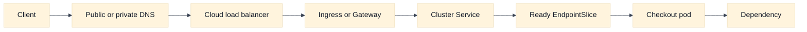
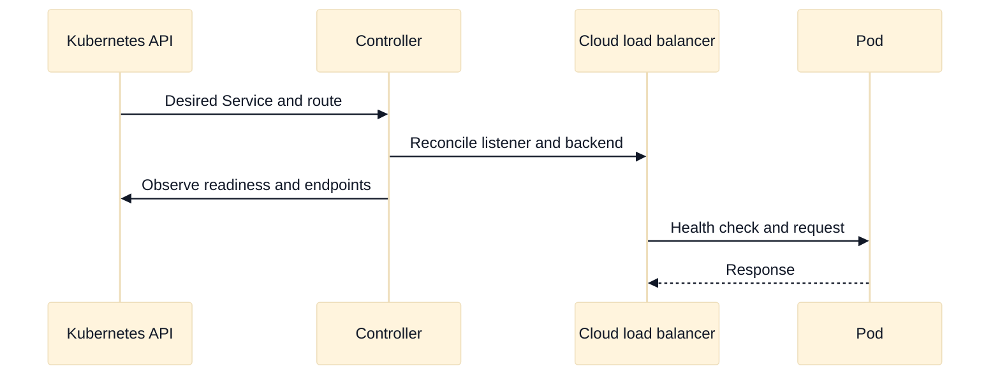

# Containers, Kubernetes, and Network Policy

## A. Purpose and learning objectives

Managed Kubernetes adds a reconciliation layer between a cloud network and an application. A request can be lost at the public load balancer, service abstraction, node or pod interface, NetworkPolicy, sidecar, or application. The most useful interview answer preserves that layering and identifies the controller or owner responsible for each transition.

By the end, you should be able to:

- Trace traffic from a cloud entry point to a pod and back, including name resolution and health gates.
- Explain how CNI address allocation, Services, EndpointSlices, and ingress controllers shape reachability.
- Design a default-deny policy that still permits DNS and required dependencies.
- Compare EKS and GKE networking and identity integration without claiming identical semantics.
- Debug a healthy cloud load balancer whose application path still fails.

Prerequisites are virtual-network boundaries, routes, load balancing, DNS, IAM, and the repository’s Kubernetes chapter: [`book/15-cloud-networking-and-kubernetes-ingress.md`](../book/15-cloud-networking-and-kubernetes-ingress.md) and [`book/topics/13-kubernetes-ingress-and-service-mesh.md`](../book/topics/13-kubernetes-ingress-and-service-mesh.md).

## B. Mental model: intent becomes several data planes

Kubernetes stores intent: a Service selects labels, an Ingress or Gateway declares traffic policy, a NetworkPolicy constrains allowed peers, and a Deployment declares desired replicas. Controllers observe that intent and program provider load balancers, node rules, virtual interfaces, routes, proxies, and endpoint records. Reconciliation is asynchronous, so configuration accepted by the API is not the same as traffic ready.

The cloud boundary matters. A cloud load balancer may health-check a node port, a pod IP, or a proxy target. The check’s source range and protocol must be allowed. A Service may load-balance through nodes or directly to pods depending on the implementation. A pod IP may be routable from the VPC while still being denied by Kubernetes policy. Conversely, a Kubernetes policy cannot make a missing cloud route appear.

NetworkPolicy is additive in many implementations: selecting a pod for ingress or egress isolation changes the allowed set, while an unrelated policy does not necessarily provide a deny rule. Exact behavior, supported selectors, and enforcement are CNI-dependent. State that dependency rather than promising that a manifest alone guarantees isolation. Always permit the DNS path explicitly when workloads use a cluster resolver.

Services provide stable discovery while backends change. EndpointSlices are a control-plane representation of ready endpoints, but readiness itself is an application contract. A pod can be ready for one path and unable to serve another. Ingress controllers may terminate TLS and create a separate backend connection; source identity and timeout behavior then need an explicit design.

## C. AWS and GCP comparison

| Label | AWS example | GCP example | Interview boundary |
|---|---|---|---|
| **Vendor terminology** | EKS, Amazon VPC CNI, security groups for pods, AWS Load Balancer Controller | GKE, VPC-native/alias IP, GKE Ingress or Gateway integrations, Google Cloud load balancers | Product integrations vary by cluster mode, CNI, and release. |
| **Fact** | EKS networking can allocate pod addresses through documented VPC CNI patterns and can integrate Kubernetes objects with AWS load balancers. | GKE commonly uses VPC-native pod ranges and integrates Kubernetes Services or Ingress with Google Cloud load balancing. | Verify address model, controller, health-check target, and policy enforcement. |
| **Inference** | A pod address consumed from a finite subnet can create placement failures even when node CPU is available. | Secondary ranges and related capacity can create the same class of failure. | Treat IP capacity as a schedulable resource. |

AWS calls out EKS and the Amazon VPC CNI as **Vendor terminology**; GKE and VPC-native networking are GCP **Vendor terminology**. The useful comparison is whether pods receive VPC-routable addresses, which identity owns them, how load-balancer controllers reconcile objects, and which policy engine enforces pod traffic. Do not infer that an AWS security group for a pod is equivalent to a Kubernetes NetworkPolicy or a GCP firewall rule.

For both providers, ask where the cloud load balancer terminates TLS, whether the backend is a node or pod, how client source information is conveyed, and which logs show each hop. Provider capability and default behavior depend on the selected cluster release and controller version.

## D. Worked scenario: public HTTPS to a pod

Fictional `checkout` runs 60 replicas across three zones. Each pod needs 1 IPv4 address and 2,000 connections at peak across the service. The cluster reserves a 25% address-growth buffer. If the current pod count is 60, an address-only estimate is `60 * 1.25 = 75` pod addresses, before system pods, rolling-update overlap, or per-zone balance. If a rollout temporarily runs 30 extra pods, the working estimate becomes 90. This demonstrates why subnet or secondary-range capacity must include rollout headroom, not just desired replicas.

The request path is client DNS -> cloud load balancer -> controller-selected listener -> Service -> ready EndpointSlice -> pod -> dependency. The return path may use a node, pod, proxy, or NAT depending on the design. A default-deny policy should allow client ingress only from the intended namespace or trusted entry path, allow egress to DNS and named dependencies, and deny unrelated lateral traffic. Health checks need their own documented allowance if they do not originate from the same identity as application traffic.

## E. Failure, evidence, and falsifiers

| Hypothesis | Evidence | Falsifier |
|---|---|---|
| Controller has not converged | Object events, controller logs, cloud resource state | Listener and backend state match desired objects. |
| No ready endpoints exist | EndpointSlices, readiness results, pod events | A controlled request reaches a ready pod. |
| Cloud health check is blocked | Check source, port, policy, node/pod logs | Check succeeds from the documented source and path. |
| NetworkPolicy denies the hop | Effective policy, CNI flow evidence, namespace/selector labels | A minimal allowed control path succeeds. |
| Pod IP or node capacity is exhausted | IP allocation, pending pods, per-zone addresses | Capacity remains available during a reproduction. |
| TLS or proxy boundary is wrong | Listener/backend protocol, certificate, headers, timeout | Same protocol works through a controlled direct path. |

The falsifier column prevents a common failure mode: collecting “the load balancer is healthy” as if it proved the entire path. Match evidence to the specific boundary.

## F. Exercises

### F1. Timed whiteboard: default-deny checkout

In 30 minutes, draw public HTTPS to a checkout pod, pod-to-DNS, pod-to-payment API, and blocked pod-to-debug namespace. Show cloud and Kubernetes policy boundaries, source identity, health checks, and endpoint readiness. Then remove one zone and add a rolling update. Explain what fails first and which owner receives the alert. A strong answer identifies both controller reconciliation and data-plane enforcement.

### F2. Evidence-led debugging

A Service has three ready pods and the cloud load balancer is green, but requests time out only after a NetworkPolicy rollout. Build a read-only evidence plan: object events, EndpointSlices, controller state, policy selectors, DNS resolution, flow logs, pod listening socket, and application logs. Reproduce with one allowed test and one deliberately denied test. Define a rollout gate that requires positive and negative policy tests before expanding the change.

## G. Interview questions and direct answers

### G1. SDE2 questions

1. **What is the difference between a Service and an Ingress?**

   **Answer:** A Service provides a stable virtual identity and selects backend pods. Ingress describes HTTP-oriented entry rules and usually causes a controller to configure an external or internal proxy. A Service can exist without public traffic, and an Ingress still depends on a healthy Service and endpoints.

2. **Why can a pod be ready but unreachable?**

   **Answer:** Readiness is only the probe contract. A cloud route, load-balancer backend mode, NetworkPolicy, listener protocol, DNS path, or return route may still fail. Compare the successful probe’s source and path with the failed request and test each hop independently.

3. **What does default deny require in practice?**

   **Answer:** It requires an enforcement-capable policy engine, an explicit isolation policy, and allow rules for required ingress, egress, DNS, health checks, and dependencies. Verify selector semantics and implementation behavior; a YAML object accepted by the API is not proof of enforcement.

4. **How do pod IPs affect capacity?**

   **Answer:** Pod placement may consume addresses independently of CPU and memory. Include system pods, rolling-update overlap, per-zone balance, and growth reserve. An address shortage can leave pods pending while compute appears idle, so inspect allocation and scheduler events together.

### G2. Staff-level questions

5. **How would you provide a safe multi-team Kubernetes networking platform?**

   **Answer:** Publish supported ingress, egress, identity, DNS, and policy patterns with ownership and version compatibility. Use admission checks for unsafe exposure, observe reconciliation latency and policy denies, budget IP and load-balancer quotas, and provide a tested exception path. Measure customer outcomes, not manifest count.

6. **How do you migrate a cluster network model without a large outage?**

   **Answer:** Inventory address use and dependencies, create an overlap-free target, run dual validation, canary namespaces or services, preserve DNS and identity contracts, and establish rollback checkpoints. Prove negative isolation and positive reachability before cutover. Treat controller version, CNI mode, and cloud quota as explicit release inputs.

## H. Advanced design review: reconciliation, identity, and safe policy rollout

### H1. Separate desired state from effective data-plane state

Kubernetes networking is a chain of controllers and enforcement points, not a direct translation from YAML to packets. A Service selects pods through labels; EndpointSlices represent the selected addresses; a controller may program a cloud load balancer; the CNI assigns or routes pod addresses; and a policy engine translates NetworkPolicy intent into enforcement. Each stage has its own convergence delay and failure mode. In an interview, draw both the desired object and the effective state observed at the node, cloud entry point, and pod.

Assume 120 application pods across three zones, a 25% rolling-update surge, and 10% address reserve for system workloads. The planning address requirement is roughly `120 * 1.25 * 1.10 = 165` pod addresses, before provider or CNI-specific reservations. If each zone must survive loss of one peer zone, the distribution must also be checked per zone; a single large regional range does not prove zonal placement capacity. **Inference:** address headroom, scheduler capacity, and load-balancer backend limits are coupled constraints. A deployment can have CPU available and still fail because the CNI or subnet cannot allocate another address.

### H2. Understand policy semantics and bypass paths

“Default deny” is meaningful only after answering five questions: which policy engine enforces it, which direction is isolated, what identity selectors mean, whether DNS and health traffic are allowed, and which paths bypass the cluster policy. A cloud load balancer entering through a node port, a host-networked pod, a service mesh sidecar, or a direct cloud API path may not be governed by the same policy. Labels are convenient selectors but should not be treated as immutable identities unless the admission and ownership model makes them trustworthy.

For every allow rule, define a positive and negative test. “Checkout may call payments on 443” should produce a successful request from an approved workload and a denied request from an unapproved namespace, with evidence at the enforcement point. If the approved request succeeds only after a broad cloud firewall rule is added, that proves reachability changed—not that the intended NetworkPolicy is enforced. A falsifier for “policy caused the outage” is a denied flow that never reaches the policy engine, or an equally affected path outside the cluster.

### H3. Provider boundaries and rollout ownership

EKS and GKE expose similar Kubernetes abstractions while differing in CNI choices, pod-address placement, load-balancer controller behavior, identity integration, and version support. **Vendor terminology** names the integration; it does not guarantee the same source-address or health-check behavior. Ask which cluster mode, CNI version, service type, controller, IP family, and cloud resource scope are in use. If those inputs are unknown, keep the answer at the mechanism level and identify the documentation boundary to verify.

The platform team should own cluster networking, supported ingress classes, CNI upgrades, policy defaults, quotas, and telemetry. Application teams own ports, readiness semantics, dependencies, and service-level SLOs. Security owns the threat model and exception criteria. During a policy or CNI rollout, use a canary namespace or node pool, record controller and policy versions, and compare a control cohort. A rollback may restore manifests but not necessarily remove already-programmed cloud resources or connections. Define cleanup evidence and allow enough drain time for endpoint changes to propagate.

### H4. Advanced troubleshooting sequence

Start with the symptom boundary: pending pod, DNS failure, connection refusal, timeout, TLS error, HTTP error, or policy denial. Then correlate scheduler events, pod readiness, EndpointSlices, Service ports, controller events, cloud backend health, route and policy evidence, node sockets, and application logs. Do not jump from “load balancer red” to “application broken.” A backend can be healthy from the controller’s probe source while client traffic fails due to a different path, SNI, policy, or return route.

When requests fail intermittently, compare by node, zone, IP family, pod identity, and connection age. If only newly scheduled pods fail, suspect address allocation, readiness timing, or policy propagation. If only one zone fails, compare route programming, subnet capacity, health-check reachability, and cloud backend registration. If old connections succeed and new connections fail, distinguish listener or policy changes from application state. The evidence plan should be read-only until a hypothesis has a falsifier.

### H5. Follow-up interview questions and substantive answers

1. **A NetworkPolicy object is accepted, but traffic is still allowed. What do you say?**

   **Answer:** API acceptance proves the object was stored, not that the selected CNI or policy engine enforces the intended semantics. I would verify enforcement capability, policy events, selector resolution, namespace labels, direction, and a controlled deny test. I would also inspect cloud and host-network bypass paths. If the test cannot demonstrate a deny at the expected boundary, the security claim remains unproven.

2. **How do you choose between pod-routable and node-translated traffic?**

   **Answer:** Compare source-identity needs, address consumption, route scale, policy enforcement, observability, and failure behavior. Pod-routable traffic can simplify source visibility but consumes and propagates more addresses. Node translation may reduce route complexity but moves identity to headers or application tokens and can create port pressure. Choose from measured requirements, then document the loss of source fidelity explicitly.

3. **A rollout makes 2% of requests fail, but all pods are ready. What is your next decision?**

   **Answer:** Pause expansion and separate the cohort by pod revision, node, zone, entry path, and request type. Compare EndpointSlices, target health, readiness timing, policy decisions, connection errors, and application responses. If failures are limited to the new revision, rollback that cohort while preserving evidence. If they span revisions but one zone, the safer rollback may be to traffic or infrastructure rather than deployment state.

## I. References and evidence labels

- **Fact / Vendor terminology:** [Amazon EKS networking](https://docs.aws.amazon.com/eks/latest/userguide/eks-networking.html).
- **Fact / Vendor terminology:** [AWS Load Balancer Controller](https://kubernetes-sigs.github.io/aws-load-balancer-controller/).
- **Fact / Vendor terminology:** [GKE networking overview](https://cloud.google.com/kubernetes-engine/docs/concepts/network-overview).
- **Fact / Vendor terminology:** [Kubernetes NetworkPolicy](https://kubernetes.io/docs/concepts/services-networking/network-policies/).
- **Inference method:** [Cloud networking and Kubernetes ingress](../book/15-cloud-networking-and-kubernetes-ingress.md).
- **Inference method:** [Kubernetes ingress and service mesh](../book/topics/13-kubernetes-ingress-and-service-mesh.md).

Provider names and integration behavior are **Vendor terminology** or **Fact** only within the cited documentation boundary. Statements about blast radius, capacity, and debugging order are **Inference** derived from the stated model and should be verified with the selected cluster and CNI.
