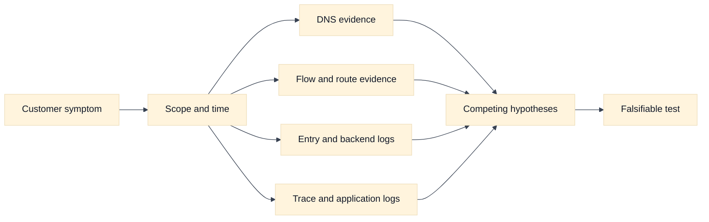
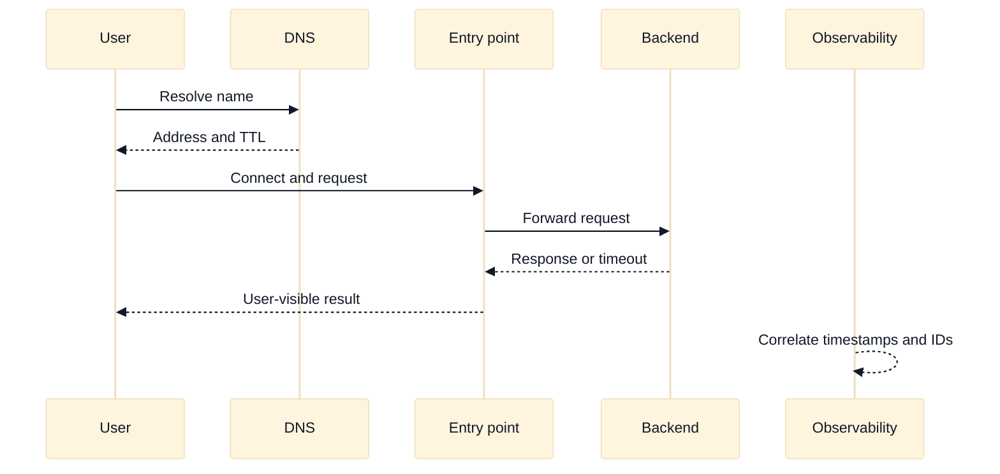

# Observability, Troubleshooting, and SLOs

## A. Purpose and learning objectives

Cloud networking interviews reward evidence, not a list of commands. A useful diagnosis connects a customer symptom to timestamps, request identity, path, policy, provider state, and a falsifiable hypothesis. This topic turns flow logs, load-balancer logs, DNS evidence, traces, and SLOs into a repeatable reasoning system while keeping the material educational rather than an account-specific runbook.

You should be able to:

- Build a layered evidence plan from DNS and connection setup through application completion.
- Distinguish missing telemetry from proof that no traffic occurred.
- Use SLOs, error budgets, and latency distributions to prioritize network work.
- Compare AWS and GCP telemetry families by coverage and blind spots.
- Explain a diagnosis with competing hypotheses, tests, and rollback or escalation gates.

Prerequisites are the earlier traffic-entry, policy, DNS, and routing modules. Cross-reference [`book/12-observability-and-troubleshooting.md`](../book/12-observability-and-troubleshooting.md) and [`book/topics/11-network-observability-slos.md`](../book/topics/11-network-observability-slos.md); this section adds cloud evidence ownership and interview communication.

## B. Mental model: an observation is not an explanation

Start with a precise symptom: which clients, names, regions, protocols, status codes, and time interval? “The network is slow” is not a testable statement. “p95 connect-plus-TLS time rose from 40 ms to 900 ms for private clients in zone B between 10:05 and 10:12 UTC” is.

Use several signal classes. Metrics show aggregate rates, saturation, and latency distributions. Logs show discrete decisions such as a DNS response, load-balancer status, policy action, or API error. Flow records often show tuples and accepted or rejected outcomes, but not payload or application success. Traces correlate a request across services, yet may be absent when connection setup or sampling fails. Configuration and control-plane events explain what changed, but desired state does not prove data-plane convergence.

A strong investigator builds a request ledger: request ID, client identity, source and destination, DNS answer, connect time, TLS time, proxy time, backend time, response, and relevant policy or route version. Correlate clocks before comparing events. Watch for sampling, aggregation windows, log delivery delay, NAT address translation, proxy-generated IDs, and privacy redaction.

SLOs should describe a user or service contract. Availability based only on a load-balancer health check can hide failed customer paths. A latency SLO based on average can hide a long tail that causes timeouts. Define eligibility, good events, bad events, and dependency exclusions. Error budget is a decision mechanism: when consumed quickly, reduce change velocity and investigate; do not use it as a justification to hide a poor measurement.

## C. AWS and GCP comparison

| Label | AWS example | GCP example | Interview boundary |
|---|---|---|---|
| **Vendor terminology** | VPC Flow Logs, CloudWatch metrics/logs, ELB access logs, X-Ray | VPC Flow Logs, Cloud Logging, load-balancer logs, Cloud Trace | Similar names have different fields, latency, sampling, and retention. |
| **Fact** | AWS documents flow records and service-specific logging separately from application telemetry. | GCP documents VPC flow records and load-balancer/application telemetry as distinct evidence sources. | Ask what hop and decision each source can actually observe. |
| **Inference** | A flow record indicating accepted traffic does not prove an HTTP response. | The same inference applies to a GCP flow record. | Pair network evidence with endpoint or trace evidence. |

AWS CloudWatch, VPC Flow Logs, Elastic Load Balancing logs, and X-Ray are **Vendor terminology**. GCP Cloud Logging, VPC Flow Logs, load-balancer logs, and Cloud Trace are also **Vendor terminology**. The comparison should focus on fields, sampling, delivery delay, aggregation, retention, access controls, and cost. These details change by service and configuration, so a production diagnosis must consult current documentation and the selected resource’s settings.

**Inference:** a “no record” result is weak evidence until you verify that logging was enabled, the interval has arrived, the query uses the translated address or correct resource, and the source is within the telemetry’s coverage. Interviewers value that caveat because it prevents false closure.

## D. Worked scenario and SLO calculation

Fictional `search.example.test` serves 2,000,000 requests in a seven-day window. Its availability SLO counts a request as good only when the client receives a valid response within 800 ms. The service recorded 18,000 failures and 42,000 slow responses. If each event is mutually exclusive, bad events are 60,000 and the observed availability is `(2,000,000 - 60,000) / 2,000,000 = 97%`. A 99.9% target permits 2,000 bad events, so the budget is exceeded by 58,000 events. If failures and slow responses overlap, use request IDs to deduplicate rather than add them.

Create competing hypotheses: DNS steering changed, a regional backend is saturated, NAT or connection ports are exhausted, a policy rollout rejects return traffic, or the application dependency slowed. First compare good and bad cohorts by region, zone, resolver, entry point, and backend. Then correlate the first divergence in timing. A rise in DNS time with unchanged backend time points differently from a rise in backend queueing. A flow record can confirm a tuple was accepted, but it cannot distinguish an application timeout from a successful response.

## E. Failure, evidence, and falsifiers

| Hypothesis | Evidence | Falsifier |
|---|---|---|
| DNS caused cohort-specific failure | Answers by resolver, TTL, geography, and change history | Good and bad clients resolve the same address and path. |
| Route or policy rejects traffic | Flow verdict, route selection, policy version, translated tuple | A controlled request with the same tuple completes. |
| Entry point generated the error | Access status, backend-status field, TLS and listener events | Backend logs show the request and response before the error. |
| Backend saturation drives tail latency | Queue, CPU, connections, per-zone latency, dependency timing | Tail remains high while saturation and dependency timing are normal. |
| Telemetry is incomplete | Enablement, sampling, delivery delay, retention, query scope | Independent signal covers the same interval and cohort. |

The falsifier is part of the hypothesis, not an afterthought. If no test could change your mind, you have a narrative rather than a diagnosis.

## F. Exercises

### F1. Timed whiteboard: evidence architecture

In 25 minutes, design observability for a private API crossing a cloud load balancer, service mesh proxy, and database. Mark where request IDs are created and propagated, where source addresses change, which signals are sampled, and who owns each dashboard. Follow up by asking how you detect a dropped SYN, a rejected policy decision, a slow dependency, and a missing log export. A strong answer states the blind spot at every layer.

### F2. Evidence-led incident review

A regional latency SLO burned 30% of its monthly budget in 12 minutes. Construct a timeline from resolver logs, flow records, load-balancer access records, backend traces, and deployment events. Rank three hypotheses and define one falsifier for each. Finish with a change gate: pause rollout, preserve evidence, communicate impact, and resume only when the metric returns to a defined range for a defined window.

## G. Interview questions and direct answers

### G1. SDE2 questions

1. **What does an accepted flow record prove?**

   **Answer:** It proves that the telemetry source observed an accepted flow record under its own model. It does not prove that TLS completed, the application accepted the request, or a response returned. Pair it with endpoint, proxy, or trace evidence and account for NAT and sampling.

2. **How do you make “slow” measurable?**

   **Answer:** Define the operation, eligible requests, measurement boundaries, percentile, and time window. Separate DNS, connect, TLS, queue, backend, and response phases where possible. An average alone can conceal a tail that violates the user’s timeout budget.

3. **Why is no log not proof of no traffic?**

   **Answer:** Logging may be disabled, sampled, delayed, filtered, redacted, queried against the wrong resource, or missing a hop. Verify coverage and delivery before using absence as evidence. Seek an independent signal such as client timing or endpoint logs.

4. **What makes a useful debugging hypothesis?**

   **Answer:** It names a boundary, predicts observable evidence, and includes a falsifier. For example, “zone B backend saturation caused the p95 increase” predicts zone-specific queueing and backend latency; balanced saturation would weaken that hypothesis.

### G2. Staff-level questions

5. **How would you standardize network observability across teams?**

   **Answer:** Define common request and resource identifiers, a minimum signal contract, ownership metadata, retention and privacy rules, SLO templates, and a cost budget. Provide platform dashboards but let teams own service semantics. Measure time to evidence, unresolved blind spots, false incident conclusions, and error-budget outcomes.

6. **How do you prevent observability from becoming an expensive data lake?**

   **Answer:** Start from decisions and SLOs, then collect the minimum fields and resolution needed to make them. Use tiered retention, sampling that preserves rare failures, aggregation for high-cardinality dimensions, and access controls. Review cost against diagnostic value and test that sampling still preserves the failure classes that matter.

## H. References and evidence labels

- **Fact / Vendor terminology:** [AWS VPC Flow Logs](https://docs.aws.amazon.com/vpc/latest/userguide/flow-logs.html).
- **Fact / Vendor terminology:** [AWS Elastic Load Balancing access logs](https://docs.aws.amazon.com/elasticloadbalancing/latest/application/load-balancer-access-logs.html).
- **Fact / Vendor terminology:** [Google Cloud VPC Flow Logs](https://cloud.google.com/vpc/docs/flow-logs).
- **Fact / Vendor terminology:** [Google Cloud Load Balancing logging and monitoring](https://cloud.google.com/load-balancing/docs/logging-monitoring).
- **Inference method:** [Observability and troubleshooting](../book/12-observability-and-troubleshooting.md).
- **Inference method:** [Network observability and SLOs](../book/topics/11-network-observability-slos.md).

Product names and logging capabilities are **Fact** or **Vendor terminology** within their cited documentation. Diagnostic ordering, SLO arithmetic, and claims about blind spots are **Inference** based on the evidence model and must be checked against actual logging configuration.
