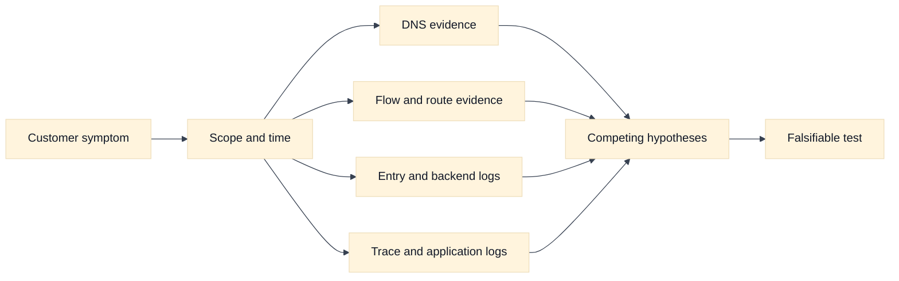
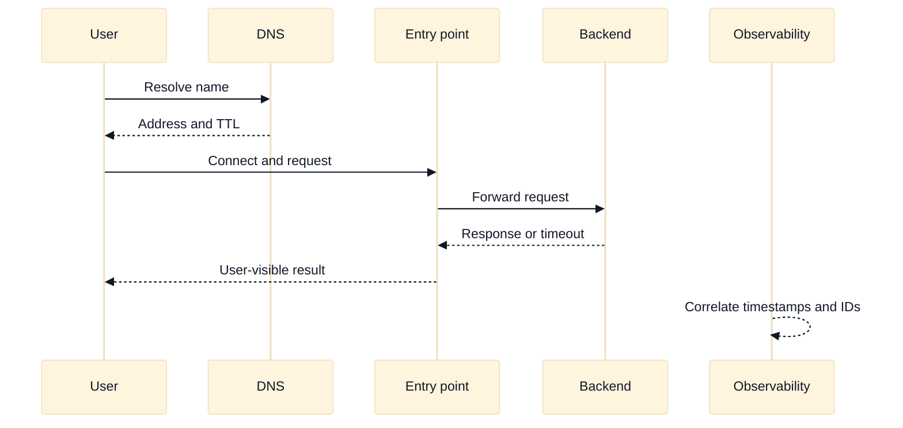

# Observability, Troubleshooting, and SLOs

## A. Purpose and learning objectives

Cloud networking interviews reward evidence, not a list of commands. A useful diagnosis connects a customer symptom to timestamps, request identity, path, policy, provider state, and a falsifiable hypothesis. This topic turns flow logs, load-balancer logs, DNS evidence, traces, and SLOs into a repeatable reasoning system while keeping the material educational rather than an account-specific runbook.

You should be able to:

- Build a layered evidence plan from DNS and connection setup through application completion.
- Distinguish missing telemetry from proof that no traffic occurred.
- Use SLOs, error budgets, and latency distributions to prioritize network work.
- Compare AWS and GCP telemetry families by coverage and blind spots.
- Explain a diagnosis with competing hypotheses, tests, and rollback or escalation gates.

Prerequisites are the earlier traffic-entry, policy, DNS, and routing modules. Cross-reference [`book/12-observability-and-troubleshooting.md`](../book/12-observability-and-troubleshooting.md) and [`book/topics/11-network-observability-slos.md`](../book/topics/11-network-observability-slos.md); this section adds cloud evidence ownership and interview communication.

## B. Mental model: an observation is not an explanation

Start with a precise symptom: which clients, names, regions, protocols, status codes, and time interval? “The network is slow” is not a testable statement. “p95 connect-plus-TLS time rose from 40 ms to 900 ms for private clients in zone B between 10:05 and 10:12 UTC” is.

Use several signal classes. Metrics show aggregate rates, saturation, and latency distributions. Logs show discrete decisions such as a DNS response, load-balancer status, policy action, or API error. Flow records often show tuples and accepted or rejected outcomes, but not payload or application success. Traces correlate a request across services, yet may be absent when connection setup or sampling fails. Configuration and control-plane events explain what changed, but desired state does not prove data-plane convergence.

A strong investigator builds a request ledger: request ID, client identity, source and destination, DNS answer, connect time, TLS time, proxy time, backend time, response, and relevant policy or route version. Correlate clocks before comparing events. Watch for sampling, aggregation windows, log delivery delay, NAT address translation, proxy-generated IDs, and privacy redaction.

SLOs should describe a user or service contract. Availability based only on a load-balancer health check can hide failed customer paths. A latency SLO based on average can hide a long tail that causes timeouts. Define eligibility, good events, bad events, and dependency exclusions. Error budget is a decision mechanism: when consumed quickly, reduce change velocity and investigate; do not use it as a justification to hide a poor measurement.

## C. AWS and GCP comparison

| Label | AWS example | GCP example | Interview boundary |
|---|---|---|---|
| **Vendor terminology** | VPC Flow Logs, CloudWatch metrics/logs, ELB access logs, X-Ray | VPC Flow Logs, Cloud Logging, load-balancer logs, Cloud Trace | Similar names have different fields, latency, sampling, and retention. |
| **Fact** | AWS documents flow records and service-specific logging separately from application telemetry. | GCP documents VPC flow records and load-balancer/application telemetry as distinct evidence sources. | Ask what hop and decision each source can actually observe. |
| **Inference** | A flow record indicating accepted traffic does not prove an HTTP response. | The same inference applies to a GCP flow record. | Pair network evidence with endpoint or trace evidence. |

AWS CloudWatch, VPC Flow Logs, Elastic Load Balancing logs, and X-Ray are **Vendor terminology**. GCP Cloud Logging, VPC Flow Logs, load-balancer logs, and Cloud Trace are also **Vendor terminology**. The comparison should focus on fields, sampling, delivery delay, aggregation, retention, access controls, and cost. These details change by service and configuration, so a production diagnosis must consult current documentation and the selected resource’s settings.

**Inference:** a “no record” result is weak evidence until you verify that logging was enabled, the interval has arrived, the query uses the translated address or correct resource, and the source is within the telemetry’s coverage. Interviewers value that caveat because it prevents false closure.

## D. AWS setup and use

Use an existing lab VPC and an existing CloudWatch log group. This example shows how to verify VPC Flow Logs, inspect an ALB’s access-log setting, and query recent records without enabling broad telemetry blindly. The learner needs `AWS_PROFILE`, `AWS_REGION`, permission to describe EC2 and ELBv2 resources, and CloudWatch Logs read access. Enabling flow or access logs requires additional permissions and may incur ingestion, storage, and analysis charges. Review [VPC Flow Logs](https://docs.aws.amazon.com/vpc/latest/userguide/flow-logs.html), [CloudWatch Logs Insights](https://docs.aws.amazon.com/AmazonCloudWatch/latest/logs/Analyzing起Logs.html), and the service’s current logging documentation.

```bash
export AWS_PROFILE="AWS_PROFILE"
export AWS_REGION="AWS_REGION"
export AWS_VPC_ID="vpc-EXAMPLE"
export AWS_ALB_ARN="arn:aws:elasticloadbalancing:AWS_REGION:AWS_ACCOUNT_ID:loadbalancer/app/northstar/EXAMPLE"
export AWS_LOG_GROUP="/aws/networking/northstar-lab"

# Read-only coverage checks: identify active flow logs and ALB attributes.
aws ec2 describe-flow-logs --profile "$AWS_PROFILE" --region "$AWS_REGION" \
  --filter Name=resource-id,Values="$AWS_VPC_ID" \
  --query 'FlowLogs[].{Id:FlowLogId,Status:FlowLogStatus,Destination:LogDestination,Traffic:TrafficType}'
aws elbv2 describe-load-balancer-attributes --profile "$AWS_PROFILE" --region "$AWS_REGION" \
  --load-balancer-arn "$AWS_ALB_ARN"
aws logs describe-log-groups --profile "$AWS_PROFILE" --region "$AWS_REGION" \
  --log-group-name-prefix "$AWS_LOG_GROUP"
```

If the lab owner has approved the cost and retention, create a flow log using a pre-created IAM role and log group. Do not copy this into a production account without reviewing the data classification and retention policy:

```bash
# Mutating and potentially billable: use only a lab VPC and approved role.
aws ec2 create-flow-logs --profile "$AWS_PROFILE" --region "$AWS_REGION" \
  --resource-type VPC --resource-ids "$AWS_VPC_ID" --traffic-type ALL \
  --log-destination-type cloud-watch-logs --log-group-name "$AWS_LOG_GROUP" \
  --deliver-logs-permission-arn "FLOW_LOG_ROLE_ARN"

# Query accepted/rejected network records after the delivery interval.
aws logs start-query --profile "$AWS_PROFILE" --region "$AWS_REGION" \
  --log-group-name "$AWS_LOG_GROUP" --start-time START_EPOCH --end-time END_EPOCH \
  --query-string 'fields @timestamp,srcAddr,dstAddr,dstPort,action | filter dstPort = 443 | stats count() by action,srcAddr,dstAddr'
```

The query returns a query ID; retrieve it with `aws logs get-query-results`. Expected evidence is a log-delivery status of `ACTIVE`, records whose five-tuple and timestamps match the incident, and a second signal such as ALB access logs, target logs, or a trace. A flow record cannot prove an HTTP response. Cleanup is to stop the test query, remove the lab flow log, and apply the approved log-group retention/deletion policy; preserve incident evidence before retention cleanup. **AWS troubleshooting follow-up:** “No rejected flow records exist, so the firewall is innocent—agree?” Ask whether flow logs covered the correct VPC/ENI, whether the record interval arrived, whether the failure occurred at TLS or HTTP, and whether NAT or proxy translation changed the tuple. See [VPC Flow Logs record examples](https://docs.aws.amazon.com/vpc/latest/userguide/flow-logs-records.html).

## E. GCP setup and use

Use an existing VPC subnet and a dedicated lab log bucket or project log view. GCP VPC Flow Logs are enabled at subnet scope in many configurations, while load-balancer and application logs are controlled by the selected product. The learner needs `PROJECT_ID`, `REGION`, `SUBNET_NAME`, and Logging Viewer permissions; enabling logs or changing sampling/metadata can increase cost and data exposure. Review [GCP VPC Flow Logs](https://cloud.google.com/vpc/docs/flow-logs), [Cloud Logging queries](https://cloud.google.com/logging/docs/view/logs-explorer-interface), and the selected load balancer’s logging guide.

```bash
export PROJECT_ID="PROJECT_ID"
export REGION="REGION"
export SUBNET_NAME="northstar-subnet"
export GCP_BACKEND="northstar-http-backend"
gcloud config set project "$PROJECT_ID"

# Read-only baseline: inspect subnet logging and backend logging state.
gcloud compute networks subnets describe "$SUBNET_NAME" --region "$REGION" \
  --project "$PROJECT_ID" --format='yaml(name,ipCidrRange,enableFlowLogs,logConfig,network)'
gcloud compute backend-services describe "$GCP_BACKEND" --global \
  --project "$PROJECT_ID" --format='yaml(name,logConfig,healthChecks,protocol)'
gcloud logging read \
  'resource.type="gce_subnetwork" AND logName:"vpc_flows"' \
  --project "$PROJECT_ID" --limit 10 \
  --format='table(timestamp,resource.labels.subnetwork_name,jsonPayload.connection.src_ip,jsonPayload.connection.dest_port)'
```

For a disposable lab subnet, enable flow logs with a bounded sampling setting and metadata choice. The exact flags are provider- and release-dependent, so check `gcloud compute networks subnets update --help` first:

```bash
# Mutating and potentially billable; use only the named lab subnet.
gcloud compute networks subnets update "$SUBNET_NAME" --region "$REGION" \
  --enable-flow-logs --logging-flow-sampling=0.5 \
  --logging-metadata=INCLUDE_ALL_METADATA --project "$PROJECT_ID"

# Search a narrow time window and resource, then correlate with LB/application logs.
gcloud logging read \
  'resource.type="gce_subnetwork" AND resource.labels.subnetwork_name="northstar-subnet"' \
  --project "$PROJECT_ID" --freshness=15m --limit 50 \
  --format='table(timestamp,jsonPayload.connection.src_ip,jsonPayload.connection.dest_ip,jsonPayload.bytes_sent)'
gcloud logging read \
  'resource.type="http_load_balancer" AND httpRequest.status>=500' \
  --project "$PROJECT_ID" --freshness=15m --limit 20 \
  --format='table(timestamp,httpRequest.requestUrl,httpRequest.status,httpRequest.latency)'
```

Expected evidence is a subnet with flow logging enabled, records that cover the correct interface and time, and a load-balancer record or trace that explains whether the failure was before or after HTTP handling. Sampling means absence is not proof of absence. For rollback, disable flow logs on the lab subnet, restore the previous sampling/metadata configuration, and retain only the approved incident artifacts. **GCP troubleshooting follow-up:** “VPC Flow Logs show bytes, but users see 503.” Ask which load-balancer backend generated the 503, whether flow records are sampled, whether health checks and backend logs agree, and whether the query is filtering the correct global/regional resource. A byte count does not prove a successful application response.

## F. Worked scenario and SLO calculation

Fictional `search.example.test` serves 2,000,000 requests in a seven-day window. Its availability SLO counts a request as good only when the client receives a valid response within 800 ms. The service recorded 18,000 failures and 42,000 slow responses. If each event is mutually exclusive, bad events are 60,000 and the observed availability is `(2,000,000 - 60,000) / 2,000,000 = 97%`. A 99.9% target permits 2,000 bad events, so the budget is exceeded by 58,000 events. If failures and slow responses overlap, use request IDs to deduplicate rather than add them.

Create competing hypotheses: DNS steering changed, a regional backend is saturated, NAT or connection ports are exhausted, a policy rollout rejects return traffic, or the application dependency slowed. First compare good and bad cohorts by region, zone, resolver, entry point, and backend. Then correlate the first divergence in timing. A rise in DNS time with unchanged backend time points differently from a rise in backend queueing. A flow record can confirm a tuple was accepted, but it cannot distinguish an application timeout from a successful response.





## G. Failure, evidence, and falsifiers

| Hypothesis | Evidence | Falsifier |
|---|---|---|
| DNS caused cohort-specific failure | Answers by resolver, TTL, geography, and change history | Good and bad clients resolve the same address and path. |
| Route or policy rejects traffic | Flow verdict, route selection, policy version, translated tuple | A controlled request with the same tuple completes. |
| Entry point generated the error | Access status, backend-status field, TLS and listener events | Backend logs show the request and response before the error. |
| Backend saturation drives tail latency | Queue, CPU, connections, per-zone latency, dependency timing | Tail remains high while saturation and dependency timing are normal. |
| Telemetry is incomplete | Enablement, sampling, delivery delay, retention, query scope | Independent signal covers the same interval and cohort. |

The falsifier is part of the hypothesis, not an afterthought. If no test could change your mind, you have a narrative rather than a diagnosis.

## H. Exercises

### H1. Timed whiteboard: evidence architecture

In 25 minutes, design observability for a private API crossing a cloud load balancer, service mesh proxy, and database. Mark where request IDs are created and propagated, where source addresses change, which signals are sampled, and who owns each dashboard. Follow up by asking how you detect a dropped SYN, a rejected policy decision, a slow dependency, and a missing log export. A strong answer states the blind spot at every layer.

### H2. Evidence-led incident review

A regional latency SLO burned 30% of its monthly budget in 12 minutes. Construct a timeline from resolver logs, flow records, load-balancer access records, backend traces, and deployment events. Rank three hypotheses and define one falsifier for each. Finish with a change gate: pause rollout, preserve evidence, communicate impact, and resume only when the metric returns to a defined range for a defined window.

## I. Interview questions and direct answers

### I1. Mechanism-focused questions

1. **What does an accepted flow record prove?**

   **Answer:** It proves that the telemetry source observed an accepted flow record under its own model. It does not prove that TLS completed, the application accepted the request, or a response returned. Pair it with endpoint, proxy, or trace evidence and account for NAT and sampling.

2. **How do you make “slow” measurable?**

   **Answer:** Define the operation, eligible requests, measurement boundaries, percentile, and time window. Separate DNS, connect, TLS, queue, backend, and response phases where possible. An average alone can conceal a tail that violates the user’s timeout budget.

3. **Why is no log not proof of no traffic?**

   **Answer:** Logging may be disabled, sampled, delayed, filtered, redacted, queried against the wrong resource, or missing a hop. Verify coverage and delivery before using absence as evidence. Seek an independent signal such as client timing or endpoint logs.

4. **What makes a useful debugging hypothesis?**

   **Answer:** It names a boundary, predicts observable evidence, and includes a falsifier. For example, “zone B backend saturation caused the p95 increase” predicts zone-specific queueing and backend latency; balanced saturation would weaken that hypothesis.

### I2. Leadership and trade-off questions

5. **How would you standardize network observability across teams?**

   **Answer:** Define common request and resource identifiers, a minimum signal contract, ownership metadata, retention and privacy rules, SLO templates, and a cost budget. Provide platform dashboards but let teams own service semantics. Measure time to evidence, unresolved blind spots, false incident conclusions, and error-budget outcomes.

6. **How do you prevent observability from becoming an expensive data lake?**

   **Answer:** Start from decisions and SLOs, then collect the minimum fields and resolution needed to make them. Use tiered retention, sampling that preserves rare failures, aggregation for high-cardinality dimensions, and access controls. Review cost against diagnostic value and test that sampling still preserves the failure classes that matter.

## J. Advanced design review: evidence quality, SLO math, and diagnostic ownership

### J1. Turn symptoms into measurable hypotheses

The first Staff-level move in a networking incident is to define the affected operation and cohort. “The network is slow” should become something such as: `checkout.create` p95 from North America increased from 320 ms to 780 ms between 10:05 and 10:17 UTC, with 3% 504s, while read traffic stayed within its baseline. This statement identifies a service-level indicator, percentile, window, geography, and comparison. It also leaves room for several hypotheses: DNS latency, edge queueing, backend saturation, dependency delay, retransmission, or a rollout.

Build a hypothesis-evidence-falsifier table before changing a control. For “zone C is overloaded,” predict zone-specific queueing, connection count, backend latency, and retries. Balanced zone metrics falsify or weaken it. For “DNS caused the incident,” compare resolver timing and answers for affected clients with a control population; a stable answer and low lookup latency weaken the claim. For “policy dropped return traffic,” inspect both directions and a controlled flow; an accepted flow with a complete application response falsifies that specific path hypothesis.

### J2. Calculate error budgets and measurement limits

For a 99.95% monthly availability SLO in a 30-day month, the nominal error budget is `30 * 24 * 60 * 0.0005 = 21.6` minutes. If a regional latency event consumes 30% of the monthly budget, it represents about 6.48 minutes of equivalent budget, but only if the SLO defines latency failures as eligible bad events and the burn-rate window is comparable. Do not silently convert request errors, latency violations, and user impact into the same unit.

Percentiles are also contracts. A p99 over a small cohort may be unstable; an average can hide a severe tail; a sampled flow log may omit the very packet loss under investigation. State sample rate, aggregation key, clock source, and missing-data treatment. If telemetry delivery is delayed by two minutes, a live dashboard cannot establish a minute-by-minute causal sequence without correction. **Inference:** an observation is useful only relative to its coverage, delay, and semantic boundary.

### J3. Design an evidence architecture with cost and privacy boundaries

Every signal should have an owner, retention class, access policy, cardinality budget, and documented query purpose. Flow records can answer whether a source-destination tuple was observed, but may omit payload, TLS outcome, or application status. Load-balancer logs can identify listener and backend decisions, but may not show client-side DNS or a downstream timeout. Traces can connect spans across services, but sampling may exclude rare failures and network devices may not propagate the trace context.

Use stable correlation fields where privacy permits: request ID, trace ID, deployment revision, zone, and a hashed or bounded tenant dimension. Avoid logging credentials, full payloads, or unbounded user identifiers. A Staff design explains how to diagnose without exposing sensitive data and how retention supports incident review. Cost is part of the design: retain high-resolution data briefly for diagnosis, aggregate longer-lived trends, and sample in a way that preserves rare error classes rather than only the common success path.

### J4. Ownership, rollback, and evidence preservation

The service owner is accountable for the user SLO and application semantics. The network or platform owner is accountable for route, policy, load-balancer, DNS, and telemetry contracts. Security and privacy owners define allowable fields and access. During an incident, the incident commander owns sequencing and communication, not every technical decision. Record who can declare a rollback, who can pause a rollout, and who can approve a temporary evidence change.

Rollback can destroy evidence: replacing a proxy version may remove the failing logs, and changing a route may eliminate the comparison path. First preserve relevant dashboards, configuration versions, timestamps, and representative request IDs. Then reduce blast radius with a canary, traffic split, or feature gate. Define stop conditions such as a second consecutive window above the error budget burn threshold, unexplained loss of trace coverage, or a new cohort showing materially worse p99. Restoration is not complete until telemetry confirms the original failure mode is gone and the causal explanation is recorded.

### J5. Follow-up interview questions and substantive answers

1. **Flow logs show accepted connections, but users report TLS failures. What does the evidence prove?**

   **Answer:** It proves only that the flow telemetry observed an accepted transport flow under its collection semantics. TLS could fail during handshake, certificate validation, SNI selection, or protocol negotiation. I would correlate edge handshake logs, client error classes, certificate version, and listener configuration. If a controlled client completes TLS with the same SNI and path, the hypothesis must be narrowed to the affected client cohort.

2. **How do you choose between more telemetry and a faster mitigation?**

   **Answer:** Protect users first with a reversible, bounded mitigation, but preserve the minimum evidence needed to distinguish competing causes. If the mitigation changes the path, capture before/after samples and keep a control cohort where safe. I would avoid broad logging changes during a high-load event unless their cost and cardinality are bounded. The decision depends on reversibility, customer harm, and whether missing evidence could make recurrence likely.

3. **What makes an SLO useful for a shared networking platform?**

   **Answer:** It measures an outcome that service teams recognize, defines eligibility and exclusions, identifies the platform boundary, and has an owner for remediation. “Load balancer up” is weaker than successful, correctly routed requests within latency and availability objectives. A platform may publish component indicators, but it should connect them to customer journeys and show which team can act when the budget burns.

## K. References and evidence labels

- **Fact / Vendor terminology:** [AWS VPC Flow Logs](https://docs.aws.amazon.com/vpc/latest/userguide/flow-logs.html).
- **Fact / Vendor terminology:** [AWS Elastic Load Balancing access logs](https://docs.aws.amazon.com/elasticloadbalancing/latest/application/load-balancer-access-logs.html).
- **Fact / Vendor terminology:** [AWS CloudWatch Logs Insights](https://docs.aws.amazon.com/AmazonCloudWatch/latest/logs/Analyzing-Log-Data.html).
- **Fact / Vendor terminology:** [Google Cloud VPC Flow Logs](https://cloud.google.com/vpc/docs/flow-logs).
- **Fact / Vendor terminology:** [Google Cloud load-balancer logging](https://cloud.google.com/load-balancing/docs/logging).
- **Fact / Vendor terminology:** [Google Cloud VPC Flow Logs](https://cloud.google.com/vpc/docs/flow-logs).
- **Fact / Vendor terminology:** [Google Cloud Load Balancing logging and monitoring](https://cloud.google.com/load-balancing/docs/logging-monitoring).
- **Inference method:** [Observability and troubleshooting](../book/12-observability-and-troubleshooting.md).
- **Inference method:** [Network observability and SLOs](../book/topics/11-network-observability-slos.md).

Product names and logging capabilities are **Fact** or **Vendor terminology** within their cited documentation. Diagnostic ordering, SLO arithmetic, and claims about blind spots are **Inference** based on the evidence model and must be checked against actual logging configuration.
