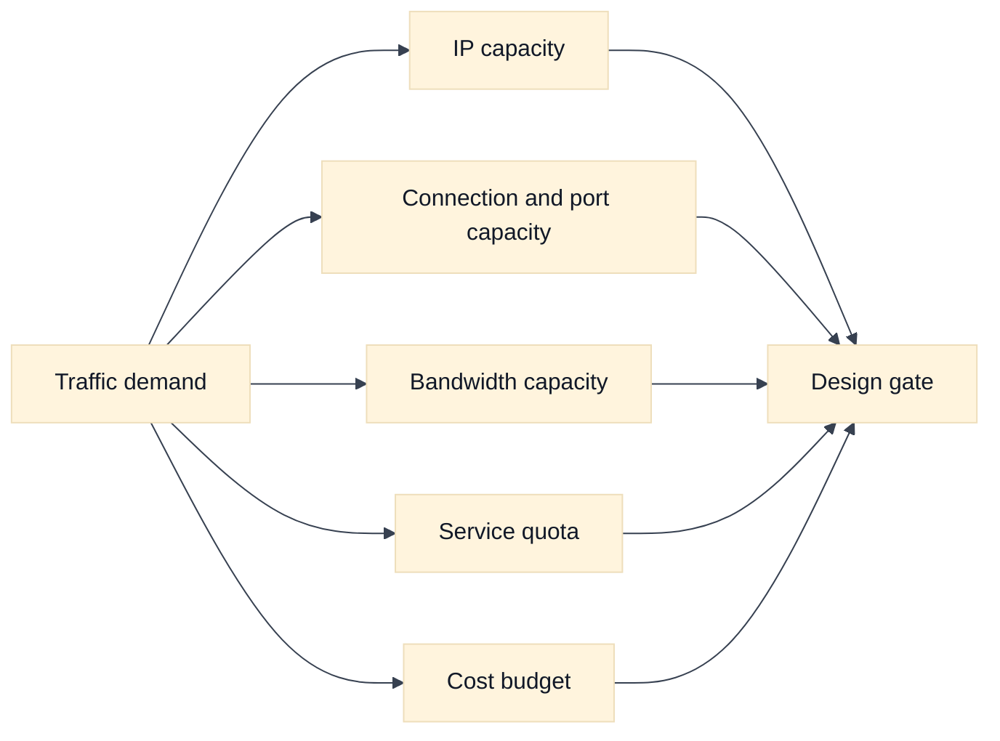
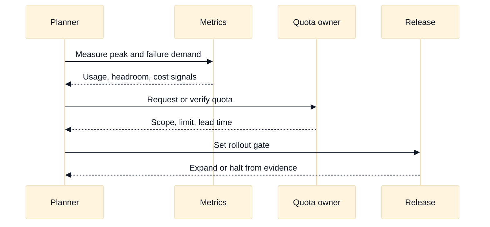

# Quotas, Capacity, and Network Cost

## A. Purpose and learning objectives

Cloud network designs fail as often at a limit or a bill as at a route. Staff interviews expect you to identify finite resources, forecast demand, preserve headroom for failure, and make cost a visible architecture constraint. This topic teaches capacity reasoning without relying on remembered provider numbers, because limits, defaults, and prices vary by service, region, account, project, and release.

You should be able to:

- Separate technical capacity, service quota, API rate limit, and budget constraint.
- Calculate rough address, connection, port, bandwidth, and failure-headroom requirements.
- Compare AWS and GCP quota and cost dimensions without quoting unstable numbers as facts.
- Design quota requests, dashboards, rollout gates, and ownership boundaries.
- Explain a capacity decision in terms of SLO, blast radius, and marginal cost.

Prerequisites are NAT, load balancing, Kubernetes address allocation, and observability. Review [`book/topics/16-capacity-performance-and-slo-engineering.md`](../book/topics/16-capacity-performance-and-slo-engineering.md) for the provider-neutral capacity method.

## B. Mental model: demand meets several limits

Capacity is not one number. A request path may consume subnet addresses, NAT ports, listener slots, backend connections, load-balancer targets, route entries, firewall rules, DNS query capacity, API calls, and logging volume. A workload can have abundant CPU while failing to launch because an IP range or interface limit is exhausted. A service can have enough ports but violate an account quota when a deployment creates temporary parallel resources.

Distinguish a hard limit from a performance knee. A hard quota rejects creation or API calls. A performance knee raises latency or error rate before a formal limit. Distinguish quota from rate limit: a quota may constrain simultaneously allocated resources, while an API rate limit constrains operations over time. Capacity planning must include both steady state and change-time peaks.

Failure headroom should be explicit. If three zones each carry one third of traffic and one zone is lost, the survivors carry 1.5 times their normal load. If the design already operates at 75% of a finite connection or bandwidth limit, a zonal loss can cross the limit even when normal dashboards look healthy. Add rollout overlap, retries, cache misses, failover replication, and growth reserve. Do not hide those assumptions inside a single “safety factor.”

Cost is also a capacity constraint. Cross-zone or cross-region transfer, NAT processing, private endpoint use, load-balancer hours, public addresses, logs, and data retention can grow with traffic. A cheaper packet path may increase blast radius or reduce observability. A good design exposes the cost driver, owner, budget signal, and optimization lever.

## C. AWS and GCP comparison

| Label | AWS example | GCP example | Interview boundary |
|---|---|---|---|
| **Vendor terminology** | Service Quotas, VPC limits, NAT Gateway processing, data-transfer pricing | Quotas, regional/global resource limits, Cloud NAT, network egress pricing | Similar quota words have different scopes and adjustment processes. |
| **Fact** | AWS documents service quotas and many can be viewed or requested through quota tooling. | GCP documents quotas by service and resource scope, with project, region, or global dimensions depending on the service. | Name the exact resource and scope before planning. |
| **Inference** | A quota increase does not make a design operationally safe if the dependent subnet, ports, or budget remain constrained. | The same reasoning applies to a GCP quota increase. | Track coupled constraints, not only the visible error. |

AWS Service Quotas and GCP quotas are **Vendor terminology**. Exact default values, adjustability, regional scope, and lead time are provider and service facts that must be looked up for the selected design. Do not answer an interview with an unqualified remembered number. Say what you would query, which account or project owns it, and what evidence makes the requested headroom sufficient.

For pricing, compare dimensions rather than product labels: bytes processed, direction and destination, inter-zone or inter-region path, request count, reserved versus ephemeral addresses, endpoint hours, NAT processing, log ingestion, and retention. **Inference:** the right optimization is the one that lowers the dominant cost while preserving the SLO and failure assumptions.

## D. AWS setup and use

Start with read-only quota and usage evidence for the exact service and region. The learner needs `AWS_PROFILE`, `AWS_REGION`, and permission to call Service Quotas, EC2, and Cost Explorer APIs. Cost Explorer access may be delayed for a new account and can itself require billing permissions. Review [AWS Service Quotas](https://docs.aws.amazon.com/servicequotas/latest/userguide/intro.html), [VPC quotas](https://docs.aws.amazon.com/vpc/latest/userguide/amazon-vpc-limits.html), and current pricing. Do not quote a remembered number; save the observed quota code, scope, timestamp, and utilization.

```bash
export AWS_PROFILE="AWS_PROFILE"
export AWS_REGION="AWS_REGION"
export AWS_SERVICE_CODE="elasticloadbalancing"
export AWS_QUOTA_CODE="L-EXAMPLE"

# Read-only: enumerate quotas and inspect one quota in the selected region.
aws service-quotas list-service-quotas --profile "$AWS_PROFILE" \
  --service-code "$AWS_SERVICE_CODE" --region "$AWS_REGION" \
  --query 'Quotas[].{Name:QuotaName,Code:QuotaCode,Value:Value,Adjustable:Adjustable}'
aws service-quotas get-service-quota --profile "$AWS_PROFILE" \
  --service-code "$AWS_SERVICE_CODE" --quota-code "$AWS_QUOTA_CODE" \
  --region "$AWS_REGION"
aws ec2 describe-vpcs --profile "$AWS_PROFILE" --region "$AWS_REGION" \
  --query 'Vpcs[].{Vpc:VpcId,Cidr:CidrBlock,State:State}'
```

For a planned rollout, compare the quota value with measured load and survivor load. A quota request is a change to account state and is not an approval to deploy. If a lab requires one, submit it only for a fictional account and document the justification:

```bash
# Mutating and potentially consequential: request only after confirming the quota code and region.
aws service-quotas request-service-quota-increase --profile "$AWS_PROFILE" \
  --service-code "$AWS_SERVICE_CODE" --quota-code "$AWS_QUOTA_CODE" \
  --desired-value DESIRED_QUOTA --region "$AWS_REGION"
aws service-quotas list-requested-service-quota-change-history-by-quota \
  --profile "$AWS_PROFILE" --service-code "$AWS_SERVICE_CODE" \
  --quota-code "$AWS_QUOTA_CODE" --region "$AWS_REGION" \
  --query 'RequestedQuotas[].{Id:Id,Status:Status,Desired:DesiredValue,Created:Created}\n+'
```

The last command should be corrected to the current CLI’s query syntax if your installed version rejects the trailing newline; the learning point is to verify the request state rather than assume it was granted. For cost evidence, use a narrow date range, filter to a lab tag where possible, and compare usage before and after the change. Clean up unused test resources, cancel or document pending quota requests according to account policy, and remove temporary log or address resources. **AWS troubleshooting follow-up:** “The quota is high enough, so why did creation fail?” Ask which coupled limit failed—subnet IPs, target registration, security-group rules, listener count, API rate, or IAM—and request the exact error and region. See [AWS Service Quotas API](https://docs.aws.amazon.com/servicequotas/2019-06-24/apireference/Welcome.html).

## E. GCP setup and use

Use the project and region as explicit quota dimensions. The learner needs `PROJECT_ID`, `REGION`, permission to view service usage and quotas, and optional billing-viewer access for cost evidence. Google Cloud quota names and commands vary by service and rollout; consult `gcloud ... --help` and [Cloud Quotas](https://cloud.google.com/docs/quotas) for the selected API. Quota increases, reservations, forwarding rules, and log exports can mutate state or incur cost.

```bash
export PROJECT_ID="PROJECT_ID"
export REGION="REGION"
export SERVICE="compute.googleapis.com"
gcloud config set project "$PROJECT_ID"

# Read-only baseline: inspect project and regional Compute Engine capacity context.
gcloud compute project-info describe --project "$PROJECT_ID" \
  --format='yaml(quotas,usage)'
gcloud compute regions describe "$REGION" --project "$PROJECT_ID" \
  --format='yaml(name,status,quotas)'
gcloud services list --enabled --project "$PROJECT_ID" \
  --filter='config.name=compute.googleapis.com'
# On installations that expose the Services Usage quota command group:
gcloud services quota list --service "$SERVICE" \
  --consumer="projects/$PROJECT_ID" --project "$PROJECT_ID" \
  --format='table(metric,limit,usage,dimensions)'
```

Use the returned metric and dimension rather than a memorized limit when asking for an increase. The following is intentionally a documented placeholder because the update command and flag names vary with the quota metric and installed `gcloud` release; inspect `gcloud services quota update --help` before using it:

```bash
# Mutating and consequential; run only after the exact metric and dimension are confirmed.
gcloud services quota update "QUOTA_METRIC" \
  --service="$SERVICE" --consumer="projects/$PROJECT_ID" \
  --dimensions="region=$REGION" --value=DESIRED_QUOTA \
  --project "$PROJECT_ID"
```

Verify the actual resource pressure separately from quota metadata. For example, list forwarding rules, addresses, and GKE clusters in the affected region, then correlate timestamps with the failed deployment and billing export. Expected evidence is a quota metric scoped to the project/region, observed usage, the exact API error, and a cost dimension tied to a resource owner. Roll back by removing unused lab resources and restoring any temporary quota or logging configuration through the provider’s approved process. **GCP troubleshooting follow-up:** “The regional quota looks available, but a new load balancer fails.” Ask whether the resource is global, regional, or zonal, whether a dependent API is enabled, whether IP capacity and IAM are sufficient, and whether the command queried the same project and region as the deployment. See [Google Cloud quota troubleshooting](https://cloud.google.com/docs/quotas/troubleshoot).

## F. Worked scenario and calculation

Fictional `media.example.test` sends 4,000 requests per second through egress translation. Each request creates up to two concurrent outbound connections, and each connection lasts 3 seconds at peak. A rough concurrent connection estimate is `4,000 * 2 * 3 = 24,000`. If each connection consumes one source port per translated destination tuple, that is an input to port-capacity planning, not a provider-specific limit claim. Add 30% rollout and retry headroom: `24,000 * 1.3 = 31,200` connections.

Now consider failure. If one of three egress zones is lost and traffic fails over evenly to two zones, the surviving per-zone load is 1.5 times normal. The failure estimate becomes `31,200 / 2 = 15,600` connections per survivor if the original total is redistributed evenly; compare that with the actual per-zone allocation and all relevant NAT, subnet, and gateway constraints. Measure peak concurrency, destination distribution, idle timeout, reuse, and retry behavior before selecting an implementation.





## G. Failure, evidence, and falsifiers

| Hypothesis | Evidence | Falsifier |
|---|---|---|
| IP capacity blocks placement | Allocated/free addresses, pending resources, per-zone use | New resources allocate successfully at the same demand. |
| Connection or port capacity is exhausted | Concurrency, tuple distribution, translation errors, idle time | Errors persist with ample ports and unchanged demand. |
| A service quota rejects provisioning | API error, exact quota name and scope, recent usage | Creation succeeds after a controlled retry without state change. |
| Cost spike comes from transfer or processing | Bytes by path, region/zone, NAT/endpoint/log dimensions | Cost and byte dimensions do not correlate. |
| Failure headroom is insufficient | Survivor load, saturation, error budget, retry amplification | Loss simulation stays below all limits with measured traffic. |

## H. Exercises

### H1. Timed whiteboard: regional loss capacity

In 25 minutes, estimate address, connection, bandwidth, and cost headroom for a three-zone API with 10,000 requests per second. Include one-zone loss, rolling-update overlap, retries, and cross-zone transfer. Label each assumption and identify which values must be looked up rather than remembered. Follow up by asking what changes if traffic becomes 60% from one zone.

### H2. Evidence-led rollout gate

A new private endpoint reduces latency but doubles network cost and causes intermittent provisioning failures. Create a canary with quota usage, creation rate, latency, error budget, bytes by path, and cost attribution. Define rollback thresholds and a stop condition for a quota request. Explain how you would distinguish a quota problem from a transient controller or dependency problem before retrying broadly.

## I. Interview questions and direct answers

### I1. Mechanism-focused questions

1. **What is the difference between a quota and capacity?**

   **Answer:** A quota is a provider-enforced allocation or operation limit; capacity is the amount a system can serve before violating performance or reliability goals. A quota may be raised while an address range, port pool, backend, or budget remains the real bottleneck.

2. **Why plan for zonal failure if normal utilization is low?**

   **Answer:** Losing one of three evenly loaded zones raises survivor load by 50%. Retries, cache misses, and rollout overlap can raise it further. Measure the resulting demand against every coupled limit, not just average CPU.

3. **What data is needed for NAT capacity planning?**

   **Answer:** Peak concurrency, destination tuple distribution, connection reuse, connection lifetime, idle timeout, retries, source addresses, and observed translation errors. Request rate alone cannot predict port usage because concurrency and tuple reuse determine occupancy.

4. **How do you discuss provider limits responsibly?**

   **Answer:** Name the exact resource and scope, state that the current value must be verified in provider documentation or quota tooling, and explain the measurement and requested headroom. Avoid turning a remembered default into an architecture fact.

### I2. Leadership and trade-off questions

5. **How would you make cost part of a platform’s design review?**

   **Answer:** Attach owner, traffic unit, cost dimensions, budget signal, and optimization levers to each network pattern. Review normal, failure, and migration traffic. Keep cost separate from availability decisions, then make the trade explicit: what SLO or blast-radius benefit justifies the incremental spend?

6. **How do you prioritize a quota increase versus redesign?**

   **Answer:** Establish whether the quota is the first limiting boundary, whether it is adjustable with acceptable lead time, and whether raising it shifts risk to a coupled resource. If the design remains fragile under failure or growth, redesign. A quota increase is an enabler, not a capacity argument.

## J. Advanced design review: coupled limits, survivor capacity, and cost decisions

### J1. Model the bottleneck graph

Capacity is not one number. A cloud network design can be constrained by addresses, interfaces, routes, listeners, target registrations, concurrent connections, NAT translation slots, bandwidth, API operations, quota allocations, or an organizational budget. Draw these as a bottleneck graph: demand enters through traffic, deployments, and control-plane operations; each node has a limit, utilization, recovery time, and owner. Raising one limit can expose the next limit without improving the user SLO.

For a three-zone service at 10,000 requests per second, losing one evenly loaded zone raises demand on each survivor from about 3,333 to 5,000 requests per second, a 50% increase. If retries add 8% and a recovery job adds 400 requests per second, survivor demand becomes roughly `10,000 * 1.08 + 400 = 11,200` across the two remaining zones, or 5,600 each before imbalance. This is a scenario estimate, not a provider limit. Include cache misses, connection re-establishment, health-check traffic, and rolling-update overlap when the service depends on them.

### J2. Distinguish quota exhaustion from saturation

Quota failure usually appears at allocation or control-plane time: a new endpoint, address, target, rule, or route cannot be created. Saturation appears in the data plane: queues grow, latency rises, connections reset, or drops increase even though provisioning succeeds. They can interact. A target-registration quota can leave a deployment partially programmed, while a NAT port pool can exhaust only for one destination tuple and look like random application failure.

For each limit, name the measurement and falsifier. “The endpoint quota is exhausted” predicts a rejected API operation and usage near the relevant scope; low usage and successful equivalent creation in the same scope falsify it. “NAT is the bottleneck” predicts translation errors or port occupancy correlated with destination and concurrency; stable translation metrics with backend queueing weakens it. Do not retry a rejected allocation blindly: retries can increase API pressure and obscure the original scope.

### J3. Cost arithmetic with ownership boundaries

Treat cost as a function of traffic shape and architecture, not a single monthly price. A simplified model can be written as `monthly cost = fixed resources + processed bytes * unit rate + cross-zone bytes * unit rate + endpoint hours + control-plane operations`. If a 2 GiB/hour path sends 40% of its traffic across zones, cross-zone volume is `2 * 0.40 * 24 * 30 = 576 GiB/month`. The amount is only an input to a current pricing lookup; it is not a remembered provider price. Ask whether bytes are counted once or at multiple boundaries and whether the failure path changes the volume.

Assign cost ownership at the traffic-producing decision. The platform may own the shared load balancer and NAT baseline, while a service owns unusually large cross-zone transfers or high-cardinality endpoints. A fair model publishes allocation dimensions, shows uncertainty, and avoids charging teams for costs they cannot influence. Conversely, “centralized” should not mean cost disappears. A Staff review connects spend to SLO or blast-radius benefit and names the optimization lever: locality, connection reuse, caching, private service publication, batching, or traffic shedding.

### J4. Rollout gates and quota requests

Every quota request should state the demand forecast, current utilization, failure headroom, expected growth, and why redesign is not the better control. Test the design under one-zone loss and rolling-update overlap before requesting more capacity. If the quota is adjustable but the design fails under regional loss, increasing it only moves the failure outward.

For a canary, measure both steady-state and control-plane pressure: allocation failures, API latency, retry count, address/port occupancy, target health, bytes by path, per-zone utilization, and cost attribution. Define a stop gate for a new private endpoint if provisioning failure exceeds the baseline, p95 latency regresses beyond the agreed margin, or cost per successful request rises without an accepted SLO benefit. Rollback must account for existing connections and resources that cannot be deleted immediately; record cleanup ownership and expiry.

### J5. Follow-up interview questions and substantive answers

1. **A quota increase is approved, but the service still fails during a zone outage. Why?**

   **Answer:** The quota was not the first limiting boundary, or the increase created capacity without tested survivor behavior. I would compare demand after loss—including retries and recovery work—with addresses, backend connections, bandwidth, translation state, dependency capacity, and per-zone distribution. The remedy could be locality, admission control, priority shedding, or a redesign rather than another quota request.

2. **How do you decide whether to pay for a second NAT or private endpoint path?**

   **Answer:** Start with the failed requirement: port headroom, availability, source control, latency, or isolation. Quantify peak concurrency and destination-tuple concentration, then model normal and failure traffic. Compare fixed and processed-byte costs with the cost of an outage or weaker isolation. If a second path improves availability, make its ownership and failover behavior explicit; redundancy that is not exercised may only add spend.

3. **What do you say when an interviewer asks for an exact provider limit?**

   **Answer:** Name the resource, scope, and workload dimension, then say the current value must be verified in quota tooling and official documentation. Continue with a symbolic limit `L`, measured demand `D`, and required headroom `H`, where the gate is `D * failure_factor <= L * (1 - H)`. This demonstrates engineering judgment without turning stale memory into a design fact.

## K. References and evidence labels

- **Fact / Vendor terminology:** [AWS Service Quotas](https://docs.aws.amazon.com/servicequotas/latest/userguide/intro.html).
- **Fact / Vendor terminology:** [AWS VPC quotas](https://docs.aws.amazon.com/vpc/latest/userguide/amazon-vpc-limits.html).
- **Fact / Vendor terminology:** [AWS Service Quotas API](https://docs.aws.amazon.com/servicequotas/2019-06-24/apireference/Welcome.html).
- **Fact / Vendor terminology:** [Google Cloud quotas](https://cloud.google.com/docs/quotas).
- **Fact / Vendor terminology:** [Google Cloud quota troubleshooting](https://cloud.google.com/docs/quotas/troubleshoot).
- **Fact / Vendor terminology:** [Google Cloud quotas](https://cloud.google.com/docs/quotas).
- **Fact / Vendor terminology:** [Google Cloud network pricing](https://cloud.google.com/vpc/network-pricing).
- **Inference method:** [Capacity, performance, and SLO engineering](../book/topics/16-capacity-performance-and-slo-engineering.md).

Limits, pricing, and adjustability are **Fact** only within current provider documentation and the selected resource scope. The capacity arithmetic and design recommendations are **Inference** from stated assumptions; validate them with measured demand and a controlled failure test.
