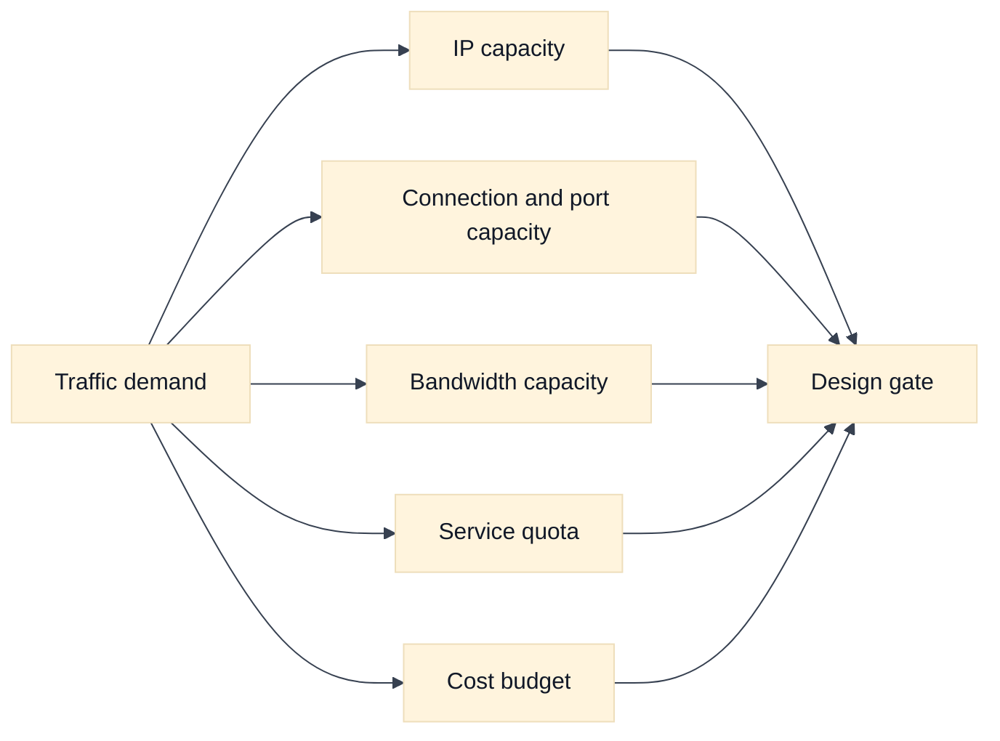
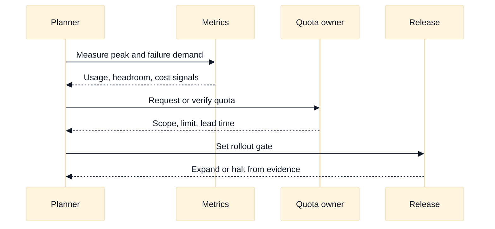

# Quotas, Capacity, and Network Cost

## A. Purpose and learning objectives

Cloud network designs fail as often at a limit or a bill as at a route. Staff interviews expect you to identify finite resources, forecast demand, preserve headroom for failure, and make cost a visible architecture constraint. This topic teaches capacity reasoning without relying on remembered provider numbers, because limits, defaults, and prices vary by service, region, account, project, and release.

You should be able to:

- Separate technical capacity, service quota, API rate limit, and budget constraint.
- Calculate rough address, connection, port, bandwidth, and failure-headroom requirements.
- Compare AWS and GCP quota and cost dimensions without quoting unstable numbers as facts.
- Design quota requests, dashboards, rollout gates, and ownership boundaries.
- Explain a capacity decision in terms of SLO, blast radius, and marginal cost.

Prerequisites are NAT, load balancing, Kubernetes address allocation, and observability. Review [`book/topics/16-capacity-performance-and-slo-engineering.md`](../book/topics/16-capacity-performance-and-slo-engineering.md) for the provider-neutral capacity method.

## B. Mental model: demand meets several limits

Capacity is not one number. A request path may consume subnet addresses, NAT ports, listener slots, backend connections, load-balancer targets, route entries, firewall rules, DNS query capacity, API calls, and logging volume. A workload can have abundant CPU while failing to launch because an IP range or interface limit is exhausted. A service can have enough ports but violate an account quota when a deployment creates temporary parallel resources.

Distinguish a hard limit from a performance knee. A hard quota rejects creation or API calls. A performance knee raises latency or error rate before a formal limit. Distinguish quota from rate limit: a quota may constrain simultaneously allocated resources, while an API rate limit constrains operations over time. Capacity planning must include both steady state and change-time peaks.

Failure headroom should be explicit. If three zones each carry one third of traffic and one zone is lost, the survivors carry 1.5 times their normal load. If the design already operates at 75% of a finite connection or bandwidth limit, a zonal loss can cross the limit even when normal dashboards look healthy. Add rollout overlap, retries, cache misses, failover replication, and growth reserve. Do not hide those assumptions inside a single “safety factor.”

Cost is also a capacity constraint. Cross-zone or cross-region transfer, NAT processing, private endpoint use, load-balancer hours, public addresses, logs, and data retention can grow with traffic. A cheaper packet path may increase blast radius or reduce observability. A good design exposes the cost driver, owner, budget signal, and optimization lever.

## C. AWS and GCP comparison

| Label | AWS example | GCP example | Interview boundary |
|---|---|---|---|
| **Vendor terminology** | Service Quotas, VPC limits, NAT Gateway processing, data-transfer pricing | Quotas, regional/global resource limits, Cloud NAT, network egress pricing | Similar quota words have different scopes and adjustment processes. |
| **Fact** | AWS documents service quotas and many can be viewed or requested through quota tooling. | GCP documents quotas by service and resource scope, with project, region, or global dimensions depending on the service. | Name the exact resource and scope before planning. |
| **Inference** | A quota increase does not make a design operationally safe if the dependent subnet, ports, or budget remain constrained. | The same reasoning applies to a GCP quota increase. | Track coupled constraints, not only the visible error. |

AWS Service Quotas and GCP quotas are **Vendor terminology**. Exact default values, adjustability, regional scope, and lead time are provider and service facts that must be looked up for the selected design. Do not answer an interview with an unqualified remembered number. Say what you would query, which account or project owns it, and what evidence makes the requested headroom sufficient.

For pricing, compare dimensions rather than product labels: bytes processed, direction and destination, inter-zone or inter-region path, request count, reserved versus ephemeral addresses, endpoint hours, NAT processing, log ingestion, and retention. **Inference:** the right optimization is the one that lowers the dominant cost while preserving the SLO and failure assumptions.

## D. Worked scenario and calculation

Fictional `media.example.test` sends 4,000 requests per second through egress translation. Each request creates up to two concurrent outbound connections, and each connection lasts 3 seconds at peak. A rough concurrent connection estimate is `4,000 * 2 * 3 = 24,000`. If each connection consumes one source port per translated destination tuple, that is an input to port-capacity planning, not a provider-specific limit claim. Add 30% rollout and retry headroom: `24,000 * 1.3 = 31,200` connections.

Now consider failure. If one of three egress zones is lost and traffic fails over evenly to two zones, the surviving per-zone load is 1.5 times normal. The failure estimate becomes `31,200 / 2 = 15,600` connections per survivor if the original total is redistributed evenly; compare that with the actual per-zone allocation and all relevant NAT, subnet, and gateway constraints. Measure peak concurrency, destination distribution, idle timeout, reuse, and retry behavior before selecting an implementation.

## E. Failure, evidence, and falsifiers

| Hypothesis | Evidence | Falsifier |
|---|---|---|
| IP capacity blocks placement | Allocated/free addresses, pending resources, per-zone use | New resources allocate successfully at the same demand. |
| Connection or port capacity is exhausted | Concurrency, tuple distribution, translation errors, idle time | Errors persist with ample ports and unchanged demand. |
| A service quota rejects provisioning | API error, exact quota name and scope, recent usage | Creation succeeds after a controlled retry without state change. |
| Cost spike comes from transfer or processing | Bytes by path, region/zone, NAT/endpoint/log dimensions | Cost and byte dimensions do not correlate. |
| Failure headroom is insufficient | Survivor load, saturation, error budget, retry amplification | Loss simulation stays below all limits with measured traffic. |

## F. Exercises

### F1. Timed whiteboard: regional loss capacity

In 25 minutes, estimate address, connection, bandwidth, and cost headroom for a three-zone API with 10,000 requests per second. Include one-zone loss, rolling-update overlap, retries, and cross-zone transfer. Label each assumption and identify which values must be looked up rather than remembered. Follow up by asking what changes if traffic becomes 60% from one zone.

### F2. Evidence-led rollout gate

A new private endpoint reduces latency but doubles network cost and causes intermittent provisioning failures. Create a canary with quota usage, creation rate, latency, error budget, bytes by path, and cost attribution. Define rollback thresholds and a stop condition for a quota request. Explain how you would distinguish a quota problem from a transient controller or dependency problem before retrying broadly.

## G. Interview questions and direct answers

### G1. SDE2 questions

1. **What is the difference between a quota and capacity?**

   **Answer:** A quota is a provider-enforced allocation or operation limit; capacity is the amount a system can serve before violating performance or reliability goals. A quota may be raised while an address range, port pool, backend, or budget remains the real bottleneck.

2. **Why plan for zonal failure if normal utilization is low?**

   **Answer:** Losing one of three evenly loaded zones raises survivor load by 50%. Retries, cache misses, and rollout overlap can raise it further. Measure the resulting demand against every coupled limit, not just average CPU.

3. **What data is needed for NAT capacity planning?**

   **Answer:** Peak concurrency, destination tuple distribution, connection reuse, connection lifetime, idle timeout, retries, source addresses, and observed translation errors. Request rate alone cannot predict port usage because concurrency and tuple reuse determine occupancy.

4. **How do you discuss provider limits responsibly?**

   **Answer:** Name the exact resource and scope, state that the current value must be verified in provider documentation or quota tooling, and explain the measurement and requested headroom. Avoid turning a remembered default into an architecture fact.

### G2. Staff-level questions

5. **How would you make cost part of a platform’s design review?**

   **Answer:** Attach owner, traffic unit, cost dimensions, budget signal, and optimization levers to each network pattern. Review normal, failure, and migration traffic. Keep cost separate from availability decisions, then make the trade explicit: what SLO or blast-radius benefit justifies the incremental spend?

6. **How do you prioritize a quota increase versus redesign?**

   **Answer:** Establish whether the quota is the first limiting boundary, whether it is adjustable with acceptable lead time, and whether raising it shifts risk to a coupled resource. If the design remains fragile under failure or growth, redesign. A quota increase is an enabler, not a capacity argument.

## H. References and evidence labels

- **Fact / Vendor terminology:** [AWS Service Quotas](https://docs.aws.amazon.com/servicequotas/latest/userguide/intro.html).
- **Fact / Vendor terminology:** [AWS VPC quotas](https://docs.aws.amazon.com/vpc/latest/userguide/amazon-vpc-limits.html).
- **Fact / Vendor terminology:** [Google Cloud quotas](https://cloud.google.com/docs/quotas).
- **Fact / Vendor terminology:** [Google Cloud network pricing](https://cloud.google.com/vpc/network-pricing).
- **Inference method:** [Capacity, performance, and SLO engineering](../book/topics/16-capacity-performance-and-slo-engineering.md).

Limits, pricing, and adjustability are **Fact** only within current provider documentation and the selected resource scope. The capacity arithmetic and design recommendations are **Inference** from stated assumptions; validate them with measured demand and a controlled failure test.
