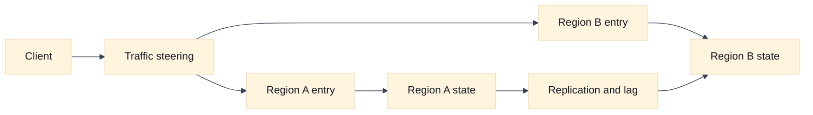
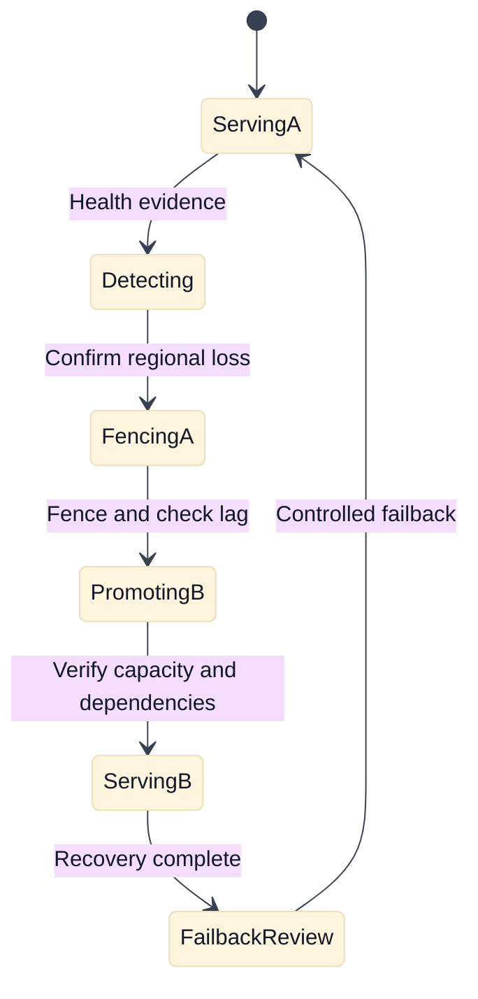

# Multi-Region Disaster Recovery and Failover

## A. Purpose and learning objectives

“Multi-region” is not a recovery plan by itself. Traffic can move while writes remain unsafe, replicas remain stale, certificates are unavailable, or the surviving region lacks capacity. This topic helps candidates connect routing, state, fencing, replication, RTO, RPO, and communication into one recoverable design.

You should be able to:

- Define RTO, RPO, detection time, promotion time, and failback separately.
- Design traffic steering around the ownership and safety of application state.
- Calculate survivor capacity and reason about stale DNS and client connection behavior.
- Compare AWS and GCP regional and global building blocks without equating them.
- Lead a tabletop exercise with explicit evidence, fencing, rollback, and communication gates.

Prerequisites are load balancing, observability, quotas, DNS, and replication. Review [`book/16-bgp-anycast-and-multi-region.md`](../book/16-bgp-anycast-and-multi-region.md) and [`book/topics/36-replication-failover-and-fencing.md`](../book/topics/36-replication-failover-and-fencing.md).

## B. Mental model: recovery is a state transition

Name the failure domain first: an instance, zone, region, provider control plane, identity service, DNS path, or dependency. A regional traffic director can detect an unhealthy endpoint, but it cannot decide whether a database is safe to promote. Separate data-plane steering from control-plane promotion and application-level readiness.

RTO is the maximum tolerated time until the service is restored. RPO is the maximum tolerated data loss measured in time or committed operations. Detection, decision, fencing, promotion, cache warm-up, DNS convergence, and client retry behavior all consume RTO. A short DNS TTL does not guarantee that every recursive resolver, client cache, or existing connection changes quickly.

Writes require a safety story. A primary must be fenced before a secondary accepts writes, or split brain can corrupt state. Replication lag must be visible. A read-only mode may be safer than accepting writes without a quorum. Sessions, queues, object stores, secrets, certificates, and third-party dependencies need their own regional behavior. **Inference:** a design is not active-active merely because two front doors accept packets.

Plan capacity for loss. If two regions each carry 50% traffic and one fails, the survivor needs roughly double normal capacity plus retry and recovery work. If the survivor is only sized for 70% of total demand, the failover is predictably an overload event. State the customer-priority policy when full capacity is impossible.

## C. AWS and GCP comparison

| Label | AWS example | GCP example | Interview boundary |
|---|---|---|---|
| **Vendor terminology** | Regions, Availability Zones, Route 53 routing, regional services, and AWS global entry options | Regions, zones, global or regional load balancing, Cloud DNS, and regional services | Global reachability does not make regional state globally available. |
| **Fact** | AWS provides multiple DNS, load-balancing, and replication building blocks with service-specific scope. | GCP provides global and regional load-balancing and DNS/replication building blocks with service-specific scope. | Verify health semantics, state support, and failover scope for the selected service. |
| **Inference** | Steering a name or address is only one phase of recovery. | The same inference applies to GCP steering. | Pair traffic movement with fencing and application readiness. |

AWS Regions, Availability Zones, Route 53, and service-specific global or regional features are **Vendor terminology**. GCP regions, zones, Cloud DNS, and global or regional load-balancing products are also **Vendor terminology**. Do not claim that a global load balancer guarantees database failover, or that a DNS health check captures application write safety. Current health-check behavior, propagation, and service availability must be verified in official documentation.

Compare providers on failure detection, traffic steering, backend scope, state replication, identity availability, data residency, capacity, and cost. The product with the most global networking is not automatically the product with the safest recovery semantics.

## D. Worked scenario: two-region checkout

Fictional checkout traffic is 6,000 requests per second, with 20% writes and 80% reads. Region A and Region B each normally serve 3,000 requests per second. A regional loss requires Region B to receive 6,000 requests per second. Add 10% retry amplification: `6,000 * 1.10 = 6,600` requests per second. If Region B is sized for only 5,500, the design must shed, queue, or prioritize traffic; calling it “highly available” without that policy is incomplete.

The recovery sequence is detect -> stop or fence writes in A -> confirm replica position -> promote B -> verify dependencies and capacity -> steer new traffic -> drain or reject old connections -> communicate -> observe -> later fail back. If the target RTO is 10 minutes, allocate a budget to each phase rather than assigning all 10 minutes to DNS. If RPO is five seconds, measure replication lag and define what happens when it exceeds the budget.

## E. Failure, evidence, and falsifiers

| Hypothesis | Evidence | Falsifier |
|---|---|---|
| Region A is unavailable | Independent probes, backend health, control-plane events | Multiple independent paths serve successfully from A. |
| Replication is safe to promote | Commit position, lag, fencing acknowledgement, dependency state | Old primary can still accept writes or lag exceeds RPO. |
| Traffic steering converged | Resolver answers, new connections, entry logs by region | New clients still consistently enter the failed region. |
| Survivor has capacity | Per-region saturation, queueing, retries, error budget | Capacity remains below tested failover limits under load. |
| Recovery is customer-complete | User journey and write/read probes | Only health checks pass while checkout or reconciliation fails. |

## F. Exercises

### F1. Timed whiteboard: safe regional loss

In 35 minutes, design a two-region checkout service with 10-minute RTO and five-second RPO. Draw traffic steering, state replication, fencing, identity, DNS, queues, capacity, and customer communication. Then introduce stale DNS and an unavailable identity provider. A strong answer degrades safely, names what cannot fail over, and assigns an owner to every transition.

### F2. Tabletop and evidence-led failover

At 09:00, region A reports high errors, but health checks are mixed and replication lag is eight seconds. Walk through the first 15 minutes. Define evidence for detection, when to stop writes, what customer modes are safe, and which signal authorizes traffic movement. Include a rollback or abort gate if fencing cannot be proven. Do not promote merely because a dashboard is red.

## G. Interview questions and direct answers

### G1. SDE2 questions

1. **What is the difference between RTO and RPO?**

   **Answer:** RTO is the maximum time to restore service; RPO is the maximum acceptable data loss or replication gap. Detection, promotion, DNS convergence, capacity, and client behavior consume RTO, while replication and fencing determine whether RPO is safe.

2. **Why is a short DNS TTL not enough for failover?**

   **Answer:** Recursive and client caches may retain answers, existing connections do not re-resolve, health evaluation may lag, and the target may not be safe to serve. DNS is one traffic-steering phase, not proof of application recovery.

3. **What prevents split brain?**

   **Answer:** A promotion protocol must fence the old writer or establish an equivalent authoritative ownership mechanism before the new writer accepts traffic. Observe acknowledgement and failure behavior; a timeout is not proof that the old writer stopped.

4. **How do you size a failover region?**

   **Answer:** Model total demand after loss, retries, cache misses, recovery jobs, and priority shedding. Compare it with tested compute, connections, addresses, bandwidth, quotas, dependencies, and state capacity. Normal utilization is not a failover capacity test.

### G2. Staff-level questions

5. **How would you get teams to treat disaster recovery as an engineering system?**

   **Answer:** Set service-level RTO/RPO contracts, dependency maps, ownership, runbook-free recovery procedures, evidence requirements, and recurring game days. Track actual detection and recovery time, stale data, unsafe promotions, capacity under loss, and unresolved assumptions. Fund resilience work through error-budget and business-impact data.

6. **When is active-passive better than active-active?**

   **Answer:** Active-passive can reduce write conflicts and simplify ownership when state cannot safely be multi-writer. It may cost more idle capacity and increase promotion time. Choose based on state semantics, RTO/RPO, failure evidence, and operational ability to test—not on a generic availability preference.

## H. Advanced design review: failover safety, capacity, and customer modes

### H1. Turn failover into an ordered state machine

A regional recovery design should distinguish at least these states: normal service, suspected degradation, confirmed loss, writes fenced, secondary promoted, traffic shifted, recovery validated, and failback ready. Each transition needs an authority, evidence, timeout, and abort condition. “Health check red” may move the service from normal to suspected degradation; it should not by itself authorize promotion. This framing exposes unsafe gaps such as a secondary accepting writes before the primary is fenced or DNS moving before capacity is ready.

Write the RTO budget as a sum: detection, diagnosis or quorum decision, fencing, promotion, warm-up, traffic steering, client reconnection, and verification. If the target is 15 minutes and you reserve 3 minutes for uncertainty and communication, the remaining phases might be allocated 2 + 2 + 3 + 2 + 3 minutes, but those numbers are **Inference** for an interview scenario. The important follow-up is whether each phase has been measured in a game day. A control-plane API returning success is not evidence that data-plane traffic, credentials, queues, and dependencies are ready.

### H2. Calculate survivor demand and RPO honestly

Suppose each region normally serves 3,000 requests per second, traffic is split evenly, and a region loss sends all 6,000 requests to the survivor. With 10% retry amplification and 15% cache-miss or recovery overhead, demand is approximately `6,000 * 1.10 * 1.15 = 7,590 requests per second`. If tested survivor capacity is 7,000, the design needs priority shedding, a pre-warmed capacity increase, or a lower recovery promise. Do not hide the gap behind “autoscaling”; scaling latency and quota availability are part of the RTO.

RPO is not just replication lag. Include acknowledged writes not yet durable in the survivor, in-flight payment calls, queued messages, and client retries. If the required RPO is 30 seconds but observed replication lag reaches 45 seconds, the design is out of contract before a failure occurs. Promotion then requires a business decision: pause writes, accept bounded data loss, or restore from a more recent durable source. Idempotency keys and reconciliation may reduce duplicate effects, but they do not magically recover missing data.

### H3. Fencing, traffic steering, and provider boundaries

Fencing must be authoritative. A failed health check, lost route, or operator timeout does not prove the old writer stopped. Use a lease, quorum, revoked credential, disabled endpoint, or storage-level writer ownership mechanism whose success and failure semantics are observable. Record the fencing acknowledgement and test the case where the old region is partitioned but still able to serve some clients. If evidence is ambiguous, the safe mode is to stop writes or serve explicitly degraded reads.

AWS and GCP provide multiple regional, global, DNS, and load-balancing mechanisms, but product scope and health semantics differ. **Vendor terminology** identifies the mechanism; **Inference** determines whether it meets this service’s RTO/RPO and state-ownership contract. Verify propagation, health-check source, connection behavior, quotas, address scope, and billing in the selected provider and region. A global front door can successfully redirect packets to a secondary that is still stale, under-sized, or unauthorized.

### H4. Ownership, rollback, and failback

The application or data owner decides whether writes may stop and what data loss is acceptable. The platform/network owner controls steering, endpoint, DNS, and capacity transitions. The database or storage owner controls promotion and fencing. Incident leadership coordinates evidence, customer communication, and the decision record. These roles must be identified before the incident; otherwise the person with access becomes the de facto authority.

Rollback after promotion is a new failover, not a simple undo. First establish the authoritative writer, reconcile or discard divergent writes, re-establish replication, and prove the original region is safe. Keep traffic on the survivor until the former primary is fenced against stale sessions and its capacity is validated. Define a failback gate that includes data consistency, replication direction, client cache behavior, and a measured observation period. A rapid oscillation between regions can be worse than a long controlled degradation.

### H5. Follow-up interview questions and substantive answers

1. **The secondary is healthy and has fresh replicas, but fencing the primary cannot be confirmed. What do you do?**

   **Answer:** Do not enable writes in the secondary if split brain could cause conflicting state. Move customers to a read-only or queued mode if that is safe, increase evidence collection, and use an authoritative storage or lease mechanism to prove writer ownership. If the business accepts data loss, that is an explicit risk decision, not an engineering assumption. The recovery record should state what could still be served and why.

2. **Why can a DNS failover appear successful while availability remains poor?**

   **Answer:** Resolver caches and existing connections delay movement, and the target may reject requests because of capacity, identity, dependency, or state readiness. I would compare new versus existing connections, resolver cohorts, backend health, and customer-level success. The traffic shift is complete only when the eligible request population reaches the intended target and the service SLO recovers.

3. **How would you justify active-active over active-passive to a Staff review?**

   **Answer:** Show that state semantics, conflict resolution, capacity, latency, and operational testing support multi-writer behavior. Active-active may reduce steering time and use capacity efficiently, but it increases consistency and debugging complexity. Active-passive may be safer for a single writer with clear fencing, even if idle capacity costs more. The choice follows measured RTO/RPO and ownership ability, not a generic “active-active is more available” claim.

## I. References and evidence labels

- **Fact / Vendor terminology:** [AWS disaster recovery guidance](https://docs.aws.amazon.com/whitepapers/latest/disaster-recovery-workloads-on-aws/disaster-recovery-options-in-the-cloud.html).
- **Fact / Vendor terminology:** [Amazon Route 53 routing policies](https://docs.aws.amazon.com/Route53/latest/DeveloperGuide/routing-policy.html).
- **Fact / Vendor terminology:** [Google Cloud architecture framework: reliability](https://cloud.google.com/architecture/framework/reliability).
- **Fact / Vendor terminology:** [Google Cloud global load balancing](https://cloud.google.com/load-balancing/docs/).
- **Inference method:** [BGP, anycast, and multi-region](../book/16-bgp-anycast-and-multi-region.md).
- **Inference method:** [Replication, failover, and fencing](../book/topics/36-replication-failover-and-fencing.md).

Provider scopes and health behavior are **Fact** or **Vendor terminology** within current cited documentation. Recovery sequencing, capacity calculations, and safety conclusions are **Inference** from stated assumptions and require a service-specific exercise.
