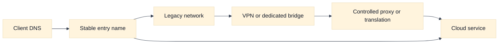
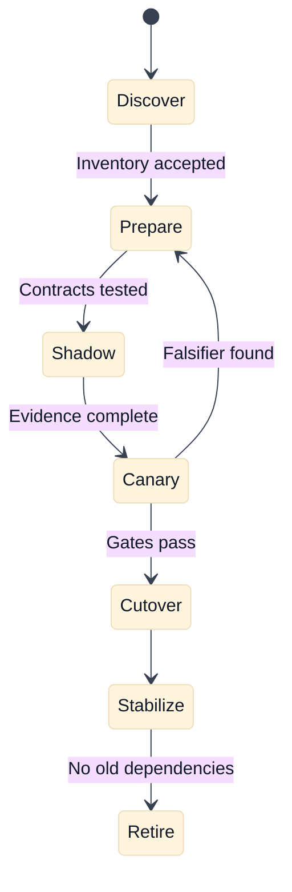

# Cloud Network Migration and Modernization

## A. Purpose and learning objectives

Migration interviews expose whether a candidate can move a live dependency graph while preserving safety. A plan that says “create a VPC and switch DNS” misses CIDR conflicts, identity, certificates, return paths, quotas, ownership, rollback, and the period when old and new systems coexist. This topic builds a phased, evidence-led migration answer for AWS, GCP, and hybrid environments.

You should be able to:

- Inventory network, identity, DNS, certificate, and application dependencies before selecting a target.
- Resolve overlapping address space and design a temporary hybrid path.
- Sequence dual-running, canary, DNS or load-balancer cutover, rollback, and decommissioning.
- Compare AWS and GCP migration building blocks by behavior and ownership.
- Lead a migration review that makes uncertainty, cost, and exit criteria explicit.

Prerequisites are routing, private connectivity, DNS, IAM, Kubernetes, load balancing, and the repository’s [staff design review pack](../docs/staff-design-review-pack.md).

## B. Mental model: migration is a series of reversible contracts

Begin with inventory, not target products. Record every producer and consumer, source and destination ranges, ports, protocols, DNS names, certificates, identity flows, health checks, data stores, queues, proxies, firewall rules, NAT paths, and ownership. A dependency that does not appear in the inventory is a migration risk, not an empty space.

Address overlap is a design constraint. Peering or routed VPN does not make identical prefixes safely distinguishable. Options include renumbering, translation, a temporary proxy, application-level bridging, or isolating the overlapping networks until one side moves. NAT can make packets flow while hiding identity and complicating troubleshooting, so make the translation boundary intentional and observable.

Coexistence needs a truth table. For each direction, state whether old-to-old, old-to-new, new-to-old, and new-to-new traffic is allowed, translated, authenticated, and monitored. DNS cutover changes new connections; existing pools and long-lived connections may continue using the old path. Certificate names, token audiences, client allowlists, and health-check sources must remain valid throughout the overlap.

Use stages with exit criteria: discover, prepare, connect, deploy, shadow, canary, expand, cut over, stabilize, and retire. Every stage has a rollback boundary. Decommission only after traffic, DNS caches, logs, credentials, routes, and dependencies show no remaining use. “No alerts” is not enough if telemetry is incomplete.

## C. AWS and GCP comparison

| Label | AWS example | GCP example | Interview boundary |
|---|---|---|---|
| **Vendor terminology** | VPC, Site-to-Site VPN, Direct Connect, Transit Gateway, Route 53, EKS | VPC, Cloud VPN, Cloud Interconnect, Network Connectivity Center, Cloud DNS, GKE | These are provider building blocks with service-specific scopes and limits. |
| **Fact** | AWS documents VPN and dedicated connectivity as distinct connectivity options with different operational properties. | GCP documents Cloud VPN and Interconnect as distinct options with different properties and prerequisites. | Compare encryption, bandwidth, redundancy, routing, ownership, and lead time. |
| **Inference** | A connected network still needs application, DNS, identity, and return-path validation. | The same inference applies in GCP. | Connectivity is a prerequisite, not a migration completion criterion. |

AWS VPC, Transit Gateway, Direct Connect, Site-to-Site VPN, EKS, and Route 53 are **Vendor terminology**. GCP VPC, Network Connectivity Center, Cloud Interconnect, Cloud VPN, GKE, and Cloud DNS are **Vendor terminology**. Product availability, topology, routing behavior, and quotas depend on region, account or project, and configuration. Verify the exact current design before implementation.

Compare migration options by time to provision, encryption, predictable capacity, route propagation, failure behavior, address compatibility, change ownership, and cost. A dedicated link may reduce variability while a VPN may be faster to stage. Neither removes the need to test application semantics.

## D. AWS setup and use

Use a disposable AWS account or a pre-approved lab VPC to stage the target side of a migration. This example creates only a non-overlapping VPC, subnet, and route table; it does not create a NAT gateway, VPN, Direct Connect circuit, or production route. The learner needs `AWS_PROFILE`, `AWS_REGION`, and permission to create and inspect EC2 networking resources. Review [AWS VPC creation](https://docs.aws.amazon.com/vpc/latest/userguide/create-vpc.html) and [AWS Site-to-Site VPN](https://docs.aws.amazon.com/vpn/latest/s2svpn/VPC_VPN.html). VPC, route-table, and address resources mutate cloud state; NAT gateways, VPNs, and data transfer may incur cost.

```bash
export AWS_PROFILE="AWS_PROFILE"
export AWS_REGION="AWS_REGION"
export AWS_VPC_CIDR="10.80.0.0/16"
export AWS_SUBNET_CIDR="10.80.10.0/24"
export AWS_VPC_NAME="northstar-migration-lab"
export AWS_SUBNET_NAME="northstar-target-a"

# Read-only preflight: prove the target range does not overlap known lab ranges.
aws ec2 describe-vpcs --profile "$AWS_PROFILE" --region "$AWS_REGION" \
  --query 'Vpcs[].{Vpc:VpcId,Cidr:CidrBlock,State:State,Tags:Tags}'

# Mutating lab setup: create a target boundary without internet egress.
aws ec2 create-vpc --profile "$AWS_PROFILE" --region "$AWS_REGION" \
  --cidr-block "$AWS_VPC_CIDR" --tag-specifications \
  "ResourceType=vpc,Tags=[{Key=Name,Value=$AWS_VPC_NAME}]"
aws ec2 create-subnet --profile "$AWS_PROFILE" --region "$AWS_REGION" \
  --vpc-id "TARGET_VPC_ID" --cidr-block "$AWS_SUBNET_CIDR" \
  --availability-zone "AWS_AZ" --tag-specifications \
  "ResourceType=subnet,Tags=[{Key=Name,Value=$AWS_SUBNET_NAME}]"
aws ec2 create-route-table --profile "$AWS_PROFILE" --region "$AWS_REGION" \
  --vpc-id "TARGET_VPC_ID"
aws ec2 associate-route-table --profile "$AWS_PROFILE" --region "$AWS_REGION" \
  --route-table-id "TARGET_ROUTE_TABLE_ID" --subnet-id "TARGET_SUBNET_ID"
```

The create responses provide the IDs used by later commands. Do not add a `0.0.0.0/0` route merely to make a migration test “work”; first decide whether the path is private, through a controlled inspection point, or intentionally public. Use route and subnet evidence before adding a VPN or peering connection:

```bash
aws ec2 describe-route-tables --profile "$AWS_PROFILE" --region "$AWS_REGION" \
  --route-table-ids "TARGET_ROUTE_TABLE_ID" \
  --query 'RouteTables[0].{Routes:Routes,Associations:Associations}'
aws ec2 describe-subnets --profile "$AWS_PROFILE" --region "$AWS_REGION" \
  --subnet-ids "TARGET_SUBNET_ID" \
  --query 'Subnets[0].{Vpc:VpcId,Cidr:CidrBlock,AZ:AvailabilityZone,State:State}'
```

For use in a real staged migration, connect this VPC to the existing environment using an approved, redundant VPN or dedicated-link design, advertise only the target prefix, and test both directions with a canary identity. Expected evidence is a non-overlapping CIDR, the intended route association, symmetric forward and return paths, MTU behavior, DNS resolution, certificate validity, and application-level success. Roll back by stopping canary traffic, removing the new route advertisement, disassociating the route table, and deleting the lab subnet/VPC only after confirming no dependent resource remains. **AWS troubleshooting follow-up:** “The VPN tunnel is up but the application cannot connect.” Ask whether the target route table has the remote prefix, the remote side has the target return prefix, security controls allow the application port, MTU/fragmentation was tested, and the application uses the new address rather than a cached old one.

## E. GCP setup and use

Use a disposable Google Cloud project or an explicitly approved lab project to stage a target VPC and regional subnet. Google Cloud VPC networks are global while subnets are regional, so state that scope in the migration record. The learner needs `PROJECT_ID`, `REGION`, a non-overlapping CIDR, and Compute Network Admin or equivalent permissions. Review [Google Cloud VPC networks](https://cloud.google.com/vpc/docs/vpc) and [Cloud VPN](https://cloud.google.com/network-connectivity/docs/vpn/concepts/overview). VPC creation is generally not the expensive part, but VPN, Interconnect, NAT, compute, and data transfer can incur cost.

```bash
export PROJECT_ID="PROJECT_ID"
export REGION="REGION"
export GCP_NETWORK="northstar-migration-lab"
export GCP_SUBNET="northstar-target-a"
export GCP_SUBNET_CIDR="10.90.10.0/24"
gcloud config set project "$PROJECT_ID"

# Read-only preflight: inspect existing networks and subnets for overlap.
gcloud compute networks list --project "$PROJECT_ID" \
  --format='table(name,autoCreateSubnetworks,routingConfig.routingMode)'
gcloud compute networks subnets list --project "$PROJECT_ID" \
  --format='table(name,region,ipCidrRange,network)'

# Mutating lab setup: create a custom-mode VPC and regional target subnet.
gcloud compute networks create "$GCP_NETWORK" --subnet-mode=custom \
  --bgp-routing-mode=regional --project "$PROJECT_ID"
gcloud compute networks subnets create "$GCP_SUBNET" --network "$GCP_NETWORK" \
  --region "$REGION" --range "$GCP_SUBNET_CIDR" --project "$PROJECT_ID"
gcloud compute networks describe "$GCP_NETWORK" --project "$PROJECT_ID" \
  --format='yaml(name,routingConfig,subnetworks)'
```

For a staged hybrid use case, add Cloud VPN or Interconnect only after the ownership, redundancy, dynamic-routing, and change windows are recorded. Advertise one test prefix, verify route import/export and return-path behavior, and run a canary application probe. Expected evidence is an overlap-free range, the subnet’s region and network, the remote route in the intended scope, MTU behavior, DNS/certificate readiness, and application success from both sides. Roll back by withdrawing the test route, removing the hybrid attachment through the approved process, deleting test firewall rules, and deleting the lab subnet/network after dependency checks. **GCP troubleshooting follow-up:** “The route appears in the VPC, but the migrated service is unreachable.” Ask whether the route is in the right VPC and region, whether the on-premises return route exists, whether Cloud VPN/Interconnect routing mode and dynamic advertisements are correct, and whether firewall rules and identity checks are separate blockers. A visible route is not proof of end-to-end reachability.

```bash
gcloud compute routes list --project "$PROJECT_ID" \
  --filter="network:$GCP_NETWORK" --format='table(name,destRange,nextHopGateway,nextHopVpnTunnel,priority)'
gcloud compute networks subnets describe "$GCP_SUBNET" --region "$REGION" \
  --project "$PROJECT_ID" --format='yaml(name,ipCidrRange,network,region,privateIpGoogleAccess)'
```

## F. Worked scenario and phased calculation

Fictional company `Northstar` moves a private payments API from an on-premises F5 edge into a cloud platform. The API handles 800 requests per second, has 300 ms p95 latency, and has 30-minute rollback tolerance. The old network uses `10.20.0.0/16`; the target already uses it, so direct routing is unsafe.

Choose a temporary proxy or translation boundary while the target service is assigned a non-overlapping range such as `10.80.0.0/16`. Inventory both directions and make the proxy preserve an authenticated request identity rather than trusting an arbitrary forwarded header. During canary, send 1% of eligible clients and compare success, p95, dependency errors, source identity, and cost for at least a full traffic pattern. If the old path carries 99% of traffic after cutover, retain it only until evidence shows old connections and hidden clients are gone.





## G. Failure, evidence, and falsifiers

| Hypothesis | Evidence | Falsifier |
|---|---|---|
| CIDR overlap breaks return routing | Prefixes, route tables, translation records, path tests | Both directions choose unique expected routes. |
| DNS cutover did not reach clients | Resolver answers, TTL, connection age, client cohort | New connections consistently use the target. |
| Identity or certificate contract changed | Token claims, certificate/SNI, allowlists, audit records | Old and new paths accept the same controlled identity. |
| Hybrid link is unstable | Tunnel/link state, loss, latency, route changes | Repeated path tests remain within the migration SLO. |
| Hidden client still uses legacy path | Access logs, flow records, DNS query logs, dependency inventory | Multiple independent signals show zero legacy use over the retention window. |

## H. Exercises

### H1. Timed whiteboard: overlapping networks

In 30 minutes, migrate a private API from `10.20.0.0/16` to a cloud network that uses the same range. Draw a reversible bridge, translation or proxy boundary, DNS, identity, certificates, health checks, return traffic, and decommission evidence. Follow up by asking what happens when the legacy network loses its route during canary. A strong answer names the temporary complexity and its removal date.

### H2. Evidence-led rollout

The first 5% canary shows equal success but 20% higher latency and unexpected cross-region bytes. Define queries and tests for route selection, proxy placement, DNS cohort, payload size, and dependency location. Set a stop gate and decide whether to optimize, roll back, or continue with an explicit risk acceptance. Include an owner for cost attribution and a deadline for retiring temporary translation.

## I. Interview questions and direct answers

### I1. Mechanism-focused questions

1. **What should be inventoried before a network migration?**

   **Answer:** Dependencies, addresses, ports, protocols, DNS, certificates, identity, routes, policies, NAT, proxies, health checks, data stores, queues, owners, and observed traffic. Include hidden and failure paths; a firewall rule list alone is not an application dependency graph.

2. **Why is overlapping CIDR dangerous?**

   **Answer:** A router cannot safely distinguish the same destination prefix in two connected domains. It may choose the wrong path or make return traffic asymmetric. Use renumbering, isolation, translation, or a controlled proxy and document the identity and observability consequences.

3. **Why is DNS cutover not an instant switch?**

   **Answer:** Caches, resolver behavior, client libraries, and existing connections outlive the authoritative change. New and old paths coexist. Monitor cohorts and keep the old path safe until evidence shows no important traffic remains.

4. **What is a useful canary?**

   **Answer:** A bounded cohort with a known entry path, measurable success and latency, complete logs, and a rollback gate. Compare against a control and include identity, dependency, cost, and failure metrics rather than only HTTP status.

### I2. Leadership and trade-off questions

5. **How do you keep a migration from becoming permanent hybrid complexity?**

   **Answer:** Give every bridge, translation, exception, and dual-write path an owner, purpose, metric, expiration date, and removal test. Review it at each gate. Make the target architecture and decommission evidence part of the initial approval, not a later aspiration.

6. **How do you lead disagreement between speed and safety?**

   **Answer:** Convert the disagreement into explicit customer impact, reversibility, evidence, and residual risk. Offer a smaller canary or staged boundary, assign decision ownership, and record what is accepted. Speed is safe when scope and rollback are bounded; broad emergency access is not a migration strategy.

## J. Advanced design review: migration contracts, rollback, and organizational ownership

### J1. Build a dependency graph before a cutover graph

A migration plan is incomplete if it lists networks and servers but not the behavior around them. Inventory caller cohorts, DNS names and TTLs, certificates and SNI, ports and protocols, source-identity expectations, routes and NAT, policy attachments, health checks, queues, databases, third-party endpoints, identity providers, observability, owners, and failure paths. Annotate each edge with direction, volume, latency budget, data sensitivity, and whether the dependency is hard or soft.

Use observed traffic to challenge the inventory. If a service handles 800 requests per second and 5% create long-lived connections, there may be 40 new long-lived connections per second; their age distribution matters more than the count at cutover. If 40% of clients reuse connections for up to 10 minutes, a 60-second DNS TTL cannot move those sessions. **Inference:** DNS, drain time, certificate rotation, and connection lifetime form one migration contract. A weekend window does not make an old path disappear.

### J2. Resolve overlap without hiding identity

Overlapping CIDRs create ambiguity in route selection and return traffic. Options include renumbering, isolation behind a proxy, translation, or a temporary application gateway. Each changes observability and source identity. Translation can make connectivity possible while collapsing many callers behind one address; a proxy can preserve authenticated application identity but adds a hop, timeout, certificate, and quota boundary. Renumbering costs more upfront but leaves the cleanest long-term route and policy model.

Evaluate the choice with a decision matrix: time to deploy, data-plane performance, source fidelity, failure isolation, rollback ease, cost, and retirement effort. If translation is selected, document the original identity carrier and prove that logs can correlate it end to end. A hidden NAT bridge is a common Staff failure: it solves packets while making authorization, rate limiting, and incident diagnosis weaker.

### J3. Migration arithmetic and phased gates

Suppose a canary receives 5% of 800 requests per second: `40 requests/second`. If the target path adds 20 ms at p95 and sends 30% of its 2 MiB average response across regions, the canary produces roughly `40 * 2 MiB * 0.30 = 24 MiB/second` of cross-region response traffic. Over an hour, that is about `84.4 GiB`, before retries and protocol overhead. These figures are planning inputs for cost and capacity review, not provider pricing claims.

Use gates that test behavior, not just deployment completion. Gate 1 verifies address, route, identity, certificate, and telemetry prerequisites. Gate 2 compares a controlled canary with an old-path control for success, latency, retries, dependency load, source identity, and cost. Gate 3 exercises one dependency or zone failure. Gate 4 expands traffic while the old path remains safe. Gate 5 retires the bridge only after connection drain, DNS convergence, audit review, and a removal test. Each gate needs an owner and a stop condition.

### J4. Provider boundaries, ownership, and rollback

AWS and GCP offer different hybrid connectivity, load-balancing, identity, quota, and address-scope mechanisms. **Vendor terminology** can describe the candidate implementation; it cannot prove that a migration path is reversible. Verify route propagation, transitivity, MTU, health-check source, source translation, endpoint scope, quota lead time, and billing for the selected design. Keep portable acceptance criteria—reachability, authorization, latency, failure behavior, evidence, and cost—above product choices.

The migration owner coordinates the plan, but component owners must accept their contracts: application for behavior and idempotency, network for paths and policy, security for trust and certificates, data for replication and consistency, and finance for material cost changes. Rollback means restoring a known-good request path, credentials, dependencies, and capacity, not merely changing DNS. Preserve the old path until the rollback test has passed, and give every temporary bridge an expiry date, metric, owner, and removal evidence.

### J5. Follow-up interview questions and substantive answers

1. **The canary has equal success rates but 20% higher latency. Do you continue?**

   **Answer:** First isolate the added time by DNS, connect, TLS, proxy, backend, and dependency spans. Compare payload size, client cohort, route, zone, and cache state with the control. If the latency violates the target SLO or creates hidden cost, pause expansion and optimize or redesign. Equal success is not sufficient when tail latency or cross-region transfer consumes the reliability and cost budget.

2. **When should a temporary translation layer be removed?**

   **Answer:** After the target has an overlap-free address plan, all dependencies use the new identity and DNS contracts, long-lived connections are drained, telemetry can correlate callers without translation, and rollback no longer requires the bridge. Set a measured deadline at design approval. If it remains, the owner must accept its route, port, cost, and security risk explicitly rather than allowing temporary complexity to become invisible infrastructure.

3. **A migration needs a broad firewall exception to meet the date. How do you respond?**

   **Answer:** Bound the exception to the canary source, destination, protocol, and time, assign an owner, and define evidence and removal gates. If a narrow rule cannot be expressed, treat that as a design defect or stop condition. I would explain the customer and security impact, offer a smaller reversible phase, and record residual risk. Schedule pressure changes the decision timeline, not the trust boundary.

## K. References and evidence labels

- **Fact / Vendor terminology:** [AWS hybrid connectivity](https://aws.amazon.com/hybridconnectivity/).
- **Fact / Vendor terminology:** [AWS Site-to-Site VPN](https://docs.aws.amazon.com/vpn/latest/s2svpn/VPC_VPN.html).
- **Fact / Vendor terminology:** [AWS VPC creation](https://docs.aws.amazon.com/vpc/latest/userguide/create-vpc.html).
- **Fact / Vendor terminology:** [Google Cloud VPC networks](https://cloud.google.com/vpc/docs/vpc).
- **Fact / Vendor terminology:** [Google Cloud VPN](https://cloud.google.com/network-connectivity/docs/vpn/concepts/overview).
- **Fact / Vendor terminology:** [Google Cloud hybrid connectivity](https://cloud.google.com/hybrid-connectivity).
- **Fact / Vendor terminology:** [Google Cloud Interconnect overview](https://cloud.google.com/network-connectivity/docs/interconnect/concepts/overview).
- **Inference method:** [Staff design review pack](../docs/staff-design-review-pack.md).
- **Inference method:** [Addressing, subnetting, and routing](../book/02-addressing-subnetting-routing.md).

Provider names and connectivity properties are **Fact** or **Vendor terminology** within the cited sources. Sequencing, canary arithmetic, and decommission rules are **Inference** from the stated scenario and must be adapted to the actual dependency graph.
