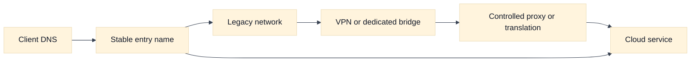
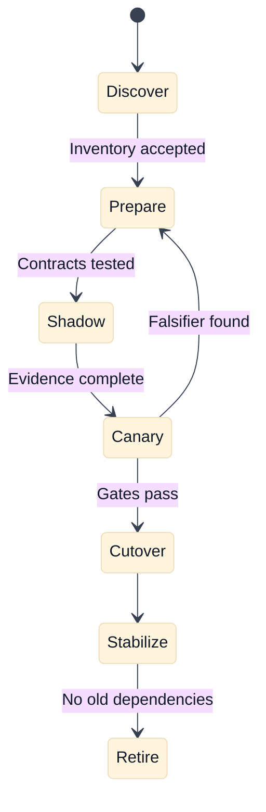

# Cloud Network Migration and Modernization

## A. Purpose and learning objectives

Migration interviews expose whether a candidate can move a live dependency graph while preserving safety. A plan that says “create a VPC and switch DNS” misses CIDR conflicts, identity, certificates, return paths, quotas, ownership, rollback, and the period when old and new systems coexist. This topic builds a phased, evidence-led migration answer for AWS, GCP, and hybrid environments.

You should be able to:

- Inventory network, identity, DNS, certificate, and application dependencies before selecting a target.
- Resolve overlapping address space and design a temporary hybrid path.
- Sequence dual-running, canary, DNS or load-balancer cutover, rollback, and decommissioning.
- Compare AWS and GCP migration building blocks by behavior and ownership.
- Lead a migration review that makes uncertainty, cost, and exit criteria explicit.

Prerequisites are routing, private connectivity, DNS, IAM, Kubernetes, load balancing, and the repository’s [staff design review pack](../docs/staff-design-review-pack.md).

## B. Mental model: migration is a series of reversible contracts

Begin with inventory, not target products. Record every producer and consumer, source and destination ranges, ports, protocols, DNS names, certificates, identity flows, health checks, data stores, queues, proxies, firewall rules, NAT paths, and ownership. A dependency that does not appear in the inventory is a migration risk, not an empty space.

Address overlap is a design constraint. Peering or routed VPN does not make identical prefixes safely distinguishable. Options include renumbering, translation, a temporary proxy, application-level bridging, or isolating the overlapping networks until one side moves. NAT can make packets flow while hiding identity and complicating troubleshooting, so make the translation boundary intentional and observable.

Coexistence needs a truth table. For each direction, state whether old-to-old, old-to-new, new-to-old, and new-to-new traffic is allowed, translated, authenticated, and monitored. DNS cutover changes new connections; existing pools and long-lived connections may continue using the old path. Certificate names, token audiences, client allowlists, and health-check sources must remain valid throughout the overlap.

Use stages with exit criteria: discover, prepare, connect, deploy, shadow, canary, expand, cut over, stabilize, and retire. Every stage has a rollback boundary. Decommission only after traffic, DNS caches, logs, credentials, routes, and dependencies show no remaining use. “No alerts” is not enough if telemetry is incomplete.

## C. AWS and GCP comparison

| Label | AWS example | GCP example | Interview boundary |
|---|---|---|---|
| **Vendor terminology** | VPC, Site-to-Site VPN, Direct Connect, Transit Gateway, Route 53, EKS | VPC, Cloud VPN, Cloud Interconnect, Network Connectivity Center, Cloud DNS, GKE | These are provider building blocks with service-specific scopes and limits. |
| **Fact** | AWS documents VPN and dedicated connectivity as distinct connectivity options with different operational properties. | GCP documents Cloud VPN and Interconnect as distinct options with different properties and prerequisites. | Compare encryption, bandwidth, redundancy, routing, ownership, and lead time. |
| **Inference** | A connected network still needs application, DNS, identity, and return-path validation. | The same inference applies in GCP. | Connectivity is a prerequisite, not a migration completion criterion. |

AWS VPC, Transit Gateway, Direct Connect, Site-to-Site VPN, EKS, and Route 53 are **Vendor terminology**. GCP VPC, Network Connectivity Center, Cloud Interconnect, Cloud VPN, GKE, and Cloud DNS are **Vendor terminology**. Product availability, topology, routing behavior, and quotas depend on region, account or project, and configuration. Verify the exact current design before implementation.

Compare migration options by time to provision, encryption, predictable capacity, route propagation, failure behavior, address compatibility, change ownership, and cost. A dedicated link may reduce variability while a VPN may be faster to stage. Neither removes the need to test application semantics.

## D. Worked scenario and phased calculation

Fictional company `Northstar` moves a private payments API from an on-premises F5 edge into a cloud platform. The API handles 800 requests per second, has 300 ms p95 latency, and has 30-minute rollback tolerance. The old network uses `10.20.0.0/16`; the target already uses it, so direct routing is unsafe.

Choose a temporary proxy or translation boundary while the target service is assigned a non-overlapping range such as `10.80.0.0/16`. Inventory both directions and make the proxy preserve an authenticated request identity rather than trusting an arbitrary forwarded header. During canary, send 1% of eligible clients and compare success, p95, dependency errors, source identity, and cost for at least a full traffic pattern. If the old path carries 99% of traffic after cutover, retain it only until evidence shows old connections and hidden clients are gone.

## E. Failure, evidence, and falsifiers

| Hypothesis | Evidence | Falsifier |
|---|---|---|
| CIDR overlap breaks return routing | Prefixes, route tables, translation records, path tests | Both directions choose unique expected routes. |
| DNS cutover did not reach clients | Resolver answers, TTL, connection age, client cohort | New connections consistently use the target. |
| Identity or certificate contract changed | Token claims, certificate/SNI, allowlists, audit records | Old and new paths accept the same controlled identity. |
| Hybrid link is unstable | Tunnel/link state, loss, latency, route changes | Repeated path tests remain within the migration SLO. |
| Hidden client still uses legacy path | Access logs, flow records, DNS query logs, dependency inventory | Multiple independent signals show zero legacy use over the retention window. |

## F. Exercises

### F1. Timed whiteboard: overlapping networks

In 30 minutes, migrate a private API from `10.20.0.0/16` to a cloud network that uses the same range. Draw a reversible bridge, translation or proxy boundary, DNS, identity, certificates, health checks, return traffic, and decommission evidence. Follow up by asking what happens when the legacy network loses its route during canary. A strong answer names the temporary complexity and its removal date.

### F2. Evidence-led rollout

The first 5% canary shows equal success but 20% higher latency and unexpected cross-region bytes. Define queries and tests for route selection, proxy placement, DNS cohort, payload size, and dependency location. Set a stop gate and decide whether to optimize, roll back, or continue with an explicit risk acceptance. Include an owner for cost attribution and a deadline for retiring temporary translation.

## G. Interview questions and direct answers

### G1. SDE2 questions

1. **What should be inventoried before a network migration?**

   **Answer:** Dependencies, addresses, ports, protocols, DNS, certificates, identity, routes, policies, NAT, proxies, health checks, data stores, queues, owners, and observed traffic. Include hidden and failure paths; a firewall rule list alone is not an application dependency graph.

2. **Why is overlapping CIDR dangerous?**

   **Answer:** A router cannot safely distinguish the same destination prefix in two connected domains. It may choose the wrong path or make return traffic asymmetric. Use renumbering, isolation, translation, or a controlled proxy and document the identity and observability consequences.

3. **Why is DNS cutover not an instant switch?**

   **Answer:** Caches, resolver behavior, client libraries, and existing connections outlive the authoritative change. New and old paths coexist. Monitor cohorts and keep the old path safe until evidence shows no important traffic remains.

4. **What is a useful canary?**

   **Answer:** A bounded cohort with a known entry path, measurable success and latency, complete logs, and a rollback gate. Compare against a control and include identity, dependency, cost, and failure metrics rather than only HTTP status.

### G2. Staff-level questions

5. **How do you keep a migration from becoming permanent hybrid complexity?**

   **Answer:** Give every bridge, translation, exception, and dual-write path an owner, purpose, metric, expiration date, and removal test. Review it at each gate. Make the target architecture and decommission evidence part of the initial approval, not a later aspiration.

6. **How do you lead disagreement between speed and safety?**

   **Answer:** Convert the disagreement into explicit customer impact, reversibility, evidence, and residual risk. Offer a smaller canary or staged boundary, assign decision ownership, and record what is accepted. Speed is safe when scope and rollback are bounded; broad emergency access is not a migration strategy.

## H. References and evidence labels

- **Fact / Vendor terminology:** [AWS hybrid connectivity](https://aws.amazon.com/hybridconnectivity/).
- **Fact / Vendor terminology:** [AWS Site-to-Site VPN](https://docs.aws.amazon.com/vpn/latest/s2svpn/VPC_VPN.html).
- **Fact / Vendor terminology:** [Google Cloud hybrid connectivity](https://cloud.google.com/hybrid-connectivity).
- **Fact / Vendor terminology:** [Google Cloud Interconnect overview](https://cloud.google.com/network-connectivity/docs/interconnect/concepts/overview).
- **Inference method:** [Staff design review pack](../docs/staff-design-review-pack.md).
- **Inference method:** [Addressing, subnetting, and routing](../book/02-addressing-subnetting-routing.md).

Provider names and connectivity properties are **Fact** or **Vendor terminology** within the cited sources. Sequencing, canary arithmetic, and decommission rules are **Inference** from the stated scenario and must be adapted to the actual dependency graph.
