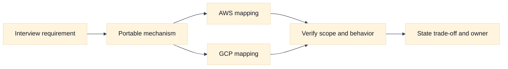
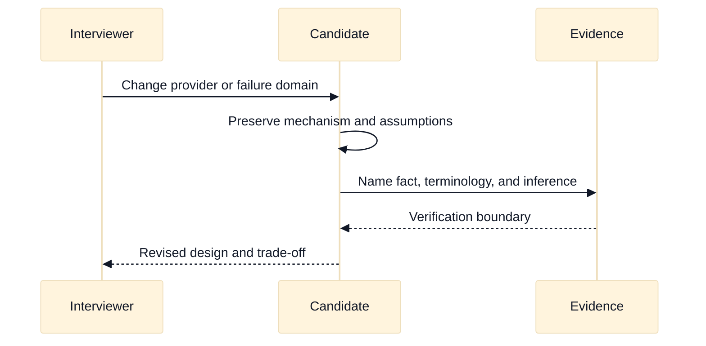

# Cloud Networking Interview Synthesis and Mock Loops

## A. Purpose, learning objectives, and prerequisites

This capstone turns the cloud networking track into interview performance. SDE2 candidates need a dependable method for tracing a request, choosing a design, and debugging a failure. Staff candidates also need to define ownership, manage uncertainty, expose organizational trade-offs, and show how a design survives change. The goal is not to recite AWS or GCP product names. The goal is to make a clear, testable argument about boundaries, state, evidence, capacity, and risk.

By the end, you should be able to:

- Open a design answer with assumptions, requirements, and a layered request path.
- Compare AWS and GCP only where the scenario requires provider-specific choices.
- Use calculations, diagrams, evidence, and falsifiers to make trade-offs concrete.
- Lead a recovery, migration, or platform discussion at Staff scope.
- Self-score an answer and turn weak areas into a deliberate practice plan.

Prerequisites are the preceding topics in this folder, especially traffic entry, Kubernetes, observability, quotas, multi-region recovery, and migration. Also use the repository’s [`docs/networking-interview-bank.md`](../docs/networking-interview-bank.md), [`docs/interview-whiteboard-drills.md`](../docs/interview-whiteboard-drills.md), and [`docs/staff-design-review-pack.md`](../docs/staff-design-review-pack.md) for general rubrics. This capstone supplies cloud-specific scenarios rather than duplicating generic questions.

## B. A repeatable answer structure

Use the following sequence when a prompt is underspecified.

1. **Clarify the contract.** Ask about users, protocols, regions, latency, availability, data sensitivity, RTO/RPO, scale, and change constraints.
2. **State assumptions.** Use fictional names and reserved addresses. Identify what is known, estimated, and provider-dependent.
3. **Draw the path.** Put DNS, entry, routing, policy, identity, backend, dependency, return path, and state on one diagram.
4. **Choose a baseline.** Explain the simplest design that meets the contract before adding global routing, service insertion, or multi-region complexity.
5. **Calculate pressure points.** Estimate requests, concurrency, addresses, ports, bandwidth, survivor load, and cost dimensions.
6. **Name failure modes.** Include control-plane lag, stale DNS, partial regional loss, quota exhaustion, identity failure, and asymmetric return traffic.
7. **Define evidence and gates.** Say what logs, metrics, traces, or controlled tests would confirm or falsify each leading hypothesis.
8. **Close with ownership.** At Staff level, name service, platform, security, finance, and incident roles, plus a migration or review cadence.

Do not start with “I would use an ALB” or “I would use a global load balancer.” Start with the packet and customer contract. **Vendor terminology:** AWS and GCP product names are implementation options. **Inference:** a product is suitable only if its documented packet, health, identity, scope, quota, and failure behavior satisfies the stated requirements.

## C. AWS and GCP comparison

The capstone uses provider features only as examples of portable design decisions. The candidate should first explain the mechanism—private service publication, workload identity, load balancing, flow evidence, quotas, or traffic steering—and then map it to a provider. This keeps the answer useful when the interviewer changes the provider halfway through the discussion.

| Label | AWS example | GCP example | What to compare |
|---|---|---|---|
| **Vendor terminology** | VPC, EKS, PrivateLink, IAM roles, Route 53, and Elastic Load Balancing | VPC, GKE, Private Service Connect, Workload Identity Federation, Cloud DNS, and Cloud Load Balancing | Scope, source identity, health behavior, and ownership. |
| **Fact** | AWS documents each networking, identity, and regional service with its own limits and integration model. | GCP documents each networking, identity, and regional service with its own limits and integration model. | Check the selected product, region, release, and account/project. |
| **Inference** | A shared platform must make provider-specific behavior visible behind a stable contract. | The same platform inference applies on GCP. | Standardize interfaces, not assumptions about matching names. |

In every mock loop, label provider-dependent statements as **Fact** or **Vendor terminology**, and label architecture conclusions as **Inference**. For example, it is vendor terminology to name AWS PrivateLink or GCP Private Service Connect; it is an inference that a private service publication pattern can reduce route-mesh blast radius. Confirm current endpoint, DNS, authorization, quota, and billing semantics in official documentation.

## D. Mock loop one: private multi-tenant platform

### C1. Interview prompt and expected framing

You are designing a private platform for 40 internal teams. Each team runs services in Kubernetes and must call shared billing and secrets APIs. Teams must not reach one another by default. The platform will be offered on AWS first and may later support GCP. Ask about tenant isolation, service publication, DNS, identity, egress, audit, quotas, and whether shared services need consumer source identity.

A strong opening says that “private” describes exposure, not authorization. Draw team namespaces and cloud network boundaries. Use a stable internal name for each shared service, a service-oriented private publishing mechanism or controlled internal entry point, default-deny network policy, workload federation, and per-team authorization at the API. Keep DNS ownership explicit. If shared services need tenant identity, preserve a signed application identity; do not rely on a source address that may be translated or proxied.

### C2. Design path and trade-offs

The request path is workload -> cluster DNS -> private endpoint or internal load balancer -> shared-service listener -> policy -> backend -> dependency. The return path must be traced separately. A network connection can be available while IAM or application authorization denies the request. A broad peering mesh may seem simple at 40 teams but grows the route, policy, and blast-radius surface. A hub or service-publication pattern centralizes controls but introduces platform dependency and quotas.

Use a team address plan with non-overlapping growth blocks. If each team needs 256 workload addresses and a 50% growth and rollout reserve, reserve `256 * 1.5 = 384` addresses per team before system and infrastructure allocation. This is a planning estimate, not a provider limit. For 40 teams that is 15,360 addresses, distributed by region and zone rather than placed in one flat subnet. Ask whether future acquisitions or connected networks make this plan insufficient.

For AWS, mention VPC, EKS integration, internal load-balancing, private service publication, IAM role federation, and flow/access logs as **Vendor terminology**. For GCP, mention VPC, GKE integration, private service publication or internal load balancing, Workload Identity Federation, and flow/access logs as **Vendor terminology**. Keep the comparison on scope, source identity, DNS, approval, quota, and observability. Do not say AWS PrivateLink and GCP Private Service Connect have identical endpoint or billing behavior.

### C3. Interviewer follow-ups and wrong paths

- **Follow-up:** “A team says its policy is default deny, but it can reach another team.” Ask how policy enforcement is verified, whether labels are mutable, and whether the traffic bypasses the cluster through a cloud entry point.
- **Follow-up:** “The shared API sees every client from one address.” Ask whether a proxy or NAT translated the source and what authenticated identity the API should use instead.
- **Follow-up:** “The platform team wants full administrator access for convenience.” Push toward scoped roles, time-bounded break-glass access, audit evidence, and tenant ownership.
- **Wrong path:** Building a full mesh before establishing service ownership and discovery. This creates many failure and policy edges.
- **Wrong path:** Calling a security group or cloud firewall a tenant authorization system. It controls packet reachability, not the entire application decision.
- **Wrong path:** Solving overlapping CIDRs with hidden NAT and never documenting identity, return paths, or removal criteria.

### C4. Scoring notes

SDE2 performance is strong when the candidate traces one request, identifies the policy and identity gates, and explains a test. Staff performance requires a platform contract, exception process, quota model, ownership, cost allocation, and migration path. Deduct for unqualified provider equivalence or for assuming private reachability means safe access.

## E. Mock loop two: regional checkout recovery

### D1. Interview prompt and expected framing

An online checkout service runs in two regions. The business requires 99.95% monthly availability, an RTO of 15 minutes, and an RPO of 30 seconds for committed orders. Region A reports elevated errors, but health checks are mixed. Ask whether reads and writes are separate, how replication works, how sessions and payment calls behave, what capacity is available in region B, and how an operator proves fencing.

State that traffic steering, state promotion, and customer readiness are separate transitions. Draw DNS or global entry, regional backends, database ownership, replication lag, identity, payment dependency, and observability. Define a degraded mode: perhaps reads continue, new orders pause, or low-value operations queue while write safety is established. Do not promise that a global front door fixes a split-brain database.

Suppose each region normally serves 3,000 requests per second and loss of A sends all 6,000 to B. Add 10% retry amplification: `6,000 * 1.10 = 6,600`. If B can safely serve only 5,500, state the prioritization or reject the design. Count detection, decision, fencing, promotion, warm-up, steering, and client reconnection inside 15 minutes. If observed replication lag is 45 seconds, the RPO requirement is already violated and promotion requires a business decision or data-loss response.

### D2. Interviewer follow-ups and wrong paths

- **Follow-up:** “DNS has a 30-second TTL.” Ask about recursive caches, existing connections, client retry behavior, and whether B is actually ready.
- **Follow-up:** “The health check in A is red.” Ask what it checks, whether it can distinguish read and write safety, and which independent evidence confirms regional loss.
- **Follow-up:** “Promotion succeeded, but duplicate orders appear.” Ask whether A was fenced, whether clients retried without idempotency, and whether payment calls were replayed.
- **Wrong path:** Treating an HTTP 200 health check as proof of data correctness.
- **Wrong path:** Promoting B before proving A cannot accept writes.
- **Wrong path:** Sizing B for normal traffic and ignoring retries, cache misses, replication work, or priority shedding.

### D3. Scoring notes

SDE2 candidates should define RTO/RPO and trace a safe failover sequence. Staff candidates should add game days, evidence ownership, customer communications, legal or residency constraints, error-budget decisions, capacity financing, and a failback plan. Deduct for conflating regional network reachability with service availability.

## F. Mock loop three: hybrid Kubernetes migration

### E1. Interview prompt and expected framing

`Northstar` has an on-premises F5 edge and a Kubernetes service using `10.20.0.0/16`. The target cloud network uses the same range. The team wants to migrate without changing the public DNS name and asks for a weekend cutover. Ask about dependency inventory, clients with long-lived connections, certificates, identity, source preservation, traffic symmetry, target CNI, quota, observability, rollback, and who can approve a stop.

Begin with discovery and an overlap-free target such as `10.80.0.0/16`, then select a temporary proxy or translation boundary. Draw old-to-old, old-to-new, new-to-old, and new-to-new behavior. Make DNS, certificate, token audience, health-check, and forwarded-identity contracts explicit. Keep a control cohort on the old path and a measured canary on the new path. A weekend window is not evidence that rollback is easy.

Estimate risk from traffic rather than server count. If the service handles 800 requests per second and 5% of requests create long-lived connections, inspect connection age and drain time before cutover. If 40% of clients use connection pools with a 10-minute maximum age, a short DNS TTL will not move those connections immediately. Set a drain and observation window based on measured behavior.

### E2. Interviewer follow-ups and wrong paths

- **Follow-up:** “The canary has equal success but more latency.” Ask about proxy location, cross-region transfer, MTU, DNS cohort, dependency placement, and payload size.
- **Follow-up:** “The new path works only when a broad firewall rule is enabled.” Require a minimal rule and evidence that health checks, identity, and return traffic are covered.
- **Follow-up:** “Rollback DNS now.” Ask what happens to already established connections and whether the old path still has capacity and valid credentials.
- **Wrong path:** Adding a broad allow rule to meet the cutover clock without a removal or evidence plan.
- **Wrong path:** Removing the old network immediately after DNS changes.
- **Wrong path:** Ignoring cloud IP allocation because compute capacity is available.

### E3. Scoring notes

SDE2 performance includes a phased plan, overlap handling, canary, evidence, and rollback. Staff performance adds stakeholder alignment, migration economics, platform standardization, temporary-complexity retirement, and a decision record that makes residual risk visible.

## G. Self-scoring and practice loop

Score each dimension from 0 to 3: 0 means absent, 1 means named without evidence, 2 means coherent and testable, and 3 means anticipates trade-offs and ownership.

| Dimension | 0–1 signal | 2–3 signal |
|---|---|---|
| Requirements | Jumps to a product | Clarifies SLO, scale, scope, and constraints. |
| Request path | Draws only a cloud box | Traces DNS, route, policy, identity, backend, dependency, and return path. |
| Capacity | Says “scale horizontally” | Calculates concurrency, addresses, survivor load, ports, quotas, and cost dimensions. |
| Provider reasoning | Equates product names | Maps behavior and states verification boundaries. |
| Failure safety | Says “fail over” | Defines detection, fencing, promotion, steering, readiness, and failback. |
| Evidence | Lists dashboards | Gives hypotheses, signals, timestamps, and falsifiers. |
| Staff leadership | Names a team | Defines ownership, guardrails, exceptions, communications, and measurable outcomes. |
| Communication | Gives an unstructured monologue | Narrates assumptions, trade-offs, uncertainty, and next decision clearly. |

An SDE2 target is at least 16 of 24 with no zero in request path, failure safety, or evidence. A Staff target is at least 20 of 24, with a 3 in ownership and at least one explicit trade-off. After each loop, write one missed assumption, one missing signal, and one sentence that could be shorter. Repeat the same scenario after 48 hours, then change the provider, traffic shape, or failure domain.

## H. Interview questions and direct answers

### G1. SDE2 questions

1. **What should your first five minutes of a cloud design answer contain?**

   **Answer:** Clarified requirements, explicit assumptions, a request and return path, the main policy and identity boundaries, a baseline architecture, and the first capacity or failure calculation. This gives the interviewer a model to challenge rather than a list of products.

2. **How do you compare AWS and GCP in an interview?**

   **Answer:** State the portable mechanism first, then map only the needed provider terms. Compare scope, packet behavior, identity, health, quota, observability, and cost. Label documented facts and inferences, and say which current provider behavior you would verify.

3. **What makes a debugging answer convincing?**

   **Answer:** It starts with a precise symptom, narrows the cohort and time, lists competing hypotheses, gathers evidence at each boundary, and names a falsifier. It avoids changing several controls at once and preserves a rollback or stop condition.

4. **What calculation is most useful in a failover question?**

   **Answer:** Calculate survivor demand, including retries, cache misses, and recovery work, then compare it with tested capacity and quotas. Also calculate the RTO phase budget and replication lag against RPO. The exact numbers are less important than visible assumptions.

### G2. Staff-level questions

5. **What differentiates a Staff cloud-networking answer from a senior implementation answer?**

   **Answer:** Staff reasoning connects architecture to organizational systems: ownership, interfaces, guardrails, exception paths, cost, reliability investment, migration sequence, and learning loops. It makes uncertainty explicit and creates mechanisms by which many teams can make safe decisions repeatedly.

6. **How would you challenge a design that is technically correct but operationally fragile?**

   **Answer:** Identify the unowned assumption, missing evidence, coupled limit, or unsafe failure transition. Propose a smaller reversible experiment, define a success and stop gate, and record residual risk. Escalate only the decision that needs authority; do not hide fragility behind a broader permission or a more complex product.

7. **How should a platform team balance standardization and autonomy?**

   **Answer:** Standardize the interfaces, safe defaults, observability, identity, quotas, and recovery expectations. Allow teams to choose implementation details when they meet those contracts. Provide a reviewable exception path with owner, expiry, evidence, and cost so autonomy does not become unbounded blast radius.

8. **What would you do if you do not remember a provider limit?**

   **Answer:** Say it is provider-dependent, name the resource and scope, and explain how you would verify it in current documentation or quota tooling. Continue with symbolic variables and headroom calculations. Honest uncertainty with a verification plan is stronger than a confident stale number.

## I. Fourth integrated mock loop: global API edge with identity and telemetry split

### I1. Interview prompt and expected opening

An organization runs a multi-tenant API on AWS today and plans to add a GCP region. Customers use HTTPS, the API calls a private fraud service, and a small subset of tenants requires data residency. The current platform has one global hostname, a shared edge, workload federation, private service publication, per-tenant rate limits, and centralized telemetry. During a release, 1% of requests return 401, p99 latency doubles for European tenants, and cost rises sharply because traffic appears to cross regions. The interviewer asks whether the edge, identity, routing, or observability design is at fault.

Do not accept “multi-cloud active-active” as a requirement without clarifying the state model. Ask which tenants may be served in which region, whether writes are single-home or multi-home, how the fraud service is reached, what identity the edge forwards, whether rate limits are global or regional, and which SLO defines success. Clarify whether the 401s are provider authorization failures, application authentication failures, expired tokens, or an edge-generated response. Ask who owns global traffic policy, tenant placement, identity federation, telemetry pipelines, and cost allocation.

Your opening should establish four separate paths: customer DNS and edge entry; edge-to-API routing; API-to-fraud private connectivity; and workload-to-provider identity. Draw the return path for each. Then state assumptions: 4,000 requests per second globally, 60% from Europe, 5% retries during the incident, 20-minute token lifetime, and 30% of fraud calls crossing the region boundary in the current design. Mark these as **Inference** from the prompt rather than facts.

### I2. Design path, calculations, and trade-offs

The baseline should prefer tenant-aware regional affinity with an explicit escape path, not indiscriminate global balancing. If Europe normally receives 2,400 requests per second and 5% retries are added, the incident demand is about `2,400 * 1.05 = 2,520 requests/second`. If one European region is lost and the alternate region is tested for 2,800 requests per second, the capacity margin is only 280 requests per second, or about 10%. That margin may disappear with cache misses, fraud-service calls, and connection re-establishment. State what traffic would be shed first: low-priority reads, expensive fraud checks, or new writes.

For p99 latency, decompose the increase into DNS, edge queue, TLS, API queue, fraud RPC, and response serialization. If 30% of requests call fraud and those calls add 100 ms when cross-region, the expected average contribution is approximately `0.30 * 100 ms = 30 ms`; p99 can be much larger if the cross-region cohort is concentrated or retries cascade. This arithmetic is a diagnostic estimate, not a claim about any provider’s network. A falsifier for “cross-region fraud traffic caused the latency” is stable fraud-call geography and duration for affected requests while edge queueing rises independently.

The 401 cohort requires a different evidence path. Compare token issuer, audience, subject, expiry, clock skew, edge-to-backend forwarding, and provider audit principal. A load balancer or proxy can preserve a connection while altering headers or source address. If the API sees a valid customer token but the fraud service sees a workload token with the wrong audience, the network is reachable and the authorization boundary is wrong. The remedy is not a wider firewall rule.

### I3. Provider comparison and behavior boundaries

Map only the mechanisms needed by the prompt. **Vendor terminology:** AWS and GCP each offer global or regional traffic-entry products, workload identity mechanisms, private service publication, flow/load-balancer logs, and quota systems. **Fact:** the selected product documentation defines its own scope, health semantics, identity fields, limits, and pricing. **Inference:** a portable platform contract should expose tenant placement, source identity, health, telemetry, quota, and rollback semantics without claiming that similarly named services behave identically.

For AWS, ask which edge, regional load balancer, VPC, private endpoint, and workload identity mode are selected. For GCP, ask which global or regional load-balancing path, VPC, private service publication, and GKE identity mode are selected. Compare health-check source, regionality, DNS behavior, source translation, service-provider approval, token subject, log coverage, and quota scope. If a provider detail is unknown, state the exact verification question instead of inventing a limit or promising feature parity.

### I4. Interviewer follow-ups, falsifiers, and wrong paths

- **Follow-up:** “The 401s disappear when traffic is pinned to AWS.” Ask whether the GCP path uses a different token issuer, audience, clock source, header policy, or application configuration. A falsifier for a GCP network hypothesis is a provider audit record showing the intended principal arrived and was denied by policy.
- **Follow-up:** “The European region is healthy, so why not send all traffic there?” Ask about residency, tested survivor capacity, fraud-service locality, state ownership, and existing connections. Health is insufficient if the region cannot safely own the tenant’s data or withstand retry-amplified demand.
- **Follow-up:** “Central telemetry shows no edge errors.” Ask about sampling, pipeline delay, tenant cardinality, log source coverage, and whether the edge-generated 401 is represented. Absence of an edge record may falsify edge handling only after coverage is proven.
- **Follow-up:** “Finance asks why cross-region cost rose.” Correlate bytes by path, tenant, region, retry count, and failover state. Do not charge all teams for a shared routing decision without identifying the control that can reduce the cost.
- **Wrong path:** Making both clouds active for every tenant before defining state and residency ownership.
- **Wrong path:** Treating a shared customer JWT as sufficient workload authorization for the fraud service.
- **Wrong path:** Turning up telemetry sampling globally during an incident without a cardinality, privacy, or cost bound.

### I5. Scoring example and recovery sequence

An SDE2 answer should identify the four paths, separate 401 from latency, perform one survivor calculation, and propose an evidence sequence. A strong Staff answer additionally proposes a tenant placement contract, a cross-cloud identity contract, cost attribution, quota and capacity gates, and a staged rollback. Score the answer higher when it says what each owner can change safely and what evidence authorizes the next change.

A credible recovery sequence is: freeze the release; preserve representative request IDs and configuration versions; segment 401 and p99 cohorts; validate identity claims and audit principals; reduce cross-region fraud calls or route only an eligible tenant cohort; enforce priority shedding if survivor margin is insufficient; and keep a control cohort on the previous path. Restore traffic only after identity success, customer latency, fraud-service locality, and cost return to defined ranges for two observation windows. If the evidence contradicts the leading hypothesis, say so and reopen the decision tree.

## J. Interviewer calibration: distinguishing competent, strong, and Staff answers

### J1. Use observable behaviors rather than confidence

Interviewers should score the candidate’s reasoning artifacts, not fluency or product familiarity. A competent answer names a plausible architecture. A strong answer states assumptions, traces request and return paths, calculates a pressure point, and proposes evidence. A Staff answer makes the design repeatable across teams by naming interfaces, ownership, guardrails, exceptions, cost, migration, and learning mechanisms. A candidate who says “I would verify the current limit” should receive credit when they identify the resource, scope, evidence source, and design consequence.

### J2. Calibration rubric with examples

| Dimension | Competent signal | Strong signal | Staff signal |
|---|---|---|---|
| Requirements | Asks about scale and availability | Adds latency, state, residency, and change constraints | Identifies conflicting stakeholders and decision owner. |
| Path reasoning | Draws client, edge, and backend | Includes DNS, routing, policy, identity, dependency, and return path | Shows control plane, data plane, state, and cost/limit plane. |
| Calculations | Estimates requests or concurrency | Includes retries, zone loss, addresses, ports, or bytes | Tests coupled limits, uncertainty, and sensitivity to assumptions. |
| Provider mapping | Names a plausible AWS/GCP service | Compares scope, semantics, and verification boundaries | Defines a portable contract and isolates provider-specific risk. |
| Failure handling | Suggests failover or rollback | Gives evidence, falsifiers, and stop gates | Defines safe state transitions, authority, communication, and residual risk. |
| Ownership | Names a responsible team | Separates platform and service ownership | Creates interfaces, exception expiry, cost allocation, and review cadence. |

For a worked scoring example, consider a candidate who proposes a global load balancer, active-active writes, default-deny policy, and autoscaling. If they cannot explain writer fencing, survivor capacity, token audience, or how the load balancer health check differs from customer success, score the architecture knowledge as partial despite confident delivery. If they pause, identify those gaps, and replace the proposal with a staged, testable design, score the recovery behavior separately and reward the correction.

### J3. Follow-up dialogue for calibration

**Interviewer:** “The target region is healthy, but replication lag is 45 seconds and the RPO is 30 seconds. Shift writes?”

**Competent candidate:** “I would be cautious and check the database.”

**Strong candidate:** “No. The observed lag violates the stated RPO. I would pause promotion, determine whether the business accepts loss, and check whether the old writer can be fenced.”

**Staff candidate:** “No automatic write promotion. I would declare the RPO contract currently unmet, move eligible reads or queued operations to a degraded mode, and assign data, platform, and business owners to the decision. I would preserve evidence of lag, verify writer fencing, quantify affected writes, and state the exact condition for accepting bounded loss. If we later promote, I would require an idempotency and reconciliation plan, not just a green health check.”

**Interviewer:** “A team asks for a broad firewall exception to recover faster.”

**Strong candidate:** “I would narrow it to the required source, destination, protocol, and time, then add a rollback.”

**Staff candidate:** “I would first identify whether the failure is reachability, authorization, or identity. If an exception is necessary, it is a time-bound experiment with an owner, audit evidence, a negative test, and a removal gate. I would explain the customer impact of waiting versus the security and blast-radius cost of widening access, and I would offer a smaller cohort or alternate path. Recovery speed does not justify making an unmeasured trust boundary permanent.”

### J4. Candidate self-review prompts

After each mock, write down: the assumption you failed to state, the limit you treated as infinite, the owner you left ambiguous, the evidence that would falsify your favorite hypothesis, and the sentence where you overclaimed provider equivalence. Repeat the scenario with one changed variable—provider, region, identity mode, traffic skew, or state model. The goal is not to memorize this answer. It is to demonstrate a stable method when the interviewer changes the facts.

## K. References and evidence labels

- **Inference method:** [Networking interview bank](../docs/networking-interview-bank.md).
- **Inference method:** [Interview whiteboard drills](../docs/interview-whiteboard-drills.md).
- **Inference method:** [Staff design review pack](../docs/staff-design-review-pack.md).
- **Fact / Vendor terminology:** [AWS architecture center](https://aws.amazon.com/architecture/).
- **Fact / Vendor terminology:** [Google Cloud architecture center](https://cloud.google.com/architecture).
- **Fact / Vendor terminology:** [AWS networking documentation](https://docs.aws.amazon.com/vpc/).
- **Fact / Vendor terminology:** [Google Cloud VPC documentation](https://cloud.google.com/vpc/docs).

AWS and GCP names in the mock loops are **Vendor terminology**. Claims about documented provider capabilities are **Fact** only within the cited, current documentation boundary. The sequencing, scoring, calculations, and interview recommendations are **Inference** from the scenarios and should be adapted to the interviewer’s stated requirements.
