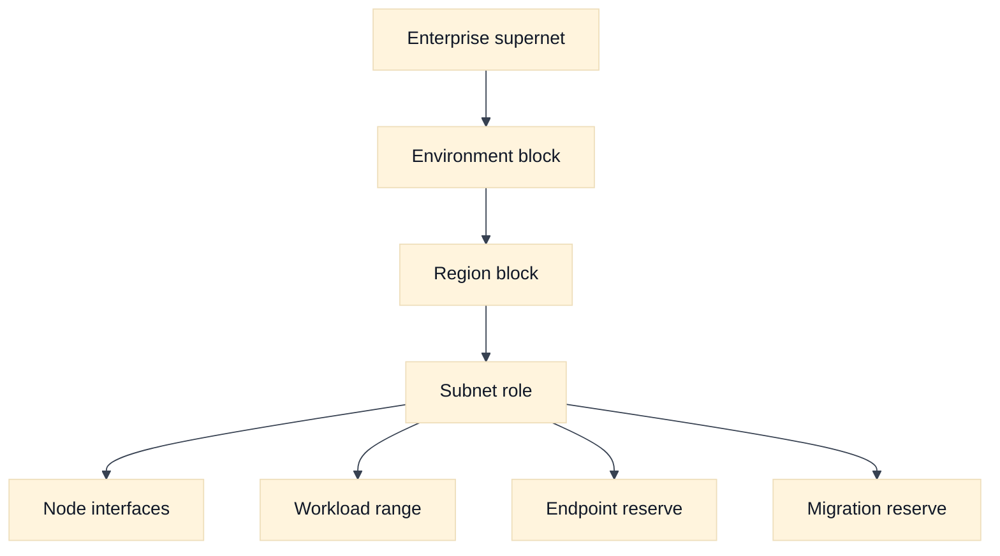
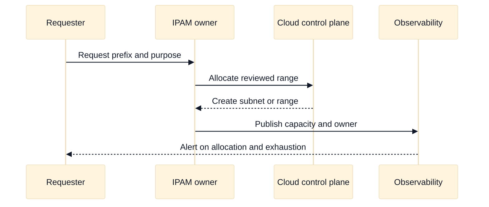

# Subnet and IP Address Planning in Cloud Networks

## A. Learning objectives

- Build a non-overlapping address plan with growth, failure, and migration reserve.
- Distinguish subnet scope from workload, pod, service, and endpoint address consumption.
- Explain IPv4 pressure, IPv6 choices, and the operational cost of fragmented space.
- Compare AWS and GCP subnet placement and managed-container range planning.
- Diagnose address exhaustion with evidence rather than by repeatedly resizing a subnet.

## B. Prerequisites

Review [addressing, subnetting, and route selection](../book/02-addressing-subnetting-routing.md), [cloud primitives](../book/topics/37-cloud-networking-primitives.md), and [the foundations module](cloud-network-foundations.md). You should be able to calculate a prefix size, understand usable host space at a high level, and distinguish an interface address from a service virtual IP. Provider-specific reserved-address counts and service limits are intentionally not memorized here; check current official documentation for the selected product and region.

## C. Address planning mental model

An address plan is an ownership and change-management artifact, not just a CIDR spreadsheet. Start with a hierarchy: enterprise supernet, environment, region, failure domain, subnet role, and workload range. Allocate contiguous blocks where future aggregation matters, but preserve holes for mergers, hybrid links, and services that require fixed shapes. Record who may allocate from each block and how exhaustion is reported.

Separate these consumers:

- **Node or interface ranges:** addresses attached to virtual machines, nodes, gateways, and appliances.
- **Workload ranges:** pod or task addresses when the platform gives workloads routable addresses.
- **Service ranges:** virtual IPs or cluster service addresses that may not be directly routed like an interface.
- **Endpoint ranges:** private service endpoints, load-balancer interfaces, and inspection attachments.
- **Control and migration ranges:** management, temporary overlap mediation, and blue/green deployment space.

Capacity is not only host count. A design can have free addresses but still fail because a particular zone, interface type, route table, endpoint, or control-plane operation has a limit. Track demand as a distribution. If zone A has 60 percent of workloads and a zone-loss plan moves half of that demand, the surviving zones need headroom for the moved load, not merely the normal average.

For a prefix, the rough IPv4 host calculation is `2^(32-prefix)`, after subtracting provider, network, broadcast, or platform reservations as documented for the product. Use rough math in an interview, label it as an estimate, and state that exact usable capacity is provider and feature dependent. IPv6 can reduce address scarcity, but it does not automatically solve routing policy, application compatibility, egress, logging, or identity problems.

## D. AWS and GCP comparison

**Vendor terminology:** AWS subnets are associated with Availability Zones, and route tables are associated with subnets. Google Cloud VPC networks use regional subnets and global route concepts; GKE may use primary and secondary ranges depending on the cluster networking model.

| Planning concern | AWS example | Google Cloud example | What to verify |
| --- | --- | --- | --- |
| Placement | Subnets are tied to an Availability Zone | Subnets are regional and serve zonal resources | Failure and route scope for the selected service. |
| Workload allocation | ENI and service-specific interface consumption | NICs plus GKE alias or secondary range consumption | Per-workload address behavior and limits. |
| Container ranges | VPC CNI pod addresses often consume VPC space | GKE VPC-native clusters use alias IP ranges | CNI mode, version, and expansion procedure. |
| Private endpoints | Interface endpoints and load-balancer interfaces consume addresses | Private access and PSC endpoints consume addresses according to product mode | Endpoint count, regional behavior, and source identity. |
| IPv6 | Dual-stack and egress features vary by service | Dual-stack support and subnet configuration vary by service | Current regional and product support. |

**Fact:** [AWS subnet documentation](https://docs.aws.amazon.com/vpc/latest/userguide/configure-subnets.html) and [Google Cloud subnet documentation](https://cloud.google.com/vpc/docs/subnets) describe different scope models. **Vendor terminology:** “secondary range” is a Google Cloud/GKE term, while AWS commonly discusses VPC CNI address allocation and ENIs. **Inference:** The portable question is “which object consumes an address, where can it be placed, and what happens during failure?”

## E. Worked scenario: three environments and two regions

Northstar needs development, staging, and production in two fictional regions. Each region has three failure zones. Production expects 180 nodes, up to 20 workload addresses per node, 30 private endpoints, and 25 percent growth. The team also wants 20 percent reserve for migration.

If every workload address must come from the same VPC space, the rough production workload requirement is `180 x 20 = 3,600`. Growth adds `900`, and migration reserve adds `720` if applied after growth, for `5,220` addresses before platform reservations. A `/19` has 8,192 total addresses, so it may be a candidate, but the answer must check the provider’s usable count, distribution across zones, node address density, and whether workload addresses are separate ranges. If pods use a separate range, the node subnet can be smaller while the workload range receives the growth reserve.

Do not allocate one giant block and call the problem solved. Place a per-region, per-role plan in a table, reserve non-overlapping space for on-premises and future acquisition, and test a simulated zone loss. Document an exhaustion alarm based on allocated and available addresses, not only CPU utilization.

## F. Diagram: address hierarchy

## G. Diagram: allocation lifecycle

## H. Failure, evidence, and falsifiers

| Hypothesis | Evidence | Falsifier |
| --- | --- | --- |
| Subnet is exhausted | Allocation inventory by zone and object type | Adequate free addresses in the failing scope |
| Pod range is exhausted | CNI or cluster range usage | Workload range has capacity and placement succeeds |
| Fragmentation blocks growth | IPAM free-list and contiguous-prefix request | A suitable contiguous block is available |
| Zone loss cannot be absorbed | Per-zone demand and failover simulation | Surviving zones retain required headroom |
| Overlap causes route ambiguity | Prefix inventory across connected domains | No overlapping prefixes on the attempted path |
| Resize is unsafe | Route, dependency, and migration plan | Change is supported with tested rollback |

## I. Exercises

### I.1 Timed whiteboard: address plan

Take 20 minutes. Allocate fictional RFC 1918 space for two regions, three environments, three zones, node interfaces, workload addresses, private endpoints, and a future hybrid connection. Show at least 25 percent growth and a migration reserve. Follow-up: the interviewer changes the workload model from one address per pod to several addresses per node. Recalculate the pressure and explain which assumptions are provider-dependent.

### I.2 Evidence-led rollout: exhausted range

Take 25 minutes. A cluster rollout fails only in one zone with an “address unavailable” symptom. Define the evidence order: allocation by zone, pending workload placement, CNI events, route state, control-plane quota, and recent changes. Propose a safe temporary mitigation and a durable plan. Follow-up: explain why expanding a range without checking overlap and route propagation can create a larger outage.

## J. Interview questions and direct answers

### J.1 SDE2: How do you size a subnet?

**Answer:** Identify every address consumer, calculate normal and failure demand, add growth and migration reserve, partition by placement and ownership, then validate provider reservations and limits. I would show the assumptions and alarms, not present a single prefix as universally correct.

### J.2 SDE2: Why can free addresses still fail allocation?

**Answer:** Capacity may be scoped by zone, interface type, quota, contiguous-prefix requirement, endpoint type, or control-plane state. Aggregate free space does not prove that the requested object can be placed in the required scope. Break usage down by consumer and placement.

### J.3 SDE2: What is the difference between a service IP and an interface IP?

**Answer:** An interface IP is usually attached to a network interface and participates in forwarding. A service IP may be virtual, implemented by a load balancer or proxy, and mapped to changing backends. Its routing, source preservation, health, and logging behavior must be verified rather than inferred from the address format.

### J.4 SDE2: How does overlap hurt hybrid connectivity?

**Answer:** A router cannot safely distinguish two identical destinations without policy or translation. Longest-prefix selection cannot resolve equal overlapping prefixes. Resolve overlap before connecting, use a carefully bounded translation or proxy design when unavoidable, and document the identity and return-path implications.

### J.5 Staff: How would you govern IP allocation across many teams?

**Answer:** Establish an IPAM source of truth with delegated pools, purpose and owner metadata, approval rules for connected domains, automated overlap checks, and exhaustion SLOs. Review actual allocation against declared demand. Treat address space as a platform product with migration reserve and a deprecation process.

### J.6 Staff: When would you prefer separate workload ranges?

**Answer:** Separate ranges are useful when workload density, routing, ownership, or scaling differs from node interfaces. They can reduce pressure on node subnets and make policy clearer, but add route, observability, and expansion dependencies. I would choose them only after confirming CNI behavior and failure evidence.

### J.7 Staff: Is IPv6 an answer to every address problem?

**Answer:** No. It addresses scarcity and can simplify endpoint identity, but applications, firewalls, DNS, egress, observability, dependencies, and staff expertise must support it. A dual-stack migration needs explicit coverage and rollback, not a claim that a larger address space removes operational complexity.

### J.8 SDE2: What would you monitor?

**Answer:** Monitor allocated and free addresses by subnet, zone, range, and consumer; pending allocation failures; growth rate; overlap findings; route changes; and quota headroom. Alert before exhaustion and attach an owner and action to each alert so it is not merely a dashboard metric.

## K. References and evidence labels

- **Fact:** [AWS subnets](https://docs.aws.amazon.com/vpc/latest/userguide/configure-subnets.html) and [Google Cloud subnets](https://cloud.google.com/vpc/docs/subnets).
- **Vendor terminology:** [Amazon VPC CNI](https://docs.aws.amazon.com/eks/latest/userguide/pod-networking.html) and [GKE VPC-native clusters](https://cloud.google.com/kubernetes-engine/docs/concepts/alias-ips).
- **Inference:** Capacity formulas and reserve guidance are engineering estimates; confirm exact usable addresses and quotas in the selected service documentation.
- [Portable subnetting](../book/02-addressing-subnetting-routing.md), [Kubernetes ingress](../book/15-cloud-networking-and-kubernetes-ingress.md), and [capacity/SLO engineering](../book/topics/16-capacity-performance-and-slo-engineering.md) provide related material.
