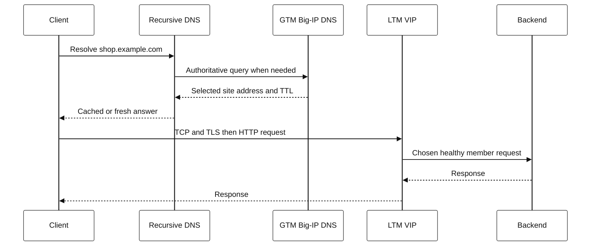

# 2. Follow one request

Consider `https://shop.example.com/cart` served from two data centers.

1. The client resolves `shop.example.com`. A recursive resolver may answer
   from cache or query the site's authoritative DNS path.
2. GTM/BIG-IP DNS can select a healthy, policy-appropriate site answer for a
   Wide IP. DNS reply caching means that choice can affect later requests.
3. The client creates a TCP connection to the selected virtual IP (VIP).
4. TLS is negotiated. The VIP may pass TLS through or terminate it.
5. LTM applies virtual-server policy, selects an eligible pool member, and
   proxies/forwards the connection according to its configuration.
6. The application executes the request and the response traverses its own
   return path.



## A decision tree for failures

```text
Name does not resolve?
  Verify the exact query, resolver, response code, TTL, and authoritative data.
Name resolves but connection fails?
  Verify selected address, route, firewall/security group, and TCP evidence.
TLS fails after connection?
  Verify hostname/SNI, certificate chain, expiration, and TLS policy.
HTTP fails?
  Identify the responder, then examine VIP policy, pool health, and app logs.
Intermittent or regional?
  Compare resolver/cache, selected site, client network, and failure domain.
```

## SDE2 design questions

- Is load balancing client-side, DNS-based, L4, L7, or a combination?
- What is the unit of balancing: DNS answer, connection, HTTP request, or
  stream? That determines how quickly policy can react.
- Where does TLS terminate, and which hop authenticates the caller?
- What protects a healthy dependency when another fails: timeouts, circuit
  breakers, bulkheads, backoff, and load shedding?
- Which telemetry says a target is *serving correct traffic*, rather than only
  accepting TCP?
