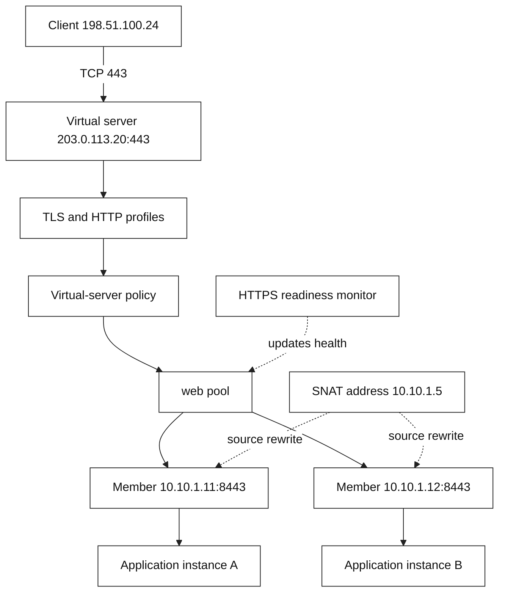
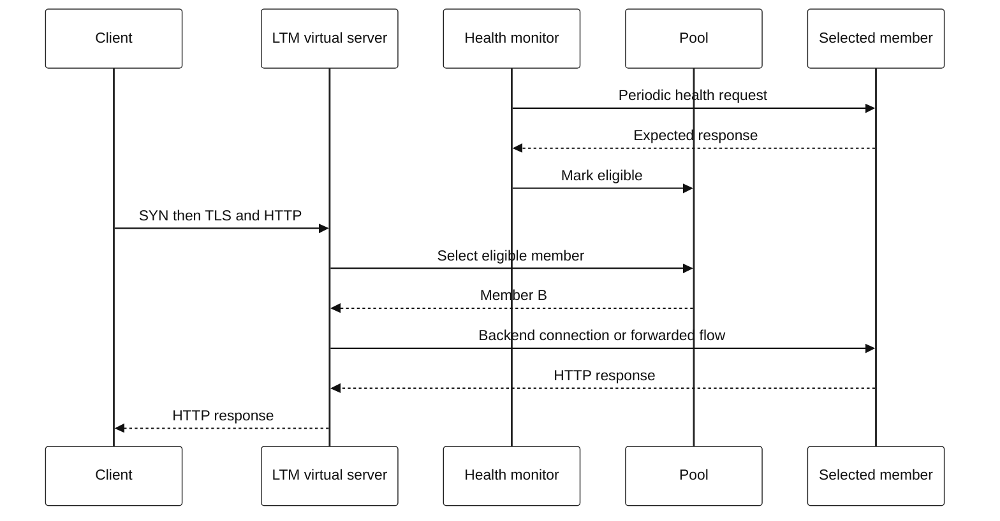

# 3. F5 BIG-IP LTM: local traffic

**Local Traffic Manager (LTM)** is the BIG-IP module commonly used to expose a
virtual server (often called a VIP), apply traffic policy, and select a local
backend. “Local” means its decision scope is typically a site or traffic
domain, not that packets are physically short-distance.

## Object model

| Object | Meaning | SDE question |
| --- | --- | --- |
| Virtual server | Listener and policy entry point, usually an IP:port | Which address/port did the client reach? |
| Pool | Candidate backend group | Which service instances are eligible? |
| Pool member | Backend address and service port in a pool | Is this instance enabled and healthy? |
| Node | Address-level backend object | Is the host reachable? |
| Monitor | Active health test assigned to a node/member/pool | Does it test meaningful readiness? |
| Profile | Protocol/traffic behavior, such as TCP, HTTP, or TLS | What behavior changes at the VIP? |
| SNAT | Source-address translation toward the backend | Can backend replies return through LTM? |

F5's virtual-server, pool, node, and monitor configuration objects are
documented in the F5 TMSH reference. A monitor result can affect eligibility;
the exact inheritance and availability state depend on attachment scope and
configuration.

## Detailed architecture

This is conceptual: the processing order and available features depend on the
virtual server, profiles, policy, mode, and BIG-IP version.

## Connection lifecycle: UML-style sequence

## Health checks are a contract

A TCP monitor can show that a port accepts connections; it does not prove the
application can serve a correct checkout. Prefer a lightweight endpoint that
tests the dependencies needed for the traffic class being admitted. Avoid
making it so expensive that the monitor itself harms the service.

Choose the failure policy deliberately:

| Choice | Benefit | Cost/risk |
| --- | --- | --- |
| Fast monitor interval | Quicker removal | More probe traffic; transient sensitivity |
| Slow monitor interval | Fewer probes, less flapping | Longer exposure to a bad member |
| Shallow TCP probe | Simple signal | May route traffic to a broken application |
| Deep readiness probe | Better admission signal | Can couple health to fragile dependencies |

## Load-balancing methods and persistence

Common policies include round robin, ratio/weighted selection, least
connections, and fastest-response-style policies. A policy only selects among
the **eligible** members it can observe; it does not manufacture capacity.

Persistence (for example a cookie, source address, or application token) can
keep related requests on one member. It can also create hot spots and make
draining slower. Use it only when the application state design requires it;
prefer externally shared state when that is viable.

## TLS termination, re-encryption, and passthrough

| Pattern | LTM can inspect HTTP? | Backend sees TLS? | Key consideration |
| --- | --- | --- | --- |
| Terminate | Yes | Not on that hop | Protect backend hop and client identity headers |
| Terminate then re-encrypt | Yes | Yes, new TLS session | Manage both TLS policies/certificates |
| Passthrough | Usually no L7 inspection | Yes, client session | Less L7 control at LTM |

Never assume `X-Forwarded-For` is trustworthy from the public Internet. Strip
or overwrite it at a trusted boundary and document which proxy hops may add it.

## LTM troubleshooting order

1. Identify the exact VIP, port, client network, timestamp, and error.
2. Check virtual-server availability and whether the flow matched the expected
   listener/policy.
3. Check pool/member availability, monitor output, and administrative state.
4. Compare client-side and server-side TCP/TLS evidence. Look for missing
   return traffic, resets, handshake mismatch, or timeout.
5. Verify SNAT/routing symmetry and backend listener behavior.
6. Correlate with application logs using a request ID; do not diagnose from a
   status code alone.
