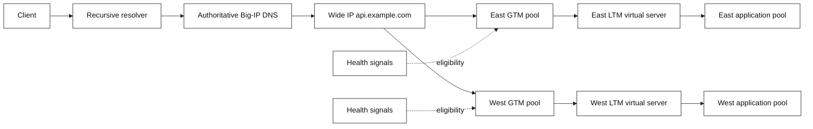
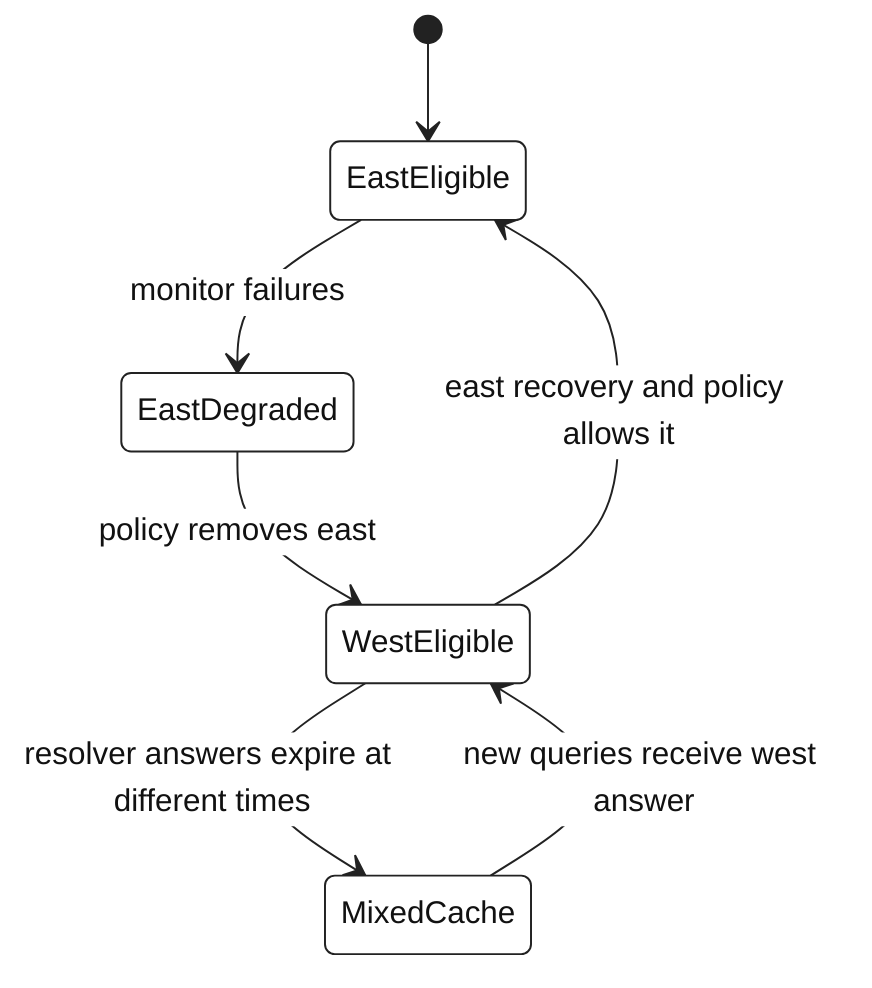

# 4. F5 GTM / BIG-IP DNS: global traffic

F5 GTM is the older name for **BIG-IP DNS**. It makes DNS answers available
under a global traffic policy. Unlike LTM, it generally does not proxy each
HTTP request: a recursive resolver asks a DNS question, receives an answer,
and may cache it for the TTL. The client then connects to that answer.

## Core object model

| Object | Meaning |
| --- | --- |
| Data center | Logical location/failure-domain grouping |
| Server | A managed or discovered traffic-serving system |
| Virtual server | An address/service endpoint available through a server |
| GTM pool | Set of candidate virtual servers or nested objects |
| Wide IP (WIP) | FQDN mapped to one or more pools and selection methods |
| Listener / DNS service | Endpoint receiving DNS queries |
| Monitor | Health signal for a target or dependency |

F5 defines a Wide IP as mapping an FQDN to one or more pools of virtual
servers. A local DNS (LDNS) query is evaluated against the Wide IP’s eligible
pools and configured load-balancing methods.

## Architecture: DNS steering and local delivery

## What GTM can and cannot promise

**It can:** select a DNS answer from eligible objects using configured policy
and health signals.

**It cannot:** revoke a response already cached by recursive resolvers,
guarantee that every end user uses the resolver location as their location, or
instantaneously move existing TCP connections. It is therefore an important
traffic-steering layer, not a replacement for local capacity and resilience.

## Common steering approaches

| Method | Idea | Best fit | Caveat |
| --- | --- | --- | --- |
| Global availability | Prefer an ordered site until unavailable | Active/passive DR | Can overload the preferred site |
| Ratio | Return sites by configured weight | Planned distribution | Weights are not live capacity |
| Topology | Use source/resolver topology rules | Geographic affinity | Resolver location is an imperfect client proxy |
| Round robin | Rotate eligible answers | Simple distribution | Cache behavior changes client-level results |
| Quality of service / metrics | Use monitored performance inputs | Latency-aware steering | Requires trustworthy, fresh measurements |

Availability thresholds, persistence, fallback behavior, and monitor scope are
policy decisions. Discuss their failure implications before changing them.

## Failover timeline: UML-style state diagram

The diagram highlights an inference from DNS caching: observed client migration
is staggered. The exact timing is a function of TTL, resolver behavior,
application connection reuse, and local policies.

## SDE2 failure drill

When one site is unhealthy, answer these in order:

1. Does the relevant monitor mark the GTM target unavailable, and what exactly
   does that monitor test?
2. Are alternate pools/virtual servers eligible under the WIP policy?
3. Are recursive resolvers still serving a cached old response?
4. Does the alternate LTM have healthy capacity, correct certificate/SNI,
   dependencies, and database/write safety for the workload?
5. Which requests are already connected to the failing site, and what does the
   application retry safely?
