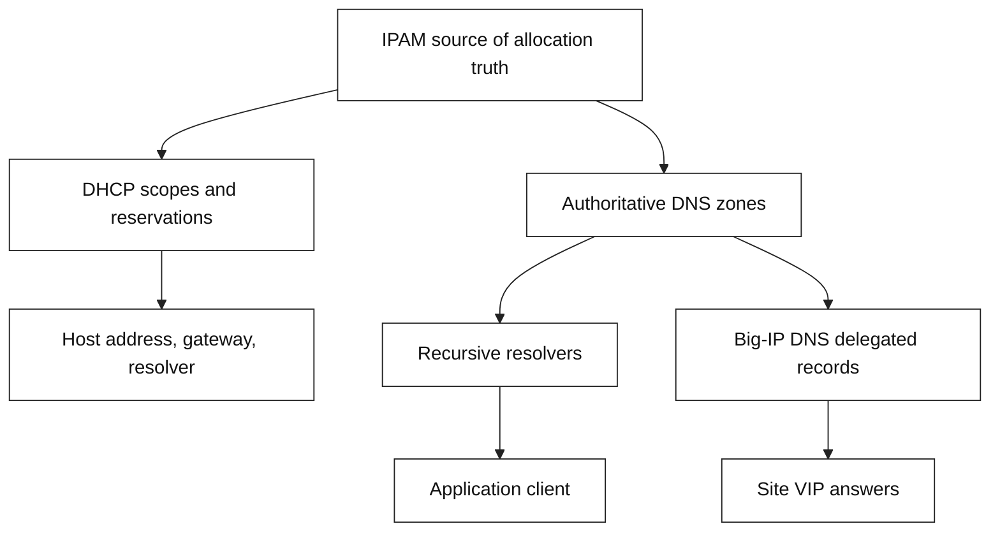
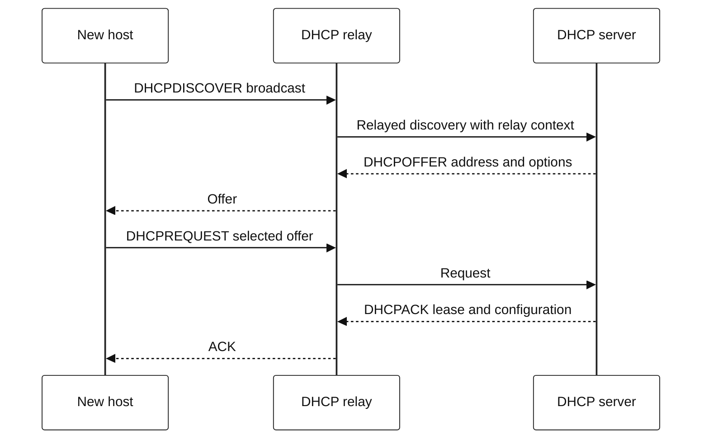

# 6. DDI: DNS, DHCP, and IPAM

**DDI** joins three related control-plane capabilities:

| Capability | Job | A common application impact |
| --- | --- | --- |
| DNS | Name-to-record publication and resolution | A service name resolves to an old or wrong VIP |
| DHCP | Lease-based host configuration | A new host lacks a gateway, DNS resolver, or valid address |
| IPAM | Address/prefix inventory, allocation, and ownership | An address conflict or undocumented subnet breaks routing/security policy |

They are distinct systems but share an authoritative model of addresses, names,
network boundaries, and ownership. A mature DDI setup reduces drift between
what a network intends and what its DNS/DHCP infrastructure publishes.

## Architecture and ownership

Treat the arrows as integration goals, not a claim that every DDI product
automatically synchronizes every object. Decide which system owns each field:
prefix, address allocation, hostname, DNS record, DHCP reservation, and
service VIP. Ambiguous ownership creates split-brain configuration.

## DHCP lifecycle: UML-style sequence

DHCP provides host configuration parameters and an address-allocation
mechanism. In routed networks, a relay is commonly needed because client
broadcasts do not cross routers by default.

## DDI operational rules

- Use IPAM to allocate address space before deployment; do not treat a manual
  spreadsheet entry as a routing contract.
- Version-control or audit DNS and DHCP changes. Define approvals and rollback
  procedures for production zones/scopes.
- Set DNS TTL based on rollout and caching goals, then test resolver behavior.
- Scope DHCP pools per network and reserve enough capacity for replacement and
  growth; alert on lease exhaustion.
- Protect DNS/DHCP management paths and log administrative changes. A correct
  application cannot overcome a compromised control plane.
- Keep service discovery ownership explicit: dynamic host records, application
  records, and GTM Wide IPs need not have the same lifecycle.
