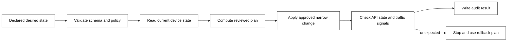

# 7. Networking automation and F5 Python SDK

Automation reduces manual drift only when it is built like production software:
desired state, least privilege, review, idempotency, a dry-run/read phase,
post-change verification, and an auditable rollback plan. A script that can
blindly change every virtual server is not safe automation.

## Automation control loop



## F5 interfaces

BIG-IP exposes management interfaces including iControl REST; the F5 Python
SDK is a client library that maps API objects into Python resources. For new
automation, inspect the version-specific F5 documentation and your platform
team’s supported interface before choosing an SDK. The key design principle is
unchanged: query a bounded object set first, make a minimal explicit change
only after review, and verify the effect.

The example below uses the F5 Python SDK to **read** one pool and report member
state. It intentionally does not create, modify, or delete anything.

```bash
python3 -m pip install f5-sdk
export F5_HOST=bigip.example.internal
export F5_USER=readonly-automation
read -r -s -p 'F5 password: ' F5_PASSWORD; export F5_PASSWORD; echo
python3 examples/f5_pool_audit.py /Common/web_pool
unset F5_PASSWORD
```

Never commit credentials, put them on a command line, or disable certificate
verification to “make the script work.” Use a secret manager/short-lived
credential flow approved by the organization. The example requires a CA bundle
through `F5_CA_BUNDLE`; it fails closed if it is absent.

## Change checklist

- Define exact partition, object, expected old state, and desired state.
- Use a service account limited to the intended API operations.
- Test against a non-production device or isolated partition first.
- Add a concurrency/precondition check to prevent overwriting another change.
- Validate desired state, monitor result, and an application-level request
  after the change. API `200` alone is not a traffic success signal.
- Record who approved, what changed, outcome, and rollback decision.

## SSH is a management plane, not an application dependency

Use SSH only through approved jump hosts/accounts, with MFA and short-lived
certificates/keys where available. Verify the host key on first connection via
an out-of-band fingerprint. Do not bypass changed-host-key warnings: they can
indicate a legitimate rebuild or a man-in-the-middle risk. Prefer named,
logged commands over interactive broad shell access; do not paste secrets into
terminal history.

Example safe client posture (replace placeholders under team policy):

```sshconfig
Host bigip-admin
    HostName bigip.example.internal
    User approved-operator
    IdentitiesOnly yes
    IdentityFile ~/.ssh/approved_key
    StrictHostKeyChecking yes
    UserKnownHostsFile ~/.ssh/known_hosts
```

The `IdentityFile` is a local reference; protect its permissions and never add
the key to this repository.
