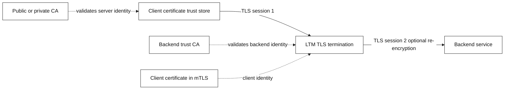
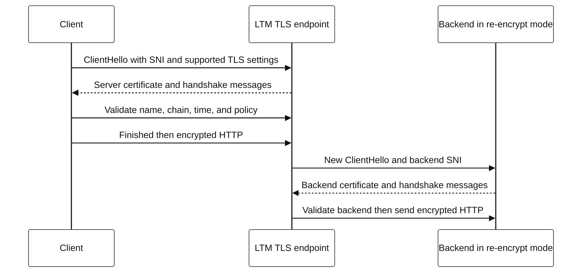

# 8. Encryption, certificates, SSL/TLS, and mTLS

“SSL” is commonly used in product names, but modern deployments should use TLS
and disable obsolete SSL protocol versions. TLS protects bytes in transit; it
does not by itself authorize a user, validate application input, or make a
backend trustworthy.

## TLS concepts

| Term | Meaning | Debugging consequence |
| --- | --- | --- |
| Certificate | Signed binding of a public key to identities/constraints | Client must validate the intended hostname and chain |
| CA / chain | Trust anchor and intermediary signatures | Missing/wrong intermediates cause validation failures |
| SAN | Names the certificate is valid for | Modern hostname matching relies on SANs |
| SNI | Hostname sent during TLS setup | Wrong/missing SNI can select the wrong certificate/policy |
| TLS termination | Proxy decrypts client traffic | Creates client-side and backend-side security boundaries |
| Re-encryption | Proxy starts a new TLS connection upstream | Both connections need correct validation/policy |
| mTLS | Both client and server authenticate certificates | Client identity/trust mapping must be configured and audited |

## TLS termination architecture



Two TLS sessions mean two independent certificate names, chains, protocol
policies, and logs. Do not assume that a browser accepting the VIP proves the
LTM can validate the backend certificate.

## TLS handshake: UML-style sequence



In mTLS, the server requests a client certificate and validates it against a
configured trust policy. Certificate possession is an authentication factor;
authorization should map the validated identity to explicitly allowed actions.

## Certificate lifecycle runbook

1. Inventory every termination point and certificate: subject/SANs, issuer,
   serial, expiration, private-key location, and owner.
2. Alert before expiry and test renewal in non-production. Include intermediates
   and key/certificate pairing in the validation.
3. For a failure, capture hostname, SNI, client clock, negotiated protocol,
   presented chain, and validation error. Avoid capturing private keys.
4. Roll out a new certificate with a staged, reversible plan; test both client
   to VIP and VIP to backend if re-encrypting.
5. Revoke/rotate compromised credentials under the organization’s incident
   procedure and assess access logs.

## Quick commands

```bash
# Show the certificate selected for a hostname; do not send secrets.
openssl s_client -connect api.example.com:443 -servername api.example.com -showcerts

# Display subject, SANs, issuer, and dates from a PEM certificate.
openssl x509 -in certificate.pem -noout -subject -issuer -dates -ext subjectAltName

# Get HTTP/TLS negotiation details from a client perspective.
curl -v --tlsv1.2 https://api.example.com/health
```

Run only against systems you are authorized to test. Do not use `-k` / insecure
certificate bypass as a production diagnostic conclusion; it hides the failure
that must be understood.
