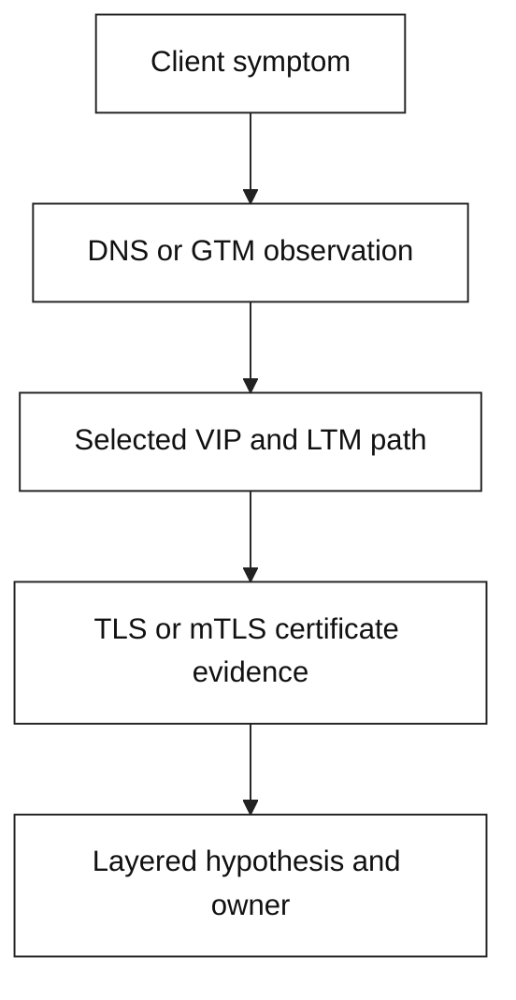

# 9. Hands-on labs: observe, isolate, explain

These short labs turn the primer's mental models into repeatable evidence
collection. They are observation exercises, not configuration instructions.
Use a disposable shell and only endpoints you own or have explicit permission
to inspect. The names ending in `.test` and `.invalid`, and addresses from
TEST-NET (`192.0.2.0/24`, `198.51.100.0/24`) or documentation IPv6 space, are
examples; they are not real service endpoints.

## Lab map



The commands below are intentionally read-only. A command may show an
expected timeout or `NXDOMAIN` when run with a reserved name; that is evidence
about the test input, not proof that a production service is broken.

## Lab 1: DNS/GTM observation

### Objective

Observe the resolver-facing contract of a GTM/BIG-IP DNS Wide IP: response
code, answer set, TTL, authority, and resolver path. Separate DNS selection
from the later TCP/HTTP request.

### Prerequisites

- A shell with `dig` (from a standard DNS utilities package) or `nslookup`.
- A hostname and recursive resolver that your team has approved for testing;
  otherwise use the reserved examples below and do not infer production
  behavior.

### Commands

```bash
# Safe baseline: the reserved name should not resolve to a service.
dig +noall +answer +authority +comments app.example.invalid A

# Compare record families; each command preserves the resolver TTL and status.
dig +noall +answer +authority +comments app.example.test A
dig +noall +answer +authority +comments app.example.test AAAA
dig +noall +answer +authority +comments app.example.test CNAME

# Ask a resolver only when it is explicitly provided by your lab owner.
dig @192.0.2.53 +noall +answer +authority +comments api.example.test A

# Portable fallback when dig is unavailable (less detail than dig).
nslookup api.example.test 192.0.2.53
```

Do not substitute a public resolver or a real domain merely to make the
example return an answer. `192.0.2.53` is documentation space and normally has
no reachable server.

### Expected evidence

Record the exact query name and type, resolver address, timestamp and timezone,
status (`NOERROR`, `NXDOMAIN`, or timeout), answer addresses/aliases, TTL,
authority section, and whether an answer is cached. For an authorized GTM
exercise, also record the Wide IP name/type, eligible pool members or virtual
servers, monitor state, data center, and steering method from the read-only
dashboard or exported status.

### Interpretation

- `NXDOMAIN` means the queried name does not exist according to that DNS
  response; it is different from an existing name with no healthy target.
- `NOERROR` with no answer can indicate an empty response, a type mismatch, or
  policy behavior; inspect authority and query the relevant record type.
- A changing answer with a nonzero TTL is consistent with DNS steering, but
  the recursive resolver may continue serving a cached answer until expiry.
- A DNS answer proves name resolution only. It does not prove that the VIP is
  listening, the LTM pool is healthy, or the application is responding.

### Cleanup and safety

No cleanup is needed. Save output locally without including tokens, cookies,
customer names, or internal topology. Stop after observation; do not flush
resolver caches, edit a Wide IP, lower TTLs, or force monitor state.

## Lab 2: LTM request-path diagnosis

### Objective

Locate the first failing boundary in a client-to-VIP-to-pool request. Use
connection, route, HTTP, and (when supplied by the owner) load-balancer
evidence to distinguish DNS, TCP listener, pool selection, backend reachability,
and application response failures.

### Prerequisites

- `curl` and either `nc` or `ss`.
- A local test listener, or an approved lab VIP. The commands default to
  loopback and a documentation hostname.
- A request/correlation ID if the lab service supports one.

### Commands

```bash
# Resolve locally without contacting DNS; hosts-file mapping is optional.
getent hosts api.example.test || true

# Inspect the HTTP/TCP path to a local lab listener. Do not add -k to hide TLS errors.
curl --verbose --connect-timeout 3 --max-time 8 \
  --header 'Host: api.example.test' http://127.0.0.1:8080/health

# Test only whether the local port accepts TCP; no payload is required.
nc -vz -w 3 127.0.0.1 8080

# On an owned host, observe listeners without changing them.
ss -lnt '( sport = :8080 )'
```

For an approved VIP, replace `127.0.0.1:8080` with its documented address and
port and use the service's real host header. Do not scan ranges or loop over
ports.

### Expected evidence

Capture curl's resolved address, connect result, timestamps, request path,
response status/headers, and any request ID. On the LTM side, obtain the
matched virtual server, selected pool, member/monitor state, client-side and
server-side connection outcome, and SNAT/return-route indication from approved
read-only telemetry.

### Interpretation

- Name resolution failure stops before TCP; investigate DNS ownership and
  resolver scope.
- `Connection refused` means the destination answered but no compatible
  listener accepted the connection; a timeout is evidence of a different
  reachability or filtering problem.
- A successful client-side handshake with a 5xx or reset can still mean the
  LTM-to-member connection or application failed.
- A healthy monitor is a point-in-time probe, not proof that this URI, method,
  identity, or dependency works for every request.

### Cleanup and safety

No cleanup is needed for the read-only commands. Do not restart listeners,
disable monitors, alter pools, send destructive HTTP methods, or include
authorization headers. Redact cookies, bearer tokens, and response bodies
before sharing evidence.

## Lab 3: TLS/mTLS certificate diagnosis

### Objective

Diagnose certificate identity, chain, time, SNI, and client-authentication
evidence for a TLS endpoint. Keep the client-to-VIP and optional VIP-to-backend
TLS sessions conceptually separate.

### Prerequisites

- OpenSSL 1.1.1 or newer and `curl`.
- A local TLS test service on `127.0.0.1:8443`, or an approved endpoint.
- If examining a certificate file, a copy of the public PEM certificate only;
  never request or copy a private key.

### Commands

```bash
# Inspect a supplied public certificate without contacting a network service.
openssl x509 -in ./lab-server.crt -noout \
  -subject -issuer -serial -dates -ext subjectAltName

# Check the local endpoint selected for the example SNI name.
openssl s_client -connect 127.0.0.1:8443 \
  -servername api.example.test -showcerts -verify_return_error </dev/null

# Ask curl for negotiated protocol, certificate, and HTTP evidence.
curl --verbose --connect-timeout 3 --max-time 8 \
  --resolve api.example.test:8443:127.0.0.1 \
  https://api.example.test:8443/health

# For an authorized mTLS lab, add only the lab client material.
curl --verbose --connect-timeout 3 --max-time 8 \
  --resolve api.example.test:8443:127.0.0.1 \
  --cert ./lab-client.crt --key ./lab-client.key \
  --cacert ./lab-ca.crt https://api.example.test:8443/health
```

The final command is an example only: keep `lab-client.key` local, protected,
and disposable. If no local listener exists, the expected connection refusal
is safe and still demonstrates that no TLS evidence can be collected past TCP.

### Expected evidence

Record SNI, peer subject and SANs, issuer and presented chain, validity dates,
verification result, negotiated TLS version/cipher, and alert text. For mTLS,
also record whether the server requested a client certificate, whether the
client chain anchored in the expected CA, and the application-level identity
mapping result. Record the client clock and endpoint name used.

### Interpretation

- A certificate can be unexpired yet invalid for `api.example.test` if its SAN
  does not contain that name; SNI can also select a different certificate.
- An incomplete or untrusted intermediate chain causes verification failure
  even when the leaf certificate looks correct.
- A server certificate check says nothing about whether the server accepted a
  client certificate. mTLS requires the server to request and validate the
  client chain under its configured trust policy.
- In re-encryption, repeat the reasoning for the LTM-to-backend session: its
  SNI, name, trust store, chain, clock, and policy can fail independently.

### Cleanup and safety

Remove only disposable lab certificates and keys using the lab's normal
cleanup process; do not delete shared or production material. Do not use
`-k`, disable verification, paste private keys into tickets, or rotate/revoke
certificates as part of this observation lab.

## Lab handoff template

Summarize: timestamp and timezone; client/resolver; exact hostname and port;
first failing layer; command output or redacted evidence; blast radius;
contradictory evidence; owner; and the next read-only check. A good handoff
states a falsifiable hypothesis, for example: “DNS returns the expected VIP,
but the LTM server-side connection to the selected member times out.”
