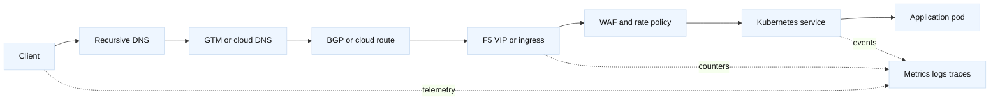

# 10. Platform networking: cloud ingress, routing, security, and SLOs

This bridge module connects the core request path to the platform concerns that
appear in an SDE2 on-call rotation. The long-form treatment is in the new
[cloud and Kubernetes chapter](../book/15-cloud-networking-and-kubernetes-ingress.md),
[BGP chapter](../book/16-bgp-anycast-and-multi-region.md), and
[WAF chapter](../book/17-network-security-waf-zero-trust.md).

## One request, several control planes

A browser request can cross a DNS control plane, a routing control plane, a
load-balancer data plane, a policy engine, and an application scheduler. Do
not assume that a successful DNS answer proves that the selected workload is
reachable. Each layer has its own state, timers, identity, and rollback.

| Layer | State to inspect | Typical owner | Evidence before changing it |
| --- | --- | --- | --- |
| DNS/GTM | answer, TTL, health result | network platform | `dig` from affected resolver locations |
| Routing | prefix, next hop, withdrawal | network/cloud | route table or BGP snapshot |
| LTM/ingress | VIP, policy, pool endpoints | traffic platform | virtual-server and endpoint counters |
| WAF/API | rule match, quota, identity | security platform | request ID and redacted event |
| Scheduler | service endpoints, readiness | platform team | Kubernetes events and endpoint slice |
| Application | latency, status, dependency calls | service team | trace and structured logs |

## Worked diagnostic path

Suppose `api.lab.example` resolves correctly, but clients receive intermittent
503 responses. First record a UTC timestamp, resolver, source location, VIP,
and request ID. Then compare three views:

1. `dig +short api.lab.example` and the authoritative answer. A stale GTM
   answer can send only some recursive resolvers to an unhealthy region.
2. LTM or ingress counters. A rising client-side 503 count with no matching
   server-side connection count suggests policy, endpoint, or admission
   failure before the application.
3. Service endpoint readiness. A pod can be running but absent from the
   endpoint set because its readiness probe failed.

The safe first action is a read-only comparison, not deleting endpoints or
lowering a health threshold. If the route and VIP are stable but endpoint
readiness flaps, inspect the probe path and dependency timeout. If only one
region is affected, compare its BGP advertisement and GTM health result with a
known-good region. “The load balancer is down” is a hypothesis, not evidence.

## Capacity and SLO connection

Define an SLI across the complete user path: an approved DNS answer, a
successful TCP/TLS connection, an acceptable HTTP response, and a latency
budget. Track saturation separately: VIP connection limits, SNAT port use,
WAF inspection CPU, ingress queue depth, node conntrack entries, and pod CPU.
An availability graph can remain green while latency burns the error budget.

For a monthly 99.9% availability target, the nominal budget is about 43.2
minutes. That number is useful only if failures are counted consistently. A
retrying client must not turn one user-visible outage into ten “successful”
internal attempts. Document whether planned maintenance, rejected policy
requests, and synthetic probes are included.

## Safe automation boundary

Automation should produce a plan before it changes a route, VIP, WAF policy, or
Kubernetes object. Include the current version, intended diff, blast radius,
pre-checks, post-checks, and rollback command. Use F5 SDK or REST for object
state, the Kubernetes API for declarative workload state, and SSH only for
approved read-only diagnostics when an API is unavailable. Never put tokens,
private keys, or certificate key material in logs.

## Questions and answers

1. **Why can DNS be healthy while the service is down?** DNS only returns a
   name-to-address answer; it does not guarantee the route, VIP, policy, or
   workload behind that address is healthy.

Interview reasoning: Describe the resolver chain and the exact record, flags, TTL, and response code involved. A useful diagnostic is to query the configured recursive resolver and an authoritative server separately, then compare the answer, authority section, DNSSEC status, and cache age. The caveat is that DNS is cached and control-plane driven: changing an authoritative record does not instantly change every client, and a healthy answer still does not prove that the selected VIP or origin is healthy.

2. **What does a BGP withdrawal change?** It removes a path from route
   selection. Existing connections may still fail or drain; BGP is not an
   application health check.

Interview reasoning: Interviewers want the control loop: discover current state, normalize only supported fields, calculate a minimal diff, obtain approval, apply idempotently, validate behavior, and record evidence. For F5, include partition/folder/self-link handling, pagination, version compatibility, bounded retries, and read-back after uncertain responses; use SSH for approved diagnostics rather than hidden mutation. The caveat is that an HTTP 200 or successful SDK call is not proof of traffic health, so rollback and post-change probes are part of correctness.

3. **Why separate readiness from liveness?** Readiness controls traffic
   eligibility; liveness controls restart behavior. Conflating them can cause
   a restart storm during a dependency outage.

Interview reasoning: Explain the packet and state transition, then identify the observation point: a client capture, a listener socket, and a server capture can show different parts of the same flow. For example, compare the five-tuple, sequence progress, retransmissions, and FIN/RST timing before deciding whether the failure is transport or application-level. The caveat is that a successful handshake proves only reachability to a listener at that instant; it does not prove routing symmetry, HTTP success, capacity, or dependency health.

4. **When should WAF block versus observe?** Start in a measured, logged mode
   for a new rule, confirm false positives, then enforce with an explicit
   rollback threshold.

Interview reasoning: Explain the trust boundary and the failure mode the control is intended to prevent. Name the identity, policy decision, protected resource, telemetry, and recovery path; for example, distinguish encryption in transit from authenticated authorization and distinguish WAF detection from blocking. The caveat is that stronger inspection or authentication can add latency, certificate/secret rotation work, false positives, and dependency coupling, so enforce changes progressively with an explicit rollback signal.

5. **What is a useful SLO symptom?** “99.9% successful HTTPS requests under
   750 ms” is testable; “the network is reliable” is not.

Interview reasoning: A strong answer connects symptoms to evidence across layers: request ID and status, queue/connect/TLS/origin timings, DNS answer and TTL, route state, pool/member health, and resource saturation. Establish clock quality and sampling before inferring causality, then compare a known-good request with a failing one. The caveat is that a dashboard aggregate can hide tail latency, retries, cardinality loss, or sampling bias, so every alert should have a bounded diagnostic query and an owner.

6. **Why inspect SNAT ports?** A VIP can be reachable while the proxy cannot
   open new backend flows because its translated source-port pool is exhausted.

Interview reasoning: Map the answer to the BIG-IP LTM object model: virtual server and profiles admit the client flow, a monitor determines member eligibility, a pool chooses a member, and SNAT/persistence influence the server-side tuple. In a diagnosis, compare VIP-side and member-side captures, monitor logs, pool state, persistence records, and return routing. The caveat is that a green monitor is only evidence for that probe; it is not proof that every user request, TLS name, dependency, or capacity budget is healthy.

7. **What does a 503 identify?** It identifies a response class, not a root
   cause. Correlate it with endpoint selection, policy events, and backend
   connection attempts.

Interview reasoning: Explain the packet and state transition, then identify the observation point: a client capture, a listener socket, and a server capture can show different parts of the same flow. For example, compare the five-tuple, sequence progress, retransmissions, and FIN/RST timing before deciding whether the failure is transport or application-level. The caveat is that a successful handshake proves only reachability to a listener at that instant; it does not prove routing symmetry, HTTP success, capacity, or dependency health.

8. **Why keep routing and application evidence together?** Their clocks and
   state transitions explain whether a failure is a path problem, an admission
   problem, or an application problem.

Interview reasoning: A strong answer names the source and destination prefixes, the longest-prefix decision, the next hop, and the return route. In practice, verify both directions with route-table lookups and a narrowly scoped flow trace, because policy routing, NAT, VRFs, and asymmetric paths can invalidate a simple diagram. The caveat is that a route being present does not prove that ACLs, MTU, ARP/ND, or the receiving process will accept the packet.
