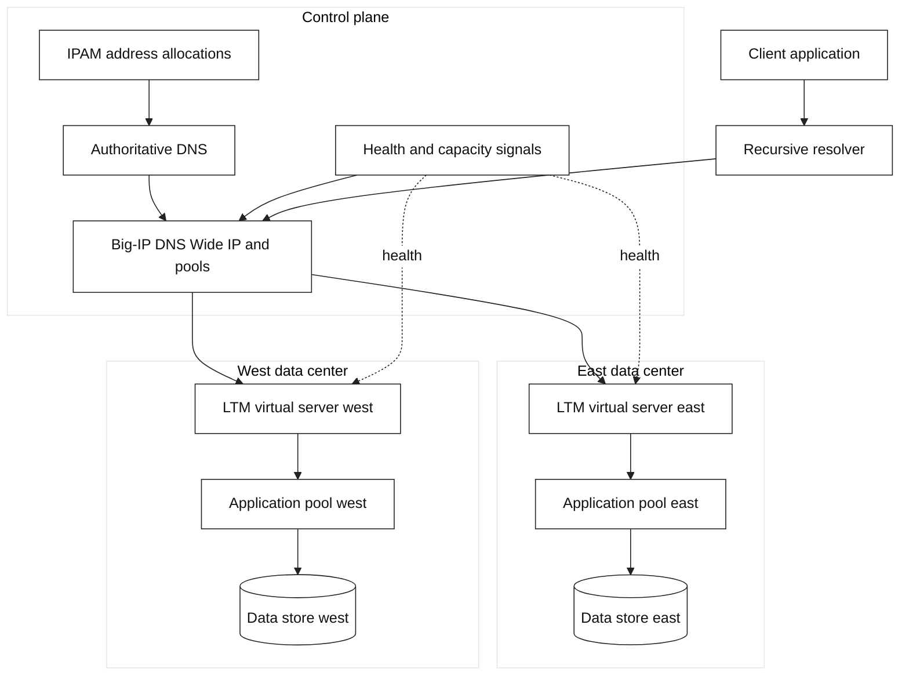
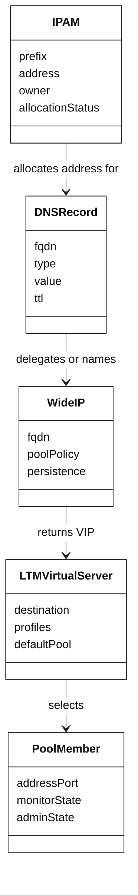
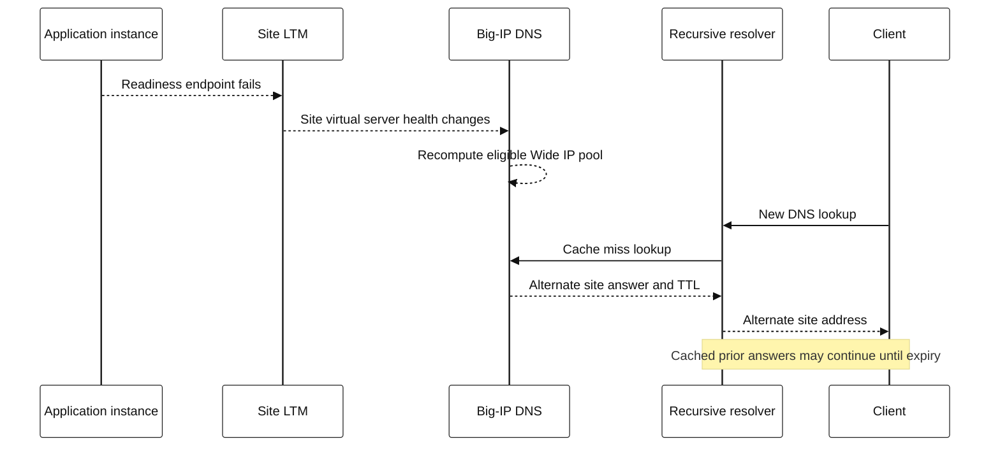

# Architecture diagrams and reasoning patterns

These diagrams are deliberately detailed enough to guide a design review while
remaining implementation-neutral. Boxes show responsibilities; they are not an
automatic deployment prescription.

## Multi-site service architecture

### Review this architecture with these questions

| Concern | Concrete question |
| --- | --- |
| Failure domain | Can the DNS control plane, an LTM pair, a site, or a dependency fail independently? |
| Consistency | Is it safe for a write to land in either site during DNS cache overlap? |
| Capacity | Does every eligible site have enough capacity for the traffic it can receive? |
| Health | Is a DNS/GTM target marked healthy only when the LTM and application can safely serve? |
| Security | Which hop terminates TLS, validates client identity, and validates upstream identity? |
| Observability | Can one request ID link client, LTM/proxy, application, and dependency evidence? |

## State ownership model

The meaningful design choice is **ownership**: give each important field a
system of record and a change path. A data model alone does not synchronize
systems.

## Failure propagation sequence

Do not model a DNS change as a synchronous redirect. Existing clients can have
cached answers and open connections, so application resilience remains needed.
