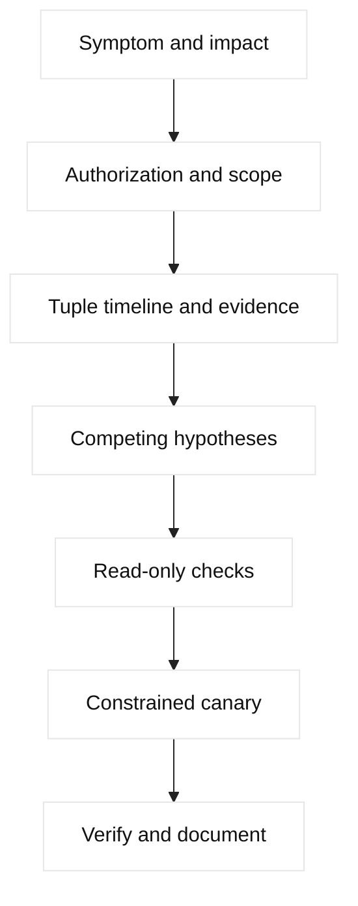

# Interview dialogue exercises

These exercises model a strong, evidence-led conversation. Targets are
fictional or local. Any penetration test, packet capture, fault injection, or
load test requires written authorization, scope, rate limits, a stop condition,
and an owner who can roll back the experiment.

## Decision diagram

## 1. Logs are full

**Setup:** A fictional service emits credentials in a debug log after a proxy
change. **Interviewer:** “What do you do first?” **Candidate:** “I confirm
impact and restrict access before searching broadly. I ask whether logs are
centralized, who can read them, retention, source versions, and whether the
material is active.”

**Dialogue:** The interviewer says the file is on three hosts. The candidate
asks for timestamps, owner, and a safe sample with values redacted. They state
that copying logs to a personal machine is prohibited. They revoke or rotate
exposed secrets through the owner, preserve a protected forensic copy, remove
the logging defect, and verify downstream indexes and backups. They do not
delete evidence impulsively.

**Evidence/commands:** `journalctl --since` or a platform read-only query,
index ACL audit, commit diff, and secret-rotation record. **Boundary:** only
authorized responders access logs; no credential replay. **Expected answer:**
contain exposure, preserve evidence, rotate, patch, and assess access history.
**Follow-up:** “Would you purge logs?” Strong answer: only under an approved
retention/legal process after protected evidence is preserved. **Lesson:**
privacy and incident handling are part of debugging.

## 2. System unresponsive

**Setup:** A lab VM stops responding to SSH. **Interviewer:** “Do you reboot?”
**Candidate:** “I first ask whether the impact is one host or a service, when it
started, and whether console or monitoring access exists.”

They inspect last-known CPU, memory, disk, network, kernel, and dependency
health. A console check may use `uptime`, `vmstat`, `free`, `df`, and read-only
logs. If an approved out-of-band restart is necessary, they state blast radius,
snapshot and rollback, and maintenance owner. **Evidence table:** symptom,
metric timestamp, host state, dependency state, action. **Follow-up:** “What if
memory is exhausted?” Strong answer: preserve a dump if policy permits, identify
the process, contain traffic, and fix leak or limit rather than repeatedly
rebooting. **Lesson:** availability action must preserve causality.

## 3. Certificate expired

**Setup:** Clients report TLS failures for `device.example.invalid`.
**Interviewer:** “How do you distinguish expiry from trust failure?”
**Candidate:** “I record client/server time, SNI, served chain, issuer, validity,
and termination point.”

They use an authorized `openssl s_client` fixture or platform certificate
inspection, never request private keys. They compare edge and origin profiles,
check intermediate delivery, and stage a renewed certificate with canary
clients. **Boundary:** certificate changes require owner approval and rollback
material. **Follow-up:** “Why not disable verification?” Strong answer: it hides
the defect and weakens security. **Lesson:** chain, hostname, clock, and client
authentication are distinct hypotheses.

## 4. Vulnerability finding

**Setup:** A scanner reports an old TLS algorithm. **Interviewer:** “How do you
respond?” **Candidate:** “I validate asset, evidence, scanner version, and
scope before changing policy.”

They reproduce only against an authorized lab or approved endpoint, identify
which virtual server/profile terminates TLS, and assess client compatibility and
exposure. They propose a staged profile update, monitor handshake errors, and
document exception ownership. **Evidence:** scanner finding, negotiated cipher,
effective profile, release advisory, and canary result. **Follow-up:** “What is
the trade-off?” Strong answer: stronger policy can break legacy clients; use
inventory, migration, and a time-bounded exception rather than silent weakening.

## 5. Suspected breach

**Setup:** Unusual outbound DNS and API traffic appears. **Interviewer:** “Do
you block the host immediately?” **Candidate:** “I establish incident authority,
preserve volatile evidence where feasible, and apply approved containment.”

They ask for time window, identities, source addresses, DNS answers, proxy logs,
and known maintenance. They isolate a workload only if incident command
authorizes it, rotate affected secrets, and preserve chain of custody. No live
exploit or unauthorized scanning is performed. **Follow-up:** “How avoid losing
evidence?” Strong answer: snapshot through approved tooling, hash exports, and
record every action. **Lesson:** containment and forensics must be coordinated.

## 6. DNS wrong answer

**Setup:** One region resolves a service to an old site. **Interviewer:** “Where
do you look?” **Candidate:** “I compare authoritative and recursive answers,
LDNS source, TTL, topology decision, and timestamp.”

They query a local fixture, inspect delegation, Wide IP/pool state, monitor and
iQuery freshness if F5 is involved, and explain cache lifetime. **Evidence:**
query name/type, flags, answer, TTL, resolver, and authoritative serial.
**Boundary:** no zone edits without DNS owner. **Follow-up:** “Would you lower
TTL during the incident?” Strong answer: only as a planned change; it cannot
shorten already cached answers. **Lesson:** DNS is a control plane, not a
per-request load balancer.

## 7. TCP timeout

**Setup:** A client times out reaching a fictional VIP. **Interviewer:** “What
is your first artifact?” **Candidate:** “The exact five-tuple and timestamp.”

They compare client SYN, listener receipt, SYN-ACK, server-side SYN, route,
ACL, SNAT, and member state. A timeout is silence, not proof of one cause.
They use read-only flow logs and captures in approved interfaces. **Follow-up:**
“What does a reset mean?” Strong answer: an active endpoint or policy signal;
identify sender before blaming firewall. **Lesson:** packet direction and NAT
context prevent layer confusion.

## 8. MTU black hole

**Setup:** Small requests work; large responses stall across an overlay.
**Interviewer:** “What competing explanations exist?” **Candidate:** “Path MTU,
blocked ICMP, fragmentation policy, and application framing.”

They test reserved lab endpoints with bounded, do-not-fragment probes where
supported, inspect inner and outer headers, VTEP path, and retransmissions. They
do not raise production MTU blindly. **Follow-up:** “Why can TCP connect?”
Strong answer: handshake packets are small; later segments exceed effective
MTU. **Lesson:** underlay health does not prove overlay payload delivery.

## 9. F5 pool/monitor issue

**Setup:** LTM returns 503 while members answer direct probes. **Interviewer:**
“How can both be true?” **Candidate:** “The monitor source, URI, TLS profile, or
route may differ from user traffic.”

They inspect virtual server, profiles, policies/iRules, pool eligibility,
monitor result and source, member port, route domain, SNAT, and responding hop.
They use read-only state and a canary request. **Follow-up:** “Disable the
monitor?” Strong answer: no; first compare expected response and dependency,
then make a reviewed correction. **Lesson:** a green monitor proves only its
configured probe.

## 10. SNAT exhaustion

**Setup:** Existing sessions work but new clients time out. **Interviewer:**
“What evidence supports port exhaustion?” **Candidate:** “Allocation errors,
translated-port utilization, connection age, and unchanged member health.”

They compare client/server tuples and return route, check SNAT pool capacity,
and model effect of adding addresses. **Boundary:** capacity changes require
security and owner review. **Follow-up:** “Clear all connections?” Strong
answer: only under an approved emergency plan; it creates a surge. **Lesson:**
SNAT is both a routing mechanism and finite capacity resource.

## 11. Penetration-test planning

**Setup:** A team wants to test a fictional API edge. **Interviewer:** “What
must be agreed before testing?” **Candidate:** “Written authorization, exact
targets, dates, source addresses, methods, rate limits, data handling, stop
conditions, contacts, and rollback.”

They prefer non-destructive verification, separate production from lab, notify
providers, and define evidence retention. No credential guessing, persistence,
exploitation, or lateral movement is described here. **Follow-up:** “How report
a finding?” Strong answer: impact, reproducibility, evidence, scope, severity,
mitigation, owner, and retest plan. **Lesson:** authorization is a technical
precondition, not paperwork after the test.

## 12. Network load/chaos testing

**Setup:** Engineers propose packet loss against a service. **Interviewer:**
“How do you make it safe?” **Candidate:** “Use a disposable slice, bounded rate,
known baseline, SLO guardrails, abort automation, and incident owner.”

They test one failure mode at a time, observe client, LB, origin, and dependency
metrics, and stop if error budget or customer impact exceeds the threshold.
Evidence includes experiment ID, start/stop, injected condition, and recovery.
**Follow-up:** “Why not test peak loss first?” Strong answer: failure magnitude
should be increased gradually because models and safeguards need validation.
**Lesson:** chaos is controlled hypothesis testing, not random damage.

## Local implementation exercises

1. Build a redacted log fixture and write a checklist for containment and rotation.
2. Create packet traces for SYN timeout, reset, and MTU stall; label evidence.
3. Use a local DNS server fixture to compare authoritative and cached TTL behavior.
4. Model an F5 pool with monitor, persistence, and SNAT state in JSON, then write read-only hypotheses.
5. Write a load-test plan with baseline, rate, abort threshold, and rollback owner without running it.

## Evidence table template

| Field | Example safe value |
| --- | --- |
| Scope | `app.lab.example`, reserved address |
| Time | UTC timestamp and clock health |
| Tuple | Source/destination, ports, protocol |
| Observation | Packet, log, metric, or state |
| Hypothesis | Mechanism, not conclusion |
| Authorization | Owner, window, stop condition |
| Resolution | Verified change and rollback |
