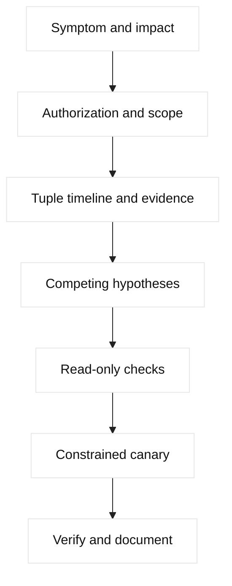

# Interview dialogue exercises

These exercises model a strong, evidence-led conversation. Targets are
fictional or local. Any penetration test, packet capture, fault injection, or
load test requires written authorization, scope, rate limits, a stop condition,
and an owner who can roll back the experiment.

## Decision diagram

## 1. Logs are full

**Setup:** A fictional service emits credentials in a debug log after a proxy
change. **Interviewer:** “What do you do first?” **Candidate:** “I confirm
impact and restrict access before searching broadly. I ask whether logs are
centralized, who can read them, retention, source versions, and whether the
material is active.”

**Dialogue:** The interviewer says the file is on three hosts. The candidate
asks for timestamps, owner, and a safe sample with values redacted. They state
that copying logs to a personal machine is prohibited. They revoke or rotate
exposed secrets through the owner, preserve a protected forensic copy, remove
the logging defect, and verify downstream indexes and backups. They do not
delete evidence impulsively.

**Evidence/commands:** `journalctl --since` or a platform read-only query,
index ACL audit, commit diff, and secret-rotation record. **Boundary:** only
authorized responders access logs; no credential replay. **Expected answer:**
contain exposure, preserve evidence, rotate, patch, and assess access history.
**Follow-up:** “Would you purge logs?” Strong answer: only under an approved
retention/legal process after protected evidence is preserved. **Lesson:**
privacy and incident handling are part of debugging.

## 2. System unresponsive

**Setup:** A lab VM stops responding to SSH. **Interviewer:** “Do you reboot?”
**Candidate:** “I first ask whether the impact is one host or a service, when it
started, and whether console or monitoring access exists.”

They inspect last-known CPU, memory, disk, network, kernel, and dependency
health. A console check may use `uptime`, `vmstat`, `free`, `df`, and read-only
logs. If an approved out-of-band restart is necessary, they state blast radius,
snapshot and rollback, and maintenance owner. **Evidence table:** symptom,
metric timestamp, host state, dependency state, action. **Follow-up:** “What if
memory is exhausted?” Strong answer: preserve a dump if policy permits, identify
the process, contain traffic, and fix leak or limit rather than repeatedly
rebooting. **Lesson:** availability action must preserve causality.

## 3. Certificate expired

**Setup:** Clients report TLS failures for `device.example.invalid`.
**Interviewer:** “How do you distinguish expiry from trust failure?”
**Candidate:** “I record client/server time, SNI, served chain, issuer, validity,
and termination point.”

They use an authorized `openssl s_client` fixture or platform certificate
inspection, never request private keys. They compare edge and origin profiles,
check intermediate delivery, and stage a renewed certificate with canary
clients. **Boundary:** certificate changes require owner approval and rollback
material. **Follow-up:** “Why not disable verification?” Strong answer: it hides
the defect and weakens security. **Lesson:** chain, hostname, clock, and client
authentication are distinct hypotheses.

## 4. Vulnerability finding

**Setup:** A scanner reports an old TLS algorithm. **Interviewer:** “How do you
respond?” **Candidate:** “I validate asset, evidence, scanner version, and
scope before changing policy.”

They reproduce only against an authorized lab or approved endpoint, identify
which virtual server/profile terminates TLS, and assess client compatibility and
exposure. They propose a staged profile update, monitor handshake errors, and
document exception ownership. **Evidence:** scanner finding, negotiated cipher,
effective profile, release advisory, and canary result. **Follow-up:** “What is
the trade-off?” Strong answer: stronger policy can break legacy clients; use
inventory, migration, and a time-bounded exception rather than silent weakening.

## 5. Suspected breach

**Setup:** Unusual outbound DNS and API traffic appears. **Interviewer:** “Do
you block the host immediately?” **Candidate:** “I establish incident authority,
preserve volatile evidence where feasible, and apply approved containment.”

They ask for time window, identities, source addresses, DNS answers, proxy logs,
and known maintenance. They isolate a workload only if incident command
authorizes it, rotate affected secrets, and preserve chain of custody. No live
exploit or unauthorized scanning is performed. **Follow-up:** “How avoid losing
evidence?” Strong answer: snapshot through approved tooling, hash exports, and
record every action. **Lesson:** containment and forensics must be coordinated.

## 6. DNS wrong answer

**Setup:** One region resolves a service to an old site. **Interviewer:** “Where
do you look?” **Candidate:** “I compare authoritative and recursive answers,
LDNS source, TTL, topology decision, and timestamp.”

They query a local fixture, inspect delegation, Wide IP/pool state, monitor and
iQuery freshness if F5 is involved, and explain cache lifetime. **Evidence:**
query name/type, flags, answer, TTL, resolver, and authoritative serial.
**Boundary:** no zone edits without DNS owner. **Follow-up:** “Would you lower
TTL during the incident?” Strong answer: only as a planned change; it cannot
shorten already cached answers. **Lesson:** DNS is a control plane, not a
per-request load balancer.

## 7. TCP timeout

**Setup:** A client times out reaching a fictional VIP. **Interviewer:** “What
is your first artifact?” **Candidate:** “The exact five-tuple and timestamp.”

They compare client SYN, listener receipt, SYN-ACK, server-side SYN, route,
ACL, SNAT, and member state. A timeout is silence, not proof of one cause.
They use read-only flow logs and captures in approved interfaces. **Follow-up:**
“What does a reset mean?” Strong answer: an active endpoint or policy signal;
identify sender before blaming firewall. **Lesson:** packet direction and NAT
context prevent layer confusion.

## 8. MTU black hole

**Setup:** Small requests work; large responses stall across an overlay.
**Interviewer:** “What competing explanations exist?” **Candidate:** “Path MTU,
blocked ICMP, fragmentation policy, and application framing.”

They test reserved lab endpoints with bounded, do-not-fragment probes where
supported, inspect inner and outer headers, VTEP path, and retransmissions. They
do not raise production MTU blindly. **Follow-up:** “Why can TCP connect?”
Strong answer: handshake packets are small; later segments exceed effective
MTU. **Lesson:** underlay health does not prove overlay payload delivery.

## 9. F5 pool/monitor issue

**Setup:** LTM returns 503 while members answer direct probes. **Interviewer:**
“How can both be true?” **Candidate:** “The monitor source, URI, TLS profile, or
route may differ from user traffic.”

They inspect virtual server, profiles, policies/iRules, pool eligibility,
monitor result and source, member port, route domain, SNAT, and responding hop.
They use read-only state and a canary request. **Follow-up:** “Disable the
monitor?” Strong answer: no; first compare expected response and dependency,
then make a reviewed correction. **Lesson:** a green monitor proves only its
configured probe.

## 10. SNAT exhaustion

**Setup:** Existing sessions work but new clients time out. **Interviewer:**
“What evidence supports port exhaustion?” **Candidate:** “Allocation errors,
translated-port utilization, connection age, and unchanged member health.”

They compare client/server tuples and return route, check SNAT pool capacity,
and model effect of adding addresses. **Boundary:** capacity changes require
security and owner review. **Follow-up:** “Clear all connections?” Strong
answer: only under an approved emergency plan; it creates a surge. **Lesson:**
SNAT is both a routing mechanism and finite capacity resource.

## 11. Penetration-test planning

**Setup:** A team wants to test a fictional API edge. **Interviewer:** “What
must be agreed before testing?” **Candidate:** “Written authorization, exact
targets, dates, source addresses, methods, rate limits, data handling, stop
conditions, contacts, and rollback.”

They prefer non-destructive verification, separate production from lab, notify
providers, and define evidence retention. No credential guessing, persistence,
exploitation, or lateral movement is described here. **Follow-up:** “How report
a finding?” Strong answer: impact, reproducibility, evidence, scope, severity,
mitigation, owner, and retest plan. **Lesson:** authorization is a technical
precondition, not paperwork after the test.

## 12. Network load/chaos testing

**Setup:** Engineers propose packet loss against a service. **Interviewer:**
“How do you make it safe?” **Candidate:** “Use a disposable slice, bounded rate,
known baseline, SLO guardrails, abort automation, and incident owner.”

They test one failure mode at a time, observe client, LB, origin, and dependency
metrics, and stop if error budget or customer impact exceeds the threshold.
Evidence includes experiment ID, start/stop, injected condition, and recovery.
**Follow-up:** “Why not test peak loss first?” Strong answer: failure magnitude
should be increased gradually because models and safeguards need validation.
**Lesson:** chaos is controlled hypothesis testing, not random damage.

## Local implementation exercises

1. Build a redacted log fixture and write a checklist for containment and rotation.
2. Create packet traces for SYN timeout, reset, and MTU stall; label evidence.
3. Use a local DNS server fixture to compare authoritative and cached TTL behavior.
4. Model an F5 pool with monitor, persistence, and SNAT state in JSON, then write read-only hypotheses.
5. Write a load-test plan with baseline, rate, abort threshold, and rollback owner without running it.

## Evidence table template

| Field | Example safe value |
| --- | --- |
| Scope | `app.lab.example`, reserved address |
| Time | UTC timestamp and clock health |
| Tuple | Source/destination, ports, protocol |
| Observation | Packet, log, metric, or state |
| Hypothesis | Mechanism, not conclusion |
| Authorization | Owner, window, stop condition |
| Resolution | Verified change and rollback |

## Dedicated SDE2 and Staff dialogue practice

The short scenarios above are prompts. This section is the detailed answer key.
Use it only after attempting the conversation. The interviewer should reveal
one new fact at a time and challenge assumptions rather than reward memorized
commands.

### A. Conversation protocol

Every candidate response should move through six beats:

1. **Frame:** clarify impact, scope, timestamp, authority, and success criteria.
2. **Model:** draw the request path, control path, state owner, and trust boundary.
3. **Evidence:** name the smallest read-only observation that separates hypotheses.
4. **Falsifier:** state what result would change the leading hypothesis.
5. **Decision:** propose a bounded action, owner, trade-off, and rollback boundary.
6. **Verification:** define the metric, probe, or state read that proves recovery.

An SDE2 answer must be technically correct, evidence-led, and safe. A Staff
answer must additionally expose ambiguity, coordinate ownership, quantify risk
or capacity, compare alternatives, and explain how the fix becomes durable.

### B. Scenario 1 — logs contain credentials

**Strong opening:** “I confirm the affected service, time window, log locations,
access scope, and whether the credentials are active. I restrict access and
preserve a protected copy before cleanup.”

The SDE2 candidate identifies the logging change, obtains a redacted sample,
checks index and backup replication, rotates exposed secrets through the owner,
and removes the logging defect. Useful evidence includes a bounded
`journalctl` query, commit/config diff, log ACL audit, secret-rotation record,
and timestamps. They do not copy logs to a personal workstation or replay a
credential to test it.

The Staff candidate assigns incident, security, service, and compliance owners;
defines whether exposure is confirmed or only suspected; estimates blast radius
from retention and access history; and chooses between access revocation,
rotation, and temporary feature disablement. **Falsifier:** a protected sample
from the same version and time window contains no secret, but that does not
close the case until indexes and backups are checked.

**Follow-ups:** Who can approve deletion? What evidence must be retained? How
will you prevent recurrence—structured redaction, secret-scanning CI, log
schema review, or a policy that forbids sensitive fields?

### C. Scenario 2 — system unresponsive

**Strong opening:** “I establish whether one host, one service, or a whole
failure domain is affected, when it began, and whether console or out-of-band
access exists. I do not reboot before preserving the best available evidence.”

The SDE2 candidate compares last-known `uptime`, `vmstat`, memory, disk, socket
counts, kernel/service logs, and dependency health. They distinguish CPU
starvation, memory pressure, full disk/inodes, network loss, filesystem failure,
and a process deadlock. A console restart is an escalation with blast radius,
owner, and verification—not a diagnosis.

The Staff candidate asks whether traffic can be drained to a healthy instance,
whether data integrity or quorum is at risk, and whether the recovery action
changes evidence. They select containment based on customer impact and RTO,
then plan durable capacity, alerting, or ownership changes. **Falsifier:** a
healthy console and process state with only SSH failing shifts attention to the
management path, not necessarily the data plane.

**Follow-ups:** What if memory is exhausted? What if the host is a stateful
leader? Which action is reversible, and how do you prove the replacement is
healthy before expanding traffic?

### D. Scenario 3 — certificate expired

**Strong opening:** “I identify the exact hostname, VIP, port, SNI, client
population, terminating hop, and current time before calling this expiry.”

The SDE2 candidate uses an authorized `openssl s_client` or platform read-only
inspection to capture the served leaf and chain, then checks SAN, issuer,
validity, EKU, trust store, clock, ALPN, and backend TLS. They distinguish wrong
SNI/default certificate, expired intermediate, trust failure, hostname mismatch,
and client-certificate rejection. They never ask for a private key or disable
verification.

The Staff candidate inventories unknown consumers, defines overlap between old
and new trust material, assigns certificate and service owners, and chooses a
canary population. **Falsifier:** a valid served certificate with correct time
means expiry is not the primary explanation; trust, SNI, backend TLS, or client
authentication remain candidates.

**Follow-ups:** How do you handle an unknown client population? What is the
rollback if the old certificate has already expired? Which expiry, chain, and
handshake metrics become a platform SLO?

### E. Scenario 4 — vulnerability finding

**Strong opening:** “I verify the asset, scanner version, exact finding, scope,
authorization, and effective TLS profile before changing policy.”

The SDE2 candidate safely reproduces the negotiated protocol or cipher against
an approved endpoint, identifies the terminating profile, checks release and
client compatibility, and proposes a canary policy update. They record scanner
output, SNI, certificate, protocol, cipher, client error rate, and rollback
version. A scanner result is evidence of a finding, not permission to exploit.

The Staff candidate weighs exposure, legacy-client revenue, compliance deadline,
exception ownership, and migration cost. They compare immediate block, staged
deprecation, and a time-bounded exception with compensating controls.
**Falsifier:** the effective profile rejects the reported algorithm from the
actual endpoint; then investigate scanner targeting, a different VIP, or stale
inventory.

**Follow-ups:** Who accepts residual risk? How will you measure legacy-client
migration? What stop condition protects customers during the profile change?

### F. Scenario 5 — suspected breach

**Strong opening:** “I confirm incident authority, time window, affected
identities, and containment options. I preserve volatile and audit evidence
before taking a disruptive action where feasible.”

The SDE2 candidate correlates DNS queries, proxy/flow logs, API identities,
maintenance events, process/network state, and secret use. They isolate or block
only within incident-command authority, rotate affected credentials, preserve
hashes and chain of custody, and avoid broad scanning or live exploitation.

The Staff candidate establishes a decision cadence, separates confirmed facts
from threat hypotheses, assigns security/service/legal/comms owners, and chooses
containment that protects customers without destroying evidence. They define
criteria for returning the workload and a durable control improvement.
**Falsifier:** known approved maintenance from the same identity and source may
explain the traffic, but it must be reconciled with authentication and payload-
safe evidence rather than accepted as proof of innocence.

**Follow-ups:** What if isolation breaks a critical dependency? How do you
communicate uncertainty? When do you rotate credentials versus revoke access?

### G. Scenario 6 — DNS wrong answer

**Strong opening:** “I compare the exact name and type at authoritative,
recursive, local, and application-resolver viewpoints, with TTL and timestamps.”

The SDE2 candidate inspects delegation, Wide IP or steering state, monitor and
iQuery freshness when applicable, answer distribution, negative caching, and
existing connections. They distinguish stale cache, wrong authoritative data,
topology policy, resolver locality, and client reuse. **Falsifier:** multiple
fresh recursive answers agree with authority, while the client still reaches
the old site; then inspect local cache, connection reuse, or another name.

The Staff candidate adds data ownership and failover authority: who can change
DNS, who can fence writes, what RTO DNS can realistically provide, and how
resolver behavior affects customer communication. Lowering TTL during the
incident is not an instant flush.

**Follow-ups:** How do you test six resolver populations? What if the new site
has insufficient capacity? How do you roll back without reintroducing a fenced
writer?

### H. Scenario 7 — TCP timeout

**Strong opening:** “I record the five-tuple, namespace, interface, timestamp,
and whether the failure is new connection, established traffic, or one proxy
leg.”

The SDE2 candidate compares client SYN, listener receipt, SYN-ACK, final ACK,
server-side SYN, route, ACL, NAT, member state, and socket pressure. They treat
silence, reset, and retransmission as distinct observations and identify the
sender of a reset. A single laptop ping cannot falsify an asymmetric or
VIP-specific failure.

The Staff candidate asks whether the fault is zonal, tenant-specific, or a
capacity event; defines an error-budget response; and prevents a retry storm
while the path is repaired. **Falsifier:** a completed handshake at the same
listener shifts the investigation to TLS, HTTP, queueing, or application policy.

**Follow-ups:** What if only new flows fail? What does SNAT change? When is a
packet capture justified, and how do you protect payload privacy?

### I. Scenario 8 — MTU black hole

**Strong opening:** “I compare small and large payload behavior on the same
inner and outer path, with explicit MTU and fragmentation assumptions.”

The SDE2 candidate checks PMTU, ICMP errors, MSS, retransmissions, VXLAN/VTEP
encapsulation, underlay route, and both directions. They explain why a TCP
handshake can succeed before larger data stalls. A bounded lab probe or capture
is safer than changing production MTU.

The Staff candidate quantifies affected protocols and regions, chooses between
MSS adjustment, underlay MTU change, or a staged application workaround, and
assigns network and platform owners. **Falsifier:** large do-not-fragment
traffic succeeds across the exact path while application framing fails; then
inspect protocol or proxy behavior.

**Follow-ups:** What if ICMP is filtered? How do you calculate inner payload
budget? What rollback restores service if a tunnel change affects other tenants?

### J. Scenario 9 — F5 pool or monitor issue

**Strong opening:** “A green monitor proves only its configured source, protocol,
Host/SNI, URI, expected response, and route; I compare it with the user path.”

The SDE2 candidate identifies who emitted the 503, then reads virtual server,
profiles, policy/iRules, pool eligibility, member port, monitor source/result,
route domain, SNAT, and selected-member evidence. They compare direct member
success with VIP failure without disabling the monitor blindly. **Falsifier:** an
equivalent probe from the monitor source succeeds with the same headers and
TLS while user requests fail, shifting attention to selection, policy, or
capacity.

The Staff candidate defines the contract between application and edge teams,
chooses shallow versus deep health checks based on dependency cost, and stages a
monitor correction with a canary and rollback. They make clear whether the
monitor should represent readiness, liveness, or business availability.

**Follow-ups:** How do you prevent a dependency outage from ejecting every
member? How do you handle persistence during recovery? What evidence supports
changing the monitor timeout?

### K. Scenario 10 — SNAT exhaustion

**Strong opening:** “I model concurrent translated flows per destination tuple,
not only requests per second, and compare allocation errors with member health.”

The SDE2 candidate reads translated tuples, port utilization, connection age,
TIME-WAIT/idle retention, source identity, and return route. They distinguish
SNAT exhaustion from ACL, backend, and listener failures. Adding addresses may
increase capacity but changes source identity and requires policy and logging
review.

The Staff candidate quantifies peak and failure-mode demand, headroom, tenant
fairness, cost, and the effect of long-lived protocols. They compare connection
reuse, pool sizing, translation addresses, and load shedding. **Falsifier:** new
flows fail with abundant translation capacity but an ACL denies the translated
source; then SNAT is an enabler, not the root cause.

**Follow-ups:** What happens during regional failover? Would clearing flows make
the incident worse? Which alert threshold gives enough time to act?

### L. Scenario 11 — penetration-test planning

**Strong opening:** “Before discussing a technique, I need written scope,
targets, source addresses, dates, rate, methods, data handling, stop conditions,
contacts, and recovery ownership.”

The SDE2 candidate proposes a non-destructive test that directly answers the
finding, preserves evidence, and stays within the approved boundary. They reject
credential guessing, persistence, destructive exploitation, lateral movement,
and broad scans. A result includes reproducibility, impact, evidence, severity,
mitigation owner, and retest criteria.

The Staff candidate also coordinates provider notification, legal/security
review, customer-impact thresholds, communication cadence, and learning goals.
They choose a lab or canary when production realism is not required.
**Falsifier:** the reported behavior disappears on the exact approved endpoint
with the correct SNI and profile; then reconcile scanner scope and inventory.

**Follow-ups:** Who can stop the test? What if the test hits a shared tenant?
How do you preserve chain of custody without collecting unnecessary payloads?

### M. Scenario 12 — network load or chaos testing

**Strong opening:** “I define a baseline, experiment hypothesis, disposable
scope, rate, abort threshold, owner, and restoration proof before injecting any
failure.”

The SDE2 candidate changes one variable at a time, starts below the expected
failure magnitude, observes client/LB/origin/dependency SLOs, and stops on the
first guardrail breach. They record experiment ID, start/stop, condition,
affected scope, recovery, and evidence. A lab result is not automatically a
production guarantee.

The Staff candidate connects the experiment to a decision: capacity purchase,
retry policy, failover design, or degraded mode. They secure stakeholder
authorization, communicate risk, and ensure the result becomes a backlog item
with an owner. **Falsifier:** the baseline already violates the SLO, so injected
loss cannot isolate the proposed mechanism until the baseline is repaired.

**Follow-ups:** Why not begin at peak loss? What if abort automation fails? How
will you distinguish customer impact from expected synthetic errors?

## Scoring each dialogue

Score **0–4** for framing, mechanism, evidence, falsifier, safety, trade-off,
communication, and verification. For SDE2, require a mean of **3** with no
safety score below **3**. For Staff, require a mean of **3.5**, plus explicit
ownership, quantification, migration or adoption, and durable prevention.

The interviewer should ask at least two follow-ups: one that changes the
evidence and one that changes the organizational or business constraint. A
candidate who changes their hypothesis when new evidence arrives demonstrates
stronger engineering judgment than one who confidently repeats the first model.
