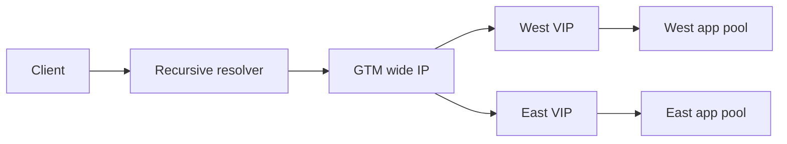

# Whiteboard drills

Each drill is timed for 10 minutes. State assumptions, draw the path, identify
evidence, and name a falsifier.

1. DNS failover: draw LDNS, listener, Wide IP, TTL. Assume 60-second TTL; decide whether stale cache explains a five-minute symptom.
2. TCP path: draw client, VIP, pool, return route. Table: SYN seen/no reply means listener or policy; member SYN absent means selection; reset means identify sender.
3. TLS chain: draw SNI, profile, chain, trust. Hypothesis expired cert; falsifier is valid served chain and incorrect clock.
4. LTM persistence: calculate five clients pinned to one member; decide drain versus expiry and explain hotspot trade-off.
5. SNAT: model 1000 clients and finite source ports; identify allocation evidence and a staged capacity choice.
6. DNSSEC: draw signer, delegation, validator; hypothesis broken chain; falsifier is valid signature and resolver path issue.
7. Kubernetes ingress: draw ingress, service, endpoints, pod; check selectors, readiness, TLS secret, and network policy.
8. VXLAN: draw inner frame, VTEPs, underlay; calculate effective MTU and identify outer-drop evidence.
9. BGP: draw peers, policy, RIB, FIB; decide why a received route is not installed.
10. HTTP cache: draw key and origin; test cookie and authorization variants without exposing data.
11. gRPC: draw stream, proxy, member; decide how deadline and drain interact.
12. NTP: draw sources, daemon, wall and monotonic clocks; distinguish TLS failure from elapsed-time measurement.
13. Automation: draw desired, diff, API task, verify; decide response to ambiguous POST timeout.
14. HA: draw active/standby, state sync, flows; distinguish configuration from runtime state.
15. Pen-test: draw authorization boundary and stop condition; reject destructive or out-of-scope actions.

## Decision table

| Observation | Strong next step | Falsifier |
| --- | --- | --- |
| No ingress packet | Inspect path policy | Ingress capture shows packet |
| Green monitor, 503 | Identify responding hop | Origin and VIP both healthy |
| Valid authoritative DNS | Inspect cache/LDNS | Resolver answer current |
| API accepted write | GET effective state | Desired version absent |

## Worked answer: DNS/GTM failover (12-minute drill)

Assume two regions, authoritative GTM health checks, a 30-second TTL, and a
warm-standby database. The client uses a recursive resolver, so TTL is a bound,
not an instant switch.

**Interviewer:** West is unhealthy. Why do some clients still reach West?

**Candidate:** GTM may stop selecting West only after monitor and iQuery state
converge. Resolvers that cached the old answer continue until the remaining TTL
expires; clients may cache locally or reuse existing connections. I compare
authoritative answers, resolver answers with cache age, GTM member state,
monitor source, and application errors. The safe action is to confirm the
approved policy and observe; lowering TTL after the incident cannot flush old
caches.

| Signal | Supports | Falsifier |
| --- | --- | --- |
| Authoritative answer excludes West | GTM decision changed | Resolver still returns West |
| Resolver answer includes West | Cache/convergence delay | Cache age below TTL yet stale |
| West monitor down | Regional failure | Direct equivalent probe succeeds |

Two hypotheses are H1, expected cache convergence, and H2, stale or incorrect
GTM health state. Test H1 from multiple resolver vantage points; test H2 with
monitor logs and iQuery peer state. Aggressive TTL reduction improves future
failover but increases DNS load and does not repair an unhealthy application.
Rollback restores the prior topology only after a canary and database write
safety are proven.

**Calculation:** if a resolver cached the answer one second before failure,
the remaining DNS exposure is approximately 29 seconds, excluding client cache
and connection reuse. Label this as an assumption, not a recovery guarantee.
