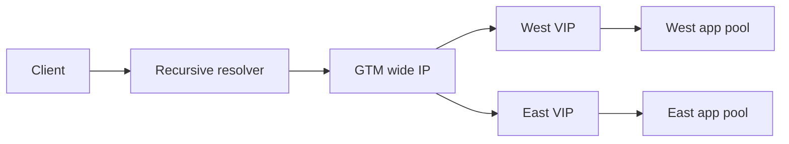

# Whiteboard drills

Each drill is timed for 10 minutes. State assumptions, draw the path, identify
evidence, and name a falsifier.

1. DNS failover: draw LDNS, listener, Wide IP, TTL. Assume 60-second TTL; decide whether stale cache explains a five-minute symptom.
2. TCP path: draw client, VIP, pool, return route. Table: SYN seen/no reply means listener or policy; member SYN absent means selection; reset means identify sender.
3. TLS chain: draw SNI, profile, chain, trust. Hypothesis expired cert; falsifier is valid served chain and incorrect clock.
4. LTM persistence: calculate five clients pinned to one member; decide drain versus expiry and explain hotspot trade-off.
5. SNAT: model 1000 clients and finite source ports; identify allocation evidence and a staged capacity choice.
6. DNSSEC: draw signer, delegation, validator; hypothesis broken chain; falsifier is valid signature and resolver path issue.
7. Kubernetes ingress: draw ingress, service, endpoints, pod; check selectors, readiness, TLS secret, and network policy.
8. VXLAN: draw inner frame, VTEPs, underlay; calculate effective MTU and identify outer-drop evidence.
9. BGP: draw peers, policy, RIB, FIB; decide why a received route is not installed.
10. HTTP cache: draw key and origin; test cookie and authorization variants without exposing data.
11. gRPC: draw stream, proxy, member; decide how deadline and drain interact.
12. NTP: draw sources, daemon, wall and monotonic clocks; distinguish TLS failure from elapsed-time measurement.
13. Automation: draw desired, diff, API task, verify; decide response to ambiguous POST timeout.
14. HA: draw active/standby, state sync, flows; distinguish configuration from runtime state.
15. Pen-test: draw authorization boundary and stop condition; reject destructive or out-of-scope actions.

## Decision table

| Observation | Strong next step | Falsifier |
| --- | --- | --- |
| No ingress packet | Inspect path policy | Ingress capture shows packet |
| Green monitor, 503 | Identify responding hop | Origin and VIP both healthy |
| Valid authoritative DNS | Inspect cache/LDNS | Resolver answer current |
| API accepted write | GET effective state | Desired version absent |

## Worked answer: DNS/GTM failover (12-minute drill)

Assume two regions, authoritative GTM health checks, a 30-second TTL, and a
warm-standby database. The client uses a recursive resolver, so TTL is a bound,
not an instant switch.

**Interviewer:** West is unhealthy. Why do some clients still reach West?

**Candidate:** GTM may stop selecting West only after monitor and iQuery state
converge. Resolvers that cached the old answer continue until the remaining TTL
expires; clients may cache locally or reuse existing connections. I compare
authoritative answers, resolver answers with cache age, GTM member state,
monitor source, and application errors. The safe action is to confirm the
approved policy and observe; lowering TTL after the incident cannot flush old
caches.

| Signal | Supports | Falsifier |
| --- | --- | --- |
| Authoritative answer excludes West | GTM decision changed | Resolver still returns West |
| Resolver answer includes West | Cache/convergence delay | Cache age below TTL yet stale |
| West monitor down | Regional failure | Direct equivalent probe succeeds |

Two hypotheses are H1, expected cache convergence, and H2, stale or incorrect
GTM health state. Test H1 from multiple resolver vantage points; test H2 with
monitor logs and iQuery peer state. Aggressive TTL reduction improves future
failover but increases DNS load and does not repair an unhealthy application.
Rollback restores the prior topology only after a canary and database write
safety are proven.

**Calculation:** if a resolver cached the answer one second before failure,
the remaining DNS exposure is approximately 29 seconds, excluding client cache
and connection reuse. Label this as an assumption, not a recovery guarantee.

## Detailed answer key and interviewer follow-ups

Use these answers after attempting the ten-minute drill. A strong answer is not
just a diagram: it states assumptions, separates facts from inferences, names
evidence and a falsifier, and ends with a safe verification plan.

### 1. DNS failover

**Answer:** Draw `client -> recursive resolver -> authoritative/GTM listener ->
Wide IP -> regional VIP`. Assume the authoritative TTL is 60 seconds, but state
that this is a cache lifetime, not a universal recovery deadline. A resolver
that cached the West address immediately before failure can continue returning
it for nearly 60 seconds; a client or intermediary may add reuse or local
caching. Existing TCP connections do not consult DNS again.

Check the authoritative answer, resolver answer and remaining TTL, GTM monitor
and pool state, resolver viewpoint, and new connection destinations. Hypothesis
H1 is expected cache convergence; H2 is stale or incorrect health state; H3 is
connection reuse. A resolver returning West after its cache age exceeds the
advertised TTL falsifies a simple TTL-only explanation. Do not lower TTL during
the incident and promise immediate movement; that affects future caching only.

**Follow-ups:**

- *What if authoritative DNS excludes West but users still fail?* Check the
  resolver cache, client cache, existing connections, East VIP, and East origin
  capacity independently.
- *How would you design writes?* Fence the old writer and establish the new
  authority before routing write traffic; DNS movement alone cannot transfer
  state ownership.
- *What would you measure?* Answer distribution by resolver, cache age, new
  connection region, error rate, TTL, monitor convergence, and origin load.

### 2. TCP path

**Answer:** Draw both legs if the VIP is a proxy: `client -> VIP` and `VIP ->
member`, plus the return routes. A SYN seen at the client but not at the VIP
suggests a path or policy problem. A SYN arriving at the VIP with no response
suggests listener, local policy, resource, or return-path hypotheses. If the
client connects but no member-side SYN exists, inspect virtual-server policy,
pool eligibility, selection, and proxy resource limits. For an RST, identify
which endpoint or policy device sent it before assigning cause.

Record the five-tuple, interface, timestamp, TCP flags, retransmissions, NAT
translation, and socket state at each observation point. A capture at one
interface is not end-to-end proof. A completed handshake falsifies “no route to
the listener,” but not TLS, HTTP, authorization, or backend health.

**Follow-ups:**

- *The member sees SYN-ACK, but the client does not.* Compare the proxy’s
  client-side return route, SNAT state, ACLs, and asymmetric path.
- *Would you increase TCP timeout?* Only after evidence shows delayed but valid
  progress; increasing it can retain more state during an overload.
- *What is the safest first action?* Read-only captures and state inspection,
  followed by a narrowly scoped synthetic probe.

### 3. TLS chain and SNI

**Answer:** Draw `ClientHello(SNI, ALPN) -> listener/profile -> certificate
chain -> trust store`, and include a second leg if the proxy re-encrypts to the
origin. Test the exact hostname with SNI. Inspect the served leaf, SAN, issuer,
chain order, validity interval, key usage/EKU, negotiated protocol, and local
clock. An expired certificate is a fact only after observing the certificate
actually served to the failing hostname.

The hypothesis “the leaf is expired” is falsified by a valid served leaf; then
consider wrong SNI/default certificate, incomplete chain, trust-store mismatch,
hostname validation, clock skew, or backend TLS. Never disable verification as
the fix. A valid certificate proves identity under the trust policy, not that
the backend is healthy or the request is authorized.

**Follow-ups:**

- *Why can one hostname fail on a shared VIP?* SNI may select a different
  profile or certificate; test each hostname, not only the IP address.
- *What changes for mTLS?* Inspect the client chain, server trust bundle, SAN or
  identity mapping, EKU, and authorization decision as well as server TLS.
- *How do you rotate safely?* Overlap trust or certificate versions, canary
  representative clients, monitor failures, then remove the old material.

### 4. LTM persistence hotspot

**Answer:** Assume five clients share one persistence key or arrive through a
  common NAT address, and the pool has three healthy members. If the configured
  key maps all five to Member A, the nominal distribution is 5/0/0 rather than
  2/2/1. Explain whether persistence is source-address, cookie, SSL-session,
  or another key; the result depends on the configured profile and scope.

Inspect persistence records, selected-member logs, connection counts, member
  capacity, timeout, fallback behavior, and drain state. A hotspot hypothesis is
  falsified if requests use independent keys and selection is balanced. Expiring
  persistence can redistribute new work but may break sessions; draining Member
  A protects new traffic while allowing active work to finish. The trade-off is
  session continuity versus utilization and recovery speed.

**Follow-ups:**

- *Would you clear all persistence?* Only under an approved plan; a mass reset
  can create a synchronized login or cache surge.
- *How do long-lived WebSockets change it?* Connection count and duration, not
  request count, dominate; drain needs an explicit close or migration policy.
- *What is a better long-term fix?* Reduce unnecessary affinity, use a stable
  application session store, or partition keys deliberately after measuring.

### 5. SNAT capacity

**Answer:** State a tuple model. A single SNAT address has a finite set of source
  ports for a given destination address, destination port, and protocol. With
  1,000 clients, long-lived connections, and one destination tuple, calculate
  usable ports from the configured ephemeral range, reserve headroom, and
  account for TIME-WAIT or idle retention. Do not treat requests per second as
  the same thing as concurrent translated flows.

Evidence is allocation failure, translated-port utilization, connection age,
member health, and client/server tuple comparison. H1 is exhaustion; H2 is an
ACL or return-path failure. If new flows fail while existing flows continue and
translation allocation is near the limit, H1 gains support. Adding addresses
increases capacity but changes source identity and may require ACL, logging, or
allowlist updates.

**Follow-ups:**

- *Why do multiple destinations help?* Port uniqueness is commonly constrained
  by the full translated tuple, so destinations can provide separate capacity;
  verify the implementation rather than assuming the exact allocator.
- *Would you clear connections?* Only as an approved emergency action; it can
  cause a reconnection storm and destroy useful evidence.
- *What is the durable fix?* Reduce connection churn, improve reuse, add
  carefully governed translation capacity, and alert before exhaustion.

### 6. DNSSEC validation failure

**Answer:** Draw `authoritative zone -> DNSKEY/RRSIG -> DS delegation ->
validating recursive resolver -> client`. Query the authoritative server and a
validating resolver separately. Inspect `AD`, `SERVFAIL`, DNSKEY, DS, RRSIG,
signature validity, key tags, and resolver clock. A broken delegation, expired
signature, incorrect key rollover, or stale signer can produce SERVFAIL even
when unsigned lookup intuition says the record exists.

The hypothesis “the record is absent” is falsified by a valid authoritative
answer and a failed validating answer. The hypothesis “DNSSEC is broken” is
weakened if multiple validating resolvers succeed and only one local resolver
fails. Do not disable validation globally as a first fix; preserve the chain
evidence and identify the signing or delegation owner.

**Follow-ups:**

- *What can a client cache?* Positive and negative results can remain cached,
  so correction does not instantly change every client outcome.
- *What does clock matter?* Signature validity uses time; compare resolver and
  signer time sources and offset.
- *How do you roll keys?* Use documented overlap and delegation sequencing,
  canary validation, and a rollback plan that does not create two authorities.

### 7. Kubernetes ingress

**Answer:** Draw `client -> DNS -> external LB/ingress -> Service -> EndpointSlice
-> ready Pod`, and separately draw API/controller/CNI control paths. Check the
  ingress class, host/path precedence, TLS secret, service port, selector,
  ready endpoints, NetworkPolicy, CNI enforcement, and controller-rendered
  configuration. Distinguish an API object existing from a data-plane route
  being programmed and enforced.

For an empty backend, selectors and readiness are leading hypotheses. For a
  timeout, inspect cloud routes, security policy, node path, CNI, and return
  traffic. A default-deny egress policy may block CoreDNS and make a healthy
  dependency look absent. Verify the installed CNI’s supported policy behavior;
  Kubernetes YAML alone is not proof of enforcement.

**Follow-ups:**

- *Ingress returns 404 but the pod is healthy.* Check class ownership, host,
  path matching, default backend, and controller events.
- *How do you roll out a fix?* Canary one route or namespace, compare request
  and endpoint metrics, and retain the prior manifest and controller state.
- *What is Staff-level reasoning?* Define ownership between cloud LB, ingress
  controller, CNI, and service teams so failures do not become boundary gaps.

### 8. VXLAN and MTU

**Answer:** Draw the inner frame from workload to VTEP, the outer UDP/IP packet
across the underlay, and decapsulation at the remote VTEP. If the underlay MTU
is 1,500 bytes and the chosen VXLAN overhead is approximately 50 bytes, a
conservative inner payload budget is about 1,450 bytes before inner headers;
state the exact header assumptions rather than treating 50 as universal.

Small TCP handshakes may succeed while larger segments stall because the outer
packet exceeds path MTU or ICMP Packet Too Big/Fragmentation Needed is blocked.
Capture both inner and outer views, inspect VTEP reachability, VNI mapping,
underlay routes, PMTUD signals, retransmissions, and MSS behavior. Do not raise
MTU globally as the first remediation.

**Follow-ups:**

- *What falsifies MTU as the cause?* Large do-not-fragment probes and packet
  traces succeed across the same path while the application still stalls.
- *What if only one direction fails?* Compare underlay MTU and return route;
  asymmetric paths can have different constraints.
- *What is a safe test?* Use reserved lab endpoints, bounded packet sizes, and
  a documented restoration step.

### 9. BGP route not installed

**Answer:** Separate adjacency, policy, RIB, and FIB. A peer may be established
while the route is rejected by import policy, invalid next hop, prefix limit,
duplicate preference, route target/VRF mismatch, or a more preferred source.
Inspect received and accepted prefixes, attributes, policy decision, next-hop
resolution, RIB selection, and FIB programming. A route in the received table
is not necessarily eligible for forwarding.

For a route that is accepted but absent from the RIB, inspect preference and
competing paths. For one in the RIB but absent from the FIB, inspect recursion,
hardware/resource limits, programming lag, and platform state. A packet capture
or FIB lookup falsifies a claim that the route is active in the data plane.

**Follow-ups:**

- *Would you withdraw the route?* Not as an exploratory action; isolate the
  prefix and use read-only policy and FIB evidence first.
- *What does longest-prefix match decide?* The FIB chooses the most specific
  installed prefix per lookup; BGP attributes influence route selection before
  that lookup.
- *What is the Staff concern?* Bound blast radius, route-leak risk, convergence,
  and ownership before changing shared policy.

### 10. HTTP cache privacy

**Answer:** Draw the cache key and the origin authorization boundary. Define
  which request attributes participate in the key: scheme, host, path, query,
  selected headers, cookies, and authorization context. Test two synthetic
  users with different authorization and cookie values against a local cache or
  approved fixture. Verify `Age`, cache status, `Vary`, validators, purge state,
  and origin timing without recording private bodies.

The dangerous hypothesis is that a shared cache treats personalized responses
as interchangeable. A different user receiving the first user’s content is
strong evidence, but absence of reproduction does not prove safety if sampling
misses a key variant. Prefer private/no-store behavior for sensitive responses,
explicit cache keys, and versioned immutable assets for public content.

**Follow-ups:**

- *Is purge enough?* Purge removes known objects but does not repair a bad key
  policy or every downstream cache; fix the invariant and then purge safely.
- *How can authorization be preserved?* Enforce it at the origin or trusted
  gateway and ensure cache reuse cannot cross identity boundaries.
- *What would you monitor?* Cache-key dimensions, hit/miss by policy class,
  authorization errors, unexpected `Age`, and privacy-safe synthetic probes.

### 11. gRPC stream reset

**Answer:** Draw client connection, HTTP/2 or HTTP/3 streams, proxy, and member.
Separate connection failure from stream reset, deadline expiry, GOAWAY/drain,
flow-control exhaustion, max-stream limits, and application status. Record
method, deadline remaining, stream ID, reset/status code, ALPN, proxy timeout,
member selection, and whether the operation is safe to retry.

A graceful drain should stop new streams, allow bounded existing work to finish,
and signal clients to reconnect. Retrying a non-idempotent write after an
unknown reset can duplicate the effect. The falsifier for “proxy timeout” is a
client-side deadline that expires before the proxy limit; the falsifier for
“member failure” is a healthy member trace with a policy-generated reset.

**Follow-ups:**

- *Why can HTTP/2 be healthy while one RPC fails?* Stream state, flow control,
  method deadline, or application status can fail independently of TCP.
- *How should retries work?* One owner applies a bounded budget with jitter,
  idempotency rules, and a total deadline.
- *What does drain require?* Connection and stream counts, long-lived stream
  policy, GOAWAY behavior, and a forced-close recovery boundary.

### 12. NTP and clock domains

**Answer:** Draw time sources, NTP daemon, wall clock, monotonic clock, TLS
validator, logs, and application deadlines. Compare offset, delay, stratum,
source reachability, leap state, and synchronization status. Wall-clock errors
can break certificate validity and log ordering; monotonic clocks are generally
better for measuring elapsed duration but do not provide a calendar timestamp.

The hypothesis “TLS is broken” is weakened if the certificate is valid under a
correct synchronized time but the host wall clock is outside the validity
interval. The hypothesis “the request took ten seconds” is invalid if the
measurement uses a wall clock that jumped. Preserve both clocks where possible
and do not change system time during an ordinary application investigation.

**Follow-ups:**

- *Can NTP be the only cause?* No; compare trust chain, SNI, network path, and
  service logs as independent evidence.
- *What is a safe remediation?* Escalate to the host/platform owner, verify the
  time-source policy, and monitor convergence; changing time can affect tokens,
  databases, and incident timelines.
- *What does Staff-level thinking add?* Define time dependency ownership and a
  degraded behavior when synchronization is unavailable.

### 13. Automation with ambiguous POST outcome

**Answer:** Treat the request outcome as **unknown**, not failed. Record target,
method, stable object identity, request ID, payload hash, timeout, response, and
task state. Read effective state using a fully qualified name and inspect any
asynchronous task. Reconcile desired state with observed state before deciding
whether retry is safe.

If the operation is non-idempotent, do not blindly repeat the POST. If the
object exists with the intended payload, verify and stop. If it is absent and
the API contract guarantees safe creation or supports an idempotency key, use a
bounded retry. Validate partition, RBAC, pagination, version, and ownership.
The falsifier for “the write succeeded” is an authoritative read showing no
object or task completion, but a read failure still leaves the outcome unknown.

**Follow-ups:**

- *Why not trust HTTP 202?* Acceptance means the platform received work, not
  that the effective state is healthy or complete.
- *What must logs exclude?* Tokens, passwords, private keys, full payloads, and
  sensitive response bodies.
- *What is the rollback?* Restore the prior approved desired state after proving
  what changed; do not delete an unknown object automatically.

### 14. HA configuration versus runtime state

**Answer:** Draw active and standby devices, configuration synchronization,
state synchronization, control links, data interfaces, flows, and upstream and
downstream routes. Configuration state answers what should be configured;
runtime state answers which unit is active, what flows exist, what monitors see,
and whether peers agree. Inspect role, sync status, versions, trust, failover
events, traffic-group ownership, connection mirroring, and route/ARP state.

A standby can have a matching configuration but still lack runtime flow state,
current peer health, or a usable data path. A failover may preserve new request
availability while disrupting long-lived sessions. Avoid forcing failover as a
diagnostic action; first compare read-only state and use an approved canary or
maintenance procedure.

**Follow-ups:**

- *What if config is synchronized but traffic fails?* Inspect data interfaces,
  routes, self IPs, VLANs, monitor state, and runtime ownership separately.
- *When is connection mirroring useful?* When supported and sized for the
  workload, but it adds state and capacity costs and does not guarantee every
  application session survives.
- *What is the verification gate?* New and existing traffic, peer health,
  persistence, TLS, origin selection, and rollback readiness.

### 15. Authorized penetration-test planning

**Answer:** Start with written authorization, exact targets, source addresses,
dates, methods, rate limits, data handling, stop conditions, contacts, and a
recovery owner. Draw the authorization boundary separately from the network
topology. Choose a non-destructive test that answers the finding, such as a
bounded TLS handshake or safe header validation, and define what evidence will
be retained.

Reject credential guessing, persistence, destructive exploitation, lateral
movement, broad scanning, and tests outside the approved scope. A scanner
finding is a hypothesis until reproduced safely and correlated with the
effective listener/profile/policy. The success condition is not merely “the
scanner ran”; it is a documented finding, impact, mitigation owner, retest, and
absence of unacceptable customer impact.

**Follow-ups:**

- *The owner says “just test production.”* Ask for written scope, window,
  source allowlisting, provider notification, stop threshold, and rollback.
- *How do you report a weak TLS result?* Include hostname/SNI, protocol, cipher,
  certificate, scanner version, scope, affected clients, and staged remediation.
- *What if the test causes impact?* Stop immediately, notify the incident owner,
  preserve evidence, contain within authorization, and verify recovery before
  continuing or closing the exercise.
