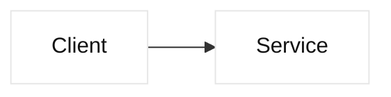

# Markdown style guide

## A. Heading hierarchy

Use one document title followed by ordered major sections. Label major sections
with a descriptive title; use lettered labels when the document is procedural or
governance-oriented:

```markdown
# Document title

## A. Major section

### A.1 Subsection

#### Detail, only when required
```

Technical chapters may use descriptive headings such as `## Mental model` and
`## Worked example`; do not add a heading level merely for decoration. Never
skip from `#` to `###`, and keep sibling sections at the same level.

## B. Readable emphasis

- Use **bold** for key terms, decisions, and safety boundaries.
- Use *italics* for caveats, assumptions, and emphasis within prose.
- Use backticks for commands, filenames, identifiers, addresses, and code symbols.
- Use fenced code blocks with a language tag for executable or illustrative code.
- Use tables for clear comparisons, mappings, evidence matrices, and timelines.

## C. Diagrams and colors

Mermaid diagrams must remain ASCII-only. Use the light `base` theme with dark
text and restrained colors, for example:



Markdown has no portable color syntax. Do not use color as the only signal;
pair it with labels, table columns, or text such as **Fact**, **Inference**, and
**Safety boundary**. Use raw HTML color only when the rendering target is
explicitly known and accessibility has been considered.

## D. Content labels

Distinguish evidence in prose:

- **Fact:** protocol or documented product behavior with a source.
- **Vendor terminology:** product-specific naming or behavior with a version boundary.
- **Inference:** engineering guidance with assumptions, trade-offs, and verification.
- **Observed:** measured output from a stated environment and timestamp.

## E. Links and handoff checks

Use relative links for repository files and descriptive link text. Before
handoff, run `./scripts/validate.sh`, the documented Python example, and
`git diff --check`. Keep examples fictional or reserved, and never commit
secrets.
