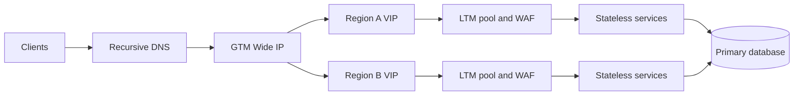

# Network system design exercises

## Common requirements

For every design state request path, capacity assumptions, failure domains,
security boundaries, observability, rollout, and rollback. Label protocol facts
and engineering inferences. Use reserved addresses and authorized tests.

## Senior design method

For SDE2, make the request path and failure evidence concrete. For Staff,
extend the same design with *ownership, migration, cost, and adoption*:

1. **Frame:** clarify users, business impact, SLO/RTO/RPO, scale, and authority.
2. **Model:** separate data plane, control plane, state ownership, and trust boundaries.
3. **Quantify:** estimate RPS/CPS, concurrency, failure load, headroom, and the dominant cost.
4. **Compare:** present two viable options, then state the rejected trade-off.
5. **Evolve:** define teams, compatibility, canary, rollback, failback, and adoption metrics.
6. **Verify:** name dashboards, a falsifier, and the evidence required to expand rollout.

The [Staff design review pack](staff-design-review-pack.md) supplies twelve
prompts using this method. A design answer is incomplete if it has a polished
topology but no state owner, migration boundary, or recovery decision.

1. **Multi-site checkout:** Requirements: DNS/GTM site choice, LTM pools, TLS, drain, and stale-cache tolerance. Request path: LDNS to Wide IP to VIP to pool. Capacity: model peak connections and SNAT. Failures: site, DNS, member, certificate. Security: mTLS and RBAC. Observe SLO, TTL, health, and traces. Roll out one site first. Follow-ups: how handle cached answers? How test failover?
2. **Private service discovery:** Requirements: registry leases, readiness, config versions, retries. Path: client to resolver/registry to service. Capacity: registry and endpoint churn. Failures: partition and stale data. Security: identity and secret references. Observe effective version and endpoint. Canary configuration. Follow-ups: liveness versus readiness? Idempotent retry?
3. **CDN API edge:** Requirements: cache privacy and purge. Path: client to edge to origin LTM. Capacity: hit/miss and origin shield. Failures: stale object and origin overload. Security: key isolation and TLS. Observe age, status, origin timing. Version assets before rollout. Follow-ups: cache key? emergency correction?
4. **Kubernetes ingress:** Requirements: TLS, service routing, readiness, policy. Path: DNS to ingress to service endpoints. Capacity: connections and pod limits. Failures: empty endpoints and controller. Security: namespace and RBAC. Observe traces and endpoint slices. Canary ingress class. Follow-ups: rollback? network policy?
5. **BGP anycast edge:** Requirements: route policy and health withdrawal. Path: client to nearest announcement to edge. Capacity: regional headroom. Failures: route leak and stateful session movement. Security: prefix filters and authentication. Observe RIB/FIB and SLO. Stage one prefix. Follow-ups: convergence? asymmetric state?
6. **F5 automation platform:** Requirements: REST/SDK, AS3/DO/TS, RBAC, idempotency. Path: desired state to diff to task to effective VIP. Capacity: API rate and device resources. Failures: partial task and version drift. Security: scoped tokens. Observe request IDs. Canary declaration. Follow-ups: ambiguous timeout? pagination?
7. **DNS/DDI service:** Requirements: DHCP, IPAM ownership, authoritative DNS. Path: client lease to record to application. Capacity: scopes and queries. Failures: duplicate IP and stale record. Security: protected updates. Observe leases and audit. Roll out one scope. Follow-ups: overlap? recovery?
8. **TLS/mTLS gateway:** Requirements: SNI, trust rotation, backend re-encryption. Path: client to gateway to service. Capacity: handshakes and connections. Failures: expired chain and clock. Security: least trust. Observe ALPN and handshake errors. Canary certificates. Follow-ups: rollback? client inventory?
9. **Observability pipeline:** Requirements: logs, metrics, traces, TS-style export. Path: device/service to collector to store. Capacity: event volume and backpressure. Failures: destination or schema. Security: redaction and RBAC. Observe delivery SLO. Roll out one tenant. Follow-ups: sampling? data retention?
10. **Authorized resilience test:** Requirements: written scope, rate, abort, owner, recovery. Path: selected lab or canary dependency. Capacity: baseline and error budget. Failures: packet loss, delay, dependency outage. Security: no exploit or credential guessing. Observe impact and stop. Follow-ups: falsifier? rollback?

## Worked design: multi-region F5 application edge

### Requirements and assumptions

Serve 50,000 requests/second across two regions, keep p99 latency below 250 ms,
survive loss of one region, and avoid split-brain writes. Assume 70% cacheable
GETs, 30% dynamic requests, 20,000 concurrent TLS sessions per region, a
30-second DNS TTL, and RTO/RPO targets of 10 minutes/5 minutes. These are
interview assumptions and must be replaced by measured traffic.

### Architecture and request sequence

The resolver receives a GTM answer subject to TTL and cache age. The client
then performs TCP and TLS to the selected VIP; SNI chooses the certificate and
the LTM profile terminates or re-encrypts TLS. LTM selects a healthy member,
applies SNAT if the return route requires it, and emits a request ID. Dynamic
writes go to the database primary; promotion requires fencing before GTM
advertises the new region.

### Capacity, failure, and safety

At 70% cacheable traffic, origins see about 15,000 requests/second before
retries. Size for a full 50,000-request regional burst plus TLS handshakes, not
the average. Reserve SNAT ports by source/destination tuple and alert on
allocation failures. A regional failure consumes DNS convergence, connection
drain, and database-promotion time; a 10-minute RTO is a budget, not a DNS
promise. Monitors test the real dependency path without writes. WAF and rate
limits fail closed for admin routes and fail safely for approved public reads.

### Observability and rollout

Track answer distribution, monitor state, TLS errors by SNI, 4xx/5xx, queue
depth, SNAT utilization, replication lag, resolver cache age, and trace IDs.
Roll out one VIP/profile at a time, canary known clients, compare p50/p95/p99
and error budgets, then expand. Roll back with the versioned LTM/GTM
declaration, drain new traffic, and verify data-plane health and database
fencing.

### Follow-ups

1. How would IPv6 avoid an asymmetric return path?
2. Which certificates and trust stores rotate, and how is mTLS identity mapped?
3. What evidence distinguishes GTM cache delay from an LTM pool outage?
4. How is an SDK/AS3 deployment made idempotent after an API timeout?
5. What is the safe rollback if the promoted database accepts writes too early?
