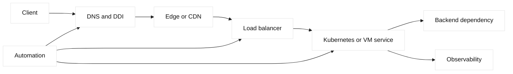

# Networking interview bank

This bank targets SDE1, SDE2, and network-automation roles. Every scenario uses
reserved or fictional names. Answers distinguish protocol facts from engineering
inferences and identify evidence before a change.

## Role map

| Role | Core expectation | Evidence habit |
| --- | --- | --- |
| SDE1 | Trace request through DNS, TCP, TLS, and HTTP | Tuple, timestamp, status |
| SDE2 | Reason about failure domains and capacity | Competing hypotheses |
| Automation | Encode desired state safely | Diff, test, rollback |

## Architecture diagram

## Fundamentals

1. **What is an Ethernet frame?** It carries source and destination MAC addresses, an EtherType or length, payload, and frame check sequence. Switches learn source locations and forward based on destination tables. Evidence is a capture or switch table; a trade-off is flooding unknown destinations versus control-plane complexity. Verify VLAN context and caveat that a frame capture at one interface does not prove end-to-end delivery.
2. **What does ARP do?** ARP maps an IPv4 address to a local-link MAC through requests and replies. It is scoped to a broadcast domain, not routed end to end. Evidence includes cache and packet exchange. Static entries can stabilize special cases but create drift; stale or spoofed replies are caveats, so use validation and appropriate security controls.
3. **How does IPv6 neighbor discovery differ?** IPv6 uses ICMPv6 Neighbor Discovery for address resolution, router discovery, and reachability. It relies on multicast rather than IPv4 broadcast. Evidence includes neighbor cache and ICMPv6 messages. Blocking ICMPv6 can break more than ping; the trade-off is filtering unwanted traffic without removing required control messages.
4. **What is a subnet?** A subnet is an address prefix defining which destinations are directly reachable through local link resolution and which require a router. Evidence is prefix, interface address, and route table. Larger prefixes reduce routing entries but enlarge failure and broadcast scope; overlapping or incorrect prefixes create ambiguous reachability.
5. **How does routing choose a path?** A router selects the most specific matching prefix, then applies administrative and protocol-specific preference or cost. Evidence is the forwarding table and next-hop state. More-specific routes improve policy control but can create leaks; a route present in control plane may still be unusable if adjacency fails.
6. **Why use IPv6?** IPv6 expands address space and changes neighbor and configuration mechanisms. It does not automatically improve latency or security. Evidence is dual-stack path behavior, DNS AAAA answers, and application support. The trade-off is migration complexity; ensure monitoring, ACLs, MTU, and libraries handle both families.
7. **What is a default route?** It matches destinations for which no more-specific route exists. Evidence is route table and next-hop reachability. It simplifies hosts but can send unexpected traffic toward a black hole or security boundary; use explicit routes and policy where failure impact warrants it.
8. **What causes asymmetric routing?** Different forward and return paths can result from metrics, policy, ECMP, or NAT. Evidence requires captures and route tables on both directions. Asymmetry may improve utilization but breaks stateful inspection or troubleshooting assumptions; verify state sharing and symmetric design where needed.
9. **What does TCP provide?** TCP provides ordered, reliable byte-stream delivery, congestion control, and connection state. Evidence includes handshake, retransmission, RTT, and window metrics. It does not preserve message boundaries or guarantee application success; buffering and head-of-line blocking are caveats.
10. **What is UDP good for?** UDP provides datagrams with ports but no built-in reliability, ordering, or congestion control. Evidence is packet and application behavior. It suits DNS and transports such as QUIC when the application supplies control; the trade-off is flexibility versus implementation responsibility.
11. **What is QUIC?** QUIC is an encrypted, congestion-controlled transport over UDP with independent streams and connection identifiers. Evidence includes version, handshake, loss, and ALPN. It can avoid cross-stream blocking but still faces congestion, MTU, and UDP policy caveats.
12. **How do MTU failures appear?** Oversized packets may fragment or be dropped, causing stalls for larger responses while small probes pass. Evidence is path-MTU testing, ICMP messages, and retransmissions. Raising MTU can improve efficiency but requires end-to-end support; changing application timeouts is not a fix.

## DNS, DHCP, IPAM, and DDI

13. **What does recursive DNS do?** A recursive resolver obtains answers from authoritative servers and caches them under TTL policy. Evidence includes query, answer, flags, TTL, and cache state. Caching reduces load but delays changes; client libraries and intermediaries can add additional behavior.
14. **What is authoritative DNS?** It publishes records for a zone and answers according to zone data and signing policy. Evidence is a direct query to the authoritative listener. It cannot control already cached recursive answers; delegation, serial, and DNSSEC chain must be checked.
15. **Why does TTL matter?** TTL tells caches how long an answer may be reused. Lower TTL can improve planned agility but increases query load and cannot shorten values already cached. Evidence is authoritative TTL versus observed recursive age; do not promise instant failover.
16. **What is DHCP leasing?** DHCP allocates addresses and options for bounded lease intervals through a discover, offer, request, and acknowledgement exchange. Evidence is server lease state and client messages. Short leases aid reuse but increase traffic; relay and failover state are caveats.
17. **What is IPAM ownership?** IPAM records allocation, ownership, and lifecycle of addresses and prefixes. Evidence includes reservation, DNS, DHCP, and device state. A central source improves auditability but becomes a dependency; reconcile drift before assigning an address.
18. **How do duplicate IPs happen?** Stale reservations, manual configuration, cloned images, or split ownership can assign one address twice. Evidence includes ARP/ND observations, DHCP logs, and IPAM history. Isolate safely and resolve ownership; blindly clearing caches can hide recurrence.
19. **What is DNSSEC?** DNSSEC signs DNS data so validating resolvers can detect tampering or missing authenticity. Evidence includes DNSKEY, DS, RRSIG, flags, and clock state. Key rollover improves security but requires overlap and careful delegation; disabling validation is a risky shortcut.
20. **How do you debug NXDOMAIN?** Query authoritative and recursive servers for the exact name and type, check delegation and negative TTL, then verify client search behavior. NXDOMAIN differs from timeout and SERVFAIL. Changing an unrelated record is a poor trade-off because it obscures ownership.

## HTTP, proxies, and load balancing

21. **What is HTTP caching?** Caches store representations under a cache key and freshness policy. Evidence includes cache status, age, validators, and origin timing. Caching lowers origin load but can serve stale or private data if keys and headers are wrong; version immutable assets.
22. **What does a reverse proxy do?** It accepts client traffic and forwards requests to origin services, often terminating TLS or applying policy. Evidence includes both hop protocols and timings. It centralizes control but adds buffering, timeout, and failure-domain complexity.
23. **How does a load balancer select?** It filters members by health and policy, then applies a method such as round robin, least connections, persistence, or priority. Evidence is selection reason and per-member metrics. Persistence improves session affinity but can create hotspots.
24. **Why can HTTP status mislead?** A 503 or 504 may come from an edge, proxy, or origin and means different things. Identify the responding hop through headers, timing, and logs. Status interpretation is fast but imperfect; correlate with tuples and pool state.
25. **What is connection draining?** Draining stops new assignments while active work completes within a bound. Evidence is new versus existing connection counts and closure reasons. It reduces deploy resets but delays maintenance; long-lived clients require forced-close and reconnect policy.
26. **What is a health check?** It probes a configured source, protocol, path, and expected response to determine eligibility. Evidence is monitor result and source. Deep checks improve signal but consume backend capacity and couple availability to dependencies; keep contracts explicit.
27. **How does HTTP/2 multiplex?** Frames for multiple streams share a TCP connection, reducing setup overhead while retaining HTTP semantics. Evidence includes stream resets, windows, and ALPN. TCP loss can delay all streams; HTTP/2 is not automatically faster.
28. **What does HTTP/3 change?** HTTP/3 maps streams to QUIC over UDP, reducing cross-stream loss blocking and integrating TLS. Evidence includes h3 ALPN and UDP path. Fallback is useful availability but can conceal blocked UDP; measure by client path.

## TLS, PKI, and mTLS

29. **What does a certificate prove?** A certificate binds a name or identity to a public key through a trust chain and validity interval. Evidence is served chain, hostname, issuer, and clock. It does not prove application authorization or backend health.
30. **What is SNI?** SNI identifies the requested hostname during TLS negotiation so an endpoint can select certificate and policy. Evidence is ClientHello and selected profile. A default certificate may be valid for another name; test each listener and hostname.
31. **What is mTLS?** Mutual TLS validates certificates on both sides. Evidence includes client chain, server trust store, SAN mapping, and authorization decision. It authenticates keys, not business permissions; broad trust eases migration but increases blast radius.
32. **How do you rotate a CA?** Publish and trust the new chain in overlap, canary clients, monitor failures, then remove the old chain after its consumers migrate. Evidence is chain-building results and expiry inventory. Overlap increases temporary trust but avoids abrupt outages.
33. **Why does time affect TLS?** Not-before and not-after checks use wall-clock time. Evidence is client/server time and synchronization state. Repair NTP and lifecycle rather than relaxing validation; clock errors also affect tokens and logs.
34. **What is ALPN?** ALPN negotiates application protocol such as HTTP/2 or HTTP/1.1 within TLS. Evidence is handshake result at each hop. A valid certificate does not imply protocol support; proxies can terminate and select different upstream protocols.

## Cloud, Kubernetes, overlays, and BGP

35. **What is a security group?** It is a platform policy boundary often attached to an interface and commonly stateful. Evidence is rule, source identity, and flow log. Statefulness reduces return-rule duplication but not application authorization; provider semantics must be verified.
36. **What is a NACL?** A network ACL commonly applies at subnet or boundary and may evaluate packets statelessly. Evidence is ordered rule match and return policy. It provides coarse control but can require ephemeral-port rules and careful precedence.
37. **What is a Kubernetes Service?** It provides a stable virtual endpoint for changing workloads and selects eligible endpoints. Evidence includes selectors, endpoint slices, readiness, and packet path. A service can be reachable while pods are unready or policy blocks traffic.
38. **What is an ingress?** Ingress exposes HTTP or HTTPS routing from outside a cluster through a controller. Evidence is class, listener, TLS secret, route, and backend endpoints. Controller defaults vary; distinguish ingress configuration from load-balancer runtime state.
39. **What is VXLAN?** VXLAN encapsulates Ethernet in UDP using a VNI so logical segments can cross a routed underlay. Evidence includes VTEP reachability, endpoint learning, and outer MTU. Encapsulation adds overhead and control-plane state; underlay health alone is insufficient.
40. **What is BGP used for?** BGP exchanges reachability and policy attributes between routing domains or devices. Evidence is session state, received and advertised prefixes, and RIB/FIB installation. Policy improves control but can leak or withdraw routes; validate both directions.
41. **What is anycast?** Multiple sites announce the same address and routing selects a path, often near a client. Evidence is route origin and path changes. It can improve locality and failover but makes stateful sessions and troubleshooting more complex.
42. **Why are overlays hard to debug?** Inner workload traffic and outer transport have different addresses and failure points. Capture both layers and check VNI, VTEP, underlay route, and MTU. Encapsulation improves abstraction but adds headers and state.

## Observability, SLO, capacity, automation, and security

43. **What is an SLO?** An SLO states a measurable reliability target over a window, such as successful requests or latency. Evidence is a defined event and denominator. It guides trade-offs but is not a guarantee; bad instrumentation invalidates conclusions.
44. **What is an error budget?** It is the tolerated unreliability implied by an SLO. Evidence is burn rate and remaining budget. It helps decide release pace versus reliability work, but only if exclusions and measurement boundaries are explicit.
45. **Why use traces?** Traces correlate work across services using context propagation and spans. Evidence includes trace IDs, timing, and status. They expose queue and dependency time but add overhead and can lose context at proxies; sampling must preserve failures.
46. **How do logs correlate?** Request IDs and synchronized timestamps connect events across hops. Evidence includes clock health and ingestion delay. Logs improve diagnosis but cannot prove total order; causal metadata and sequence numbers remain useful.
47. **What is capacity planning?** Estimate demand, resource limits, headroom, and failure-mode load using representative traffic. Evidence is measured utilization, concurrency, latency, and saturation. A benchmark without realistic connection lifetime or payload gives false confidence.
48. **What is idempotent automation?** Reapplying desired state converges without duplicate side effects. Evidence is no-op diff and stable identifiers. Idempotency reduces retry risk but does not validate ownership or business intent.
49. **Why use dry runs?** A dry run reads and computes a diff without mutation, enabling review and invariant checks. Evidence is normalized before/after state. It cannot prove runtime behavior, so post-change probes remain necessary.
50. **What is RBAC?** Role-based access control limits identity operations and scope. Evidence is denied and allowed test calls plus audit logs. Least privilege reduces blast radius but can complicate workflows; separate read and apply identities where practical.
51. **How should secrets be managed?** Inject them from an approved secret store, restrict scope, rotate, and redact logs. Evidence is access audit and absence from artifacts. Convenience of environment variables must be weighed against process exposure and lifecycle controls.
52. **What is zero trust?** It treats network location as insufficient proof and evaluates identity, context, and policy per access. Evidence is authenticated identity and decision logs. It improves segmentation but adds dependency and policy complexity.
53. **How do you test network changes?** Use fixtures, mocks, reserved addresses, synthetic probes, and failure injection in a disposable scope. Evidence is expected invariant and observed result. Production tests need authorization and rollback; destructive chaos is not a default.
54. **What is a canary?** A canary applies a change to a small traffic or device slice before broad rollout. Evidence compares control and treatment SLOs. It reduces blast radius but can miss regional or low-frequency failures.
55. **Why use version control for network state?** Reviews preserve intended diff, ownership, and rollback history. Evidence is commit, rendered plan, and effective version. Git does not guarantee device convergence; reconcile observed state and protect sensitive data.
56. **How do retries cause incidents?** Independent retries multiply work during dependency failure. Evidence is attempt count, queue depth, and deadlines. Bounded backoff and idempotency reduce storms but cannot make non-repeatable operations safe.
57. **What is a firewall flow tuple?** Source, destination, ports, and protocol identify a flow; add direction, interface, and NAT context. Evidence is policy log and route. A broad rule may fix one tuple while exposing many others; specify scope.
58. **Why segment networks?** Segmentation limits lateral reach and failure blast radius. Evidence is allowed dependency graph and denied flow logs. Too much segmentation creates operational friction and exceptions; model required flows and ownership first.
59. **What is a threat model?** It identifies assets, actors, trust boundaries, abuse paths, and mitigations. Evidence is a reviewed diagram and test. It guides security trade-offs but is not complete without operational monitoring and incident response.
60. **How should incident response start?** State impact, preserve evidence, establish timeline, and choose reversible containment. Evidence is timestamps, scope, and hypotheses. Rapid changes may reduce harm but destroy clues; record every action and owner.
61. **Why review dependencies?** DNS, NTP, certificates, registries, and telemetry can fail together with an application. Evidence is dependency health and error budget impact. Removing unnecessary coupling improves resilience but costs design and maintenance effort.
62. **What is a change rollback?** It restores a known-good desired state and verifies behavior, not merely reversing a command. Evidence is prior version, task status, and probes. Rollback can fail if dependencies changed; rehearse it.
63. **How do you handle provider defaults?** Treat defaults as version-dependent facts, inspect effective state, and cite primary documentation. Evidence is release and configuration. Assuming a remembered default is faster but risks silent behavior changes.
64. **What is a safe read-only command?** It queries state without mutation, such as a route, listener, pool, or API GET. Evidence includes timestamp and target scope. Read-only still exposes sensitive metadata, so redact and retain appropriately.
65. **Why separate control and data planes?** Control planes advertise or configure state; data planes forward live traffic. Evidence from one cannot prove the other. Separation improves scalability but creates convergence and stale-state failure modes.
66. **How do you communicate technical risk?** State mechanism, evidence, uncertainty, impact, mitigation, owner, and rollback in plain language. A concise risk statement supports decisions better than certainty without proof; caveats should be explicit.
67. **What makes a design review effective?** It compares alternatives using failure domains, capacity, security, operability, and migration cost. Evidence is a decision record and test results. A favored design may still need a canary and rollback.
68. **How do you answer an unknown question?** Say what is known, identify the missing fact, name the measurement or primary reference, and avoid inventing a default. This is a professional strength: precise uncertainty prevents unsafe changes.

## Debugging exercises

1. DNS returns an old VIP: compare authoritative and recursive TTL; resolve cache staleness.
2. TCP SYN timeout: capture both directions and inspect listener, route, and ACL hypotheses.
3. TLS alert: compare SNI, served chain, validity, trust, and clock.
4. HTTP 503: identify responding hop, then inspect pool eligibility and origin status.
5. IPv6-only failure: compare AAAA path, ICMPv6, ACL, and application binding.
6. VXLAN large-packet stall: test effective MTU and inspect outer drops.
7. Kubernetes service empty: compare selectors, endpoint readiness, and network policy.
8. BGP route missing: inspect session, advertisements, policy, RIB, and FIB.
9. SNAT exhaustion: correlate port allocation errors, connection age, and translated tuples.
10. NTP drift: compare source state, offset, monotonic durations, and certificate symptoms.
11. Cache leak: vary cookie and authorization inputs and inspect cache key and age.
12. Retry storm: correlate attempts, deadlines, queue depth, and idempotency.
13. Certificate rotation failure: compare old/new chain and canary handshake results.
14. HA failover resets sessions: distinguish config sync from runtime state.
15. Telemetry gap: verify declaration, destination auth, schema, transport, and emitted records.
16. Automation duplicate: read state after ambiguous timeout, then enforce stable identity.

## Follow-up prompts

- What observation would falsify your first hypothesis?
- Which evidence is fact, and which is inference?
- What is the smallest reversible test and its expiry?
- Which primary RFC or vendor document defines the behavior?

## Primary references

- [RFC 791 IPv4](https://www.rfc-editor.org/rfc/rfc791)
- [RFC 8200 IPv6](https://www.rfc-editor.org/rfc/rfc8200)
- [RFC 9293 TCP](https://www.rfc-editor.org/rfc/rfc9293)
- [RFC 9000 QUIC](https://www.rfc-editor.org/rfc/rfc9000)
- [RFC 9110 HTTP semantics](https://www.rfc-editor.org/rfc/rfc9110)
- [RFC 1034 DNS concepts](https://www.rfc-editor.org/rfc/rfc1034)
- [RFC 4033 DNSSEC](https://www.rfc-editor.org/rfc/rfc4033)

## Follow-up questions and explanatory answers

### Packet evidence and reasoning

69. **What does a SYN without SYN-ACK tell you?** It proves a client emitted an initial TCP segment, not that the VIP, route, or listener is healthy. Capture at the client, ingress, and server sides and compare timestamps. A missing ingress packet suggests path or policy loss; ingress with no reply suggests listener, ACL, or service behavior. A trade-off is capture scope versus privacy and storage. Caveat: asymmetric routing can hide the return path.
70. **Why are resets different from timeouts?** A reset is an active signal from a host, proxy, or rejecting policy, while a timeout is silence or lost evidence. Inspect who sent the reset, sequence numbers, policy logs, and listener state. Treating every reset as firewall behavior misdiagnoses closed services; treating every timeout as overload misses ACL drops. The mechanism narrows hypotheses but does not alone identify ownership.
71. **How do you reason across NAT?** Write the original tuple, each translated tuple, and expected reverse mapping. Correlate captures and logs by time and request ID because backend logs may show only SNAT identity. NAT state can expire or exhaust ports, while the endpoints remain healthy. The evidence trade-off is visibility versus source preservation; caveat that a capture on one side cannot prove the other side.
72. **What makes a falsifiable hypothesis?** It names a mechanism and an observation that would disprove it, such as “SNAT allocation is exhausted; a new-flow counter and translated-port error should rise.” This avoids changing configuration on intuition. Evidence should be read-only where possible, timestamped, and scoped. A hypothesis remains provisional when multiple layers can produce the same symptom.

### DNS and DDI

73. **Why reconcile DNS, DHCP, and IPAM?** DHCP can lease an address, DNS can publish a name, and IPAM can record ownership; drift between them creates duplicates and stale service discovery. Compare lease state, authoritative records, reservations, and device observations. Central ownership improves auditability but creates process dependency. Caveat: a record can be intentionally static, so automation needs an approved exception model.
74. **How do you debug intermittent DNS answers?** Query the authoritative server and several recursive resolvers for the exact name, type, flags, TTL, and source. Compare answer sets and cache ages, then inspect load-balancing or topology decisions. Resolver location, negative caching, and DNSSEC validation can differ. Do not conclude that round-robin is broken from one response; observe over a controlled interval.
75. **What evidence supports safe DHCP changes?** Record scope utilization, exclusions, lease duration, relay path, failover state, and affected options before changing a pool. A larger pool can hide duplicate or ownership problems, while shorter leases increase traffic. Test a disposable client and confirm DNS registration behavior. Caveat: a healthy DHCP server does not prove every relay or VLAN reaches it.

### TCP, TLS, and HTTP

76. **How do TCP and TLS timing differ?** TCP timing covers handshake and transport establishment; TLS adds negotiation, certificate validation, and key exchange before HTTP data. Capture or trace each phase separately. A fast TCP handshake with slow TLS suggests certificate, crypto, or policy work; a completed TLS handshake with slow response points upstream. Connection reuse can remove both setup costs, so compare new and reused connections.
77. **Why can a valid certificate still fail?** Hostname mismatch, missing intermediates, unsupported signature algorithms, expired validity, SNI selection, client authentication, or clock skew can reject it. Collect hostname, served chain, trust store, SNI, ALPN, and client/server time. Replacing a certificate without identifying the failed check can break other names. Caveat: browser success may reflect cached intermediates unavailable to another client.
78. **How should a load balancer expose HTTP truth?** Log the client request ID, selected virtual server, protocol, pool member, monitor state, upstream timing, response status, and termination point. This connects HTTP semantics to packet evidence without logging secrets. More fields aid diagnosis but increase volume and privacy exposure; sample carefully and retain only what ownership and policy allow.
79. **When is caching unsafe?** It is unsafe when the cache key omits user, authorization, language, encoding, or tenant dimensions that change representation. Inspect `Cache-Control`, validators, key construction, age, and response privacy. Bypassing cache improves correctness but raises origin load. Versioned immutable assets are safer than relying on emergency purge alone because purge propagation is not instantaneous.

### Cloud, Kubernetes, and BGP

80. **How do you debug a Kubernetes Service with no endpoints?** Compare selector labels, EndpointSlices, readiness conditions, namespace, service port, target port, and network policy. A pod can be running but unready, or the service can select no labels. Evidence should include controller state and a request from the same source path. Editing selectors quickly may route traffic to the wrong workload; preserve intended ownership.
81. **What does a BGP route withdrawal mean?** It removes reachability from a neighbor's advertised set, but convergence, policy, RIB, and FIB installation still determine forwarding. Inspect session logs, received and advertised prefixes, next-hop reachability, and route preference. Withdrawal can improve safety during failure but causes transient path changes. Caveat: a control-plane route can remain while the data path is broken.
82. **How do overlays alter troubleshooting?** An inner packet identifies the workload while an outer packet identifies VTEPs and underlay routing. Capture both or inspect endpoint-learning, VNI, VTEP, MTU, and underlay state. Overlays simplify tenant abstraction but add headers and control-plane convergence. A successful underlay ping is necessary evidence, not proof that the intended VNI mapping works.

### Observability, automation, and security

83. **What makes an SLO measurement credible?** Define numerator, denominator, window, exclusions, and observation boundary. Correlate request success and latency with dependency and client dimensions. An attractive dashboard can still be wrong if retries count as successes or probes omit real paths. The trade-off is metric detail versus cost; review instrumentation when behavior and SLO disagree.
84. **How should automation handle ambiguous writes?** Preserve request ID, stop blind retries, and read effective state. If the desired object exists with the intended version, treat the write as completed; otherwise use a stable idempotency key or reviewed recovery. This avoids duplicate members and declarations. Caveat: a stale read can mislead, so account for propagation delay and task status.
85. **What is a secure network test?** It uses authorized, fictional or reserved targets, bounded rate, scoped credentials, and a rollback or stop condition. It records expected invariants and redacts tokens and personal data. A broad scan may produce useful inventory but violates least privilege and can affect service. Prefer a small synthetic probe that can falsify a specific hypothesis.

## Expanded exercise solutions

For exercise 1, expected evidence is an authoritative answer that differs from
a recursive cache; resolution is cache expiry or an approved correction, not an
LTM pool edit. For exercise 2, a client SYN with no ingress packet points to
path policy, while ingress with no SYN-ACK points to listener or filtering.
For exercise 3, a TLS alert must be classified by SNI, chain, trust, validity,
or client-auth evidence before replacement. For exercise 4, identify the hop
that emitted 503/504 and then compare pool eligibility with origin status.

For exercise 5, compare AAAA and A paths, ICMPv6, binding, and ACLs; do not
disable IPv6 merely because IPv4 works. For exercise 6, a size-dependent stall
with outer drops supports MTU rather than application timeout. For exercise 7,
empty EndpointSlices support selector or readiness hypotheses; a populated
slice shifts attention to policy or route. For exercise 8, a BGP session can be
up while policy rejects a prefix, so inspect RIB and FIB rather than session
state alone.

For exercise 9, correlate translated-port allocation errors with new-flow
failures and connection age; adding SNAT addresses is a capacity and identity
change. For exercise 10, compare NTP offset and source state with monotonic
latency and certificate failures; timezone display is not synchronization.
For exercise 11, vary cache-key dimensions and authorization safely; a hit is
not proof of correct isolation. For exercise 12, count attempts and queue
growth, then enforce deadlines and idempotency before increasing capacity.

For exercise 13, stage trust overlap and verify representative SNI clients.
For exercise 14, separate configuration sync from runtime state and test drains
and reconnects. For exercise 15, declaration acceptance is not telemetry
delivery; verify destination, schema, authentication, and emitted records.
For exercise 16, a post-timeout GET and stable identity prevent duplicate
automation, while a full rollback requires effective-state and behavior checks.
