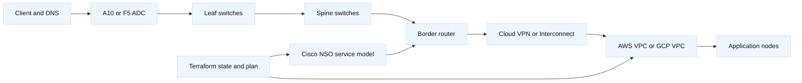

# 1. Topology and Lab Contracts

## A. Reference topology



## B. Platform inventory and evidence

| Component | Example role | Primary owner | Success evidence |
| --- | --- | --- | --- |
| A10 Thunder or F5 BIG-IP | VIP, TLS, pool, monitor, SNAT | ADC platform | effective config, counters, bounded HTTP probe |
| IOS-XE router | WAN/BGP/VRF handoff | network platform | BGP, RIB/FIB, ACL counters |
| NX-OS leaf/spine | underlay and EVPN/VXLAN | fabric platform | ECMP, EVPN routes, VTEP, MTU |
| Linux nodes | backend and test client | lab owner | listener, logs, `curl`, `ss`, `tcpdump` |
| AWS/GCP network | cloud attachment and policy | cloud platform | routes, firewall/SG, flow logs, BGP |
| Cisco NSO | service intent and mapping | automation platform | CDB service, transaction, device diff |
| Terraform | lifecycle and approval boundary | IaC platform | plan, state, policy, drift read |

## C. Lab 1: north-south application edge

Build a VIP on A10 or F5, two backend nodes, a fabric tenant VLAN/VRF, and one
cloud subnet. Terraform owns cloud primitives and declared service inputs;
the selected ADC provider, AS3, or API owns ADC objects. Do not mix F5
individual resources with an AS3 declaration, and do not assume an A10 provider
has the same resource model.

**Deliverables:** dependency graph, listener-to-node packet path, health
contract, TLS termination decision, SNAT/return-route design, plan review, and
cleanup order. Test a healthy node, a drained node, and a failed monitor.

```hcl
# Shape only: use the selected AWS, Google, and ADC provider documentation.
module "edge_contract" {
  source       = "./modules/edge-contract"
  backend_cidr = "198.51.100.0/24"
  health_path  = "/healthz"
  tls_mode     = "terminate-and-reencrypt"
}
```

## D. Lab 2: service intent through NSO

Model an L3VPN service with an IOS-XE router and NX-OS border/leaf. Terraform
sends a stable service key and inputs to NSO. NSO owns YANG validation, mapping,
NED operations, and rendered device configuration. The cloud VPC/TGW or
VPC/Cloud Router remains a Terraform-owned boundary.

Required evidence: validation, generated diff, transaction result, device
read-back, VRF route, BGP state, and bidirectional probe. Inject a timeout after
request delivery and classify the service as absent, pending, committed, or
failed before retrying.

## E. Lab 3: fabric and cloud attachment

Use two spines, two leaves, a border leaf, and Linux nodes. Allocate loopbacks,
point-to-point links, tenant VLAN/VNI, and ASNs deterministically. Add AWS
Transit Gateway or VPN, or GCP HA VPN with Cloud Router. Compare cloud route
propagation, security controls, BGP advertisements, and return paths.

**Verification sequence:** underlay reachability -> BGP/EVPN -> VTEP/VNI -> VRF
RIB/FIB -> cloud routes/firewall -> node listener -> bounded application probe.
A Terraform apply or BGP Established state alone is not completion.

## F. Safe lab workflow

```bash
terraform fmt -check
terraform init
terraform validate
terraform plan -out=lab.tfplan
terraform show -no-color lab.tfplan

# Read-only shapes; adapt to the selected platform and lab image.
ip addr
ss -ltnp
curl --fail --silent --show-error https://vip.example.invalid/healthz
```

Apply only after checking target, ownership, blast radius, credentials, and
cleanup. Preserve plan and read-back output as learning evidence. An accepted
API request followed by failed traffic requires convergence and data-plane
evidence before a rollback decision.
