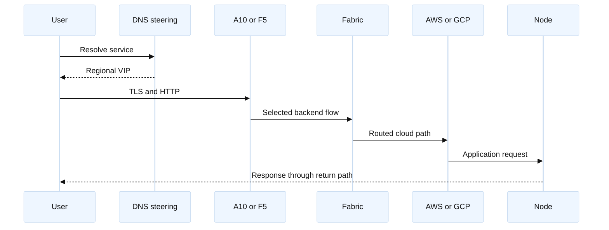
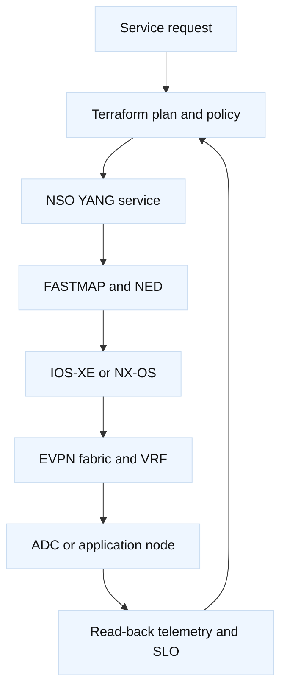

# 3. System Design and Interview Discussions

## A. Design 1: multi-region ADC and cloud edge

Design an Internet-facing service using A10/F5, AWS and GCP backends, Cisco
border routers, a spine-leaf fabric, Linux nodes, and Terraform/NSO.

**SDE2 answer:** define DNS health semantics, VIP/TLS/pool behavior, routing,
security controls, node health, and observability at every hop. Explain
active/active versus active/standby, client-IP preservation, SNAT, and draining.

**Staff answer:** define failure domains, residency, capacity, RTO/RPO, cost,
ownership, gates, and migration. Terraform owns cloud primitives and service
inputs; NSO owns network rendering; ADC automation owns ADC objects. Explain
detection and containment for provider failure, DNS cache, route leak, and ADC
capacity events.

## B. Design 2: self-service L3VPN platform

Customers submit a request. Terraform validates cloud attachment and calls NSO;
NSO maps the service to IOS-XE and NX-OS. The fabric carries tenant traffic to
an ADC or node.

Discuss schema versioning, constraints, idempotency, timeouts, partial device
failure, drift, RBAC, quotas, and deletion. The Staff insight is that the
service API is a product: it needs compatibility policy, support ownership,
metrics, and safe migration.

## C. Interview questions and model discussion points

### C.1 Why not let Terraform configure everything?

Terraform needs stable identity, state, meaningful diff, and read-back. A
controller may own a larger dependency graph and reconcile it. Use one owner
per object layer; do not let Terraform, NSO, NDFC, AS3, and direct CLI rewrite
the same VLAN, VRF, VIP, or policy.

### C.2 What does a plan fail to prove?

It does not prove device convergence, BGP/EVPN state, packet forwarding, cloud
firewall acceptance, node behavior, TLS correctness, or user experience. Pair
plan output with API status, effective configuration, operational state,
logs/counters, and a bounded probe.

### C.3 How do you roll out fabric and ADC changes safely?

Canary one leaf, node, pool member, or region; preserve the known-good plan;
batch by failure domain; set stop thresholds for loss, resets, route churn, MAC
moves, and latency; drain where possible; and verify forward and return paths.
If not reversible, document forward repair before approval.

### C.4 How do AWS and GCP differ?

Both provide VPC-style isolation and managed routing/security primitives, but
route propagation, firewall/security-group semantics, VPN/Interconnect options,
logging, and load-balancer models differ. Name the exact AWS route table/TGW/
VPN or GCP Cloud Router/HA VPN/Interconnect contract rather than copying names.

### C.5 What would you monitor?

Monitor request success/latency, ADC member health, TLS failures, SNAT use,
node saturation, interface drops, BGP/EVPN churn, route counts, NSO transaction
errors, Terraform drift, cloud flow logs, and customer-path SLOs. Alert on
leading indicators as well as provider failures.

## D. Staff follow-up rubric

Score each answer 0–2 for packet/control-plane accuracy, ownership, evidence and
falsifiers, safety/recovery, capacity/cost, and communication. Staff-quality
answers name the owner, failure domain, measurable gate, alternative, and what
would cause forward repair instead of rollback.
