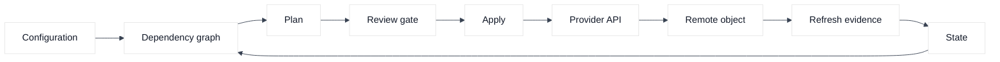
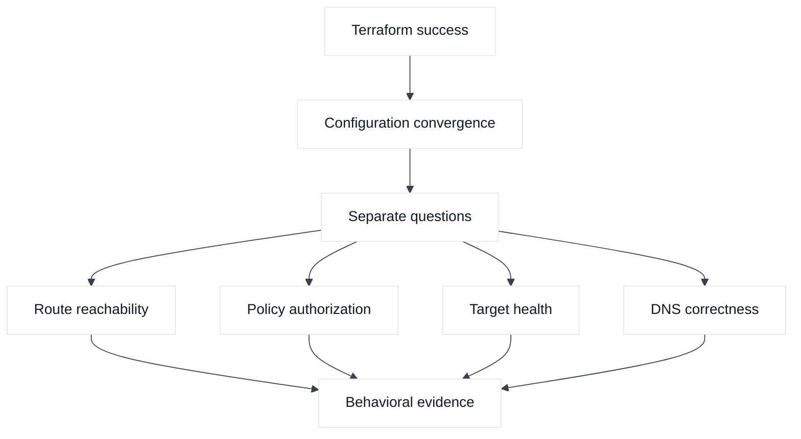
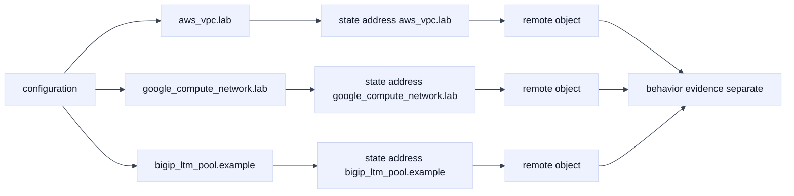

# 01. Terraform Core and Execution Model

## A. Learning objectives

By the end of this module, you should be able to explain Terraform as a declarative reconciliation system rather than as a shell-script replacement. You should be able to identify configuration, provider, state, remote object, and plan as separate artifacts; trace a dependency graph; distinguish refresh, planning, and apply; and explain why a successful API response does not prove that packets, DNS, or an application are healthy.

You should also be able to answer an interview prompt without hiding behind product vocabulary. A strong answer names the desired contract, the observed evidence, the owner of each object, and the point at which a human or an automated gate may stop a change. The examples use AWS, GCP, and F5 BIG-IP, but the portable model comes first.

## B. Prerequisites

Know basic HCL syntax, CIDR notation, a cloud account or project boundary, and the difference between a virtual network, a route, a firewall policy, and a load-balancer listener. You do not need an active account for this module. All identifiers below are placeholders; never paste real credentials, production IDs, or a real BIG-IP address into study notes.

Terraform version constraints and provider versions are intentionally illustrative. Confirm the selected versions in the provider documentation and commit the resulting lock file in a real disposable lab. A plan is a proposed transition, not a health check and not a guarantee that an external system will remain unchanged until apply.

## C. Portable mental model

Terraform evaluates a configuration into a graph of managed objects. A resource block describes an object Terraform is intended to own. A data block reads an object that may be owned elsewhere. A provider translates Terraform operations into an API-specific protocol. State records the relationship between stable Terraform addresses and remote objects, along with selected attributes needed for future planning. The remote system remains the final authority over what exists, but Terraform uses state and refresh to form its view of that system.

There are four useful comparisons:

| Artifact | Main question | Typical owner | What it cannot prove |
|---|---|---|---|
| Configuration | What do we intend? | Repository and reviewers | That the API accepts it or traffic works |
| Provider | How is the intent translated? | Provider publisher and platform team | That every API-side default is modeled |
| State | Which remote object corresponds to which address? | State administrators | That an object was not changed moments later |
| Plan | What transition appears necessary now? | CI plus approver | That credentials, quotas, or dependencies stay valid |

The lifecycle is normally: load configuration, initialize providers, read state, refresh selected remote attributes, evaluate expressions, construct a dependency graph, produce a plan, review the plan, and apply the approved transition. During apply, Terraform may create, update, or destroy nodes in dependency order. A provider can return success while a load balancer has no healthy targets, a firewall blocks a dependency, or an F5 declaration is accepted asynchronously but has not completed.

### Diagram 1: configuration to remote system



The graph is not a packet path. It orders infrastructure operations. A dependency edge such as “route table after network” does not prove that a route has a usable next hop or that return traffic is permitted.

### Diagram 2: convergence is not service health



The command result is one signal among several. Interview answers should name the other signals and the source from which each is collected.

## D. AWS, GCP, and F5 mapping

**Fact:** In AWS, a resource may represent a VPC, subnet, route table, or security group through the AWS provider. **Vendor terminology:** an AWS VPC is a regional virtual network boundary, while subnets are placed in availability zones. **Inference:** separating network foundation state from application edge state usually makes review and recovery easier, because a listener change should not require a network-wide plan.

**Fact:** In GCP, the Google provider can model a VPC network, regional subnet, firewall rule, or Cloud Router-related object. **Vendor terminology:** a VPC network has global scope while subnets are regional. Do not infer that a GCP route-table association behaves exactly like an AWS subnet route-table association. Compare scope and ownership before translating a design.

**Fact:** The F5 BIG-IP provider can model selected BIG-IP objects, including LTM resources, and can submit an AS3 declaration. **Vendor terminology:** an AS3 declaration is a declarative application-service payload. **Inference:** an individual `bigip_*` resource and an AS3 declaration should have disjoint ownership; if both manage the same virtual server, Terraform may report drift or repeatedly overwrite the other controller’s work.

## E. Terraform examples and walkthrough

### E.1 AWS setup and use

The following deliberately small configuration demonstrates three provider configurations. It is not a complete deployable stack. Credentials are injected by the environment or an approved identity mechanism; they are not arguments in the file.

```hcl
terraform {
  required_version = ">= 1.6, < 2.0"

  required_providers {
    aws = {
      source  = "hashicorp/aws"
      version = "~> 6.0"
    }
    google = {
      source  = "hashicorp/google"
      version = "~> 7.0"
    }
    bigip = {
      source  = "F5Networks/bigip"
      version = "~> 1.28"
    }
  }
}

provider "aws" {
  region              = var.aws_region
  allowed_account_ids = [var.disposable_aws_account_id]
}

provider "google" {
  project = var.gcp_project_id
  region  = var.gcp_region
}

provider "bigip" {
  address  = var.f5_address
  username = var.f5_username
  password = var.f5_password
  # Verify the certificate through the provider's supported CA setting.
}

resource "aws_vpc" "study" {
  cidr_block           = "10.20.0.0/16"
  enable_dns_support   = true
  enable_dns_hostnames = true
  tags = { Name = "study-only" }
}

resource "google_compute_network" "study" {
  name                    = "study-only"
  project                 = var.gcp_project_id
  auto_create_subnetworks = false
}

data "bigip_system_info" "study" {}
```

For AWS, the concrete setup is the VPC resource and its provider guard. In a disposable account, verify the caller and target region before planning:

```hcl
resource "aws_vpc" "aws_example" {
  provider   = aws
  cidr_block = "10.21.0.0/16"
  tags       = { Name = "terraform-study-aws" }
}
```

```bash
aws sts get-caller-identity
terraform plan -out=aws-study.tfplan
```

### E.2 GCP setup and use

For GCP, create a custom-mode network in the explicitly selected project. A network alone does not create a regional subnet or permit application traffic:

```hcl
resource "google_compute_network" "gcp_example" {
  provider                = google
  name                    = "terraform-study-gcp"
  project                 = var.gcp_project_id
  auto_create_subnetworks = false
}
```

```bash
gcloud config get-value project
gcloud projects describe "${GCP_PROJECT_ID_PLACEHOLDER}"
terraform plan -out=gcp-study.tfplan
```

### E.3 F5 setup and use

For F5, the provider read is a management-plane setup example. Supply a trusted CA through the supported provider configuration and use a disposable partition; do not disable certificate verification:

```hcl
data "bigip_system_info" "f5_example" {
  provider = bigip
}
```

```bash
terraform plan -out=f5-study.tfplan
# Verify the read in the BIG-IP audit log and protect plan output.
```

The following smaller block is a second HCL example showing how a resource reference creates a graph edge. The subnet depends on the VPC ID, while the tags are metadata and do not create network reachability. The CIDR is reserved for a disposable lab.

```hcl
resource "aws_subnet" "study_app" {
  vpc_id            = aws_vpc.study.id
  cidr_block        = "10.20.10.0/24"
  availability_zone = var.aws_availability_zone
  tags              = { Name = "study-app" }
}

output "study_app_subnet_id" {
  value = aws_subnet.study_app.id
}
```

The output is a useful handoff to another module, but it is not a guarantee that routes, policy, or the application are usable. Run the plan first and verify the account, Region, and state owner. If this is later connected to a route table or NAT gateway, the cost and mutation boundary changes and requires a new review.

The AWS block creates a VPC only; it does not create a subnet or internet path. The GCP block creates a custom-mode VPC; it does not create a regional subnet. The F5 data source reads information and should not be mistaken for a safe connectivity probe. A useful interview explanation calls out these incomplete boundaries instead of claiming that “the network is ready.”

For a disposable, read-oriented workflow, the command sequence is:

```bash
terraform fmt -check
terraform init
terraform validate
terraform plan -out=plan.tfplan
terraform show -no-color plan.tfplan
# APPLY_AFTER_REVIEW_ONLY: review the saved plan and target boundary first.
terraform apply plan.tfplan
```

The command is illustrative. Use a temporary directory, an isolated AWS account, a disposable GCP project, and a non-production BIG-IP partition. Never use `-auto-approve` in a learning workflow. Never put a password in `*.tf`, `*.tfvars`, shell history, a screenshot, or an unprotected plan artifact. A saved plan can contain sensitive values and topology.

## F. Plan, state, and ownership analysis

Suppose a plan shows `aws_vpc.study` changing because a tag was added, while a subnet is being replaced because its CIDR changed. The tag may be an in-place update; the subnet replacement may destroy routes, addresses, and dependent interfaces. Read the action symbols, then inspect dependent addresses and provider replacement behavior. Do not treat all green “changes” as equally safe.

State addresses are identity handles. Renaming `aws_vpc.study` to `aws_vpc.foundation` without a move instruction can make Terraform propose destroy/create even when the remote VPC is unchanged. The configuration says one thing, state says another, and the plan is the reconciliation of that mismatch. The right remedy is an intentional address move, not a blind apply.

Ownership also exists outside Terraform. A cloud platform team may own the VPC, an application team may own a security group, and an F5 team may own the partition or AS3 tenant. A data source is appropriate for a read-only dependency when another system owns the object. A resource block is appropriate only when this state is meant to control its lifecycle. The strongest design documents both ownership and the handoff interface, such as an output containing a subnet ID or a DNS name.

## G. Failure evidence and falsifiers

| Hypothesis | Evidence to collect | Falsifier |
|---|---|---|
| The provider cannot authenticate | Redacted init/plan error, identity audit record, selected alias | A successful identity lookup under the same role |
| The graph is missing a dependency | Plan ordering, expression references, read-back of object IDs | Explicit dependency exists and remote object is ready |
| Apply succeeded but traffic is broken | Provider response, route/policy evidence, health checks, DNS result | A controlled probe succeeds from the affected source |
| State is stale or wrong | Backend version, refresh result, state address, remote ID | Fresh refresh matches the intended owner and ID |
| F5 accepted but did not finish | AS3/task status and BIG-IP audit log | Completed task plus data-plane validation |

A falsifier matters because an interview answer should change direction when evidence disproves the first theory. “Run apply again” is not diagnosis; it can increase drift or duplicate an unsafe transition.

## H. Safe change, verification, and rollback

Before apply, verify the workspace, account/project, region, provider aliases, state backend, action count, and affected addresses. After apply, read back resource identifiers and run a narrow behavioral probe: resolve a fictional name, connect from an approved test source, inspect a health endpoint, or check an F5 virtual server and pool status. Infrastructure read-back proves configuration convergence only; it does not replace a service-level check.

Rollback depends on the failure. A reversible tag or listener setting may be restored from the prior reviewed configuration. A destroyed subnet or migrated F5 object may require recovery from backups, state history, or a staged reconstruction. Do not promise universal rollback. Put a change stop in the plan: if the action count, replacement set, account, or health evidence differs from the review, stop and investigate. A later corrective plan is often safer than trying to reverse an ambiguous partial apply.

## I. Exercises

### Exercise 1: graph and plan review

In 15 minutes, draw the graph for a VPC, subnet, route, security policy, load balancer, F5 pool, and DNS record. Mark each node as resource, data source, or external owner. Then review a hypothetical plan that replaces the subnet and updates the DNS record. Identify three questions you would ask before approval and state the evidence that would answer each.

### Exercise 2: failed apply investigation

A GCP firewall resource reports success, but the application cannot reach a service behind an F5 virtual server. Produce an evidence sequence that separates provider convergence, route reachability, policy authorization, F5 listener state, pool health, and DNS correctness. Include one falsifier for each layer and state when you would stop further changes.

## J. Interview questions and direct answers

### J.1 What does Terraform state do?

**Answer:** State maps Terraform addresses to remote object identities and stores attributes used to compare intended and observed values. It lets Terraform recognize that a resource already exists and calculate changes. It is not a complete inventory, application-health record, or authorization boundary.

**SDE2 focus:** Explain configuration, refresh, state, plan, and apply as distinct steps.

**Staff extension:** Define state ownership, encryption, access logging, recovery, concurrency, and how teams prevent two states from controlling the same object.

### J.2 Why is a plan not a guarantee?

**Answer:** A plan is calculated from a point-in-time configuration, state, provider behavior, credentials, quotas, and remote observations. Any of those can change before or during apply. External controllers can also mutate objects after Terraform reads them.

**SDE2 focus:** Mention refresh and stale plans.

**Staff extension:** Add a freshness boundary, saved-plan review, lock strategy, account guardrails, and post-apply behavioral verification.

### J.3 What is the difference between a resource and a data source?

**Answer:** A resource declares lifecycle ownership; Terraform may create, update, or destroy it. A data source reads an object that is normally owned elsewhere or is discovered as input. Using a resource for a shared object creates competing ownership, while using a data source for an object that must be managed leaves lifecycle gaps.

**SDE2 focus:** Give one AWS VPC or GCP subnet example.

**Staff extension:** Explain ownership contracts and how outputs, APIs, or service catalogs form a controlled handoff.

### J.4 What does a dependency graph guarantee?

**Answer:** It orders Terraform operations based on explicit and inferred references. It does not guarantee that a route is reachable, a health check passes, DNS has propagated, or an asynchronous F5 task has completed. Those require separate evidence.

**SDE2 focus:** Distinguish operation ordering from data-plane health.

**Staff extension:** Identify hidden dependencies, eventual consistency, external controllers, and the validation gates that make them visible.

### J.5 How would you explain AWS, GCP, and F5 in one design?

**Answer:** I would define the portable request and ownership boundaries first, then map an AWS or GCP network and an F5 edge to those boundaries. I would state scope differences, provider aliases, credentials, and which state owns each object. I would not claim equivalent semantics from similar names.

**SDE2 focus:** Show a small provider configuration and trace one dependency.

**Staff extension:** Defend state separation, migration ownership, blast-radius limits, and a rollback interface across organizations.

### J.6 What do you do when apply partially succeeds?

**Answer:** Stop, preserve the error and plan, inspect state and remote objects, determine which actions completed, and compare the intended owner with the actual owner. Then run a fresh plan or refresh-only analysis where appropriate. I choose recovery or a corrective change based on evidence, not by blindly rerunning apply.

**SDE2 focus:** Identify completed and incomplete resources.

**Staff extension:** Define incident authority, change freeze, state backup, customer impact assessment, and the conditions for resuming safely.

## K. References and evidence labels

- **Fact:** [Terraform language and workflow documentation](https://developer.hashicorp.com/terraform/docs).
- **Vendor terminology:** [AWS provider registry](https://registry.terraform.io/providers/hashicorp/aws/latest/docs), [Google provider registry](https://registry.terraform.io/providers/hashicorp/google/latest/docs), and [F5 BIG-IP provider](https://registry.terraform.io/providers/F5Networks/bigip/latest/docs).
- **Inference:** Separate state by ownership and failure domain when a shared plan would make review or recovery ambiguous. Verify this choice with the service owners, account/project boundaries, provider versions, and tested recovery procedures.

## L. Deep-dive extensions: graph, state, and observable behavior

### L.1 A small configuration with three ownership boundaries

The following is intentionally executable-looking but remains safe because every value is a placeholder, no credentials are embedded, and the examples are written for a reviewed plan rather than an automatic apply. The important interview skill is not memorizing resource names; it is identifying which provider call owns which object and what evidence must exist before a change is allowed.

```hcl
terraform {
  required_version = ">= 1.6, < 2.0"

  required_providers {
    aws = { source = "hashicorp/aws", version = "~> 6.0" }
    google = { source = "hashicorp/google", version = "~> 7.0" }
    bigip = { source = "F5Networks/bigip", version = "~> 1.28" }
  }
}

provider "aws" {
  alias               = "lab"
  region              = var.aws_region
  allowed_account_ids = ["000000000000"]
}

provider "google" {
  alias   = "lab"
  project = var.gcp_project_id
  region  = var.gcp_region
}

provider "bigip" {
  address             = var.bigip_address
  username            = var.bigip_username
  password            = var.bigip_password # Inject outside the source tree.
  login_ref           = "/Common/example-login"
  no_f5_teem          = true
}

resource "aws_vpc" "lab" {
  provider             = aws.lab
  cidr_block           = "198.51.100.0/24"
  enable_dns_hostnames = true
  tags                 = { Name = "example-terraform-lab" }
}

resource "google_compute_network" "lab" {
  provider                = google.lab
  name                    = "example-terraform-lab"
  auto_create_subnetworks = false
}
```

Provider blocks establish endpoints; resources establish lifecycle ownership. Use external, short-lived credentials and never place secrets or plan artifacts in the source tree.

### L.2 Read a plan as a set of hypotheses

Suppose a reviewed plan contains this excerpt:

```text
  # aws_vpc.lab will be updated in-place
  ~ resource "aws_vpc" "lab" {
      ~ enable_dns_hostnames = false -> true
        id                   = "vpc-EXAMPLE"
    }

  # google_compute_network.lab will be created
  + resource "google_compute_network" "lab" {
      + auto_create_subnetworks = false
      + name                    = "example-terraform-lab"
    }

  # bigip_ltm_pool.example will be replaced
  -/+ resource "bigip_ltm_pool" "example" {
      ~ name = "/Common/example-pool" -> "/Common/example-pool-v2"
    }
```

The first action is an in-place AWS control-plane update; it does not prove that DNS resolution from a workload now works. The second is new GCP ownership and may fail if the API is disabled or the project is wrong. The third is a destructive replacement hypothesis: confirm whether the F5 provider schema treats the changed name as immutable, whether the old pool is referenced by a virtual server, and whether a concurrent AS3 declaration owns the same partition. A good review records the expected remote API call, the expected blast radius, and the falsifier for each line.

### L.3 State addresses are bindings, not network paths



The address-to-object binding is not a packet path or health check. This explains why a green plan can coexist with a failed application request.

### L.4 Provider-specific verification and a numerical assumption

Assume a lab owns one AWS account, one GCP project, and one F5 partition. Before reviewing a plan, verify the target identity and scope:

```bash
aws sts get-caller-identity --profile example-lab
gcloud config get-value project
gcloud auth list --filter=status:ACTIVE
curl --fail --silent --show-error --cacert "$BIGIP_CA" \
  -u "$BIGIP_USER:$BIGIP_PASSWORD" \
  "https://bigip.example.invalid/mgmt/tm/sys/global-settings"
terraform providers
terraform plan -out=example.tfplan
```

If 12 actions each have a conservative 2-second propagation window, the baseline is 24 seconds before F5 tasks or retries. This is a timeout-design assumption, not a latency guarantee. An F5 read proves management reachability only; verify partition, audit record, monitor, and safe behavior. Verify AWS/GCP scope and the intended route, policy, DNS, or load-balancer behavior separately.

### L.5 Edge cases and recovery choices

If a provider crashes after creating an object but before recording state, search by name or tag, compare ownership, and import only after configuration matches. If `~` changes to `-/+` after an upgrade, compare the lock file, schema, and replacement field. A pending F5 task needs its final outcome; process exit is not proof.

Destroy only disposable resources with recorded ownership and dependencies. Choose traffic shift, corrective change, or prior configuration based on evidence. State restoration repairs Terraform’s binding; it does not undo a VPC or F5 mutation.

### L.6 Follow-up interview questions

#### What evidence would distinguish a graph-ordering bug from a provider-read bug?

**Answer:** Inspect the graph and dependency references. If the dependent resource was scheduled before its identifier existed, configuration has an ordering defect. If ordering is correct but the provider reports stale attributes, compare logs, state, remote API output, and provider version. Check AWS account/region, GCP project/scope, and F5 partition/task status. A completed dependency edge falsifies an ordering hypothesis.

#### How would you make a cross-provider plan review safe?

**Answer:** Separate credentials and state by ownership where failure or approval boundaries differ, then pass only stable outputs across the boundary. If one state is justified, require explicit provider aliases, account/project/device assertions, a saved plan, a concurrency lock, and provider-specific behavioral gates. The review should identify which actions can succeed independently and what recovery is possible if the third provider is unavailable. A Staff-level answer also names service owners, approval expiry, audit evidence, and a stop-the-line rule for unexpected replacement.

#### What does a successful `apply` actually prove?

**Answer:** It proves that Terraform and the provider reported successful control-plane operations for the actions they attempted, subject to provider and remote API semantics. It does not prove end-to-end routing, DNS, authorization, TLS, monitor success, application readiness, or SLO health. I would read back identifiers, inspect provider and service logs, and run a safe behavioral probe from an allowed test location. For F5, I would additionally verify the task result and data-plane object status; for AWS and GCP, I would verify the selected scope and effective network policy.
