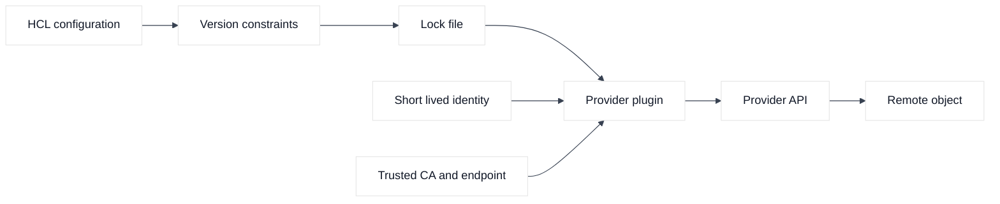
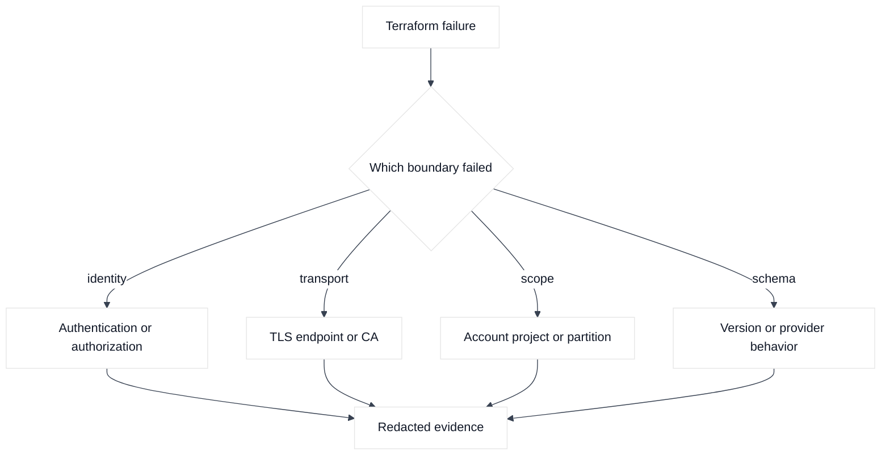
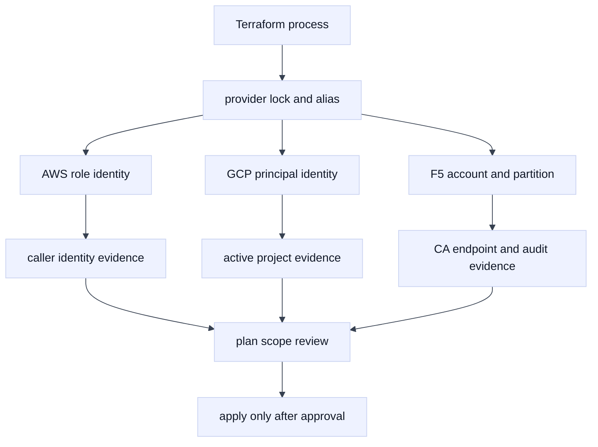

# 02. Providers, Versions, and Authentication

## A. Learning objectives

This module teaches how Terraform provider selection and authentication affect correctness, reproducibility, and blast radius. You will learn to distinguish the Terraform CLI from a provider plugin, constrain and lock provider versions, use aliases for regions or projects, and select short-lived credentials for AWS, GCP, and F5 BIG-IP. You will also practice explaining why a provider upgrade, identity change, or certificate decision is an infrastructure change even when the HCL is unchanged.

The interview goal is not memorizing provider argument names. It is showing that you can make provider behavior visible, prevent an operation in the wrong account or project, and produce evidence that the identity used by CI was the identity reviewed by the team.

## B. Prerequisites

Read Module 01 first. Know the difference between authentication and authorization, a cloud account and a region, a GCP project and a region, and a BIG-IP management endpoint and traffic endpoint. Understand environment variables at a high level. Do not use personal long-lived keys for the examples, and do not disable TLS verification to “make the provider work.”

Provider version constraints in this module are examples only. Major versions, authentication fields, and service support change. Select a version deliberately, run initialization in a disposable directory, review the lock file, and test the exact provider build used by CI.

## C. Portable mental model

Terraform core parses configuration and asks provider plugins to validate schemas, read objects, and perform operations. The `source` address identifies the provider namespace; the version constraint defines acceptable versions; `.terraform.lock.hcl` records the selected package checksums. A lock file improves reproducibility, but it does not make a bad version or unsafe provider behavior safe.

Authentication answers “who is making the API call?” Authorization answers “what may that identity do?” Transport trust answers “should this endpoint certificate be accepted?” These must be diagnosed separately. A permission denial is not fixed by changing a certificate setting; a certificate failure is not fixed by granting administrator access.

Aliases make intent explicit when one configuration needs more than one endpoint or scope. An AWS primary and disaster-recovery region, two GCP projects, and a BIG-IP management address should have named providers. The resource or module must select the alias intentionally. An implicit default provider can silently point at the wrong boundary if environment variables change.

### Diagram 1: provider resolution and identity



The provider plugin is a translator and an API client. It is not the identity authority, the policy engine, or the service health system.

### Diagram 2: diagnose the provider boundary



The error class determines the next evidence request. Granting broader permissions is not an appropriate response to a certificate or provider-schema failure.

## D. AWS, GCP, and F5 mapping

**Fact:** The AWS provider supports profiles, environment-based credentials, role assumption, and web-identity patterns depending on the selected workflow. **Vendor terminology:** `allowed_account_ids` is an AWS provider guard that can fail if the resolved account is not on the allow-list. **Inference:** an account allow-list is a useful last-mile safety check, but it must not replace IAM least privilege or a CI identity review.

**Fact:** The Google provider can use Application Default Credentials and workload-identity-based flows. **Vendor terminology:** the `project` and `region` settings determine important operation scope, while some GCP resources are global and others regional. **Inference:** make project selection explicit in provider configuration and validate it in CI before plan approval.

**Fact:** The F5 BIG-IP provider connects to a management endpoint and can authenticate with credentials or an approved token mechanism supported by the selected release. **Vendor terminology:** BIG-IP partitions and provider/API compatibility affect what an identity can see and change. **Inference:** use a dedicated disposable partition and a trusted CA path; never teach users to bypass certificate verification.

## E. Terraform examples and walkthrough

### E.1 AWS setup and use

The following configuration gives each boundary a named provider. Version ranges and names are placeholders and must be verified before use.

```hcl
terraform {
  required_version = ">= 1.6, < 2.0"

  required_providers {
    aws = {
      source  = "hashicorp/aws"
      version = "~> 6.0"
    }
    google = {
      source  = "hashicorp/google"
      version = "~> 7.0"
    }
    bigip = {
      source  = "F5Networks/bigip"
      version = "~> 1.28"
    }
  }
}

provider "aws" {
  alias               = "primary"
  region              = var.aws_primary_region
  allowed_account_ids = [var.disposable_aws_account_id]
  assume_role {
    role_arn = var.aws_ci_role_arn
  }
}

provider "aws" {
  alias               = "recovery"
  region              = var.aws_recovery_region
  allowed_account_ids = [var.disposable_aws_account_id]
  assume_role {
    role_arn = var.aws_ci_role_arn
  }
}

provider "google" {
  alias   = "platform"
  project = var.gcp_platform_project
  region  = var.gcp_region
}

provider "bigip" {
  alias    = "lab"
  address  = var.f5_management_address
  username = var.f5_username
  password = var.f5_password
  # Supply a supported CA file or bundle. Do not set insecure TLS bypass.
}

resource "aws_vpc" "primary" {
  provider   = aws.primary
  cidr_block = "10.31.0.0/16"
  tags       = { Name = "provider-study" }
}

resource "google_compute_network" "platform" {
  provider                = google.platform
  name                    = "provider-study"
  auto_create_subnetworks = false
}

data "bigip_system_info" "lab" {
  provider = bigip.lab
}
```

This second HCL example shows a module receiving an alias explicitly. The child module must declare the matching `configuration_aliases` entry; the caller should not rely on an ambient developer default. It is a composition example, not a complete module distribution.

```hcl
module "recovery_network" {
  source = "./modules/recovery-network"

  providers = {
    aws = aws.recovery
  }

  vpc_cidr = "10.32.0.0/16"
  labels   = { Owner = "training" }
}
```

Before planning this module, verify that the recovery alias points to the intended account and Region. A successful module call can still create a wrong-target VPC if the alias, role, or account guard is incorrect. Review the child module's provider requirements and keep its state ownership documented.

The aliases are not decoration. They make an AWS recovery resource, GCP platform resource, or F5 lab read explicit at the call site. In a module, declare `configuration_aliases` and pass providers from the caller; otherwise Terraform may select an unintended default.

### E.2 GCP setup and use

Use a safe initialization and identity-review sequence:

```bash
terraform init -upgrade=false
terraform providers
terraform version
terraform fmt -check
terraform validate
terraform plan -out=plan.tfplan
terraform show -no-color plan.tfplan
```

For AWS, the identity may come from CI web identity or an assumed role. A separate, redacted identity check can confirm the caller before Terraform runs:

```bash
aws sts get-caller-identity --output json
```

For GCP, use the approved ADC or workload identity and confirm the active project without placing a token in a command line:

```bash
gcloud auth list
gcloud config get-value project
gcloud projects describe "${GCP_PROJECT_ID_PLACEHOLDER}"
```

### E.3 F5 setup and use

For F5, use a lab endpoint and a supported read-only or narrowly scoped identity. The exact CLI is release-dependent; a conceptual verification should be performed through the provider’s read path or the device’s documented API, then correlated with the BIG-IP audit log. Do not print passwords or bearer tokens.

## F. Plan, state, and ownership analysis

Provider selection becomes part of resource identity in practice because the same logical resource address can point at different endpoints through aliases. A moved resource across aliases deserves a plan review; it may be an adoption or replacement event, not a harmless refactor. A module should expose a narrow interface and require the caller to provide the correct provider, rather than discover a target from an ambient developer configuration.

The lock file records selected provider packages and checksums. Review lock-file changes like code: identify the reason, release notes, compatibility tests, and rollback version. A provider upgrade can change schema defaults, validation, refresh behavior, or replacement decisions. A successful `terraform init` proves package installation and checksum verification, not that a later plan is semantically safe.

Authentication material can also appear in state, logs, or plan output if a provider or resource returns sensitive values. Use remote-state encryption and access controls, redact logs, and treat plan artifacts as sensitive. A secret manager can provide credentials, but the secret manager itself does not confer application authorization unless the identity is allowed to read it.

## G. Failure evidence and falsifiers

| Hypothesis | Evidence | Falsifier |
|---|---|---|
| Wrong AWS account | Redacted caller identity and provider alias | Caller account matches the approved allow-list |
| Wrong GCP project | Provider config, active project, resource self-link | Resource self-link is in the intended project |
| Provider schema mismatch | Terraform and provider versions, init output | Lock file and runtime versions match tested build |
| Credential lacks permission | API error code and audit event | Same identity can perform the documented read |
| TLS trust failure | Endpoint name, certificate chain, CA configuration | Read succeeds with the approved CA bundle |
| F5 partition is wrong | Provider partition, audit record, object path | Object path and audit event show intended partition |

The evidence should be collected without dumping environment variables or tokens. A falsifier narrows the diagnosis; it is not merely another log line.

## H. Safe change, verification, and rollback

For provider changes, the safe unit is not just the `.tf` diff. Review the lock-file diff, provider aliases, target account/project/partition, action count, and any resource replacements. Run a read-only plan under the same identity and environment used by the eventual apply. If a provider upgrade changes the plan unexpectedly, stop and compare schema, defaults, and release notes before approval.

Rollback can mean restoring the previous lock file and provider version, reverting configuration, or recovering remote objects. It cannot always mean “downgrade and reapply,” because an API-side migration may be irreversible. Keep a state backup according to the backend policy, preserve the exact plan and provider package, and verify the device or cloud service after recovery. For F5, an accepted declaration or API task may need device-specific recovery rather than a second Terraform apply.

## I. Exercises

### Exercise 1: identity boundary review

Given a plan that creates an AWS VPC in an unknown account, a GCP firewall in a developer project, and reads an F5 object from `/Common` instead of the lab partition, write the pre-approval checks. Include the exact evidence you would redact, the check that should fail, and the least-privilege correction.

### Exercise 2: provider upgrade investigation

A lock-file update causes a GCP firewall to be replaced and an F5 resource to fail schema validation. In 20 minutes, design a reproduction matrix using the old and new providers, identify which artifact is authoritative, and state a rollback decision that does not destroy remote objects.

## J. Interview questions and direct answers

### J.1 Why use a provider lock file?

**Answer:** It records the selected provider package and checksums so different runs resolve the intended build consistently. It improves reproducibility and supply-chain review, but it does not validate architectural correctness or prevent a provider from making a harmful change.

**SDE2 focus:** Explain constraints versus the selected lock-file version.

**Staff extension:** Describe upgrade ownership, compatibility tests, staged rollout, provenance review, and how teams recover if the provider changes a plan.

### J.2 How do you prevent Terraform from using the wrong AWS account?

**Answer:** Use an explicit provider region and alias, an account allow-list, a least-privilege assumed role, and a pre-plan caller-identity check. CI should make the target visible and fail closed when the identity or account differs from the reviewed target.

**SDE2 focus:** Show `allowed_account_ids` and `aws sts get-caller-identity`.

**Staff extension:** Add organization-level guardrails, separate state and roles, approval evidence, and a policy that prevents cross-environment credentials.

### J.3 What is the difference between authentication and authorization?

**Answer:** Authentication identifies the caller; authorization decides what that caller may do. A valid token can still receive an access-denied response, and a powerful identity can still fail if it cannot establish a trusted TLS connection to the endpoint.

**SDE2 focus:** Separate the error classes and evidence.

**Staff extension:** Design short-lived identity issuance, audience restrictions, audit correlation, revocation, and break-glass controls.

### J.4 When do provider aliases matter?

**Answer:** They matter when one configuration targets multiple regions, projects, accounts, or devices. Aliases make the boundary explicit and prevent ambient configuration from selecting the wrong endpoint. Modules should declare and receive aliases intentionally.

**SDE2 focus:** Give an AWS primary/recovery example.

**Staff extension:** Explain how aliases, separate states, and ownership boundaries limit blast radius during migrations.

### J.5 How should F5 authentication be handled?

**Answer:** Use a dedicated lab or service identity, environment-injected or short-lived credentials where supported, a trusted management certificate, and the narrowest partition permissions needed. Never place passwords in HCL or disable TLS verification as a workaround.

**SDE2 focus:** Verify the endpoint, partition, and read access.

**Staff extension:** Define credential rotation, audit ownership, provider/TMOS compatibility, emergency access, and how state and logs are protected.

### J.6 What do you review in a provider upgrade?

**Answer:** I review the constraint and lock-file diff, release notes, schema changes, default changes, replacement actions, authentication behavior, and tests against disposable AWS, GCP, and F5 boundaries. An unexpected plan is a stop signal until explained.

**SDE2 focus:** Compare old and new plans.

**Staff extension:** Establish a compatibility matrix, staged provider promotion, owner sign-off, and a recovery path that accounts for irreversible API migrations.

## K. References and evidence labels

- **Fact:** [Terraform provider requirements](https://developer.hashicorp.com/terraform/language/providers/requirements) and [dependency lock file](https://developer.hashicorp.com/terraform/language/files/dependency-lock).
- **Vendor terminology:** [AWS provider](https://registry.terraform.io/providers/hashicorp/aws/latest/docs), [Google provider](https://registry.terraform.io/providers/hashicorp/google/latest/docs), and [F5 provider](https://registry.terraform.io/providers/F5Networks/bigip/latest/docs).
- **Inference:** Explicit aliases, account/project guards, and short-lived identities reduce accidental scope; validate them against the organization’s IAM policy, provider release, and device RBAC model.

## L. Deep-dive extensions: provider identity and reproducibility

### L.1 Resolve one provider configuration deliberately

Provider selection is part of the change boundary. A configuration can be syntactically valid while resolving to the wrong account, project, region, or BIG-IP management endpoint. The following example makes the intended targets visible without embedding a secret:

```hcl
variable "aws_region" { type = string, default = "us-west-2" }
variable "gcp_project_id" { type = string, default = "example-lab-project" }
variable "gcp_region" { type = string, default = "us-west1" }
variable "bigip_address" { type = string, default = "bigip.example.invalid" }
variable "bigip_username" { type = string, sensitive = true }
variable "bigip_password" { type = string, sensitive = true }

provider "aws" {
  alias               = "recovery"
  region              = var.aws_region
  allowed_account_ids = ["000000000000"]
  default_tags { tags = { Environment = "example-recovery" } }
}

provider "google" {
  alias   = "recovery"
  project = var.gcp_project_id
  region  = var.gcp_region
}

provider "bigip" {
  address             = var.bigip_address
  username            = var.bigip_username
  password            = var.bigip_password
  validate_certs      = true
  login_ref           = "/Common/example-recovery"
  no_f5_teem          = true
}
```

Defaults are fictional; supply sensitive variables externally using role assumption, workload identity, or a secret broker. Use a trusted CA and a dedicated F5 account or partition. Fix certificate trust instead of disabling validation.

### L.2 Lock-file and plan-diff interpretation

Review `.terraform.lock.hcl` as an input to reproducibility, not as proof that the provider is safe. A lock-file diff that changes only checksums may reflect a platform package; a diff that changes the selected version can change schemas, defaults, authentication, or replacement behavior. For example:

```text
  # provider registry.terraform.io/hashicorp/aws will be upgraded
  ~ version = "6.2.0" -> "6.3.0"
  # resource aws_security_group.example has no configuration change
  ~ egress = [known after apply]
```

The second line is a review question, not approval. Explain the new unknown value, compare release notes, run `terraform providers lock` on intended platforms, and create a disposable plan. If AWS, GCP, or F5 test targets differ, stop and regenerate under a controlled version.

### L.3 Identity evidence across three systems



The key is that authentication evidence and authorization evidence are separate. A token can be valid but lack permission, and permission can be present while TLS trust or endpoint routing is broken.

### L.4 Verification and a bounded retry calculation

Use read-only checks before a plan and after any provider error:

```bash
aws sts get-caller-identity --profile example-lab
aws configure list --profile example-lab
gcloud auth list --filter=status:ACTIVE
gcloud config list --format='yaml(core.project,compute.region)'
curl --fail --silent --show-error --cacert "$BIGIP_CA" \
  -u "$BIGIP_USER:$BIGIP_PASSWORD" \
  "https://bigip.example.invalid/mgmt/shared/identified-devices/config/device-info"
terraform version
terraform providers
```

Assume a 5% transient-failure rate and two retries. Under independence, three failures are `0.05 x 0.05 x 0.05 = 0.000125`, or 0.0125%. This illustrates probability, not permission to blindly retry: record the address and remote identifier first. AWS/GCP may be eventually consistent; F5 may return an accepted task. Verify the object before retrying.

### L.5 Authentication and version edge cases

An AWS role can be assumed successfully but be constrained by an organization policy, region deny, or resource condition. A GCP principal can authenticate while the selected project lacks the API or quota needed by the resource. An F5 account can read `/Common` but lack permission in the application partition, or the device can reject a provider request because the TMOS/AS3 capability differs from the provider version. In each case, classify the failure as endpoint, authentication, authorization, schema, quota, or remote-state ambiguity before changing configuration.

If a provider upgrade changes an attribute from optional to computed, do not hide the resulting plan with `ignore_changes`. If an alias is removed, state addresses can still refer to resources created by the old provider configuration; preserve the old alias until those objects are migrated or destroyed. If a credential expires mid-run, preserve the plan and logs, reauthenticate through the approved path, verify whether any remote actions completed, and run a fresh plan. Never paste tokens into debug output or plan artifacts.

### L.6 Follow-up interview questions

#### How would you prove that a plan used the intended AWS account and GCP project?

**Answer:** I would make account and project explicit in provider configuration, use `allowed_account_ids` for AWS, and run caller-identity and active-project checks in the same CI context that creates the plan. I would record the account/project values beside the plan metadata and fail if they differ from the reviewed target. For GCP I would also verify API enablement and regional scope. The Staff extension is to separate roles and states by environment, prevent ambient credentials, and make the target visible in approvals and audit logs.

#### Why is a provider lock file necessary but insufficient?

**Answer:** It makes provider selection and checksums reproducible across runs, reducing accidental upgrades. It does not validate provider behavior against a particular AWS account, GCP API state, BIG-IP/TMOS release, quota, policy, or credential scope. I would review the lock diff, test the selected version in disposable boundaries, compare plans, and retain a recovery path. A locked provider can still make a valid but harmful change if the configuration or target identity is wrong.

#### What do you do when the same configuration works in AWS but fails in F5?

**Answer:** I would not infer provider parity. I would classify the F5 failure by endpoint, TLS, account/partition RBAC, provider schema, TMOS/AS3 compatibility, asynchronous task result, and object ownership. Then I would verify the exact resource path and audit output with read-only calls. The AWS result is evidence about AWS only. A safe resolution may be a provider-specific module, an AS3 declaration boundary, or a staged handoff rather than a shared abstraction that hides different semantics.
