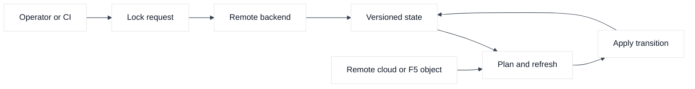
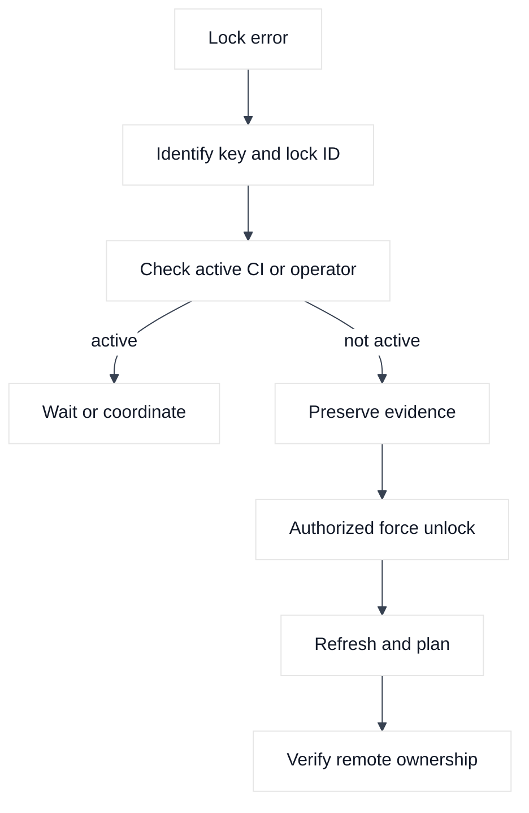
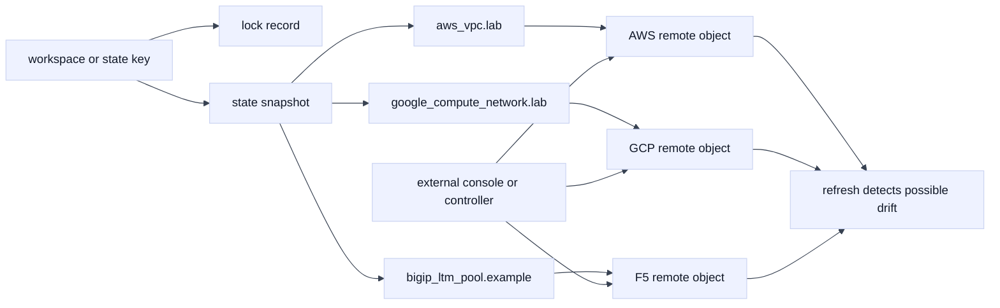

# 03. State Backends, Locking, and Workspaces

## A. Learning objectives

This module explains how Terraform state is stored, protected, serialized, and shared. You will learn why state contains sensitive topology and sometimes sensitive values, what a backend does, why locking prevents concurrent writers but does not make a plan fresh, and when separate state files are safer than workspaces. You will compare AWS-oriented object storage and GCP-oriented object storage patterns, then apply the same reasoning to F5 BIG-IP state.

By interview time, you should be able to design an environment boundary, troubleshoot a stale lock without deleting a live lock blindly, recover from a bad state operation, and explain the difference between state recovery and infrastructure rollback. Staff-level answers must include ownership, access, auditability, incident authority, and the cost of making a state mistake.

## B. Prerequisites

Complete Modules 01 and 02. Understand resource addresses, provider aliases, identity, and the difference between desired configuration and observed remote objects. You should know basic object-storage concepts such as bucket, encryption, versioning, and access policy. The backend snippets are patterns, not commands to run against a real bucket.

Use disposable accounts, projects, and a dedicated F5 partition for exercises. Never commit a state file, plan artifact, backend credential, or real endpoint to this repository. A backend migration is a state mutation and must have an approved backup and recovery procedure.

## C. Portable mental model

State is a coordination artifact. It records resource addresses, remote IDs, selected attributes, dependencies, and provider metadata so Terraform can compare configuration with remote observations. It may reveal network topology, hostnames, account identifiers, security rules, and provider-returned sensitive values. Encrypt it in transit and at rest, restrict access, log access, and retain recoverable versions.

A backend provides storage and often locking. Locking prevents two writers from applying state transitions simultaneously when the backend supports it. It does not prevent an operator from changing the remote object through another tool, and it does not make a saved plan valid forever. State isolation is the larger design question: which resources change together, who may read the state, and what is the maximum recovery blast radius?

Workspaces can separate state instances for the same configuration, but a workspace name is not automatically a security boundary, account boundary, or ownership boundary. Separate directories, repositories, backends, roles, or state files may be clearer when environments have different owners, policies, or failure domains. Use the smallest unit that still permits coherent dependency management.

### Diagram 1: state coordination



The backend protects state coordination. It does not own the truth of the remote service, and it cannot ensure that an F5 controller, cloud console, or another Terraform state will not change the object.

### Diagram 2: lock incident decision path



Force-unlock is the last step in this path, not the first. A lock removal cannot reverse a partially completed remote operation.

## D. AWS, GCP, and F5 mapping

**Vendor terminology:** A common AWS-oriented pattern stores state in S3 with encryption, versioning, and a locking mechanism selected for the Terraform and provider workflow. Confirm current Terraform and backend documentation before choosing a lock implementation. **Inference:** a dedicated bucket prefix, restrictive IAM role, and recovery-tested object versioning are more important than copying an old snippet verbatim.

**Vendor terminology:** A GCP-oriented pattern stores state in a GCS bucket with uniform access, encryption, retention or versioning controls, and a narrowly scoped service identity. **Fact:** a GCS bucket is not inherently a safe Terraform backend merely because it is remote. **Inference:** separate projects or prefixes according to ownership and recovery boundaries, then test lock contention and restoration.

**Fact:** F5 provider state can expose virtual servers, pools, members, partitions, addresses, and declaration metadata. **Inference:** the state protection standard for an F5 management plane should be comparable to cloud state, even when the objects are in a lab. Do not let an AS3 declaration state and individual-resource state own the same partition objects.

## E. Terraform examples and walkthrough

### E.1 AWS setup and use

This provider-specific setup focuses on the AWS object-storage backend and its state-protection controls.

An AWS-oriented backend shape might look like this. It intentionally uses placeholders and omits credentials.

```hcl
terraform {
  backend "s3" {
    bucket       = "example-tfstate-placeholder"
    key          = "networking/study.tfstate"
    region       = "us-example-1"
    encrypt      = true
    use_lockfile = true # Verify support for the selected Terraform release.
  }
}
```

The bucket must be created and protected through an approved bootstrap process. Configure versioning, restrictive access, audit logging, and a recovery owner. Do not put access keys in the backend block. Backend initialization may require credentials before provider initialization, so the bootstrap identity and its permissions deserve a separate review.

### E.2 GCP setup and use

A GCP-oriented pattern is:

```hcl
terraform {
  backend "gcs" {
    bucket = "example-tfstate-placeholder"
    prefix = "networking/study"
  }
}
```

The GCS bucket should use the organization’s approved encryption, retention, access, and versioning settings. `prefix` is an organization convention, not a substitute for IAM isolation. Decide whether one project should host state for many environments or whether project separation better matches recovery and access boundaries.

```bash
gcloud storage buckets describe "gs://example-tfstate-placeholder"
terraform init
terraform workspace show
```

### E.3 F5 setup and use

This provider-specific setup focuses on protecting and inspecting state for F5-managed objects.

For a F5 state discussion, the provider can be configured in the same root module while state remains in a protected backend:

```hcl
provider "bigip" {
  address  = var.f5_management_address
  username = var.f5_username
  password = var.f5_password
}

resource "bigip_ltm_pool" "study" {
  name                = "/Tenant_STUDY/pool_example"
  partition           = "Tenant_STUDY"
  load_balancing_mode = "round-robin"
}
```

This is an ownership example, not a complete service. The partition is fictional. The state can reveal the object path even if the password is marked sensitive. If AS3 owns `Tenant_STUDY`, do not add an individual pool resource for the same pool.

```bash
terraform state list
terraform state show 'bigip_ltm_pool.study'
# Correlate the read with the BIG-IP audit log; never print credentials.
```

Useful read-oriented commands include:

```bash
terraform init
terraform workspace list
terraform workspace show
terraform state list
terraform state show 'aws_vpc.study'
terraform plan -refresh-only -out=refresh.tfplan
```

Run `state show` and `show` only where the output can be protected. Do not paste unredacted output into an issue. A lock error should first be correlated with the current CI run, process, backend object, and timestamp. Use force-unlock only after an authorized owner confirms that no Terraform process is active and the lock ID is exact. A lock is not a nuisance to delete casually.

## F. Plan, state, and ownership analysis

State should be segmented around change coupling. A network foundation may export a VPC ID, subnet IDs, or a shared DNS zone identifier to an application state. The application state should consume those outputs or a service contract rather than reading the foundation’s state with broad credentials if a narrower interface is available. Conversely, splitting every resource into its own state can create unreviewable orchestration and fragile dependency passing.

When a plan says a resource will be created although the remote object exists, ask whether the state is missing, the address changed, the provider identity points to a different account/project/device, or the object was created outside the declared ownership boundary. Import may be appropriate, but only after ownership confirmation. State surgery can repair a mapping, but it cannot decide who should own a production object.

Locking controls concurrent writes to one state. It does not coordinate two different states managing one security group, a cloud load balancer, or an F5 tenant. Cross-state ownership requires architectural boundaries, policy, and read-back validation. A successful lock acquisition therefore proves coordination for that backend key, not global exclusivity.

## G. Failure evidence and falsifiers

| Hypothesis | Evidence | Falsifier |
|---|---|---|
| Lock is stale | Lock ID, owner, CI run, timestamp, process status | Active apply still owns the lock |
| Wrong state key | Backend config, workspace, state object path | Intended key contains the resource address |
| State is corrupted | Backend version history, parse/read error, last successful plan | Previous version reads and matches remote IDs |
| Another state owns the object | State inventories, audit logs, owner registry | Only this approved state references the object |
| Backend access is denied | Identity audit and storage policy result | Same identity can read the exact state object |
| Refresh shows drift | Provider read, console/API audit, state diff | Remote attributes match after refresh |

A falsifier must be specific. “The bucket looks fine” does not disprove a wrong prefix, workspace, role, or stale local cache.

## H. Safe change, verification, and rollback

Before backend migration or state edits, export or preserve a recoverable version according to policy, record the exact source and destination, and restrict the migration identity. Run a plan before and after the move without changing remote objects. Verify resource addresses and remote IDs, then perform a read-only refresh. Do not combine backend migration with a large infrastructure change.

For a lock incident, stop duplicate applies, identify the owner, and communicate a change freeze. For a bad state write, restore a known-good state version only with an authorized procedure, then run a refresh-only plan and compare every affected object. Restoring state does not restore a deleted subnet or a changed F5 virtual server. Infrastructure recovery may require a separate plan, backup, or service-specific procedure.

## I. Exercises

### Exercise 1: design a state boundary

Design states for an AWS VPC, GCP application project, shared DNS service, and F5 edge partition. For each state, name its owner, backend key, role, outputs, lock scope, and maximum blast radius. Explain why a workspace is or is not sufficient for each boundary.

### Exercise 2: lock and drift tabletop

A CI run has held a lock for 45 minutes, a developer reports a manual F5 change, and a second plan shows an AWS security-group drift. Build the evidence timeline. Decide which action is safe first, when force-unlock is permitted, and how you will distinguish state recovery from infrastructure rollback.

## J. Interview questions and direct answers

### J.1 Why is remote state preferred in a team?

**Answer:** It gives the team a shared, access-controlled, recoverable state location and can coordinate concurrent writers. It still requires encryption, least privilege, versioning, audit logs, and an ownership design. Remote does not mean public or automatically safe.

**SDE2 focus:** Explain shared state and locking.

**Staff extension:** Define backend tenancy, recovery objectives, access review, incident authority, and how state exposure is treated as a security event.

### J.2 Does a lock prevent drift?

**Answer:** No. A lock serializes writers for one state key. A console operator, another state, an external controller, or an F5 administrator can still change the remote object. Refresh and ownership controls are needed to detect and prevent drift.

**SDE2 focus:** Give a manual security-group change example.

**Staff extension:** Design global ownership enforcement, audit correlation, drift policy, and a response that distinguishes intentional emergency change from unauthorized mutation.

### J.3 When should you use separate states instead of workspaces?

**Answer:** Use separate states when environments have different owners, credentials, lifecycle, recovery boundaries, policy, or failure domains. Workspaces can be useful for similar instances with the same structure and controls, but their names are not a substitute for security isolation.

**SDE2 focus:** Compare development and production.

**Staff extension:** Explain dependency contracts, state fan-out, operational burden, and how to prevent a convenience split from creating hidden coupling.

### J.4 How do you handle a lock error?

**Answer:** Identify the exact backend key and lock ID, find the owning run, check whether it is active or dead, preserve evidence, and coordinate with the owner. Only an authorized operator should force-unlock an exact stale lock after confirming no writer is active.

**SDE2 focus:** Do not delete a lock blindly.

**Staff extension:** Define the escalation path, timeout policy, safe automation, audit record, and recovery if the original process may have partially applied.

### J.5 What does state recovery restore?

**Answer:** It restores Terraform’s mapping and recorded attributes. It does not automatically reverse remote API mutations, recreate deleted objects, or prove application health. After recovery, perform a controlled refresh and plan, then choose infrastructure recovery based on evidence.

**SDE2 focus:** Separate state and remote-object recovery.

**Staff extension:** Include state version retention, RTO/RPO, customer impact, ownership authority, and a tested reconstruction path.

### J.6 Why should F5 state receive the same protection as cloud state?

**Answer:** It can expose management endpoints, partitions, virtual servers, pools, members, and application topology. Those details can be sensitive even when credentials are not present. Access should be least privilege, encrypted, audited, and separated by ownership.

**SDE2 focus:** Mention partition and AS3 ownership.

**Staff extension:** Design provider/API compatibility controls, tenant isolation, declaration boundaries, audit retention, and recovery for an asynchronous device change.

## K. References and evidence labels

- **Fact:** [Terraform state documentation](https://developer.hashicorp.com/terraform/language/state), [backends](https://developer.hashicorp.com/terraform/language/backend), and [workspaces](https://developer.hashicorp.com/terraform/language/state/workspaces).
- **Vendor terminology:** [AWS S3 backend](https://developer.hashicorp.com/terraform/language/backend/s3), [GCS backend](https://developer.hashicorp.com/terraform/language/backend/gcs), and [F5 provider](https://registry.terraform.io/providers/F5Networks/bigip/latest/docs).
- **Inference:** Segment state by ownership and recovery boundary; validate the chosen backend controls, retention, locking behavior, and incident process in a disposable environment.

## L. Deep-dive extensions: state safety under contention

### L.1 What state contains and why the boundary matters

State maps addresses to provider associations, remote identifiers, and observed attributes. It can expose AWS routes, GCP project shape, or F5 partitions and pools even when fields are marked sensitive. Encrypt it, restrict readers, retain versions, and treat plan output as sensitive.

An educational backend configuration can show the shape without pointing at a real account:

```hcl
terraform {
  backend "s3" {
    bucket         = "example-terraform-state"
    key            = "network/example-lab.tfstate"
    region         = "us-west-2"
    use_lockfile   = true
    encrypt        = true
    dynamodb_table = "example-terraform-locks" # Verify backend-version support.
  }
}

# Alternative GCS shape; select one backend, never both.
# terraform {
#   backend "gcs" {
#     bucket = "example-terraform-state"
#     prefix = "network/example-lab"
#   }
# }
```

The names are placeholders; do not create them from this document. Bootstrap the backend separately, grant CI access explicitly, and back up before migration. Storage, locking, and authorization all matter.

### L.2 A state address is not a workspace safety boundary



The lock protects writers to the selected state key; it does not lock the AWS account, GCP project, or F5 device. A workspace name also does not create independent credentials or a complete security boundary. Separate state keys are preferable when owners, approvals, failure domains, or recovery objectives differ.

### L.3 Lock contention, stale locks, and an explicit calculation

Assume a CI run normally holds a lock for 8 minutes, a second run waits 10 minutes, and the backend reports a lock older than 30 minutes. The age alone is not enough to force unlock. First identify the exact state key and lock ID, inspect the CI run, and confirm that no process can still write. If a run is active, cancel or coordinate with its owner. If it is dead and the backend history shows no active writer, an authorized operator may force-unlock that exact lock, preserving the audit record.

If five engineers independently start plans and each has a 20% chance of attempting an apply in a 10-minute window, the chance of at least two competing writers is `1 - (0.8^5 + 5 x 0.2 x 0.8^4) = 26.24%`. The number is only an assumption-based illustration. It supports a design discussion about CI serialization, not a promise of actual contention. Plans can often run concurrently when they do not write state, but applies and refreshes must follow backend semantics.

Verification commands should be read-oriented:

```bash
terraform workspace show
terraform state list
terraform providers
terraform plan -refresh-only -out=example-refresh.tfplan
aws s3api head-object --bucket example-terraform-state \
  --key network/example-lab.tfstate --profile example-lab
gcloud storage objects describe gs://example-terraform-state/network/example-lab/default.tfstate
curl --fail --silent --show-error --cacert "$BIGIP_CA" \
  -u "$BIGIP_USER:$BIGIP_PASSWORD" \
  "https://bigip.example.invalid/mgmt/tm/ltm/pool/~Common~example-pool"
```

Do not print backend contents or credentials into a terminal transcript. For F5, compare the state address with the partition-qualified object path and device audit log; a state lock cannot prevent an administrator or AS3 from changing the same object.

### L.4 Edge cases and recovery decisions

If a lock exists but state is missing, investigate permissions, key construction, and bootstrap; never initialize a similar key. Unexpected serials require CI and backend-history comparison. If a workspace points at production, stop before refresh and correct the backend selection.

For corrupted state, preserve the current object, identify later remote actions, restore a known backend version, then run refresh-only reconciliation. This does not restore AWS routes, GCP firewalls, or F5 pools. After AS3 changes, choose import, ownership removal, or migration; never force two writers.

Cleanup means deleting only disposable backend objects after all dependent states and audit records are retired. A state bucket or GCS prefix can be more important than the lab resources because it contains recovery history. Keep retention long enough to satisfy the stated recovery objective and remove only exact temporary locks after authorization.

### L.5 Follow-up interview questions

#### What would you do if a lock has been held for an hour and the owner is unreachable?

**Answer:** Identify the exact state key and lock ID, inspect the CI system for an active or detached run, check backend version history, and preserve the evidence. I would escalate to the state owner or incident authority. Only after proving the writer is dead would I force-unlock the exact lock, then run a fresh plan and inspect for partial remote changes. The Staff answer includes an expiry policy, safe cancellation, audit trail, and a tested recovery procedure rather than an automatic timeout that can create two writers.

#### Why might separate state be safer than a single multi-provider state?

**Answer:** AWS, GCP, and F5 may have different owners, credentials, asynchronous behavior, maintenance windows, and recovery paths. A single state couples unrelated failure domains and can make a partial apply harder to recover. Separate states can exchange stable outputs through reviewed interfaces, with explicit ordering and behavioral gates. The trade-off is more coordination and potential stale outputs, so the platform needs ownership documentation, versioned contracts, and a migration plan.

#### How do you respond when a lock is free but the remote object is still changing?

**Answer:** Treat the remote system as a second concurrency domain. Check audit logs, service controllers, AWS/GCP operation status, or the F5 task and declaration state. Wait for quiescence or coordinate with the other owner, then generate a fresh plan. A free Terraform lock only says no writer currently holds that state key; it does not prove the remote API has reached a stable state or that the object is exclusively owned.
