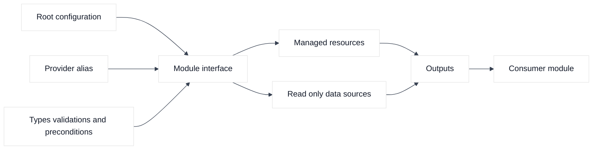
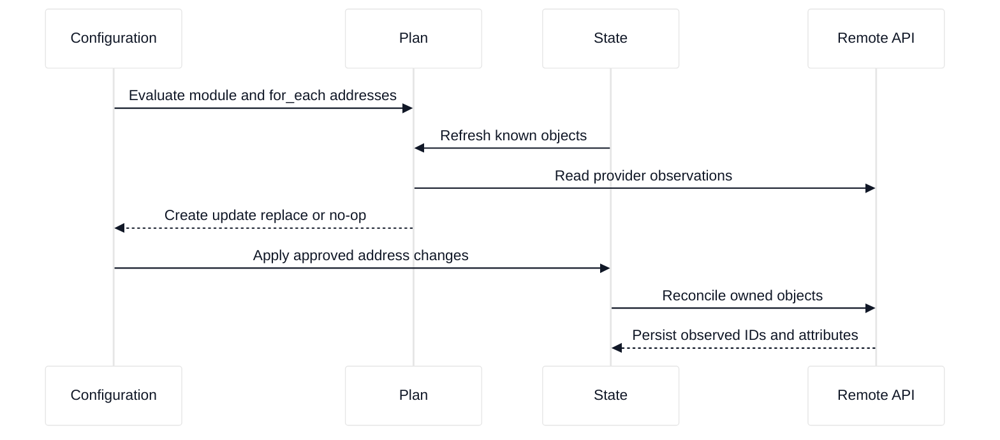
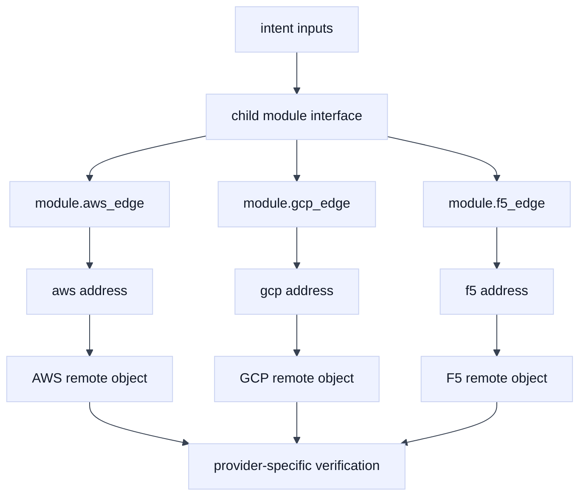

# 04. Resources, Data Sources, Modules, and Composition

## A. Learning objectives

By the end of this module, you should be able to distinguish managed resources, read-only data sources, variables, locals, outputs, and modules. You should be able to use stable `for_each` keys, provider aliases, typed interfaces, validation, and explicit ownership boundaries. You should also be able to design a small composition that maps a common application-edge intent to AWS, GCP, and F5 implementations without pretending that provider schemas or network scopes are interchangeable.

The interview goal is more than writing valid HCL. An SDE2 candidate should explain what each block owns and how Terraform will address it. A Staff candidate should explain module contracts, blast radius, compatibility, migration, support ownership, and how a platform prevents two controllers from managing the same object.

## B. Prerequisites

Read [Terraform core and the execution model](01-terraform-core-and-execution-model.md), [state and locking](03-state-backends-locking-and-workspaces.md), and the repository's [cloud networking primitives](../book/topics/37-cloud-networking-primitives.md). Know how a VPC, subnet, route, firewall policy, load balancer, and F5 virtual server relate to a request path. The examples use fictional names, documentation address space, and placeholder IDs. Do not run them against a production account, project, or device.

## C. Portable mental model

### C.1 A composition has an interface

A resource represents a lifecycle Terraform should manage. A data source reads an object that is normally managed elsewhere or discovered as an input. A module groups resources behind variables, outputs, provider configurations, and invariants. A good module documents what it creates, what it assumes, which provider scopes it needs, what it cannot verify, and which team owns the remote objects.





### C.2 Ownership determines resource versus data

If a network team owns an AWS VPC, an application module should consume its ID rather than declare another VPC resource. If a platform team owns a GCP shared VPC, the application may read the network and create only permitted service-project objects. If AS3 owns an F5 application tenant, an individual `bigip_ltm_pool` resource must not also own that pool. Importing an object into a new state is an ownership transfer, not a harmless lookup.

### C.3 Stable addresses preserve identity

`count` creates positional addresses. Removing the first element can make every later object appear to move. `for_each` uses keys that describe identity and normally survives reordering. Changing a key still changes the Terraform address and may require a `moved` block. Do not use mutable display labels, secrets, or user-controlled unvalidated strings as identity keys.

## D. AWS, GCP, and F5 mapping

| Composition need | AWS example | GCP example | F5 example |
| --- | --- | --- | --- |
| Managed edge | `aws_lb`, listener, target group | forwarding rule, backend service | LTM virtual server, pool, member |
| Read central network | VPC or subnet data source | VPC or subnetwork data source | shared self IP, route, or partition object |
| Provider scope | account and region alias | project and region alias | device, partition, and provider alias |
| Handoff output | ARN, ID, DNS name | self link, IP, URI | virtual-server or pool path |

**Vendor terminology:** AWS VPCs, GCP VPC networks, and F5 partitions are not equivalent module scopes. **Fact:** provider resources and data sources have provider-specific schemas. **Inference:** expose portable intent at the root, then isolate provider-specific behavior in child modules rather than forcing the least-common denominator to hide important differences.

## E. Terraform examples and walkthrough

### E.1 AWS setup and use

### E.1 Stable `for_each` resources

```hcl
variable "aws_subnets" {
  type = map(object({ cidr = string, az = string }))
}

resource "aws_subnet" "app" {
  for_each          = var.aws_subnets
  vpc_id            = var.aws_vpc_id
  cidr_block        = each.value.cidr
  availability_zone = each.value.az
  tags              = { Name = "app-${each.key}" }
}

output "subnet_ids" {
  value = { for name, subnet in aws_subnet.app : name => subnet.id }
}
```

Run `terraform fmt -check`, `terraform validate`, `terraform plan -out=aws-composition.tfplan`, and `terraform show -no-color aws-composition.tfplan`. Verify a placeholder with `aws ec2 describe-subnets --subnet-ids subnet-EXAMPLE123 --region us-west-2`. The plan and API read establish identity and configuration, not route reachability or workload health.

### E.2 AWS data-source boundary

```hcl
data "aws_vpc" "shared" {
  id = var.shared_vpc_id
}

module "edge" {
  source = "./modules/aws-edge"
  vpc_id = data.aws_vpc.shared.id
}
```

This module consumes a central VPC. It must not silently add routes, change the CIDR, or destroy the VPC. Review the module's IAM and outputs as an interface. If the network owner changes the VPC, the consumer should receive a controlled output change or service-contract update, not discover the change during a destructive apply.

### E.2 GCP setup and use

### F.1 Provider-mapped module

```hcl
provider "google" {
  alias   = "app"
  project = var.app_project_id
  region  = var.gcp_region
}

module "app_subnet" {
  source    = "./modules/gcp-subnet"
  providers = { google = google.app }
  name      = "app-west"
  network   = var.shared_vpc_self_link
  cidr      = "10.245.0.0/20"
}
```

Run `terraform providers`, `terraform plan -out=gcp-composition.tfplan`, and `gcloud compute networks subnets describe app-west --region REGION-EXAMPLE --project PROJECT-EXAMPLE`. GCP's VPC network can be global while its subnet is regional; make that scope visible in variables and module documentation. A plan in the wrong project can be perfectly valid, so verify the project number and audit identity.

### F.2 GCP read-only network dependency

```hcl
data "google_compute_network" "shared" {
  name    = var.shared_network_name
  project = var.host_project_id
}

module "app_firewall" {
  source  = "./modules/gcp-firewall"
  network = data.google_compute_network.shared.self_link
  project = var.app_project_id
}
```

The host-project and service-project boundary should be an explicit platform contract. A successful data read does not prove that workloads have IAM, firewall, route, or service-attachment access.

### E.3 F5 setup and use

### G.1 Individual-resource module

```hcl
variable "members" {
  type = map(object({ address = string, port = number }))
}

resource "bigip_ltm_pool" "this" {
  name                = "/Tenant_STUDY/${var.pool_name}"
  load_balancing_mode = "round-robin"
  monitors            = ["/Common/tcp"]
}

resource "bigip_ltm_pool_attachment" "member" {
  for_each = var.members
  pool     = bigip_ltm_pool.this.name
  node     = "/Tenant_STUDY/${each.key}"
  port     = each.value.port
}
```

Run `terraform plan -out=f5-composition.tfplan`, inspect every partition-qualified path, and verify with a sanctioned `tmsh list` or read-only API request. A module should document whether it creates nodes or consumes nodes as data. Never place the same pool in an AS3 declaration and an individual-resource module.

### G.2 F5 alias and handoff

```hcl
provider "bigip" {
  alias          = "dr"
  address        = var.f5_dr_address
  token          = var.f5_dr_token
  validate_certs = true
}

module "dr_edge" {
  source    = "./modules/f5-edge"
  providers = { bigip = bigip.dr }
  pool_name = "dr-edge"
  members   = var.dr_members
}
```

Run `terraform providers` and confirm the device and partition in the plan. An alias is not a failover mechanism; promotion still needs traffic steering, health evidence, and an owner.

## F. Desired, observed, state, and plan analysis

Suppose a module changes from `count` to `for_each`. Desired configuration has keys `blue` and `green`, state has `aws_subnet.app[0]` and `[1]`, observed infrastructure has two healthy subnets, and the plan proposes destroying and recreating both. The remote objects are not necessarily wrong; Terraform identity changed. Use reviewed `moved` blocks or supported state migration and require a plan showing no remote replacement.

A data source creates a different analysis. Desired configuration says “consume the shared object,” observed data says “this ID and scope were returned,” state records the read dependency, and plan may be empty. None of these facts prove that a GCP firewall permits traffic or that an F5 monitor is green. Outputs should state what they prove: an identifier or endpoint, not application health.

## G. Failure evidence and falsifiers

| Symptom | Leading hypothesis | Evidence | Falsifier |
| --- | --- | --- | --- |
| Reordering causes replacements | Positional `count` identity | State addresses and plan actions | Stable keys or reviewed moves preserve identity |
| Module creates a central network | Resource used where a data source was required | Module source, state, owner ledger | Network owner explicitly delegated lifecycle |
| GCP module targets wrong project | Provider alias was omitted or miswired | `terraform providers`, plan, audit log | Alias, project number, and IAM event agree |
| F5 pool is duplicated | AS3 and individual resources co-own it | Declaration, state, device audit | One writer owns the exact object path |
| Output exists but service fails | Output proves control-plane identity only | DNS, route, policy, monitor, probe | End-to-end request succeeds |

## H. Safe change, verification, and rollback

Version module interfaces, validate types and CIDRs, require meaningful keys, and add preconditions for scope and ownership. Review address changes separately from remote changes. For refactoring, add `moved` blocks, plan against a locked state, and confirm that only Terraform addresses move. After apply, read each provider object and run a behavioral probe. If a module abstraction hides a provider-specific safety property, split the implementation rather than adding a misleading boolean. Roll back code when the previous owner and state addresses remain valid; otherwise use forward recovery.

## I. Exercises

### K.1 Composition design drill

Design an `application_edge` interface with AWS, GCP, and F5 implementations. Inputs should include protocol, backend identity, health-check intent, owner, and provider scope. Outputs should include an endpoint and verification hints. Explain which fields cannot be portable, how aliases are passed, and how the design prevents AS3 and individual resources from co-owning objects.

### K.2 Refactoring drill

A subnet module changes from `count` to `for_each`; the plan proposes replacing eight subnets. Write the address migration, the evidence needed from AWS or GCP, the plan acceptance criteria, and the rollback decision. Extend the answer to an F5 pool whose Terraform address changed while the device path did not.

## J. Interview questions and direct answers

### L.1 When should a module use a data source instead of a resource?

**Answer:** Use a data source when another owner manages the object and this module needs read-only information. Use a resource when this state is responsible for lifecycle. Importing a shared object into the module without agreement creates competing ownership.

**SDE2 focus:** Show the HCL difference and explain state consequences.

**Staff extension:** Define ownership, access, change interfaces, drift expectations, and migration when the central team changes the object.

### L.2 Why is `for_each` often safer than `count`?

**Answer:** `for_each` uses stable keys, so list reordering does not change identity. Changing a key is still an address migration and can cause replacement unless handled explicitly.

**SDE2 focus:** Read a plan and identify positional churn.

**Staff extension:** Set naming and migration standards that preserve identity across teams and provider scopes.

### L.3 What makes a module interface good?

**Answer:** It exposes intent, types, ownership, provider aliases, invariants, outputs, and failure assumptions without hiding important blast radius. It accepts provider-specific differences where they affect behavior.

**SDE2 focus:** Use typed variables, outputs, and validation.

**Staff extension:** Treat the module as a platform contract with compatibility, deprecation, observability, and support ownership.

### L.4 How do you pass a provider alias safely?

**Answer:** Declare the provider requirement in the child module, pass an explicit `providers` map at the call site, and verify with `terraform providers` and the plan. Avoid implicit alias selection from arbitrary strings.

**SDE2 focus:** Trace one resource to its alias.

**Staff extension:** Separate credentials, scopes, approvals, and failure domains for each alias.

### L.5 Why should F5 AS3 and individual resources not manage the same object?

**Answer:** They have different ownership models and can overwrite each other's declarations during refresh or apply. Choose one writer and make the other side consume outputs or API observations.

**SDE2 focus:** Identify the object path and state address conflict.

**Staff extension:** Design ownership discovery, migration, emergency changes, and reconciliation across declarative boundaries.

### L.6 How do you prevent an output from being mistaken for health?

**Answer:** Name outputs as identifiers or endpoints, document what they prove, and pair them with verification hints for DNS, routes, policy, TLS, monitors, and application checks. Provider read success is control-plane evidence only.

**SDE2 focus:** Add a concrete post-apply probe.

**Staff extension:** Put behavioral checks and SLO gates into the platform workflow without coupling modules to fragile application internals.

## K. References and evidence labels

- **Fact:** [Terraform modules](https://developer.hashicorp.com/terraform/language/modules) and [meta-arguments](https://developer.hashicorp.com/terraform/language/meta-arguments) define module composition, `for_each`, and dependency controls.
- **Vendor terminology:** [AWS provider](https://registry.terraform.io/providers/hashicorp/aws/latest/docs), [Google provider](https://registry.terraform.io/providers/hashicorp/google/latest/docs), and [F5 provider](https://registry.terraform.io/providers/F5Networks/bigip/latest/docs) define resource and data-source schemas.
- **Inference:** Stable keys, explicit ownership, and provider-specific child modules reduce replacement and coordination risk; validate the trade-offs in the target platform.

## L. Deep-dive extensions: interfaces, addresses, and composition

### L.1 A provider-aware module interface

A useful module hides repetitive naming and validation while leaving important provider semantics visible. It should not pretend that AWS security groups, GCP firewall rules, and F5 traffic policies are interchangeable. A safe interface can accept an intent such as `edge_name`, `backend_port`, and `allowed_sources`, then select a provider-specific implementation in a reviewed child module.

```hcl
variable "edge_name" {
  type = string
  validation {
    condition     = can(regex("^[a-z0-9-]{3,30}$", var.edge_name))
    error_message = "Use a fictional lowercase example name."
  }
}

variable "backend_port" {
  type        = number
  default     = 8443
  validation {
    condition     = var.backend_port >= 1024 && var.backend_port <= 65535
    error_message = "Use a non-privileged example port."
  }
}

module "aws_edge" {
  source       = "./modules/aws-edge"
  providers    = { aws = aws.lab }
  edge_name    = var.edge_name
  backend_port = var.backend_port
}

module "gcp_edge" {
  source       = "./modules/gcp-edge"
  providers    = { google = google.lab }
  edge_name    = var.edge_name
  backend_port = var.backend_port
}

module "f5_edge" {
  source       = "./modules/f5-edge"
  providers    = { bigip = bigip.lab }
  edge_name    = var.edge_name
  backend_port = var.backend_port
}
```

The example uses a valid illustrative constraint, but it still requires `terraform fmt` and `terraform validate` in the selected Terraform and provider versions. The module should expose outputs that identify objects, not outputs that claim end-to-end health.

### L.2 Plan interpretation for stable addresses

Consider a prior configuration using `count`:

```text
  # module.edge.aws_security_group.rule[1] will be destroyed
  - resource "aws_security_group_rule" "rule" { cidr_blocks = ["198.51.100.20/32"] }
  # module.edge.aws_security_group.rule[1] will be created
  + resource "aws_security_group_rule" "rule" { cidr_blocks = ["198.51.100.30/32"] }
```

The plan may be correct if the identity really changed, but list reordering can also create positional churn. A `for_each` map makes the key visible:

```hcl
locals {
  sources = {
    health_checker = "198.51.100.20/32"
    operator_lab   = "198.51.100.30/32"
  }
}

resource "aws_security_group_rule" "https" {
  for_each          = local.sources
  type              = "ingress"
  security_group_id = aws_security_group.edge.id
  from_port         = 8443
  to_port           = 8443
  protocol          = "tcp"
  cidr_blocks       = [each.value]
  description       = "Example ${each.key} source"
}
```

Changing `operator_lab` to `maintenance_lab` is an address migration, not merely a label change. Use a `moved` block only when the remote object is intended to remain the same, then inspect the plan for a state move instead of destroy/create. For GCP, a module may manage a network while a data source reads a shared subnet; for AWS, a route table can be owned by one module while a consuming module reads its ID. For F5, an individual-resource module must not read and mutate objects that an AS3 declaration owns.

### L.3 Composition and state-address flow



The interface is a contract for inputs and outputs; it is not a promise that all provider implementations have identical replacement rules, routing semantics, or health signals.

### L.4 Verification, assumptions, and cleanup

Assume a module creates two AWS objects, one GCP object, and one F5 pool, each with a 30-second provider read-back window. The minimum observation window is not automatically 120 seconds: calls may run in parallel, and asynchronous F5 work may extend it. The correct calculation is a dependency-aware critical path. If the F5 pool must exist before a virtual server references it, the path is `pool create + F5 task completion + read-back`, while AWS and GCP branches may run concurrently. State that assumption in the plan review instead of promising a fixed duration.

```bash
terraform validate
terraform providers
terraform plan -out=example-module.tfplan
terraform show -no-color example-module.tfplan
aws ec2 describe-security-groups --group-ids sg-EXAMPLE --profile example-lab
gcloud compute networks describe example-network --project example-lab-project
curl --fail --silent --show-error --cacert "$BIGIP_CA" \
  -u "$BIGIP_USER:$BIGIP_PASSWORD" \
  "https://bigip.example.invalid/mgmt/tm/ltm/pool/~Common~example-pool"
```

If a provider read returns an object under a different address, check aliases and module provider wiring before changing the module. If the remote object was manually changed, decide whether Terraform should restore the declared value, accept an intentional external owner through a data source, or start an adoption/import workflow. Cleanup should follow module ownership: remove only the lab module’s objects, verify references first, and preserve shared network or F5 AS3 objects owned elsewhere. Never use a broad destroy to test module composition.

### L.5 Follow-up interview questions

#### How do you design a module that supports AWS, GCP, and F5 without hiding important differences?

**Answer:** Define a portable intent interface, then implement separate provider-specific modules with explicit provider aliases and documented capability differences. Outputs should be identifiers and connection metadata, not a generic claim that health is equivalent. I would test each implementation against its own provider schema and add a cross-provider acceptance scenario only for behavior that is truly portable. Staff-level design adds version compatibility, ownership, deprecation, and support boundaries.

#### When should a data source replace a resource?

**Answer:** When another owner controls the lifecycle and this module only needs a stable attribute, such as a shared AWS route table, a GCP network, or an F5 pool managed by AS3. Before switching, confirm ownership, read permissions, drift expectations, and failure behavior. A data source does not make the object immutable or healthy; it only removes Terraform lifecycle ownership from this module.

#### A module output changed but no remote resource changed. Is rollback needed?

**Answer:** First identify whether the output is a formatting, address, or dependency change. If downstream consumers use the output as an API contract, a changed value can still be a breaking change even without remote mutation. Compare the state addresses and plan, test consumers, and revert or version the module interface if compatibility is broken. Rollback is a contract decision, not just a remote-resource decision.
