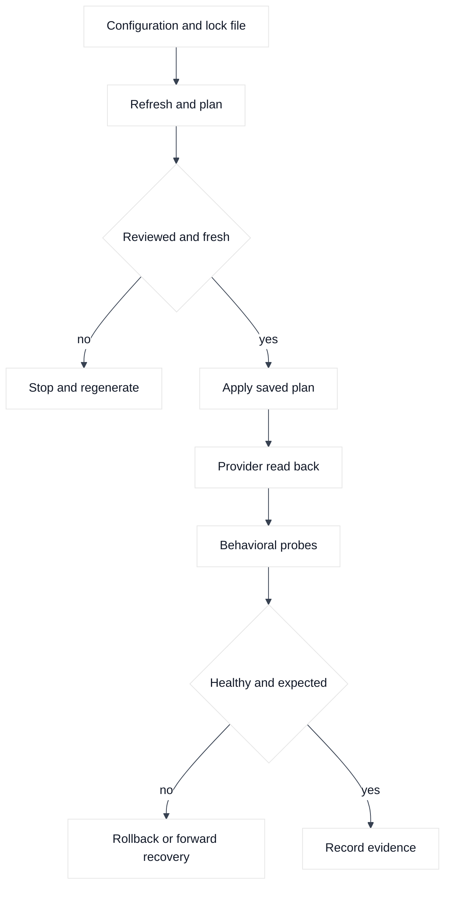
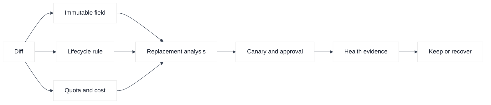
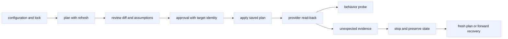

# 05. Plan, Apply, Lifecycle, and Safe Change

## A. Learning objectives

This module teaches you to read a Terraform plan as a proposed transition rather than a list of harmless text changes. You will identify in-place updates, replacements, unknown values, dependencies, lifecycle rules, provider behavior, quota risk, cost, and customer-visible effects. You will design safe changes for AWS, GCP, and F5 BIG-IP with approval, verification, rollback, and explicit stop conditions.

For SDE2 interviews, the expected answer is a precise explanation of the plan and the next evidence query. For Staff interviews, add ownership, blast radius, change coupling, concurrency, SLOs, cost, migration sequencing, and the distinction between rollback and forward recovery.

## B. Prerequisites

Read [Terraform core](01-terraform-core-and-execution-model.md), [state and locking](03-state-backends-locking-and-workspaces.md), and [resources and modules](04-resources-data-modules-and-composition.md). Review the repository's [networking issue cheatsheets](../docs/networking-issue-cheatsheets.md) for evidence-led path debugging. Use only placeholder account IDs, project IDs, device names, certificates, and documentation IP ranges.

Never use a real production target for these examples. Do not use `-auto-approve` in a learning pipeline. Do not use `-target` as normal deployment strategy. Plans and logs can contain topology or sensitive values, so protect them.

## C. Portable mental model

### C.1 A plan is a hypothesis with a freshness boundary

A plan is calculated from configuration, state, provider schemas, credentials, remote observations, and dependency values at one point in time. Unknown values can become known during apply. A saved plan can reduce review ambiguity, but it does not reserve the remote object, freeze quotas, prevent console edits, or guarantee that an asynchronous operation will complete. The approval record should name the state serial, lock, target identity, provider lock, dependency versions, and expiration time.

### C.2 Lifecycle is a trade-off

`create_before_destroy` may reduce downtime, but it can require duplicate addresses, unique names, quota, certificates, and temporary cost. `prevent_destroy` protects important foundations but can block a legitimate migration. `ignore_changes` can coexist with an external owner but can hide security or routing drift. `replace_triggered_by` can make a dependency replacement explicit. Every rule needs a reason, owner, and removal condition.



### C.3 Separate control-plane and behavior checks

An AWS listener can exist while its certificate is wrong. A GCP firewall can exist while a higher-priority policy denies the packet. An F5 virtual server can exist while its pool monitor is red. The correct workflow reads back control-plane objects and then validates DNS, route, policy, TLS, health, identity, and application behavior from the affected source.

### C.4 Diagram 2: replacement and risk review



## D. AWS, GCP, and F5 mapping

| Change type | AWS example | GCP example | F5 example |
| --- | --- | --- | --- |
| Additive | Security-group rule or target registration | Firewall rule or backend attachment | Pool member or monitor association |
| Replacement risk | Subnet or listener immutable field | Forwarding rule or subnet field | Virtual-server address or profile change |
| Read-back | `describe` API, flow logs, DNS, probe | `describe`, firewall logs, routes, probe | API read, monitor, TLS, traffic probe |
| Recovery | Revert HCL or restore prior listener | Revert rule or staged migration | Restore declaration or prior object config |

**Vendor terminology:** the exact field that forces replacement is provider and release-specific. **Inference:** review by packet or request behavior rather than product label. A “listener update” can be additive in one service and disruptive in another.

## E. Terraform examples and walkthrough

### E.1 AWS setup and use

### E.1 Listener with a precondition

```hcl
resource "aws_lb_listener" "https" {
  load_balancer_arn = var.aws_lb_arn
  port              = 443
  protocol          = "HTTPS"
  certificate_arn   = var.aws_certificate_arn

  lifecycle {
    precondition {
      condition     = var.aws_certificate_arn != ""
      error_message = "A reviewed certificate ARN is required."
    }
  }
}
```

Run `terraform plan -out=aws-listener.tfplan` and `terraform show -no-color aws-listener.tfplan`. Verify the account using `aws sts get-caller-identity`, then inspect the listener with `aws elbv2 describe-listeners --load-balancer-arn arn:aws:EXAMPLE --region us-west-2`. Perform a TLS probe with the real server name only in the authorized lab. A listener read does not prove a valid chain, target health, or authorization.

### E.2 Additive security change

```hcl
resource "aws_security_group_rule" "https_dependency" {
  type              = "egress"
  security_group_id = var.aws_security_group_id
  protocol          = "tcp"
  from_port         = 443
  to_port           = 443
  cidr_blocks       = ["198.51.100.0/24"]
  description       = "Interview lab dependency"
}
```

Review the destination, rule ownership, and whether an external controller also manages the group. Use `aws ec2 describe-security-groups --group-ids sg-EXAMPLE --region us-west-2` and flow evidence after a canary. The documentation range is not a reason to skip least privilege.

### E.2 GCP setup and use

### F.1 Firewall priority and target scope

```hcl
resource "google_compute_firewall" "https_to_proxy" {
  name          = "interview-https-to-proxy"
  network       = var.gcp_network_self_link
  direction     = "INGRESS"
  priority      = 900
  source_ranges = ["198.51.100.0/24"]
  target_tags   = ["proxy-lab"]

  allow {
    protocol = "tcp"
    ports    = ["443"]
  }
}
```

Run `terraform plan -out=gcp-firewall.tfplan`, confirm project and network scope, then use `gcloud compute firewall-rules describe interview-https-to-proxy --project PROJECT-EXAMPLE`. Review priority, target tags, route, and higher-level policy. A rule can be present and never match the instance.

### F.2 Replacement thought experiment

If a GCP subnet CIDR must change, existing workloads and routes may prevent a safe in-place update. Design a parallel subnet, migrate workloads, update consumers, verify, and retire the old range only after the owner confirms. Do not use `-target` to force the subnet as a routine shortcut; it can leave dependencies unreconciled.

### E.3 F5 setup and use

### G.1 Pool member lifecycle

```hcl
resource "bigip_ltm_node" "app" {
  for_each = var.f5_members
  name     = "/Tenant_STUDY/${each.key}"
  address  = each.value.address
}

resource "bigip_ltm_pool_attachment" "app" {
  for_each = var.f5_members
  pool     = var.f5_pool_path
  node     = bigip_ltm_node.app[each.key].name
  port     = each.value.port
}
```

Run `terraform plan -out=f5-members.tfplan`, inspect partition paths, and use a sanctioned BIG-IP read to verify nodes and attachments. Check monitor state and a permitted request through the virtual server. A node being enabled is not the same as a healthy application.

### G.2 AS3 declaration boundary

An AS3 declaration can update many virtual servers, pools, profiles, and monitors behind one Terraform resource. Review the rendered declaration and task status; never hide a large diff with `ignore_changes`. Individual `bigip_*` resources and AS3 must have disjoint object ownership. If the declaration task is asynchronous, verify completion in device logs before proceeding to behavior checks.

## F. Desired, observed, state, and plan analysis

For an AWS certificate change, desired says certificate B, observed serves certificate A, state records A, and plan proposes an update. Before approval, verify B covers the hostname, is in the expected account and region, and has a usable trust chain. After apply, read the listener and perform an SNI-aware handshake. If only one client population fails, investigate DNS, edge selection, and certificate propagation rather than rerunning Terraform.

For GCP firewall rules, desired may allow TCP 443, state may be current, and the plan may be empty while a higher-priority deny remains. For F5, desired membership may be present and state current while the monitor is red. An empty plan means Terraform sees no declared difference; it does not mean the request path is healthy.

## G. Failure evidence and falsifiers

| Symptom | Leading hypothesis | Evidence | Falsifier |
| --- | --- | --- | --- |
| Plan shows replacement | Immutable argument or provider schema change | Plan action, provider lock, field diff | Refresh with the tested build shows an in-place update |
| Replacement cannot start | Quota, name collision, or exclusive attachment | API error, quotas, names, dependencies | Temporary capacity and unique names are confirmed |
| Firewall exists but traffic is denied | Priority, target tag, route, or higher policy | Rule-match logs and instance metadata | Packet evidence shows the intended allow matched |
| F5 apply succeeds but service fails | Monitor, profile, route, or pool issue | Device read, monitor, TLS, app probe | End-to-end request succeeds from the affected source |
| Plan is unexpectedly empty | Wrong state, ignored attribute, or read gap | Backend key, lifecycle, refresh, provider schema | Exact object and attribute are read and owned |

## H. Safe change, verification, and rollback

Verify target identity, provider lock, state key, action count, replacement set, quota, cost, dependencies, and owner before apply. Use a saved plan in a bounded window, with no `-auto-approve`, and reject it if state, identity, or provider inputs changed. Apply the smallest safe unit, then read back provider objects and run behavioral probes. Rollback can mean reverting HCL, shifting traffic, disabling a new pool member, restoring an old certificate, or performing forward recovery. State restoration alone does not roll back remote behavior. Preserve plans, API errors, logs, and probe results.

## I. Exercises

### K.1 Plan-review drill

Review a plan that adds an AWS NAT route, changes GCP firewall priority, and replaces an F5 virtual-server profile. For each action, identify immutable fields, customer effect, cost, quota, verification, rollback, and owner. Decide which action must be split into separate changes and what evidence would reject approval.

### K.2 Safe certificate rollout

Design a rollout for a new certificate across an AWS load balancer, GCP proxy, and F5 virtual server. Include preconditions, saved-plan handling, canary traffic, DNS and SNI verification, monitoring, rollback, and cleanup of the old certificate. Explain how you respond if provider apply succeeds but only one resolver population receives the wrong endpoint.

## J. Interview questions and direct answers

### L.1 What does a `+/-` action mean?

**Answer:** Terraform expects to create a replacement and destroy the prior object, usually because an argument is immutable or lifecycle requires replacement. Review ordering, temporary capacity, names, dependencies, and customer impact.

**SDE2 focus:** Identify the triggering attribute and read the dependency context.

**Staff extension:** Decide whether replacement is acceptable, how to stage it, who owns the risk, and what recovery exists if overlap capacity is unavailable.

### L.2 Why is `create_before_destroy` not always safe?

**Answer:** A service may require unique names, scarce IPs, quotas, certificates, or exclusive attachments. Creating first can fail, double cost, or send traffic to an unverified replacement.

**SDE2 focus:** Name a concrete AWS, GCP, or F5 constraint.

**Staff extension:** Model capacity, canary behavior, ownership, and cleanup of the old object.

### L.3 What is a saved plan's freshness boundary?

**Answer:** It is the state, provider lock, target identity, dependency, and time assumptions under which the plan was reviewed. If those change, regenerate and re-review.

**SDE2 focus:** Explain state serial and provider identity.

**Staff extension:** Encode approval expiry and freshness checks in CI with auditable stop conditions.

### L.4 When is `ignore_changes` appropriate?

**Answer:** Only when another declared owner intentionally manages the attribute and the team accepts reduced drift visibility. It is dangerous for security, routing, and availability settings.

**SDE2 focus:** Identify the external writer and remaining managed fields.

**Staff extension:** Define the owner, drift alert, reconciliation cadence, and exit plan.

### L.5 Why is `-target` not normal deployment strategy?

**Answer:** It limits graph evaluation and can leave dependencies, outputs, and drift unreconciled. It is useful for constrained recovery or diagnosis followed by a full plan, not routine sequencing.

**SDE2 focus:** Explain what the target omits.

**Staff extension:** Require incident ownership, evidence, approval, and a follow-up full-plan gate.

### L.6 What is your rollback for infrastructure change?

**Answer:** It depends on the failure: revert code, shift traffic, restore a prior listener or declaration, disable a member, or perform forward recovery. State restoration alone does not reverse a remote API action.

**SDE2 focus:** Give a provider-specific rollback and verification.

**Staff extension:** Separate rollback from recovery, define RTO and safety gates, and test the path before the change.

## K. References and evidence labels

- **Fact:** [Terraform plan](https://developer.hashicorp.com/terraform/cli/commands/plan) and [lifecycle meta-arguments](https://developer.hashicorp.com/terraform/language/meta-arguments/lifecycle) define supported plan and lifecycle behavior.
- **Vendor terminology:** AWS, Google Cloud, and F5 provider schemas determine which fields force replacement; verify the selected provider and service release.
- **Inference:** Freshness checks, behavioral verification, canaries, and explicit rollback decisions are engineering controls around Terraform's reconciliation loop.

## L. Deep-dive extensions: plan semantics and change control

### L.1 Read action symbols with provider context

A plan is most useful when each action is translated into a remote hypothesis. For example:

```text
  # aws_lb_listener.https will be updated in-place
  ~ default_action {
      ~ target_group_arn = "arn:aws:...:tg-old" -> "arn:aws:...:tg-new"
    }

  # google_compute_firewall.example will be replaced
  -/+ resource "google_compute_firewall" "example" {
      ~ name = "example-web" -> "example-web-v2"
    }

  # bigip_as3.application will be updated in-place
  ~ declaration = jsonencode({ ... })
```

The AWS listener update may move new connections while existing connections drain according to the load balancer behavior; verify the actual target health and drain settings. The GCP replacement may create a new policy object, and the old rule may remain effective during an overlap; inspect priority, target tags or service accounts, and the resulting allow surface. The F5 AS3 update may be accepted before the declaration task reaches its final state; inspect the task response, tenant, and resulting virtual server rather than trusting the diff alone.

### L.2 Safe HCL with explicit guardrails

```hcl
resource "aws_lb_listener" "example" {
  load_balancer_arn = var.example_lb_arn
  port              = 8443
  protocol          = "HTTPS"
  certificate_arn   = var.example_certificate_arn

  default_action {
    type             = "forward"
    target_group_arn = var.example_target_group_arn
  }

  lifecycle {
    precondition {
      condition     = var.change_ticket != ""
      error_message = "A reviewed example change ticket is required."
    }
  }
}

resource "google_compute_firewall" "example" {
  name    = "example-allow-health"
  network = var.example_network_self_link
  allow { protocol = "tcp", ports = ["8443"] }
  source_ranges = ["198.51.100.20/32"]
  target_tags   = ["example-edge"]
}

resource "bigip_ltm_pool_member" "example" {
  pool        = "/Common/example-pool"
  name        = "example-member-1"
  address     = "192.0.2.20"
  port        = 8443
  monitor     = "/Common/tcp"
  partition   = "Common"
}
```

All identifiers are fictional inputs. A real configuration should validate that the certificate, network, pool, and member are owned by the same change or are intentionally consumed dependencies. Avoid `-auto-approve` in instructional CI. Save a plan only after the target identity, lock, provider versions, and policy checks are recorded.

### L.3 Change state and approval sequence



Expire approval when state, provider lock, credentials, target scope, or dependencies change. A saved plan is unsafe if the account is repointed or an external controller mutates the object.

### L.4 Assumptions, calculations, and verification

Assume a canary change sends 1% of 2,000 requests per second to a new target. The expected canary rate is `2,000 x 0.01 = 20 requests per second`, but the actual rate may be bursty and the risk depends on concurrent connections, request cost, and error concentration. A plan review should define the observation interval, minimum sample count, error budget threshold, and rollback authority. A 30-second sample at 20 requests per second yields about 600 expected requests; it is not enough to prove rare failures at a 0.1% rate. State the statistical limitation rather than overclaiming confidence.

```bash
terraform show -no-color example.tfplan
terraform plan -refresh-only -out=example-refresh.tfplan
aws elbv2 describe-listeners --load-balancer-arn "$EXAMPLE_LB_ARN" \
  --profile example-lab
gcloud compute firewall-rules describe example-allow-health \
  --project example-lab-project
curl --fail --silent --show-error --cacert "$BIGIP_CA" \
  -u "$BIGIP_USER:$BIGIP_PASSWORD" \
  "https://bigip.example.invalid/mgmt/tm/ltm/pool/~Common~example-pool"
```

For AWS, verify listener rules, target health, security groups, and route reachability. For GCP, verify firewall priority, target scope, route behavior, and effective policy. For F5, verify the pool/member monitor, virtual-server reference, partition, and AS3 task status. These are control-plane and device-state checks; pair them with a safe request through the intended path.

### L.5 Edge cases and rollback choices

`create_before_destroy` can fail when a name, IP, listener, certificate, or F5 virtual address must be unique. `prevent_destroy` can protect a critical object but can also block a needed recovery if the team has no documented exception process. `ignore_changes` can hide an external controller’s security or routing mutation. `-target` may repair one object but leave dependencies stale. In each case, record the exact reason, scope, expiration, and follow-up full plan.

If a listener update causes errors, shift traffic to the known-good target or restore the previous listener configuration if it remains valid. If a GCP firewall replacement removes required health-check access, apply the smallest corrective rule with approval and then reconcile the intended configuration. If an F5 declaration partially applies, inspect the AS3 task and tenant before submitting another declaration. Use state restoration only to repair Terraform’s binding after determining which remote actions completed. Cleanup old canary resources only after the observation window, dependency check, and rollback window have closed.

### L.6 Follow-up interview questions

#### When would you reject an otherwise small Terraform plan?

**Answer:** I would reject it if the target account, project, device partition, provider lock, state freshness, ownership, or behavioral verification is unclear. A one-line firewall change can expose a broad network, and a one-line F5 declaration change can replace an application edge. I would request a regenerated plan, explicit assumptions, and a rollback or forward-recovery decision. Staff judgment is about blast radius and evidence, not line count.

#### How do you distinguish rollback from recovery?

**Answer:** Rollback returns the system to a known prior configuration, while recovery restores safe service when the prior configuration is unavailable or unsafe. A failed AWS target rollout may roll back by selecting the old target group; a failed GCP policy replacement may require a forward corrective rule; an F5 partial declaration may require task-aware reconciliation. State restoration is neither automatically: it repairs Terraform’s view, not the remote service.

#### What belongs in a plan approval record?

**Answer:** Record the commit and provider lock, state key and serial, target account/project/device, identity, action summary, assumptions, expected control-plane evidence, behavioral checks, owner, expiry time, rollback or recovery path, and stop conditions. Include the falsifier for the main risk hypothesis. This makes approval reproducible and gives the next operator enough context to avoid applying a stale or repointed plan.
