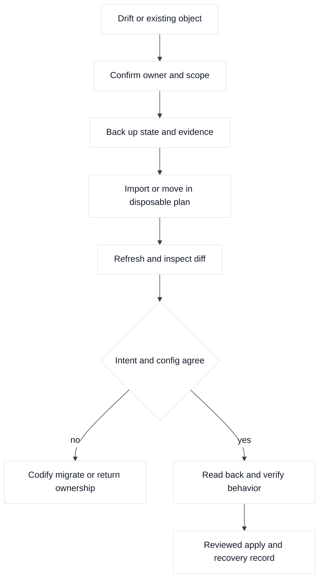
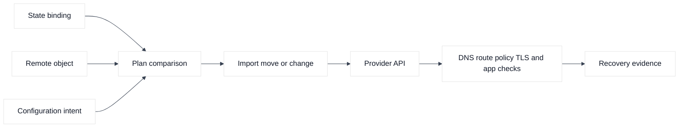
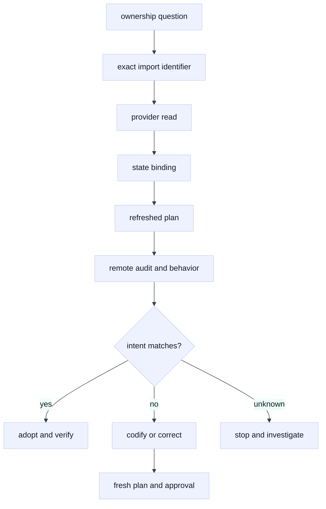

# 06. Import, Moved Blocks, and Drift Recovery

## A. Learning objectives

By the end of this module, you should be able to adopt existing AWS, GCP, and F5 objects without confusing identity discovery with design discovery. You will use configuration-driven `import` blocks, `moved` blocks, refresh-only plans, state backups, provider read evidence, and owner confirmation. You will classify drift as intentional, accidental, stale, unreadable, or a replacement mismatch and choose a safe recovery path.

SDE2 interview answers should include the exact boundary being checked, the plan action, and the next command or evidence query. Staff answers must also cover ownership transfer, auditability, state recovery, customer impact, migration sequencing, separation of duties, and how the platform prevents an emergency workaround from becoming permanent untracked configuration.

## B. Prerequisites

Complete [state, backends, locking, and workspaces](03-state-backends-locking-and-workspaces.md), [resources and modules](04-resources-data-modules-and-composition.md), and [plan and safe change](05-plan-apply-lifecycle-and-safe-change.md). Review the [cloud networking migration material](../cloud-networking-interview/15-cloud-network-migration-and-modernization.md) for the broader dependency and cutover context. Use placeholder IDs and a disposable state. Never import a production object merely to experiment with a command.

## C. Portable mental model

### C.1 Import is an ownership transfer

Import associates an existing remote object's identity with a Terraform resource address. It does not discover the desired architecture, infer all dependencies, repair insecure defaults, or prove that traffic works. After import, configuration must describe the remote object closely enough that the plan is understood. The owner must confirm that no other state, controller, AS3 declaration, or team has lifecycle authority.

### C.2 Moved blocks change Terraform identity

A `moved` block tells Terraform that an address changed while the intended remote object remains the same. It is appropriate for a refactor such as moving `aws_subnet.app` into a module or changing a stable resource name. It is not appropriate when the remote object itself changed or when an object is being transferred to a new owner without a documented migration.

### C.3 Drift is an evidence problem



### C.4 Recovery sequence

Recovery starts by stopping competing writers, preserving the state version and plan, identifying the exact remote object, and checking owner and scope. Only then should you import, move, refresh, restore a state binding, or apply a corrective configuration. A state restore changes Terraform's view; it does not undo an API mutation that already occurred.

### C.5 Diagram 2: state binding versus remote behavior



## D. AWS, GCP, and F5 mapping

| Adoption need | AWS | GCP | F5 |
| --- | --- | --- | --- |
| Existing object | VPC, subnet, route, listener | VPC, subnet, firewall, forwarding rule | pool, node, virtual server, AS3 tenant |
| Identity evidence | ARN or documented import ID | self link or documented import ID | partition-qualified object path |
| Scope check | account and region | project, region, global scope | device, partition, RBAC |
| Health check | routes, flow logs, DNS, probe | firewall logs, routes, probe | monitor, route, TLS, application probe |

**Vendor terminology:** an AWS ARN, GCP self link, or F5 partition path is an identity reference, not a design specification. **Fact:** import syntax and supported attributes vary by provider release. **Inference:** every import should have an owner, backup, generated or hand-written configuration review, and no-surprise plan before mutation.

## E. Terraform examples and walkthrough

### E.1 AWS setup and use

### E.1 Configuration-driven VPC import

```hcl
resource "aws_vpc" "adopted" {
  cidr_block           = "10.246.0.0/16"
  enable_dns_support   = true
  enable_dns_hostnames = true
  tags                 = { Name = "adopted-interview-vpc" }
}

import {
  to = aws_vpc.adopted
  id = "vpc-EXAMPLE123"
}
```

The ID is fictional. Verify the caller with `aws sts get-caller-identity`, then inspect the object using `aws ec2 describe-vpcs --vpc-ids vpc-EXAMPLE123 --region us-west-2`. Run `terraform plan -out=aws-import.tfplan` and `terraform show -no-color aws-import.tfplan`. Review the account, region, CIDR, DNS settings, tags, dependent subnets, route tables, and deletion policy. The import establishes identity only; it does not verify routes or workloads.

### E.2 AWS drift recovery

If an operator changed DNS support, determine whether it was an intentional incident action. Use a refresh-only plan, CloudTrail evidence, route and resolver observations, and an application probe. If the VPC was deleted, do not immediately re-import a similarly named replacement. Confirm dependent IDs and owner intent first. Importing the wrong VPC can turn a safe plan into a destructive one.

### E.2 GCP setup and use

### F.1 Adopt a regional subnet

```hcl
resource "google_compute_subnetwork" "adopted" {
  name          = "adopted-app-west"
  region        = var.gcp_region
  network       = var.gcp_network_self_link
  ip_cidr_range = "10.247.0.0/20"
}

import {
  to = google_compute_subnetwork.adopted
  id = "projects/PROJECT-EXAMPLE/regions/REGION-EXAMPLE/subnetworks/adopted-app-west"
}
```

Run `gcloud config get-value project`, `gcloud auth list`, and `gcloud compute networks subnets describe adopted-app-west --project PROJECT-EXAMPLE --region REGION-EXAMPLE`. Then run `terraform plan -out=gcp-import.tfplan`. GCP VPC networks can be global while subnets are regional, so verify network scope, secondary ranges, private access, IAM, routes, firewall, and workloads before applying. Confirm the import identifier format against the provider release.

### F.2 GCP refresh-only evidence

Use `terraform plan -refresh-only -out=gcp-refresh.tfplan` to inspect provider-observed changes in the selected workflow. Pair it with Cloud Audit Logs, firewall logs, route inspection, and an authorized application probe. A refresh-only plan is not a universal drift scanner because a provider may not read every remote field.

### E.3 F5 setup and use

### G.1 Import an individual LTM pool

```hcl
resource "bigip_ltm_pool" "adopted" {
  name                = "/Tenant_STUDY/adopted_pool"
  load_balancing_mode = "round-robin"
  monitors            = ["/Common/tcp"]
}

import {
  to = bigip_ltm_pool.adopted
  id = "/Tenant_STUDY/adopted_pool"
}
```

Use the provider's documented import syntax for the selected release. Verify with `terraform plan -out=f5-import.tfplan` and a sanctioned `tmsh list ltm pool /Tenant_STUDY/adopted_pool` or read-only API request. Check whether AS3 owns the tenant. If it does, do not import the pool into an individual-resource state without a reviewed ownership transfer and removal of the old writer.

### G.2 Moved address

```hcl
moved {
  from = bigip_ltm_pool.old_name
  to   = bigip_ltm_pool.adopted
}
```

Run `terraform plan -out=f5-move.tfplan` and verify that the plan shows an address move rather than destroy/create. A path change from `/Common` to `/Tenant_STUDY` may identify a different remote object; it is not automatically a rename. Verify the device path, partition, RBAC identity, provider version, and monitor behavior.

## F. Desired, observed, state, and plan analysis

Before import, desired configuration describes an address but state has no binding; observed API data describes an existing object. The import plan adds the binding and may expose configuration differences. After import, state records the object ID, but a plan may propose changing defaults, replacing an immutable field, or deleting unmanaged dependencies. Treat each non-import action as a separate decision.

For a moved block, desired address changes, observed remote identity remains constant, state binding is transformed, and plan should show a move. If it shows replacement, inspect the old and new addresses, provider ID, configuration, and remote object. For drift, compare pre-refresh state, refreshed observation, configuration intent, audit history, ownership, and behavior. A green plan can still miss provider-unread fields or application failures.

## G. Failure evidence and falsifiers

| Symptom | Leading hypothesis | Evidence | Falsifier |
| --- | --- | --- | --- |
| Import immediately wants replacement | Configuration differs or wrong ID | Provider read, plan, owner confirmation | Exact object and immutable settings match |
| AWS adoption affects production | Wrong account or region | STS identity, ARN, tags, audit log | Disposable account and owner are confirmed |
| GCP import fails | Wrong self-link scope or permission | Project, region, API error, provider docs | Same identity can read exact object |
| F5 import conflicts with AS3 | Existing declarative owner | AS3 declaration, tenant, device audit | Ownership transfer and old writer removal are approved |
| Moved block still replaces | Remote identity also changed | Plan actions and IDs | State move produces no remote action |
| Refresh-only is empty but users fail | Provider cannot observe behavior | logs, probes, monitors, traces | End-to-end behavior is healthy |

## H. Safe change, verification, and rollback

Back up state, record remote IDs and owners, test in a disposable state, write configuration from observed values, and require a plan with no unexpected mutation. Apply an import only after ownership transfer is approved. Keep moved blocks through the supported migration window and remove them only after all consumers have moved. Do not use `terraform state rm` to hide an incident. If ownership is relinquished, perform a reviewed handoff and verify that the next owner can read and manage the object. State restore is a recovery aid, not remote rollback.

## I. Exercises

### K.1 Adoption drill

An AWS VPC, GCP regional subnet, and F5 pool already serve a fictional application. Produce an adoption plan with owner, provider scope, import ID, state key, configuration-generation approach, no-surprise plan criteria, behavioral verification, and rollback. Identify which object should not be imported because an external controller owns it.

### K.2 Drift tabletop

An operator changes a GCP firewall priority during an incident, an AWS route is deleted manually, and an F5 AS3 task times out but later completes. Build the timeline and evidence matrix. Decide for each whether to codify, revert, import, refresh, or wait. Include stop conditions and explain why forcing state changes could worsen the outage.

## J. Interview questions and direct answers

### L.1 What does import do?

**Answer:** It binds an existing remote object's identity to a Terraform resource address. It does not infer intended configuration, ownership, dependencies, health, or safe lifecycle behavior.

**SDE2 focus:** Explain the import block, plan, and provider read.

**Staff extension:** Define ownership transfer, backup, security review, rollout, and long-term drift management.

### L.2 Why can an imported object be replaced immediately?

**Answer:** Configuration may differ from immutable attributes, the wrong object may have been imported, provider defaults may be exposed, or the provider may have a read limitation. Compare the exact plan and remote evidence before applying.

**SDE2 focus:** Find the triggering attribute and verify the import ID.

**Staff extension:** Decide whether to codify, migrate in parallel, return ownership, or accept replacement with tested recovery.

### L.3 What is a moved block for?

**Answer:** It tells Terraform that an address changed while the intended remote object remains the same. It prevents a refactor from appearing as destroy/create when identity is preserved.

**SDE2 focus:** Read a plan showing an address move.

**Staff extension:** Govern address migrations across module versions, state locks, CI consumers, and rollback windows.

### L.4 How do you classify drift?

**Answer:** Compare configuration intent, pre-refresh state, refreshed observations, audit history, ownership, and behavior. Classify the difference as intentional, accidental, stale, unreadable, or replacement-related before changing it.

**SDE2 focus:** Name the next evidence query and its falsifier.

**Staff extension:** Build an operating model for emergency changes, reconciliation, audit, and owner accountability.

### L.5 When is direct state editing justified?

**Answer:** Only as tightly controlled recovery when supported commands and normal reconciliation cannot safely repair the binding. Back up state, preserve evidence, obtain approval, and prove the next plan is safe. Direct editing cannot repair remote behavior.

**SDE2 focus:** Prefer import, moved blocks, or supported state commands.

**Staff extension:** Own the incident process, separation of duties, recovery test, and audit trail.

### L.6 Why is a successful import not a health check?

**Answer:** Import establishes object identity and readable attributes. Routes, firewall policy, monitors, TLS, DNS, identity, quotas, and application readiness can still be wrong.

**SDE2 focus:** Add provider read and data-plane probes.

**Staff extension:** Define adoption gates requiring service-owner signoff and SLO evidence, not just Terraform output.

## K. References and evidence labels

- **Fact:** [Terraform import](https://developer.hashicorp.com/terraform/language/import), [moved blocks](https://developer.hashicorp.com/terraform/language/moved), and [refresh-only plans](https://developer.hashicorp.com/terraform/cli/commands/plan) define supported adoption, address migration, and refresh workflows.
- **Vendor terminology:** AWS, Google Cloud, and F5 provider documentation defines import identifiers and resource-specific read behavior; verify exact release syntax.
- **Inference:** Import is best treated as an ownership transfer with a no-surprise plan and behavioral verification; this workflow is an engineering recommendation.

## L. Deep-dive extensions: adoption, drift, and identity repair

### L.1 Import is a contract, not a discovery command

Import binds an existing object to an address. It does not infer purpose, ownership, intentional attributes, or traffic health. Before adoption, inventory the AWS account/region, GCP project/region, or F5 device/partition, plus owner, dependencies, last change, provider version, and the decision to make Terraform the writer.

```hcl
import {
  to = aws_vpc.example
  id = "vpc-EXAMPLE"
}

import {
  to = google_compute_subnetwork.example
  id = "projects/example-lab-project/regions/us-west1/subnetworks/example-subnet"
}

# F5 import syntax is resource-specific; verify the selected provider release.
# import { to = bigip_ltm_pool.example, id = "/Common/example-pool" }
```

These identifiers are placeholders. Import only into a disposable target after confirming object and ownership. Review generated configuration, remove secrets, and confirm whether an F5 pool belongs to an AS3 tenant before adopting it individually.

### L.2 Plan diff after import: adoption versus replacement

```text
  # aws_vpc.example has moved to aws_vpc.network
    resource address moved from aws_vpc.example to aws_vpc.network

  # google_compute_subnetwork.example will be updated in-place
  ~ ip_cidr_range = "198.51.100.0/25" -> "198.51.100.0/24"

  # bigip_ltm_pool.example will be replaced
  -/+ name = "/Common/example-pool" -> "/Common/example-pool-managed"
```

The first line is an address move and should not mutate the remote object. The second may be a dangerous expansion, an invalid immutable change, or a configuration mismatch; check routes, overlapping ranges, and consumers before adoption. The third is not a harmless naming cleanup if the provider treats the name as identity or the pool is referenced by a virtual server. Compare the import ID, provider read response, configuration, and remote audit history. If the plan is surprising, stop and either codify the current object, migrate it deliberately, or return it to the existing owner.

### L.3 Identity and drift evidence flow



The `unknown` branch matters: omitted attributes, unaudited emergency changes, and pending F5 tasks are not intentional drift.

### L.4 Drift classification and a calculation

Assume a subnet has 256 IPv4 addresses in its configured range, with 20 reserved for platform or migration needs and 180 already allocated. The free planning headroom is `256 - 20 - 180 = 56 addresses`. If a new workload needs 40 addresses and expected growth is 25%, the modeled need is `40 x 1.25 = 50`, leaving only 6 addresses. An imported or drifted CIDR change should not be accepted until route overlap, subnet scope, and growth assumptions are reviewed. The calculation does not claim a provider-specific usable-address count; verify service reservations in the target AWS or GCP documentation.

Use read-only evidence before reconciliation:

```bash
terraform plan -refresh-only -out=example-refresh.tfplan
terraform show -no-color example-refresh.tfplan
terraform state show aws_vpc.example
aws ec2 describe-vpcs --vpc-ids vpc-EXAMPLE --profile example-lab
gcloud compute networks subnets describe example-subnet \
  --region us-west1 --project example-lab-project
curl --fail --silent --show-error --cacert "$BIGIP_CA" \
  -u "$BIGIP_USER:$BIGIP_PASSWORD" \
  "https://bigip.example.invalid/mgmt/tm/ltm/pool/~Common~example-pool"
```

For AWS compare tags, routes, security groups, and CloudTrail; for GCP compare project, region, network, firewall, routes, and audit logs; for F5 compare partition, monitor, task history, and AS3 ownership. Refresh-only identifies differences; it does not fix them.

### L.5 Edge cases, moved blocks, and cleanup

If `module.old.aws_vpc.example` moves to `module.network.aws_vpc.example`, a `moved` block preserves identity only for the same object. A typo can create a second object. Require an explicit move and no destroy/create; repair a wrong import with supported moves and a backup before considering direct state recovery.

If an imported object was deleted, confirm recreation, dependency impact, and retirement intent. For repeated external changes, choose one owner or consume data; do not hide security drift with `ignore_changes`. If AS3 owns an F5 pool, migrate the binding only after the declaration is complete.

Cleanup after an adoption exercise includes removing temporary import blocks if the repository convention requires it, retaining the final resource configuration and evidence, and deleting only disposable resources after dependent routes, firewalls, listeners, or F5 virtual servers are understood. Rollback may mean returning ownership to the previous system, restoring a state version, or applying a corrective configuration; each choice must account for remote mutations already made.

### L.6 Follow-up interview questions

#### What must be true before you import a resource?

**Answer:** I need the exact remote identifier, target scope, current owner, intended Terraform address, provider compatibility, read permissions, dependency inventory, and a plan to codify the observed attributes. I also need agreement that Terraform becomes the lifecycle writer or that the object remains data-only. After import, I require a no-surprise plan and behavioral verification. For F5, I specifically check AS3 or another controller before adopting individual resources.

#### How would you handle drift during an incident?

**Answer:** Preserve the pre-refresh state and current plan, identify the remote writer and customer impact, and classify the change as intentional, accidental, stale, unreadable, or replacement-related. Do not overwrite emergency work until the incident authority chooses restore or forward recovery. For AWS and GCP, correlate audit logs with the resource scope; for F5, correlate device audit and task/declaration history. Then make the smallest approved corrective change and run a fresh full plan.

#### When is a moved block safer than import?

**Answer:** A moved block is safer when the remote object is already managed by Terraform and only its configuration address changes during a refactor. It preserves the existing binding without rediscovering the object. Import is for adopting an object that is not currently bound in the target state. In both cases, review the plan: a move should show identity preservation, while import should be followed by configuration reconciliation and ownership confirmation.
