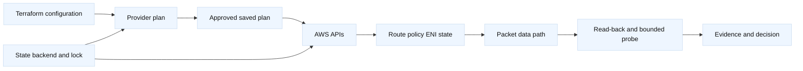
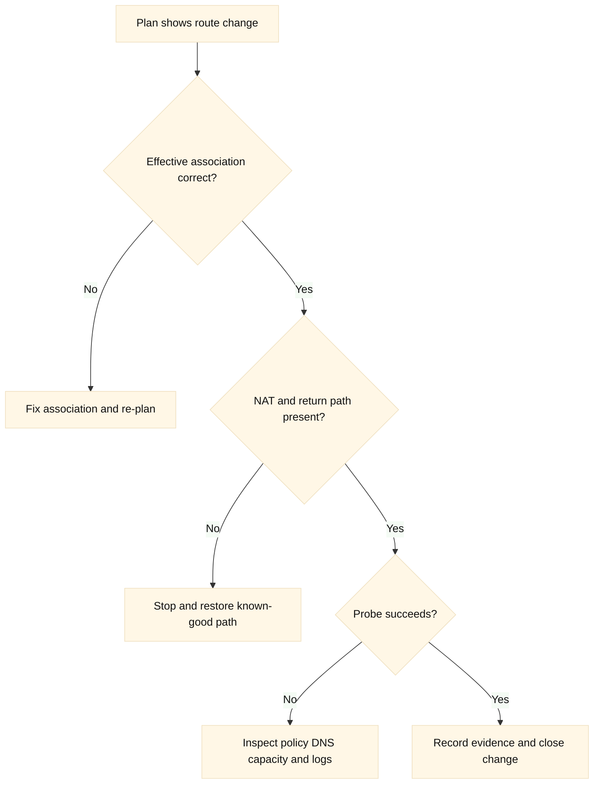
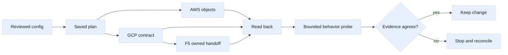

# 07. AWS Networking with Terraform

## A. Learning objectives

After this module, you should be able to explain how Terraform models a small
AWS network, identify which objects are regional or subnet-associated, and
review a plan without confusing resource creation with working connectivity.
You should be able to use provider aliases safely, protect the intended AWS
account, distinguish a private subnet from a route that merely lacks an
internet gateway, and reason about NAT, security groups, and replacement risk.
You should also be able to describe the evidence needed after an apply: the
Terraform state, AWS read-back, route and policy inspection, and a bounded
behavioral probe are separate signals.

## B. Prerequisites

Know CIDR notation, longest-prefix routing, security-group statefulness, NAT,
availability zones, Terraform resource addresses, variables, outputs, and
saved plans. Review the cloud track modules on [subnets and IP planning](../cloud-networking-interview/03-subnet-and-ip-address-planning.md),
[routes and hybrid connectivity](../cloud-networking-interview/04-routes-gateways-and-hybrid-connectivity.md),
and [safe change](../cloud-networking-interview/05-internet-ingress-nat-and-egress.md).
This is an educational example: replace every placeholder, use a disposable
account, and never paste credentials into this document or a plan artifact.

## C. Portable mental model

Terraform owns a mapping between configuration addresses, state objects, and
remote AWS objects. The provider translates a graph operation into AWS API
calls. A route table can exist while an instance has no usable path because a
subnet association, security group, network ACL, DNS setting, or return route
is wrong. A plan is a proposed transition based on a refresh and configuration;
it is not a packet trace, an authorization decision, or a health check.

The useful review sequence is: identify the account and region, draw the
desired data path, identify each resource owner, inspect the plan's actions,
apply only an approved saved plan, read back effective AWS objects, and test a
bounded path. **Inference:** treating those as independent gates reduces the
chance that a successful API response is mistaken for service availability.

### C.1 Two-plane model

The control plane contains Terraform, the AWS provider, IAM, state, route
tables, and security policy. The data plane contains ENIs, packets, NAT
translations, listeners, and application responses. A control-plane result can
be correct while a data-plane dependency is absent. For interview answers,
name the owner and observable evidence at every boundary.





## D. AWS, GCP, and F5 mapping

| Portable concern | AWS example | GCP comparison | F5 comparison |
| --- | --- | --- | --- |
| Network boundary | VPC and account/Region | VPC is global; subnet is regional | Device, partition, route domain, or tenant |
| Routing | Subnet-associated route table | VPC routes with different scope rules | TMM route table and self/virtual-server behavior |
| Policy | Security group and network ACL | VPC firewall policy | BIG-IP profiles, AFM, and listener policy |
| State owner | Terraform state plus AWS object | Separate Google provider state/object | Terraform resource or AS3 declaration, never both for one object |
| Verification | AWS read-back plus flow evidence | GCP read-back plus flow logs | Device read-back plus task and data-plane probe |

**Fact:** AWS provider resources are vendor/API adapters, not universal
abstractions. **Vendor terminology:** `aws_vpc`, `aws_subnet`, and
`aws_route_table` are Terraform resource names, while VPC and Availability
Zone are AWS terms. **Inference:** keep AWS, GCP, and F5 state boundaries
separate unless a deliberate orchestration layer documents their contract.

## E. AWS setup and use

The following is a deliberately small VPC skeleton. It uses fictional names,
an injected role, and an account guard. Version constraints are illustrative;
review the lock file and selected provider documentation before use.

```hcl
terraform {
  required_version = ">= 1.6, < 2.0"
  required_providers {
    aws = {
      source  = "hashicorp/aws"
      version = "~> 6.0" # Illustrative; pin and review the lock file.
    }
  }
}

provider "aws" {
  region              = var.aws_region
  allowed_account_ids = [var.expected_account_id]
  assume_role {
    role_arn = var.deployment_role_arn
  }
  default_tags { tags = { owner = "training", lifecycle = "disposable" } }
}

resource "aws_vpc" "training" {
  cidr_block           = "10.42.0.0/16"
  enable_dns_support   = true
  enable_dns_hostnames = true
  tags                 = { Name = "training-network" }
}

resource "aws_subnet" "private_a" {
  vpc_id            = aws_vpc.training.id
  cidr_block        = "10.42.10.0/24"
  availability_zone = "us-west-2a" # Placeholder: choose a real lab AZ.
  tags              = { Name = "private-a" }
}

resource "aws_route_table" "private" {
  vpc_id = aws_vpc.training.id
  tags   = { Name = "private-routes" }
}

resource "aws_route_table_association" "private_a" {
  subnet_id      = aws_subnet.private_a.id
  route_table_id = aws_route_table.private.id
}

resource "aws_security_group" "app" {
  name        = "training-app"
  description = "Example least-privilege application policy"
  vpc_id      = aws_vpc.training.id
  ingress { description = "from example edge" from_port = 8443 to_port = 8443 protocol = "tcp" cidr_blocks = ["198.51.100.0/24"] }
  egress  { from_port = 0 to_port = 0 protocol = "-1" cidr_blocks = ["0.0.0.0/0"] }
}
```

A reviewable workflow is read-oriented first. `aws sts get-caller-identity`
confirms the effective principal and account; it does not grant permission.
`aws ec2 describe-vpcs`, `describe-route-tables`, and
`describe-security-groups` verify the effective objects after a plan or apply.
Use `terraform fmt -check`, `terraform init`, `terraform validate`, and
`terraform plan -out=tfplan` in a disposable directory. Do not use
`-auto-approve`; an apply must have an explicit approval, a cost boundary, and
a cleanup owner. For a learning lab, cleanup is `terraform plan -destroy`
followed by a human-reviewed destroy, only after checking shared resources.

## F. GCP setup and use

The AWS exercise is primary, but an interview answer should show that the
same intent is not the same provider implementation. This GCP fragment makes
project and regional subnet scope explicit; it is not a drop-in continuation
of the AWS state.

```hcl
provider "google" {
  project = var.gcp_project_id
  region  = "us-west1"
}

resource "google_compute_network" "training" {
  name                    = "training-network"
  auto_create_subnetworks = false
}

resource "google_compute_subnetwork" "private" {
  name          = "private-us-west1"
  ip_cidr_range = "10.52.10.0/24"
  region        = "us-west1"
  network       = google_compute_network.training.id
}

resource "google_compute_firewall" "app" {
  name    = "training-app-allow"
  network = google_compute_network.training.name
  allow { protocol = "tcp" ports = ["8443"] }
  source_ranges = ["198.51.100.0/24"]
  target_tags   = ["training-app"]
}
```

The analogous inspection is `gcloud config get-value project`,
`gcloud compute networks describe training-network`, and
`gcloud compute firewall-rules describe training-app-allow`. The commands
must target a disposable project and use an identity with least privilege.

## G. F5 setup and use

For F5, the useful mapping is ownership rather than cloud parity. A narrowly
owned pool can be represented like this, with the endpoint and credentials
provided through environment variables and a trusted CA:

```hcl
provider "bigip" {
  address  = var.bigip_address
  username = var.bigip_username
  password = var.bigip_password # Inject; never commit.
  
}

resource "bigip_ltm_pool" "training" {
  name                = "/Common/training_pool"
  load_balancing_mode = "round-robin"
  monitors            = ["/Common/tcp"]
}
```

Before using `tmsh` or REST to inspect a lab device, use a partition-qualified
read such as `tmsh -q list ltm pool /Common/training_pool`. Do not let this
resource manage a virtual server or pool that an AS3 declaration owns. A
successful Terraform response proves provider acceptance, not monitor health
or a successful client request.

## H. Plan, state, and ownership analysis

Ask five questions while reviewing the AWS plan. First, is the account and
region correct? Second, which configuration address owns the object? Third, is
the action create, update, no-op, or replace? Fourth, what dependency makes a
replacement risky? Fifth, what evidence proves the intended data path after
the change? A subnet CIDR change is commonly replacement-oriented; a security
group rule may update in place but still widen exposure. A route-table
association can be syntactically valid and semantically wrong.

State contains identifiers and sometimes sensitive topology. Locking prevents
concurrent writers but does not prevent two independent states from owning the
same VPC object. Importing an existing route table transfers lifecycle intent;
it does not discover why the route exists. Use separate states for independent
environment and ownership boundaries, and use outputs as an explicit, reviewed
contract rather than reading another state casually.

## I. Worked scenario and failure evidence

Suppose an application in `private_a` must reach an external update service.
The plan adds a NAT gateway route, but the reviewer notices the NAT gateway is
in the same private route table and no public route reaches its subnet. The
right answer is not “apply and see.” Verify route-table associations, NAT
subnet placement, internet-gateway route, security-group egress, network ACL
return ports, and NAT capacity. Then define a bounded probe and an owner for
cleanup.

| Symptom | Evidence to collect | Falsifier |
| --- | --- | --- |
| Plan targets wrong account | caller identity, provider alias, account guard | expected account ID and role match |
| Instance has no egress | subnet association, route table, NAT/IGW, flow evidence | successful probe with expected translated path |
| Traffic is denied | SG/NACL effective rules, source tuple, return tuple | accepted flow logs and application response |
| Plan replaces a subnet | plan JSON, immutable field, dependencies | refresh-only plan shows no replacement |
| F5 object oscillates | state address, AS3 tenant, device owner | one authoritative owner and stable read-back |

## J. Safe change, verification, and rollback

Use a saved plan only within a defined freshness window. Re-plan if IAM,
provider version, state lock, inputs, or remote ownership changed. Record the
blast radius, approval, expected routes, and rollback condition. For a route
change, rollback may be restoring the prior route association; for a NAT
failure, it may be stopping the rollout rather than creating a second NAT.
Never promise rollback of a destructive subnet replacement without validating
data preservation and dependent ENIs. Prefer recovery and forward correction
when the old state cannot be safely restored.

## K. Exercises

1. **Timed plan review (25 minutes):** Given a plan that changes one subnet,
   adds a default route, and replaces a security group, identify account,
   region, route, policy, cost, and replacement risks. State three read-only
   commands and the exact evidence each should produce.
2. **Debugging drill (35 minutes):** A private workload resolves DNS but cannot
   download updates. Construct a hypothesis matrix for DNS, route association,
   NAT placement, SG egress, NACL return traffic, and provider state drift.
   Choose the cheapest falsifying observation first, then define a bounded
   rollback and a post-fix probe.

## L. Interview questions and direct answers

### J.1 Why does a successful AWS plan not prove connectivity?

**Answer:** A plan describes intended control-plane changes. Connectivity also
depends on route association, policy, ENI state, DNS, return traffic, service
health, and timing. Read back effective AWS objects and run a bounded probe.

**SDE2 focus:** Trace the packet and name concrete route and policy evidence.

**Staff extension:** Define freshness, approval ownership, observability, and
the stop condition if control-plane success and data-plane health disagree.

### J.2 Why use `allowed_account_ids` and provider aliases?

**Answer:** The account guard fails early when credentials point at an
unexpected account. Aliases make region or account intent explicit, reducing
accidental cross-region references and making review easier.

**SDE2 focus:** Explain provider configuration and dependency references.

**Staff extension:** Combine identity, CI context, policy checks, and audit
evidence so an account guard is one layer rather than the only safeguard.

### J.3 When is a route-table association more important than a route resource?

**Answer:** A route is useful only to the table selected by the subnet. A
correct route in an unassociated table has no effect on the workload. Inspect
both the route and the effective subnet association.

**SDE2 focus:** Trace subnet-to-table-to-next-hop selection.

**Staff extension:** Explain how module interfaces prevent ambiguous association
ownership and how a migration can preserve the old path until canary evidence.

### J.4 Why is NAT placement a design issue rather than a Terraform detail?

**Answer:** NAT depends on a public path, capacity, availability-zone failure
assumptions, port consumption, and cost. Terraform can create the objects but
cannot choose the right resilience or prove the application’s demand model.

**SDE2 focus:** Show the route sequence and distinguish source translation from
inbound reachability.

**Staff extension:** Quantify concurrency/headroom, failure domains, cost
allocation, and the recovery policy for a zonal NAT outage.

### J.5 What does importing an AWS object change?

**Answer:** Import attaches an existing remote identifier to a Terraform
address. It does not infer desired settings or prove ownership. The next plan
may propose changes, so first inventory, back up state, and confirm authority.

**SDE2 focus:** Explain import, refresh, configuration, and drift.

**Staff extension:** Establish an adoption contract, owner approval, policy
freeze, rollback path, and reconciliation window before importing shared objects.

### J.6 How would you keep F5 and AWS ownership from conflicting?

**Answer:** Define object ownership at the boundary. AWS Terraform can own a
load balancer or network; F5 Terraform can own a partition-qualified object or
AS3 tenant. No second state or AS3 declaration manages the same lifecycle.

**SDE2 focus:** Identify duplicate ownership and compare read-back to state.

**Staff extension:** Set an organizational contract for handoffs, drift alerts,
change sequencing, incident authority, and decommissioning.

## M. Extended end-to-end lab and plan review

The following lab connects a small AWS VPC to a GCP and F5 handoff without
pretending that one Terraform state is a transaction. The identifiers are
fictional and the configuration is intentionally incomplete at the edges. It
is a review artifact, not a command sequence to run against a real account.

```hcl
variable "aws_region" { type = string, default = "us-west-2" }
variable "gcp_project" { type = string, default = "example-lab-project" }
variable "f5_partition" { type = string, default = "COMMON" }

provider "aws" {
  region              = var.aws_region
  allowed_account_ids = ["111111111111"]
  default_tags { tags = { owner = "interview-lab", managed = "terraform" } }
}

provider "google" { project = var.gcp_project, region = "us-west1" }

resource "aws_vpc" "edge_lab" {
  cidr_block           = "10.42.0.0/16"
  enable_dns_hostnames = true
  enable_dns_support   = true
  tags = { Name = "example-edge-lab" }
}

resource "aws_subnet" "private_app" {
  vpc_id            = aws_vpc.edge_lab.id
  cidr_block        = "10.42.10.0/24"
  availability_zone = "us-west-2a"
  tags = { Name = "example-private-app" }
}

resource "google_compute_network" "handoff" {
  name                    = "example-handoff"
  auto_create_subnetworks = false
}

resource "google_compute_subnetwork" "service" {
  name          = "example-service"
  ip_cidr_range = "10.52.10.0/24"
  region        = "us-west1"
  network       = google_compute_network.handoff.id
}
```

The review starts with assumptions: one AWS account, one Region, one private
subnet, one GCP project, and an F5 partition that already exists and is owned
by a separate state. A production design would also decide whether the AWS
subnet needs a NAT path, whether the GCP subnet needs Private Google Access,
and whether F5 reaches the backend over a routed or translated path. Those are
not safe defaults to infer from a successful plan.

Suppose the plan reports `+ aws_route.private_default`, `~ aws_security_group.app`
and `-/+ aws_subnet.private_app`. The addition may be expected, but the
replacement is a stop signal: changing a subnet CIDR is not equivalent to
changing a tag. Before approving, identify the immutable argument, affected
interfaces, route-table associations, ENIs, and any F5 pool members that use
the old address range. A useful review note is: “The plan changes one private
subnet and may strand two instances; no apply until replacement impact and
recovery are tested.”

For verification, use separate read-only checks after an approved change. AWS
evidence includes the caller identity, VPC and subnet IDs, route-table
association, security-group rules, and a flow-log sample for the expected
tuple. GCP evidence includes the project, network, subnet region, effective
firewall targets, and flow-log or connectivity-test output. F5 evidence
includes the partition, virtual server, pool member state, monitor result, and
the source address observed by the backend. A resource ID alone proves only
that an object exists.



Cost boundaries belong in the approval record. A NAT gateway, flow logging,
cross-AZ traffic, public load-balancer processing, GCP Cloud NAT, and F5
licensed capacity can all add cost even when the HCL is small. Estimate the
dominant terms as `hourly resources + processed bytes + log ingestion +
cross-boundary transfer`; use current provider pricing rather than memorized
numbers. The cleanup boundary is the lab account/project, named resources,
and the F5 partition only. Never use a broad destroy against shared networks.

Follow-up interview questions:

### M.1 How would you handle a subnet replacement discovered during review?

**Answer:** I would stop approval, identify the immutable field and all
dependents, and compare the proposed graph with the current AWS topology. I
would create a new subnet only if the migration plan can preserve service
capacity, attach replacement interfaces or instances deliberately, update F5
and route consumers, and verify both directions. `create_before_destroy` is
not magic: overlapping CIDRs, quotas, and names can make it impossible.

**Staff extension:** I would require an owner, capacity budget, customer
canary, rollback authority, and a decommission date. If the old subnet is a
shared dependency, the correct answer may be a new state boundary or a
multi-phase migration rather than a lifecycle flag.

### M.2 What evidence distinguishes an AWS route problem from a F5 problem?

**Answer:** I would trace the tuple hop by hop: subnet association and route
selection, security-group and NACL decisions, F5 virtual-server/listener
acceptance, pool monitor state, and backend response. A successful AWS API
read-back does not prove F5 received traffic; a green F5 monitor does not prove
the client path works.

### M.3 How do you estimate headroom before adding NAT and private workloads?

**Answer:** I would model concurrent flows, ephemeral port consumption,
availability-zone failure, peak destinations, and retry amplification. Then I
would compare the result with current service limits and price dimensions,
test a representative load in a disposable boundary, and define an alert and
rollback threshold before rollout.

## M. References and evidence labels

- **Fact:** [AWS provider documentation](https://registry.terraform.io/providers/hashicorp/aws/latest/docs)
  describes provider resources and configuration; verify the selected version.
- **Vendor terminology:** [AWS VPC route tables](https://docs.aws.amazon.com/vpc/latest/userguide/WorkWithRouteTables.html)
  defines AWS-specific route concepts; verify Region, account, and quotas.
- **Inference:** The separation of plan, read-back, and behavioral probe is an
  engineering review method; validate it against the service owner’s SLOs.
- **Vendor terminology:** [F5 BIG-IP provider](https://registry.terraform.io/providers/F5Networks/bigip/latest/docs)
  documents provider resources; verify BIG-IP, provider, partition, and RBAC.
