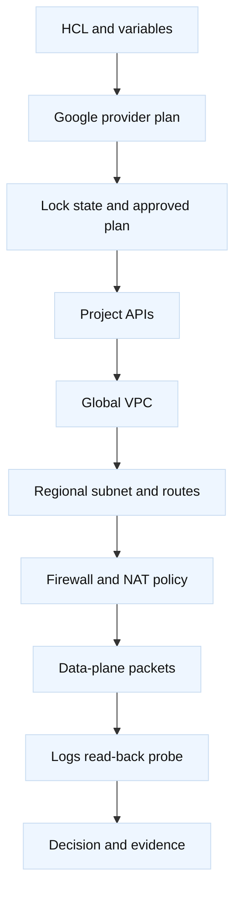
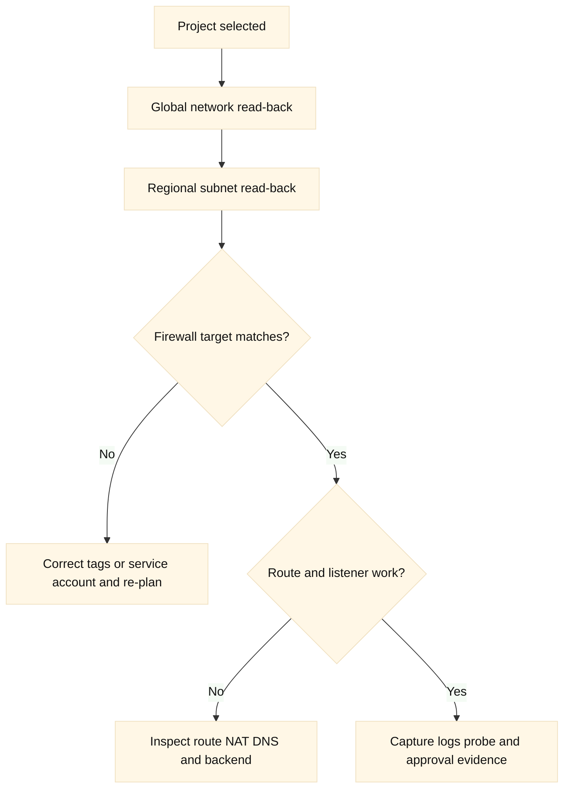
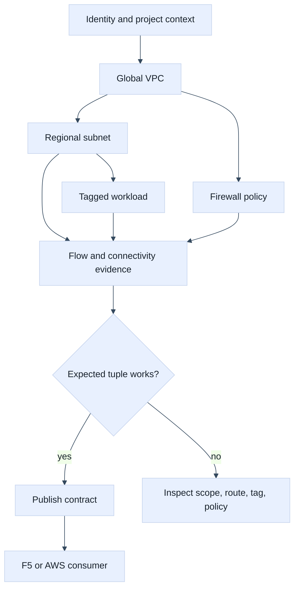

# 08. GCP Networking with Terraform

## A. Learning objectives

You should be able to model a small Google Cloud network with Terraform while
explaining the important scope difference between a global VPC network and a
regional subnet. You will practice making project, region, identity, firewall,
route, and Cloud NAT intent visible in a plan. You will also learn to review
Terraform output as one control-plane signal rather than proof that packets
can reach a workload. The interview goal is to describe resource ownership,
provider aliases, eventual consistency, quota/cost boundaries, and a safe
verification and recovery path.

## B. Prerequisites

Know CIDRs, VPC routing, stateful/stateless policy, DNS, NAT, Terraform
providers, modules, state, and drift. Read the cloud track material on [cloud
boundaries](../cloud-networking-interview/02-virtual-network-boundaries-and-design.md),
[firewalls](../cloud-networking-interview/06-firewalls-security-groups-and-network-acls.md),
and [quotas and cost](../cloud-networking-interview/13-quotas-capacity-and-network-cost.md).
Use a disposable GCP project with billing and APIs explicitly approved. The
examples contain placeholders and should not be applied to a production
project.

## C. Portable mental model

Terraform compares configuration with state and provider observations. The
Google provider then calls Google Cloud APIs, but a successful API operation
does not prove that a VM, load balancer, or private service has the desired
data-plane behavior. First identify the project and resource scope. Next draw
the path, including regional subnet, route selection, firewall target/source
semantics, DNS, and NAT. Finally define read-back and behavioral evidence.

GCP’s global VPC vocabulary can mislead candidates who memorize AWS terms.
**Fact:** a VPC network and a subnet are separate objects with different scope.
**Inference:** an answer should state scope explicitly before choosing a module
interface. A firewall rule can be global in the network sense while selecting
targets by tags or service accounts; the exact rule model should be verified
against the chosen API/provider release.





## D. AWS, GCP, and F5 mapping

| Portable concern | GCP example | AWS comparison | F5 comparison |
| --- | --- | --- | --- |
| Provider target | Project, credentials, region/zone | Account, role, Region/AZ | Device, partition, provider endpoint |
| Network scope | Global VPC plus regional subnet | VPC and AZ-scoped subnets | TMM, route domain, partition |
| Policy | VPC firewall rules and hierarchy | Security group/NACL combinations | AFM, profiles, listener policy |
| Egress | Cloud NAT and route behavior | NAT Gateway and route tables | SNAT pools and virtual server |
| State owner | Google provider state and API object | AWS provider state and API object | Individual resource or AS3, exclusively |

**Vendor terminology:** `google_compute_network`,
`google_compute_subnetwork`, and `google_compute_firewall` are provider
resource names; VPC network, subnet, project, and region are Google Cloud
terms. **Inference:** provider mapping should compare scope and behavior, not
similar names. A GCP firewall rule is not automatically an AWS security group.

## E. GCP setup and use

This example disables automatic subnet creation so the address plan is
intentional. The provider version and API behavior are illustrative: use a
committed lock file and verify provider compatibility before applying.

```hcl
terraform {
  required_version = ">= 1.6, < 2.0"
  required_providers {
    google = {
      source  = "hashicorp/google"
      version = "~> 7.0" # Illustrative; verify and pin intentionally.
    }
  }
}

provider "google" {
  project = var.training_project_id
  region  = "us-west1"
  # Use ADC or workload identity outside source control.
}

resource "google_compute_network" "training" {
  name                    = "training-network"
  auto_create_subnetworks = false
  description             = "Disposable interview laboratory"
}

resource "google_compute_subnetwork" "app" {
  name          = "app-us-west1"
  ip_cidr_range = "10.52.10.0/24"
  region        = "us-west1"
  network       = google_compute_network.training.id
  private_ip_google_access = true
}

resource "google_compute_firewall" "https" {
  name    = "training-https"
  network = google_compute_network.training.name
  direction = "INGRESS"
  priority  = 1000
  allow { protocol = "tcp" ports = ["8443"] }
  source_ranges = ["198.51.100.0/24"]
  target_tags   = ["training-app"]
}
```

Before initialization, confirm the target with `gcloud config get-value
project` and `gcloud auth list`. A read-only inspection might use:

```bash
gcloud services list --enabled --project=PROJECT_PLACEHOLDER
gcloud compute networks describe training-network --project=PROJECT_PLACEHOLDER
gcloud compute networks subnets describe app-us-west1 \
  --region=us-west1 --project=PROJECT_PLACEHOLDER
gcloud compute firewall-rules describe training-https \
  --project=PROJECT_PLACEHOLDER
```

These commands identify API enablement, network scope, regional subnet, and
firewall intent. They do not prove an application is listening. For a lab,
`terraform plan -out=tfplan` should be reviewed for project, region, CIDR,
priority, target tags, and any unexpected replacement. An apply requires
approval and a cleanup owner; do not use `-auto-approve` in the learning
workflow. Cleanup starts with `terraform plan -destroy` and an explicit check
that the project/network is not shared.

## F. AWS setup and use

The AWS equivalent has account/Region and subnet-associated route tables. It
should be kept in a separate state from the GCP example unless a platform
contract intentionally composes them.

```hcl
provider "aws" {
  region              = var.aws_region
  allowed_account_ids = [var.expected_account_id]
  assume_role { role_arn = var.aws_role_arn }
}

resource "aws_vpc" "training" {
  cidr_block           = "10.42.0.0/16"
  enable_dns_support   = true
  enable_dns_hostnames = true
}

resource "aws_subnet" "app" {
  vpc_id            = aws_vpc.training.id
  cidr_block        = "10.42.10.0/24"
  availability_zone = "us-west-2a" # Placeholder.
}
```

Use `aws sts get-caller-identity` and `aws ec2 describe-subnets` to verify
account, region, and association. Do not claim the AWS and GCP resource names
have equal route or firewall semantics.

## G. F5 setup and use

For F5, a cloud workload may hand off to a BIG-IP virtual server. A Terraform
provider resource can own a pool, while the cloud provider owns the subnet and
network. The boundary must include the address, monitor, TLS profile, and
partition. Example:

```hcl
provider "bigip" {
  address  = var.bigip_address
  username = var.bigip_username
  password = var.bigip_password # Environment-injected secret only.
}

resource "bigip_ltm_pool" "gcp_edge" {
  name                = "/Common/gcp_training_pool"
  load_balancing_mode = "least-connections-member"
  monitors            = ["/Common/tcp"]
}
```

Use a partition-qualified read such as `tmsh -q list ltm pool
/Common/gcp_training_pool` only against a disposable device. Never allow an
AS3 declaration and this resource to manage the same pool. A F5 task result or
GCP API response still requires read-back and a safe request path.

## H. Plan, state, and ownership analysis

For GCP, classify each field by scope: project, global network, regional
subnet, zone, or target selection. A plan that changes a project variable can
look small while pointing at an entirely different environment. Provider
aliases make multi-project intent explicit, but aliases do not grant access or
make cross-project dependencies atomic.

Stable module interfaces should expose network ID, subnet self-link, region,
project, and firewall target contract. Avoid hiding project selection in a
module default. Use `for_each` keys that represent stable application names,
not list positions. If a subnet is imported, first compare its CIDR, purpose,
secondary ranges, and consumers; configuration must express the desired state
before the first apply after import.

State locking protects one backend from concurrent writers. It cannot stop a
human, another state, or a console change from modifying the same GCP object.
State may reveal project IDs, network topology, and endpoint metadata. Restrict
backend access and redact plan/log artifacts. **Inference:** for AWS/GCP/F5
platforms, independent states with explicit outputs often provide a smaller
blast radius than one graph attempting to own every control plane.

## I. Worked scenario and failure evidence

An application in `app-us-west1` has a healthy instance but no response from a
client range. The Terraform plan shows the firewall rule was created. Start by
checking project and network identity, then target tags/service-account
selection, priority and direction, route state, listener port, and return
traffic. If Cloud NAT is involved, check that the workload has the expected
route and that NAT scope/capacity matches the design. A firewall rule’s
existence is not evidence that the target matches.

| Symptom | Evidence | Falsifier |
| --- | --- | --- |
| Wrong project | `gcloud config`, provider project, plan JSON | all three identify approved project |
| Firewall exists but denies | effective target tags, priority, source, flow logs | matching target and accepted flow |
| Private egress fails | subnet route, NAT configuration, logs, port demand | successful bounded external probe |
| Region mismatch | subnet self-link and provider region | expected regional resource read-back |
| F5 handoff fails | pool members, monitor state, GCP endpoint, client tuple | successful request with correlated logs |

## J. Safe change, verification, and rollback

A safe change record names the project, region, identity, state lock, plan
digest, expected resource actions, cost exposure, and verification owner. Save
the plan only for its stated freshness boundary. If the project, provider
version, IAM permission, state, or remote object changes, re-plan.

Rollback for a firewall change may restore the prior rule while preserving a
known-good emergency path. Rollback for an imported subnet or deleted network
may be impossible without data recovery. Prefer a staged rule, canary tag, or
new module address when safe; treat `-target` as a narrowly documented recovery
tool, followed by a full plan. Verify both cloud objects and F5 handoff after
any cross-provider correction.

## K. Exercises

1. **Timed design drill (25 minutes):** Design one global GCP VPC with two
   regional application subnets, a least-privilege firewall, and controlled
   egress. Explain which values are global, regional, and project-scoped, and
   show how the same design would differ in AWS.
2. **Drift drill (35 minutes):** A console user widens a firewall source range
   and Terraform plans to restore it. Build an evidence-first recovery plan:
   identify the actor, preserve logs, decide whether the change was emergency
   work, review the next plan, apply only after approval, and test the intended
   path. Include F5 ownership if the firewall protects a BIG-IP backend.

## L. Interview questions and direct answers

### J.1 Why call out GCP global versus regional scope?

**Answer:** Scope determines where an object applies, which provider arguments
are required, how dependencies are modeled, and what a failure affects. A
global VPC and regional subnet are not interchangeable resources.

**SDE2 focus:** Identify the scope of network, subnet, VM, route, and firewall.

**Staff extension:** Explain how scope drives ownership, quota planning,
multi-region resilience, and review boundaries across teams.

### J.2 Why is a firewall rule’s existence insufficient evidence?

**Answer:** The rule may select the wrong target, lose on priority, use the
wrong direction or source, or protect a port with no listener. Effective flow
evidence and a bounded application probe are required.

**SDE2 focus:** Trace source, target, port, priority, route, and return path.

**Staff extension:** Define a telemetry contract and a safe test that does not
turn a configuration review into an uncontrolled production probe.

### J.3 How do you protect against Terraform targeting the wrong project?

**Answer:** Make project input explicit, use separate identities, verify ADC or
workload identity, inspect `gcloud` context, include policy checks, and review
the plan’s project and resource self-links. A variable default is not a guard.

**SDE2 focus:** Show identity and plan evidence before apply.

**Staff extension:** Combine organization policy, CI trust context, approvals,
backend isolation, and audit correlation so one mistaken context cannot mutate a
shared environment.

### J.4 What should a module output across a cloud-to-F5 boundary?

**Answer:** Output only a deliberate contract: endpoint name/address, port,
health expectation, ownership, and change sequencing. Do not expose secrets or
make one state silently reach into another state’s internals.

**SDE2 focus:** Explain outputs, dependencies, and stable resource addresses.

**Staff extension:** Include compatibility, rollout gates, ownership transfer,
rollback authority, and what happens when one provider is unavailable.

### J.5 When would you separate GCP and AWS Terraform states?

**Answer:** Separate them when teams, credentials, failure domains, release
cadence, or recovery procedures differ. A small integration layer can consume
reviewed outputs without making both providers one transactional graph.

**SDE2 focus:** Describe state locks and dependency contracts.

**Staff extension:** Weigh coordination cost against blast radius and define
versioned interfaces, contract tests, and recovery for partial progress.

### J.6 How do you handle drift found during a GCP incident?

**Answer:** Preserve evidence, identify the actor and intended change, compare
state with remote read-back, decide whether to revert or adopt, and run a fresh
plan. Do not blindly apply stale state or import without ownership approval.

**SDE2 focus:** Distinguish refresh, plan, remote change, and behavioral health.

**Staff extension:** Establish emergency-change policy, auditability, decision
rights, customer risk, and a follow-up that prevents repeated console drift.

## M. Extended end-to-end lab and plan review

This example shows why GCP scope must be explicit in every Terraform review.
The VPC is global, the subnet is regional, the firewall selects targets, and
Cloud NAT is attached through a regional configuration. AWS and F5 appear as
comparison boundaries, but each should have its own state and credentials.

```hcl
variable "project_id" { type = string, default = "example-lab-project" }
variable "region" { type = string, default = "us-west1" }

provider "google" {
  project = var.project_id
  region  = var.region
}

resource "google_compute_network" "app" {
  name                    = "example-global-app"
  auto_create_subnetworks = false
}

resource "google_compute_subnetwork" "private" {
  name                     = "example-private-west"
  ip_cidr_range            = "10.61.10.0/24"
  region                   = var.region
  network                  = google_compute_network.app.id
  private_ip_google_access = true
  log_config { aggregation_interval = "INTERVAL_5_SEC", flow_sampling = 0.5, metadata = "INCLUDE_ALL_METADATA" }
}

resource "google_compute_firewall" "web" {
  name    = "example-web-from-test"
  network = google_compute_network.app.name
  allow { protocol = "tcp", ports = ["443"] }
  source_ranges = ["198.51.100.0/24"]
  target_tags   = ["example-web"]
}

output "network_contract" {
  value = { project = var.project_id, region = var.region, subnet = google_compute_subnetwork.private.name, port = 443 }
}
```

The assumptions are one disposable project, one region, no implicit default
network, a test source range reserved for documentation, and a workload that
has the `example-web` network tag. The source range is not a security design;
the exercise is to replace it with an intentional identity or proxy boundary.
The firewall does not by itself prove that a VM exists, that its local firewall
allows the port, or that a return path is available.

A representative plan diff might show `~ private_ip_google_access = false ->
true`, `+ google_compute_firewall.web`, and `~ project = "wrong-project" ->
"example-lab-project"`. The first change may enable an intended dependency,
but the project change is a critical stop signal because provider context and
resource identity may not be interchangeable. The firewall addition is also
unsafe until reviewers confirm target tags, source ranges, logging, and the
application’s listener. Plan output must be read with provider identity and
workspace/backend context, not in isolation.

Provider-specific verification should capture the active project and account
before any mutation. For GCP, read back the network, subnet region, routes,
firewall target, tags, and flow logs; use a bounded connectivity test from the
same source class as the client. For AWS comparison, verify account, Region,
subnet route-table association, and security-group directionality. For F5,
verify the partition-qualified virtual server, monitor source, pool member,
and the backend’s observed client address. If those checks disagree, preserve
the plan and logs instead of widening a firewall as a guess.



The calculation exercise is simple but important. If 120 concurrent clients
open two connections each and retries add 25%, the expected concurrent flow
estimate is `120 * 2 * 1.25 = 300`. Add a failure headroom factor, for example
2x for a regional test, and review NAT ports, load-balancer backends, firewall
logging, and F5 pool capacity against 600 flows. The factor is an engineering
assumption, not a provider limit. Check current quotas and pricing for Cloud
NAT, flow logs, forwarding rules, cross-region traffic, and F5 licensing.

Cleanup is limited to the named lab network, subnet, firewall, test workload,
and any explicitly created NAT or F5 objects. Remove dependencies first and
confirm the plan lists only the lab boundary. Never destroy a shared GCP
network or use a project-wide cleanup pattern in an interview example.

Follow-up interview questions:

### M.1 Why is “global VPC” not an answer to regional failure?

**Answer:** It describes network resource scope, not workload capacity,
state replication, health-aware traffic steering, or data durability. I would
separately design regional subnets, routes, capacity, service health, data
replication, and failover evidence.

### M.2 What would you inspect when the firewall plan is correct but traffic fails?

**Answer:** I would verify project and region, target tags or identities,
route selection, workload listener and local policy, return traffic, DNS, and
the source path of the test. Flow logs and connectivity-test evidence should
falsify each hypothesis before changing the rule.

### M.3 How would you defend separate GCP, AWS, and F5 states?

**Answer:** They have different API failure modes, credentials, owners,
locks, rollback semantics, and blast radii. I would publish a small versioned
endpoint contract and use contract tests rather than expose whole remote state.

## M. References and evidence labels

- **Fact:** [Google provider documentation](https://registry.terraform.io/providers/hashicorp/google/latest/docs)
  documents resource arguments; verify provider and API release behavior.
- **Vendor terminology:** [Google Cloud VPC overview](https://cloud.google.com/vpc/docs/vpc)
  explains network and subnet concepts; verify project, region, and quota.
- **Fact:** [Google Cloud firewall documentation](https://cloud.google.com/firewall/docs/firewalls)
  describes vendor policy behavior; verify hierarchy and target semantics.
- **Vendor terminology:** [AWS provider documentation](https://registry.terraform.io/providers/hashicorp/aws/latest/docs)
  is the comparison source; do not infer parity from resource names.
- **Inference:** Separate plan, remote read-back, and data-plane proof are
  engineering controls whose exact thresholds belong to the service owner.
