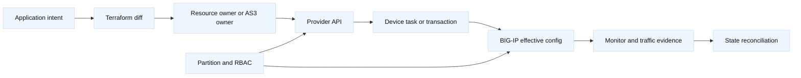
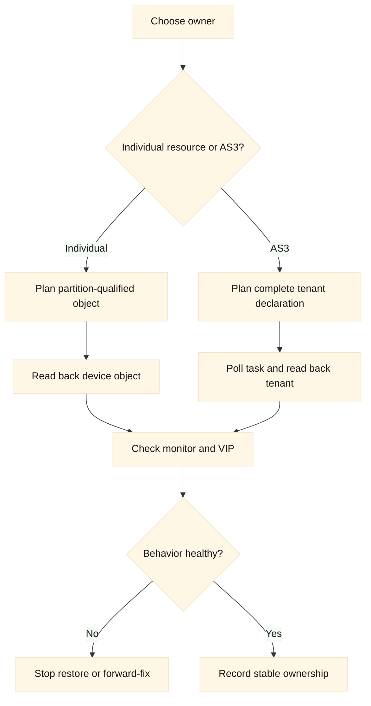
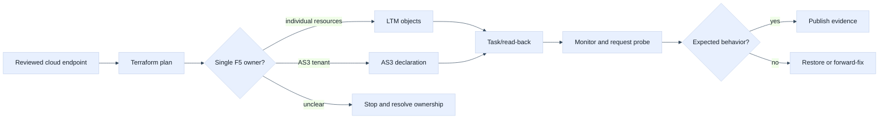

# 09. F5 BIG-IP Provider and AS3 Boundaries

## A. Learning objectives

This module teaches how to choose a Terraform ownership boundary for BIG-IP.
You will distinguish narrow `bigip_*` resources from the `bigip_as3`
declarative application-service boundary, understand partitions and folders,
and explain why a successful API task is not proof of a healthy virtual
server. You will also practice provider authentication, version compatibility,
state import, plan review, asynchronous outcomes, and safe rollback. The
interview outcome is a defensible answer about ownership and evidence rather
than a memorized list of F5 resource names.

## B. Prerequisites

Know LTM virtual servers, pools, pool members, monitors, profiles, partitions,
TLS termination, DNS/GTM at a conceptual level, HTTP APIs, Terraform state,
and the existing [F5 API and automation toolchain](../book/topics/33-f5-api-and-automation-toolchain.md).
Review [F5 LTM](../docs/03-f5-ltm.md) before attempting the exercises. Use a
disposable BIG-IP or a fixture-only lab. Do not place a token, password,
private key, response body, or real address in Markdown or plan output.

## C. Portable mental model

There are four different objects in an F5 Terraform conversation: desired
configuration, Terraform state, the provider's API calls, and the BIG-IP
effective configuration/data plane. These are related but not identical. A
provider can accept a request, create an object in the wrong partition, or
submit an AS3 declaration that later fails validation. A virtual server can be
enabled while every pool member is down. Therefore the evidence chain is
configuration diff, state, device read-back, task status, monitor state, and a
bounded client request.

Ownership is the central design problem. Individual resources are useful when
one team owns a narrow object and needs stable lifecycle addresses. AS3 is
useful when a team owns an entire application declaration and wants the device
to reconcile that declaration. **Inference:** selecting a tool before defining
the owner creates drift and oscillation. An AS3 tenant and a `bigip_ltm_pool`
resource must never manage the same pool or member lifecycle.





## D. AWS, GCP, and F5 mapping

| Concern | AWS | GCP | F5 BIG-IP |
| --- | --- | --- | --- |
| Edge object | ALB/NLB or target group | Cloud load balancer/backend service | Virtual server, pool, member |
| Scope | Account, Region, VPC | Project, region, global network | Device, partition, folder, route domain |
| Policy | Security groups/NACLs | Firewall policies | Profiles, iRules, AFM, SNAT |
| Declarative owner | AWS provider resource | Google provider resource | Individual provider resource or AS3, exclusively |
| Health evidence | Target health and logs | Backend health and logs | Monitor status plus client/server probe |

**Vendor terminology:** `bigip_ltm_pool`, `bigip_ltm_virtual_server`, and
`bigip_as3` are provider resource names; AS3, partition, tenant, virtual
server, and pool are F5 ecosystem terms. **Fact:** provider behavior depends on
provider version, BIG-IP/TMOS version, AS3 version, RBAC, and device capability.
Verify those dimensions instead of treating a registry example as universal.

## E. F5 setup and use

The provider should receive a hostname and secret through an approved runtime
identity. The version is illustrative and belongs in a lock-file review.

```hcl
terraform {
  required_version = ">= 1.6, < 2.0"
  required_providers {
    bigip = {
      source  = "F5Networks/bigip"
      version = "~> 1.28" # Illustrative; verify device compatibility.
    }
  }
}

provider "bigip" {
  address  = var.bigip_address
  username = var.bigip_username
  password = var.bigip_password # Inject at runtime; never commit.
  # Configure a trusted CA according to the selected provider release.
}

resource "bigip_ltm_pool" "training" {
  name                = "/Common/training_pool"
  load_balancing_mode = "round-robin"
  monitors            = ["/Common/tcp"]
}

resource "bigip_ltm_pool_attachment" "one" {
  pool = bigip_ltm_pool.training.name
  node = "/Common/training-node:8443"
}
```

The setup/use workflow is `terraform fmt`, `terraform init`,
`terraform validate`, a redacted `terraform plan`, explicit approval, and a
read-back. A lab-only device inspection could use
`tmsh -q list ltm pool /Common/training_pool` or an authenticated read-only
API request. Use `tmsh` only on a disposable target and never paste its output
if it contains secrets or customer topology. The plan should identify the
partition-qualified pool and attachment, not just an unqualified name.

For an application declaration, use one AS3 owner instead:

```hcl
resource "bigip_as3" "training_app" {
  as3_json = jsonencode({
    class = "AS3"
    action = "deploy"
    persist = true
    declaration = {
      class = "ADC"
      schemaVersion = "3.45.0"
      Sample = {
        class = "Tenant"
        app = {
          class = "Application"
          template = "generic"
          service = {
            class = "Service_HTTP"
            virtualAddresses = ["192.0.2.44"]
            pool = "pool"
          }
          pool = {
            class = "Pool"
            members = [{ servicePort = 8080, serverAddresses = ["192.0.2.55"] }]
          }
        }
      }
    }
  })
  # Keep this tenant exclusive to the AS3 declaration.
}
```

The JSON is intentionally fictional and may require schema changes for a
selected AS3 release. Verify the declaration schema before use. A task status
should be polled with a deadline, then the declaration and effective objects
read back. A `tmsh` or REST success response is not an HTTP health check.

## F. AWS setup and use

AWS or GCP often supplies the backend address, DNS record, or upstream load
balancer while F5 owns the edge. Keep those concerns explicit:

```hcl
provider "aws" {
  region              = var.aws_region
  allowed_account_ids = [var.expected_account_id]
  assume_role { role_arn = var.aws_role_arn }
}

resource "aws_lb_target_group" "training" {
  name     = "training-backend"
  port     = 8080
  protocol = "HTTP"
  vpc_id   = var.aws_vpc_id
}

provider "google" {
  project = var.gcp_project_id
  region  = "us-west1"
}

resource "google_compute_backend_service" "training" {
  name                  = "training-backend"
  protocol              = "HTTP"
  load_balancing_scheme = "EXTERNAL_MANAGED"
}
```

The AWS inspection is `aws elbv2 describe-target-groups` and
`describe-target-health`. Both are read-only examples with placeholder names.
An AWS backend output should contain an endpoint contract and ownership, not a
credential or an implicit promise that AWS health semantics match BIG-IP
monitors.

## G. GCP setup and use

GCP can supply a backend service while F5 owns the edge. Keep project and
global/regional scope explicit, and keep this provider state independent from
the F5 state unless an orchestration contract says otherwise.

```hcl
provider "google" {
  project = var.gcp_project_id
  region  = "us-west1"
}

resource "google_compute_backend_service" "training" {
  name                  = "training-backend"
  protocol              = "HTTP"
  load_balancing_scheme = "EXTERNAL_MANAGED"
  timeout_sec           = 10
}
```

Use `gcloud config get-value project` and
`gcloud compute backend-services describe training-backend --global` when the
selected load-balancer model uses a global backend service. Verify the backend
health and endpoint contract before adding an F5 member. A GCP API success is
not proof that the BIG-IP monitor reaches the same source, port, or TLS path.

## H. Plan, state, and ownership analysis

Before an F5 plan, record device, TMOS, provider, AS3, partition, folder,
RBAC role, and object owner. A resource name without partition context is an
ambiguous plan review. Import is especially risky: it binds a remote object to
a state address but does not infer the intended monitor, profile, persistence,
SNAT, or deletion policy. The next plan may propose changes immediately.

State can reveal VIPs, pool members, certificates, and topology. Backend access
must be restricted, and plans must be treated as sensitive artifacts. Separate
state by device/partition or ownership domain where recovery and permissions
differ. Do not use two states to “share” an object; expose a reviewed output
contract instead.

## I. Failure evidence and falsifiers

| Symptom | Evidence | Falsifier |
| --- | --- | --- |
| AS3 accepted, app unavailable | task detail, tenant read-back, monitor, client probe | successful request and healthy members |
| Resource creates duplicate pool | state address, partition, AS3 tenant, device list | one documented owner |
| 403 or filtered reads | principal, partition role, endpoint, request path | authorized read in intended partition |
| Timeout after apply | provider logs, task ID, device object | read-back proves prior or new stable state |
| Cloud backend is unhealthy | AWS/GCP health output, F5 monitor, tuple path | correlated cloud and F5 success |

## J. Safe rollback

Rollback begins by deciding whether the operation is known failed or unknown.
For an unknown timeout, do not retry blindly; inspect the task and effective
object. For a narrow pool-member change, restore the previous attachment only
after confirming the old member still exists. For AS3, restore a previously
reviewed declaration, but first check that another owner has not changed the
tenant. If a cloud backend was removed, F5 rollback alone cannot restore it.

Use `terraform plan -refresh-only` to understand state versus device, then a
fresh normal plan. `-target` can be a constrained recovery tool, never the
normal rollout model. Verification includes effective partition objects,
monitor state, TLS/listener behavior, and a bounded request through the VIP.

## K. Exercises

1. **Ownership whiteboard (30 minutes):** Choose individual resources or AS3
   for three scenarios: one pool-member change, a complete tenant declaration,
   and a legacy VIP with unknown ownership. Draw state, partition, provider,
   and read-back boundaries. Explain what you refuse to import.
2. **Ambiguous apply drill (35 minutes):** A provider times out after an AS3
   deployment. Build an evidence sequence that avoids a duplicate retry,
   determines task outcome, checks monitor and TLS state, and chooses restore,
   forward-fix, or stop. Include AWS/GCP backend evidence.

## L. Interview questions and direct answers

### J.1 Why must AS3 and individual resources not co-own a pool?

**Answer:** They can express different desired states for the same object.
One declaration may remove a member that a resource adds, producing drift or
oscillation. Ownership must be exclusive and partition-qualified.

**SDE2 focus:** Identify the shared object and explain the competing updates.

**Staff extension:** Define team contracts, state boundaries, drift detection,
change authority, and migration sequencing for legacy ownership.

### J.2 What does an accepted AS3 task prove?

**Answer:** It proves the device accepted or processed a declaration according
to the task result. It does not prove every object is effective, monitors are
up, TLS is correct, or a client request succeeds.

**SDE2 focus:** Poll the task, read back the tenant, and test a bounded path.

**Staff extension:** Define evidence retention, task deadlines, SLO probes, and
the decision rule for unknown outcomes.

### J.3 What should you verify before importing a VIP?

**Answer:** Verify device and partition, current owner, dependencies, profiles,
certificates, pool members, monitor behavior, state backup, and desired
configuration. Import only after lifecycle authority is explicitly approved.

**SDE2 focus:** Explain why import is not design discovery.

**Staff extension:** Establish a migration freeze, rollback owner, adoption
contract, and customer-impact gate before state acquisition.

### J.4 How would AWS or GCP fit behind F5?

**Answer:** Cloud Terraform can own the workload network and backend contract;
F5 Terraform can own the VIP and pool. Share only stable endpoint, port,
health, and ownership outputs. Verify both sides independently.

**SDE2 focus:** Trace the cloud backend to F5 monitor and client response.

**Staff extension:** Address partial failures, cross-team release cadence,
canary gates, rollback authority, and incompatible health semantics.

### J.5 How do you handle a provider timeout?

**Answer:** Treat it as unknown state. Use correlation/task data and read-only
device inspection to determine whether the change happened before deciding to
retry, restore, or stop.

**SDE2 focus:** Avoid duplicate creation and gather stable identifiers.

**Staff extension:** Set bounded retries, idempotency expectations, incident
ownership, and audit evidence for an ambiguous mutation.

### J.6 When is a narrow resource better than AS3?

**Answer:** When ownership is narrow, dependencies are understood, and a small
change should not replace an entire application declaration. AS3 is better for
an intentionally owned application graph. The boundary matters more than the
tool preference.

**SDE2 focus:** Compare lifecycle scope and plan review surface.

**Staff extension:** Weigh standardization, onboarding cost, drift control,
team autonomy, rollback, and long-term platform support.

## M. Extended end-to-end lab and ownership review

The decisive F5 Terraform question is not whether a resource can be expressed
in HCL. It is which system is the sole lifecycle owner, what the provider
actually observed, and how the data plane will be verified. The following
paired examples are intentionally separate: the first owns a narrow pool with
individual resources, while the second owns an entire AS3 tenant. They must
never target the same pool, member, virtual server, or partition path.

```hcl
# Pattern one: narrowly owned LTM objects in a disposable partition.
provider "bigip" {
  address   = var.f5_host
  username  = var.f5_user
  password  = var.f5_password
  partition = "LAB"
  # Use a trusted CA configuration; do not disable TLS verification.
}

resource "bigip_ltm_pool" "api" {
  name                = "/LAB/example_api_pool"
  load_balancing_mode = "round-robin"
  monitor             = "/LAB/example_https"
}

resource "bigip_ltm_pool_attachment" "api_member" {
  pool = bigip_ltm_pool.api.name
  node = "/LAB/example_api_node"
  port = 8443
}

# Pattern two: separate state and tenant, shown as a declaration boundary.
resource "bigip_as3" "checkout" {
  tenant_name = "EXAMPLE_CHECKOUT"
  declaration = file("example-as3-declaration.json")
}
```

The variables represent injected credentials and a placeholder device. A
review must confirm TMOS version, provider version, AS3 version, partition,
RBAC permissions, device-group behavior, and whether the declaration resource
waits for an asynchronous task. An accepted task is not equivalent to a
successful request. Read back the virtual server, pool, members, monitor,
profiles, routes, and translation behavior, then run a bounded test through
the expected listener.

An additional end-to-end handoff can consume a cloud endpoint without letting
F5 Terraform manage that cloud object:

```hcl
variable "backend_contract" {
  type = object({ address = string, port = number, health_path = string })
}

locals {
  # The contract is reviewed output, not an implicit remote-state entitlement.
  member_name = "/LAB/${replace(var.backend_contract.address, ".", "_")}"
}

resource "bigip_ltm_node" "cloud_backend" {
  name    = local.member_name
  address = var.backend_contract.address
}

resource "bigip_ltm_monitor" "cloud_health" {
  name     = "/LAB/example-cloud-health"
  send     = "GET ${var.backend_contract.health_path} HTTP/1.1\\r\\nHost: example.invalid\\r\\nConnection: close\\r\\n\\r\\n"
  receive  = "200"
  protocol = "https"
}
```

The plan review should call out any `-/+` node replacement, monitor changes,
partition moves, or AS3 declaration-wide diff. A declaration diff that removes
an unrelated application is a stop condition, even if the JSON is syntactically
valid. A node address change may be an intended blue/green handoff, but it
needs pool membership, health, DNS, and rollback evidence. If the provider
times out, do not reapply blindly: query the task or device state, record the
correlation identifier, and determine whether the object exists before retrying.



Troubleshooting must distinguish configuration from device behavior. If a
pool is down, check monitor source, TLS trust, Host header, route domain,
port, and backend response. If a virtual server is unreachable, check listener
address, VLAN/self-IP, route, SNAT, security policy, and cloud firewall. If an
AS3 task is accepted but the tenant is absent, inspect task status, declaration
schema, tenant permissions, and device logs. AWS and GCP read-back can prove a
backend endpoint exists, but not that F5 can route to it.

Cost and cleanup boundaries include licensed F5 capacity, cloud load-balancer
and NAT processing, health-check traffic, and cross-boundary bytes. Delete
only named lab objects in the LAB partition and never remove an AS3 tenant
without confirming its complete ownership and backup. A rollback of an F5
declaration cannot restore a cloud backend already deleted by another state.

Follow-up interview questions:

### M.1 What does an AS3 plan diff tell you, and what does it not tell you?

**Answer:** It tells me the declaration Terraform intends to submit and which
state-owned representation changes. It does not prove schema compatibility,
task completion, listener reachability, monitor health, or that unrelated
objects are safe to replace. I require task and data-plane evidence.

### M.2 How would you recover from an ambiguous F5 apply?

**Answer:** Preserve logs and the task identifier, query the device and AS3
tenant, compare state with read-back, and classify the result as applied,
partially applied, or not applied. Then choose an idempotent retry, explicit
repair, or rollback with an owner rather than running the whole pipeline again.

### M.3 When would you reject individual resources in favor of AS3?

**Answer:** When the application service is a coherent unit with shared
profiles, virtual servers, pools, and policy that must change together. I would
still require tenant ownership, declaration review, compatibility testing,
and a rollback strategy that understands declaration-wide blast radius.

## M. References and evidence labels

- **Vendor terminology:** [F5 BIG-IP provider](https://registry.terraform.io/providers/F5Networks/bigip/latest/docs)
  documents provider resources; verify the selected release.
- **Vendor terminology:** [F5 AS3 resource](https://registry.terraform.io/providers/F5Networks/bigip/latest/docs/resources/bigip_as3)
  documents declaration integration; verify BIG-IP and AS3 compatibility.
- **Fact:** [F5 AS3 documentation](https://clouddocs.f5.com/products/extensions/f5-appsvcs-extension/latest/)
  describes AS3 concepts; verify schema and task behavior.
- **Inference:** Exclusive lifecycle ownership is a platform engineering rule;
  confirm the actual owner and recovery path before adoption.
