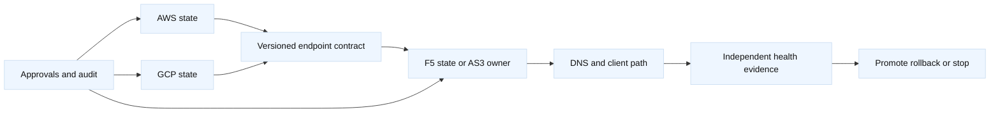
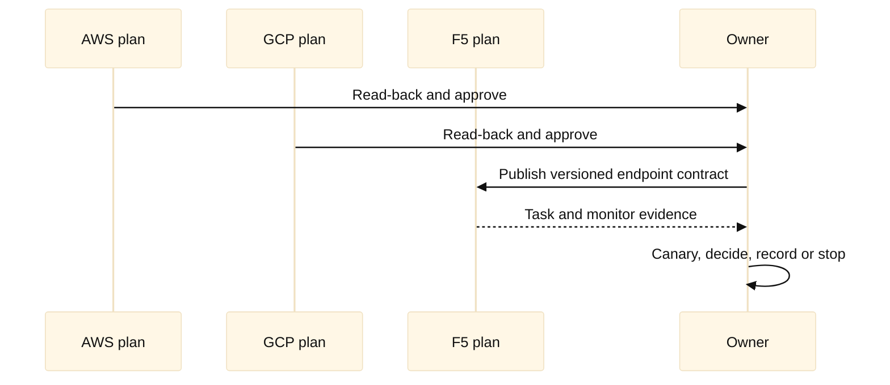
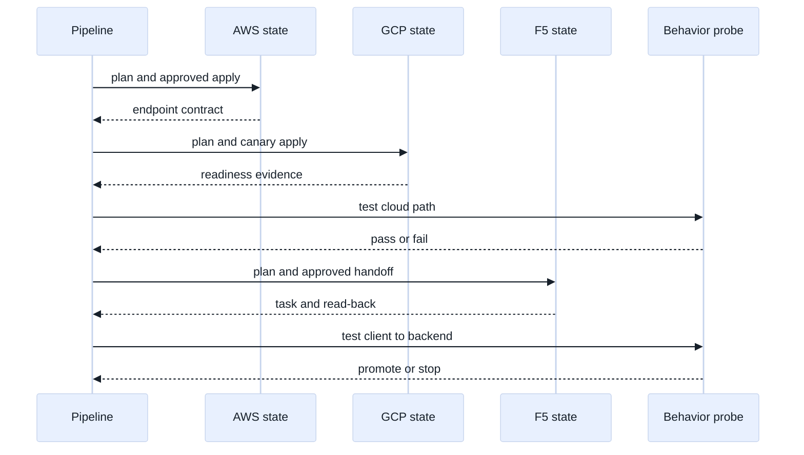

# 10. Multi-Provider Platform Patterns

## A. Learning objectives

Learn to compose AWS, GCP, and F5 changes without pretending Terraform is a
distributed transaction across three control planes. You will design provider
aliases, state boundaries, output contracts, sequencing, eventual-consistency
waits, DNS handoffs, and rollback points. You will practice explaining when a
single root module is appropriate, when separate states are safer, and how a
cloud workload can be handed to a BIG-IP edge without hidden ownership.

## B. Prerequisites

Know Terraform modules, provider aliases, state backends and locks, AWS/GCP
networking, F5 LTM/AS3, DNS, load-balancer health, CI approvals, and the cloud
track’s [private connectivity](../cloud-networking-interview/07-private-connectivity-and-service-publishing.md)
and [migration](../cloud-networking-interview/15-cloud-network-migration-and-modernization.md)
modules. Examples use placeholder projects, accounts, partitions, and
documentation ranges. They are not a production runbook.

## C. Portable mental model

Treat each provider as a separate control plane with its own API, identity,
state, rate limits, eventual consistency, health model, and failure mode.
Terraform can build one dependency graph, but an apply cannot atomically undo a
successful AWS mutation after a GCP or F5 mutation fails. A platform pattern
therefore needs explicit contracts: what is owned, what is exported, how a
consumer validates it, and who can roll it back.

**Inference:** separate state files are often the better default when teams,
credentials, recovery objectives, or release cadences differ. A root
orchestrator may still sequence approved child plans, but it should record
partial progress instead of promising all-or-nothing behavior.





## D. AWS, GCP, and F5 mapping

| Platform boundary | AWS | GCP | F5 |
| --- | --- | --- | --- |
| Identity | Account role/web identity | Project/service account/workload identity | Device user, token, partition RBAC |
| Endpoint | ALB/NLB DNS or target | Backend service/forwarding endpoint | VIP, pool, monitor |
| State | S3-style remote backend pattern | GCS remote backend pattern | State containing device topology |
| Failure signal | Target health, flow logs | Backend health, flow logs | Task, monitor, client/server probe |
| Ownership handoff | Outputs and tags | Outputs and labels | AS3 tenant or narrow resource |

Do not equate AWS and GCP load balancer names or health checks. Do not assume
an F5 monitor tests the same path as a cloud health check. **Fact:** provider
aliases select configurations; they do not make credentials, state, or APIs
transactional.

## E. AWS setup and use

The AWS child module may own a VPC-facing backend and export only a contract.
The alias makes the target visible during review.

```hcl
provider "aws" {
  alias               = "west"
  region              = "us-west-2"
  allowed_account_ids = [var.aws_account_id]
  assume_role { role_arn = var.aws_role_arn }
}

module "aws_backend" {
  source    = "./modules/aws-backend"
  providers = { aws = aws.west }
  name      = "training-backend"
  vpc_id    = var.aws_vpc_id
}

output "aws_backend_contract" {
  value = {
    endpoint = module.aws_backend.endpoint
    port     = module.aws_backend.port
    owner    = "aws-platform"
    health   = "HTTP 200 from /healthz in lab"
  }
  sensitive = false
}
```

Inspect context with `aws sts get-caller-identity` and the actual endpoint with
`aws elbv2 describe-load-balancers` or `describe-target-health`, depending on
the resource. Keep the command read-only and use placeholder names. The child
state should not silently own F5 DNS or a GCP record.

## F. GCP setup and use

The GCP child module receives a project explicitly. Global network scope and
regional workload scope must be visible in the contract.

```hcl
provider "google" {
  alias   = "training"
  project = var.gcp_project_id
  region  = "us-west1"
}

module "gcp_backend" {
  source    = "./modules/gcp-backend"
  providers = { google = google.training }
  name      = "training-backend"
  region    = "us-west1"
}

output "gcp_backend_contract" {
  value = {
    endpoint = module.gcp_backend.endpoint
    port     = module.gcp_backend.port
    scope    = "project=${var.gcp_project_id},region=us-west1"
    owner    = "gcp-platform"
  }
}
```

Verify with `gcloud config get-value project`,
`gcloud compute backend-services describe training-backend --global` or the
appropriate regional command, and a read-only log/health query. Never copy
credentials or full plan artifacts into a cross-provider output.

## G. F5 setup and use

F5 consumes a versioned endpoint contract and owns only the partition-qualified
edge objects. This narrow resource is appropriate only if the pool is not in
an AS3-owned tenant.

```hcl
provider "bigip" {
  address  = var.bigip_address
  username = var.bigip_username
  password = var.bigip_password # Runtime secret only.
}

resource "bigip_ltm_pool" "cloud_backend" {
  name                = "/Common/training_cloud_pool"
  load_balancing_mode = "round-robin"
  monitors            = ["/Common/tcp"]
}

resource "bigip_ltm_pool_attachment" "cloud_endpoint" {
  pool = bigip_ltm_pool.cloud_backend.name
  node = "/Common/endpoint-placeholder:8443"
}
```

Read-only use could be `tmsh -q list ltm pool /Common/training_cloud_pool`
followed by a bounded VIP probe from a lab client. If AS3 owns the application,
put the entire pool/service in the AS3 declaration instead. The platform
contract must specify who changes the endpoint, how a new backend is accepted,
and which team owns rollback when a cloud child state is unavailable.

## H. Orchestration, state, and ownership analysis

Use one state when resources have the same owner, identity, recovery policy,
and meaningful dependency graph. Use separate states when a provider outage,
credential boundary, or release schedule should not block unrelated changes.
`terraform_remote_state` can publish values, but it grants readers access to
state metadata and does not create an atomic transaction. A versioned artifact
or service registry may be safer when the contract is intentionally small.

A cross-provider pipeline should be explicit: validate all modules, plan AWS,
plan GCP, plan F5, policy-check each plan, approve the sequence, apply one
saved plan, read back, publish evidence, then continue. If AWS succeeds and
F5 fails, record the partial state and choose pause, restore AWS, or forward-fix
F5. Never rerun the whole graph blindly.

## I. Worked scenario, failures, and falsifiers

An organization migrates from an F5 VIP to a GCP backend while an AWS service
remains available for rollback. The first stage creates the GCP backend and
health check. The second attaches it to a non-production F5 pool. The third
uses a DNS canary. The final stage changes default traffic only after request
and error evidence meets the gate. AWS remains a rollback target until the
stability window expires.

| Failure hypothesis | Evidence | Falsifier |
| --- | --- | --- |
| Wrong provider target | aliases, identity, plan self-links | all target IDs match contract |
| Partial apply | child plan IDs, state versions, API read-back | every step has terminal evidence |
| F5 monitor mismatch | monitor type, source path, backend logs | end-to-end probe succeeds |
| DNS stale path | resolver answers, TTL, canary distribution | expected clients reach new path |
| Duplicate ownership | resource addresses, AS3 tenant, device audit | one owner per object |

## J. Safe rollback and exercises

Rollback is a workflow, not a single Terraform command. Stop new applies,
preserve state and plan IDs, identify the last known-good contract, and decide
whether to restore DNS, F5 membership, or cloud routing. Re-plan each child
against current remote state. A stale saved plan is not a rollback artifact.
If data writes crossed the boundary, network rollback may not undo application
state; the service owner must provide a data recovery plan.

1. **Design drill (35 minutes):** Draw AWS workload, GCP migration target,
   F5 edge, DNS, three states, identities, contracts, and approvals. Explain
   why your ordering is safe when the F5 apply times out.
2. **Partial-progress drill (30 minutes):** AWS and GCP plans applied, but F5
   monitor fails. Produce evidence, stop conditions, rollback options, and a
   follow-up that prevents a second state from adopting the same pool.

## K. Interview questions and direct answers

### J.1 Why is multi-provider apply not a distributed transaction?

**Answer:** Each provider has independent APIs, state, timing, and rollback
semantics. Terraform can order calls but cannot atomically undo external side
effects across AWS, GCP, and F5.

**SDE2 focus:** Explain dependency order and partial failure.

**Staff extension:** Design durable checkpoints, ownership, approvals, and
customer-safe recovery for every boundary.

### J.2 What belongs in a provider handoff contract?

**Answer:** Endpoint, port/protocol, health expectation, scope, version, owner,
readiness evidence, and rollback authority. It must exclude secrets and hidden
state coupling.

**SDE2 focus:** Show variables, outputs, and consumer validation.

**Staff extension:** Add compatibility policy, deprecation, SLA, audit, and
partial-failure behavior.

### J.3 When would you split states?

**Answer:** Split when ownership, credentials, failure domains, recovery goals,
or release cadence differ. Keep the interface small and versioned.

**SDE2 focus:** Explain locks and output dependencies.

**Staff extension:** Balance coordination overhead against blast radius and
define contract tests and escalation paths.

### J.4 How do you sequence a cloud-to-F5 migration?

**Answer:** Create and validate the target, attach it as a canary, verify
health and traffic, shift gradually, preserve the old path, and retire it only
after a stability window.

**SDE2 focus:** Identify read-back and behavioral gates.

**Staff extension:** Address DNS caching, customer cohorts, data consistency,
rollback authority, and organizational ownership.

### J.5 What is the risk of remote state as an interface?

**Answer:** It can expose more metadata than intended, couple release timing,
and fail when the backend is unavailable. It still does not make changes
atomic.

**SDE2 focus:** Compare outputs with remote-state reads.

**Staff extension:** Choose a least-privilege contract publication mechanism
and define availability/recovery for it.

### J.6 How do you prove a cross-provider change worked?

**Answer:** Correlate plans and read-back from each provider with a bounded
end-to-end request, health metrics, logs, and error/SLO evidence. No single
provider response is sufficient.

**SDE2 focus:** Trace the request across cloud, F5, DNS, and backend.

**Staff extension:** Set evidence retention, statistical confidence, canary
thresholds, and a stop rule before the rollout begins.

## L. Extended orchestration lab and partial-failure review

The safest multi-provider design treats Terraform as three independently
planned systems connected by a narrow, versioned contract. The contract can
contain an endpoint, port, health path, expected source identity, and readiness
evidence. It must not silently grant one state access to another state’s
credentials or lifecycle. This avoids the false promise that AWS, GCP, and F5
changes commit atomically.

```hcl
variable "release_id" { type = string, default = "example-2026-08-31" }

module "aws_backend" {
  source   = "./stacks/aws-backend"
  release  = var.release_id
  provider = aws.us_west_2
}

module "gcp_canary" {
  source   = "./stacks/gcp-canary"
  release  = var.release_id
  provider = google.us_west1
}

locals {
  endpoint_contract = {
    release     = var.release_id
    address     = module.gcp_canary.private_endpoint
    port        = 8443
    health_path = "/readyz"
    evidence_id = module.gcp_canary.readiness_evidence_id
  }
}

module "f5_edge" {
  source           = "./stacks/f5-edge"
  endpoint         = local.endpoint_contract
  ownership_marker = "EXAMPLE_CHECKOUT"
}
```

The example assumes the module provider configurations are valid, the AWS
rollback backend remains available, the GCP canary endpoint is private and
reachable from F5, and DNS or client routing is changed only after behavior is
verified. The `provider` lines illustrate aliases, not a recommendation to
put all systems into one state. In practice, separate root modules and
pipelines often provide stronger locks and credentials boundaries.

A review sequence is: validate and test all roots; plan AWS and GCP; apply the
approved AWS or GCP saved plan; read back resources; run a canary; plan and
apply the F5 handoff; verify end to end; then shift traffic. If AWS succeeds,
GCP succeeds, and F5 fails, the state is partial. Do not rerun the root graph
blindly. Record each applied release, freeze further writers, decide whether
to keep the new cloud endpoint while repairing F5, or restore the previous
contract, and re-plan each state against current remote reality.



The plan diff must be reviewed at provider boundaries. A GCP change that
updates a private endpoint is not enough if the F5 member still points at the
old address. An AWS output change may be harmless in its own state but unsafe
if consumers cache it. An F5 declaration removal can affect unrelated tenants.
Diff annotations should include owner, expected downstream contract change,
verification evidence, and rollback action.

For calculations, assume 10,000 requests per minute, 2% retries, and 3
downstream calls per request. Expected downstream call rate is `10,000 * 1.02
* 3 = 30,600 calls/minute`, or 510 calls/second. Size backend and F5 pool
capacity for that load plus the agreed failure factor, not just the client
rate. Also estimate cross-cloud egress, NAT processing, logging, and health
check traffic with current pricing. Cost ownership should be written into
the contract, especially when one team pays for another team’s egress.

Security edge cases include confused-deputy access through remote state,
provider aliases pointing to the wrong account or project, plan artifacts
containing endpoints or sensitive values, and F5 credentials shared across
pipelines. Use short-lived identities, account/project assertions, separate
locks, redacted artifacts, and explicit approval boundaries. Cleanup means
deleting only the named canary and edge objects after traffic is restored and
all consumers are detached.

Follow-up interview questions:

### L.1 How do you make a provider handoff reliable without distributed transactions?

**Answer:** Use a versioned contract, explicit sequencing, idempotent stages,
read-back evidence, canary gates, and a recorded partial-progress state. Each
stage has an owner and stop rule; recovery is a deliberate choice between
repairing forward and restoring the previous contract.

### L.2 What would you do if remote state is unavailable during a migration?

**Answer:** Stop mutations that depend on unknown outputs, use approved
read-only provider checks where safe, restore backend access, and verify lock
and backup status. I would not reconstruct or guess state from a stale plan.

### L.3 Which interface would you expose to an F5 team?

**Answer:** A minimal endpoint contract with address, port, health semantics,
TLS expectations, source identity, readiness evidence, expiry, owner, and
rollback version. I would exclude credentials, whole state, and implementation
details that create accidental co-ownership.

## L. References and evidence labels

- **Fact:** [Terraform provider configuration](https://developer.hashicorp.com/terraform/language/providers/configuration)
  documents aliases and provider selection.
- **Vendor terminology:** [AWS provider](https://registry.terraform.io/providers/hashicorp/aws/latest/docs),
  [Google provider](https://registry.terraform.io/providers/hashicorp/google/latest/docs),
  and [F5 provider](https://registry.terraform.io/providers/F5Networks/bigip/latest/docs)
  document provider-specific behavior.
- **Inference:** Separate states and versioned contracts reduce blast radius;
  validate the model against team ownership and recovery objectives.
