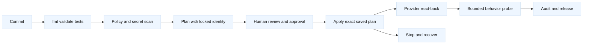
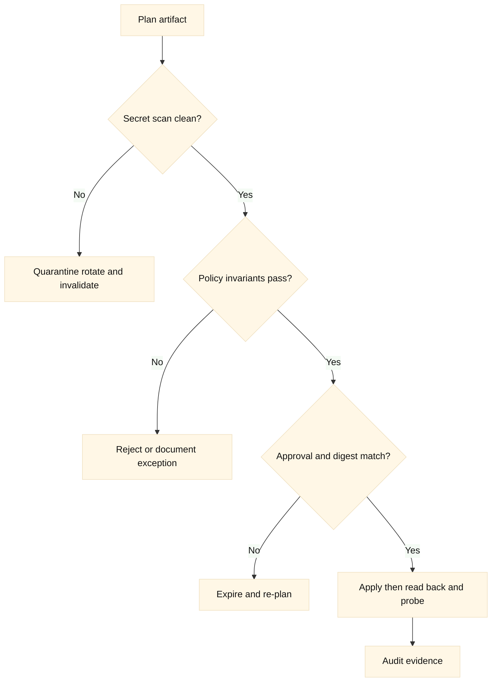
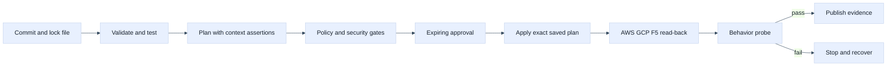

# 11. Testing, Policy, CI/CD, and Security

## A. Learning objectives

This module turns Terraform from a command-line habit into a reviewable
delivery system. You will design a pipeline that validates HCL, checks module
contracts, produces a protected plan, applies only the approved plan, and
verifies both provider state and behavior. You will compare AWS, GCP, and F5
identity and policy boundaries, reason about secret exposure in plans, and
explain why static validation cannot prove network health. Staff-level answers
must include concurrency, auditability, separation of duties, recovery, and
the cost of false confidence.

## B. Prerequisites

Know Terraform plans, state backends, provider aliases, AWS/GCP IAM concepts,
F5 partitions and RBAC, CI jobs, policy-as-code, unit tests, and network
verification. Review [state and locking](03-state-backends-locking-and-workspaces.md)
and [safe change](05-plan-apply-lifecycle-and-safe-change.md). Examples use
fictional accounts, projects, partitions, and domains. Treat all output as
potentially sensitive.

## C. Portable mental model

A safe pipeline has separate gates for syntax, provider initialization,
module behavior, policy, plan review, mutation, and data-plane verification.
`terraform validate` can catch configuration errors, but it cannot confirm
that an AWS route is useful, a GCP firewall selects the intended target, or an
F5 monitor is healthy. A plan can also contain values that reveal topology or
secrets. The pipeline must therefore minimize permissions, redact artifacts,
and make the applied plan identifiable.





## D. AWS, GCP, and F5 mapping

| Control | AWS | GCP | F5 |
| --- | --- | --- | --- |
| CI identity | Assumed role or web identity | Workload identity/service account | Least-privilege device account/token |
| Plan target guard | Account ID, Region, tags | Project ID, region, labels | Device, partition, folder |
| Policy check | SG, route, public exposure, quotas | Firewall, IAM, public exposure, quotas | AS3 tenant, profiles, VIP, partition |
| Behavioral proof | Target health, flow/log probe | Backend health, flow/log probe | Monitor plus VIP request |
| Sensitive artifact | Plan/state and role context | Plan/state and project topology | VIPs, pool members, certificates, tokens |

**Fact:** CI credentials need permissions to perform the planned operation;
validation credentials and apply credentials need not be identical. **Vendor
terminology:** IAM roles, service accounts, and BIG-IP partitions are provider
concepts, not interchangeable security controls. **Inference:** the same gate
names can be portable while their policy rules remain provider-specific.

## E. AWS setup and use

An AWS CI job should use an ephemeral identity and verify account context. The
following provider configuration is illustrative; pin the provider in the lock
file and keep role trust outside the repository.

```hcl
provider "aws" {
  region              = var.aws_region
  allowed_account_ids = [var.expected_account_id]
  assume_role {
    role_arn     = var.ci_role_arn
    session_name = "terraform-training"
  }
}

resource "aws_security_group" "edge" {
  name   = "training-edge"
  vpc_id = var.aws_vpc_id
  ingress {
    description = "reviewed example range"
    protocol = "tcp"
    from_port = 8443
    to_port = 8443
    cidr_blocks = ["198.51.100.0/24"]
  }
  egress { protocol = "-1" from_port = 0 to_port = 0 cidr_blocks = ["0.0.0.0/0"] }
}
```

The CI preflight can run `aws sts get-caller-identity`, then
`terraform fmt -check`, `terraform init -lockfile=readonly`,
`terraform validate`, and `terraform plan -out=tfplan`. Review the plan for
account, region, public routes, security-group widening, replacement, and
expected cost. Store a protected, short-lived plan reference rather than
posting raw plan output to an untrusted pull request. `aws ec2
describe-security-groups` and route-table reads are useful post-apply evidence.

## F. GCP setup and use

GCP CI should establish project context from workload identity rather than a
long-lived JSON key. The example intentionally sets project and region in the
provider.

```hcl
provider "google" {
  project = var.ci_project_id
  region  = "us-west1"
}

resource "google_compute_firewall" "edge" {
  name    = "training-edge"
  network = var.gcp_network_name
  allow { protocol = "tcp" ports = ["8443"] }
  source_ranges = ["198.51.100.0/24"]
  target_tags   = ["training-edge"]
}
```

The preflight may run `gcloud auth list`, `gcloud config get-value project`,
and a read-only `gcloud compute firewall-rules describe training-edge
--project=PROJECT_PLACEHOLDER`. The plan policy should fail if the project is
not an approved training target or a firewall is broader than the declared
contract. After apply, compare the rule, target selection, flow evidence, and
a bounded connection test; a created rule is not proof that a VM listens.

## G. F5 setup and use

F5 CI requires a device endpoint, a least-privilege account, trusted TLS, and a
clear partition or AS3 tenant owner. A pipeline must not scan or mutate a
production device as a side effect of a pull request.

```hcl
provider "bigip" {
  address  = var.lab_bigip_address
  username = var.ci_bigip_username
  password = var.ci_bigip_password # Injected secret; never a tfvars commit.
}

resource "bigip_ltm_virtual_server" "training" {
  name        = "/Common/training_vip"
  destination = "192.0.2.44:443"
  pool        = "/Common/training_pool"
  profiles    = ["/Common/tcp"]
}
```

A lab inspection can use `tmsh -q list ltm virtual /Common/training_vip` and a
bounded HTTPS request that does not include private data. If AS3 owns the
tenant, use an AS3 declaration and test the declaration/task boundary instead;
do not mix a `bigip_ltm_virtual_server` resource with the same AS3 object. The
pipeline should redact tokens, certificate material, and plan values and keep
F5 device identifiers out of public logs.

## H. Testing and policy analysis

Testing operates at multiple levels. Formatting and validation test syntax.
Module tests test input/output contracts and stable `for_each` addresses.
Provider contract tests can use a disposable account/project/device or mocked
fixtures, but mocks cannot prove provider/API compatibility. Plan policies can
reject public CIDRs, missing tags/labels, unapproved accounts/projects,
unbounded destruction, unreviewed F5 partitions, or a resource whose owner is
already an AS3 tenant. A policy pass means the rule matched; it does not prove
the network works.

The apply job should receive the exact approved plan, enforce a state lock,
record commit, actor, provider lock file, target identity, plan digest, and
approval, then read back remote objects. A behavior job should run only inside
a declared test boundary and report its source, destination, protocol, and
time. Do not make a pipeline “green” because a provider returned 2xx.

## I. Worked scenario, failures, and falsifiers

A pull request changes an AWS route, a GCP firewall, and an F5 pool. Static
tests pass. Policy flags the AWS default route, the GCP source range, and a
pool already present in an AS3 tenant. The correct result is a failed gate,
not a broad exception. Split ownership, narrow the ranges, and generate new
plans. If one child applies before another fails, preserve the applied plan
and stop rather than rerun all providers.

| Hypothesis | Evidence | Falsifier |
| --- | --- | --- |
| Wrong CI identity | cloud identity, device audit, job metadata | all targets match approved context |
| Secret exposed | artifact permissions, scan result, logs | no secret in source or artifacts |
| Policy missed public access | plan JSON, rule semantics, test fixture | explicit deny test fails closed |
| Apply used stale plan | digest, state serial, lock, commit | applied digest equals approved digest |
| Provider success is unhealthy | read-back, monitor/logs, probe | end-to-end evidence passes |

## J. Safe rollback and exercises

Approval must include a rollback condition and authority. If the applied plan
widens a rule, restoring the prior reviewed plan may be safe after confirming
no emergency dependency. If it deletes a subnet, VIP, or F5 member, do not
promise restoration without data and dependency checks. An emergency pipeline
may stop further automation, preserve artifacts, and apply a narrowly reviewed
forward fix. Never hide risk with `-auto-approve`; never use `-target` as the
normal CI strategy.

1. **Pipeline review (30 minutes):** Given a pipeline that runs plan on a pull
   request and auto-applies on merge, identify identity, artifact, freshness,
   approval, lock, policy, and verification gaps. Redesign it for AWS, GCP,
   and F5 without exposing credentials.
2. **Policy exercise (35 minutes):** Write policy tests in prose for a public
   default route, a GCP firewall wider than `/24`, an F5 resource inside an
   AS3 tenant, and a destroy of an untagged shared object. For each, state a
   legitimate exception and the evidence required to approve it.

## K. Interview questions and direct answers

### J.1 Why apply the exact saved plan?

**Answer:** It ties mutation to the reviewed graph, inputs, provider lock, and
state snapshot. Re-planning at apply can change actions after review; a saved
plan still needs a freshness and lock boundary.

**SDE2 focus:** Explain plan, state serial, provider, and apply sequencing.

**Staff extension:** Define artifact integrity, approval authority, concurrency,
expiry, audit, and recovery when the plan becomes stale.

### J.2 What should policy-as-code reject?

**Answer:** It should reject violations of explicit safety invariants, such as
unapproved targets, public exposure, broad source ranges, destructive changes,
missing ownership, or secrets in artifacts. Policies should be testable and
versioned.

**SDE2 focus:** Map a rule to a plan attribute.

**Staff extension:** Design exception governance, false-positive handling,
ownership, rollout, and metrics for policy effectiveness.

### J.3 Why are provider mocks insufficient?

**Answer:** Mocks test module logic but not provider schema, API behavior,
permissions, eventual consistency, quotas, or real data-plane health. Use
disposable integration tests for high-risk contracts.

**SDE2 focus:** Distinguish unit, plan, integration, and behavioral tests.

**Staff extension:** Choose risk-based test investment and failure isolation
across AWS, GCP, and F5.

### J.4 How do you protect Terraform artifacts?

**Answer:** Minimize content, restrict access, encrypt storage, set retention,
scan logs, avoid raw plan publication, and assume state and plans may contain
sensitive topology or values.

**SDE2 focus:** Identify secrets and artifact controls.

**Staff extension:** Define threat model, incident response, rotation, audit,
and separation of duties for CI identities.

### J.5 What makes a verification step meaningful?

**Answer:** It states source, destination, protocol, expected result, time
boundary, and evidence. It checks provider read-back and a safe behavior path
without claiming one signal proves all layers.

**SDE2 focus:** Trace a request and its logs.

**Staff extension:** Set SLO thresholds, canary populations, statistical
confidence, and stop/rollback criteria before applying.

### J.6 How should an emergency exception work?

**Answer:** It should be narrow, time-bounded, attributable, approved by the
incident authority, and followed by a fresh plan and reconciliation. An
exception should reduce immediate risk, not permanently bypass controls.

**SDE2 focus:** Explain evidence and follow-up plan.

**Staff extension:** Define blast-radius limits, customer communication,
post-incident ownership, and controls that prevent recurrence.

## L. Extended pipeline lab and adversarial review

The useful test of an infrastructure pipeline is not whether it can produce a
green plan. It is whether it prevents an unsafe plan from reaching AWS, GCP,
or F5 and whether the evidence remains useful after a partial failure. The
following pseudocode makes the freshness boundary and provider-specific gates
visible:

```yaml
jobs:
  terraform:
    steps:
      - run: terraform fmt -check -recursive
      - run: terraform init -lockfile=readonly
      - run: terraform validate
      - run: terraform test
      - run: terraform plan -out=example.tfplan
      - run: policy-check example.tfplan --deny-destroy-shared --deny-public-default
      - run: verify-context --aws-account 111111111111 --gcp-project example-lab-project --f5-partition LAB
      - manual: approve-with-expiry-and-owner
      - run: terraform apply example.tfplan
      - run: aws read-back --redacted
      - run: gcloud read-back --project example-lab-project
      - run: f5 task-and-monitor-check --partition LAB
      - run: bounded-probe --source example-canary --destination example-service
```

The plan must be treated as expiring evidence. Between plan and apply, a
provider version, remote change, lock, quota, or dependent deployment can
change the outcome. A strong gate binds the saved plan to commit, workspace,
provider lock file, account/project/partition, approval expiry, and state
serial. If any boundary changes, generate a new plan.

Consider this sample diff:

```text
  # aws_security_group.example will be updated in-place
  ~ ingress { cidr_blocks = ["198.51.100.0/24"] -> ["0.0.0.0/0"] }
  # google_compute_firewall.example will be created
  + source_ranges = ["0.0.0.0/0"]
  # bigip_as3.example will be updated in-place
  ~ declaration = "...tenant EXAMPLE..." -> "...tenant EXAMPLE..."
```

The first two lines should fail policy immediately because exposure widened.
The F5 line requires semantic JSON review, not merely a textual diff: a small
declaration change may delete a pool or alter a shared profile. If a policy
tool cannot parse provider-specific meaning, it should fail closed for high
blast-radius resources and require a human owner. A passing static policy is
not proof of application health.

Provider verification needs different assertions. AWS should confirm caller
identity, account, Region, route associations, security-group direction, and
flow evidence. GCP should confirm project, global network, regional subnet,
firewall target, labels, and connectivity evidence. F5 should confirm trusted
TLS, partition, task outcome, declaration tenant, monitor state, and request
behavior. Do not place credentials or raw secrets in logs, plan files, test
fixtures, or uploaded artifacts.



Testing edge cases deserve explicit interview discussion. Provider mocks can
miss API defaults, eventual consistency, quota errors, and F5 asynchronous
tasks. Contract tests should check the output shape passed between states.
Negative tests should reject wrong AWS accounts, wrong GCP projects, public
CIDRs, missing F5 partition ownership, untrusted TLS, and plan destroys of
shared resources. A canary should test the intended source and destination,
not only a control-plane API.

Rollback is not always “apply the previous commit.” If a plan created a new
NAT, route, firewall, or F5 member, the inverse may be safe. If it deleted a
subnet, changed DNS, or caused application writes, rollback can be destructive
or incomplete. Define the stop condition, traffic freeze, owner, evidence
retention, and cleanup boundary before approval. Cost controls should reject
unexpected NAT gateways, public load balancers, cross-region transfer, large
flow-log volume, and unbounded F5 capacity in a lab. Use current pricing and
quota sources; never encode remembered limits as policy.

Follow-up interview questions:

### L.1 What is the most dangerous false positive in a Terraform pipeline?

**Answer:** A green plan or apply that is interpreted as service health. It
can hide wrong-account context, a bad route, an overbroad policy, an unhealthy
F5 monitor, or a backend that is unreachable from real clients. I require
read-back and a bounded behavioral check.

### L.2 How should policy handle provider-specific resources it cannot understand?

**Answer:** Classify them by blast radius. Low-risk changes can use review and
read-back; high-risk or declaration-wide changes should fail closed until a
provider-aware policy or named owner reviews them. Unknown is not equivalent
to safe.

### L.3 What would you do if approval is granted but the plan expires?

**Answer:** Reject the stale artifact, refresh state, verify identity and lock
file, produce a new plan, and re-run policy and approval. Approval attaches to
specific evidence, not to a branch forever.

## L. References and evidence labels

- **Fact:** [Terraform plan](https://developer.hashicorp.com/terraform/cli/commands/plan)
  and [apply](https://developer.hashicorp.com/terraform/cli/commands/apply)
  document plan/apply behavior; verify the selected CLI version.
- **Fact:** [Terraform testing](https://developer.hashicorp.com/terraform/language/tests)
  describes Terraform test facilities; verify provider support and test scope.
- **Vendor terminology:** [AWS provider](https://registry.terraform.io/providers/hashicorp/aws/latest/docs),
  [Google provider](https://registry.terraform.io/providers/hashicorp/google/latest/docs),
  and [F5 provider](https://registry.terraform.io/providers/F5Networks/bigip/latest/docs)
  document provider-specific resources.
- **Inference:** A layered pipeline lowers risk but cannot replace service-owner
  evidence and a tested recovery procedure.
