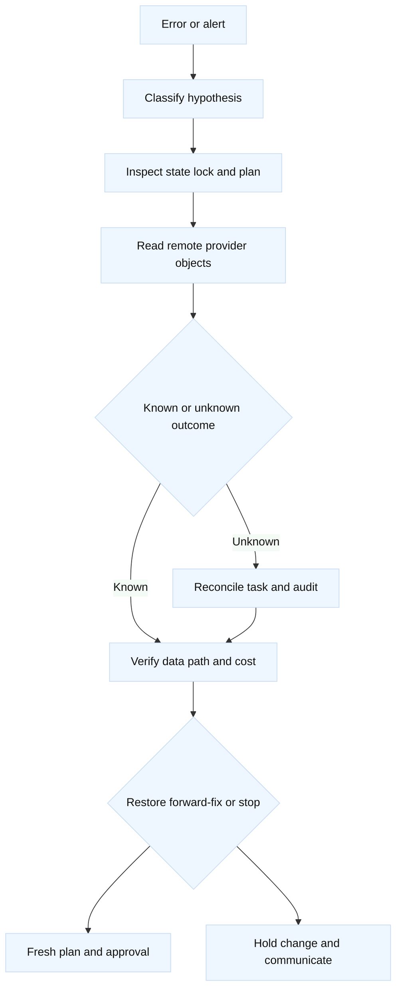
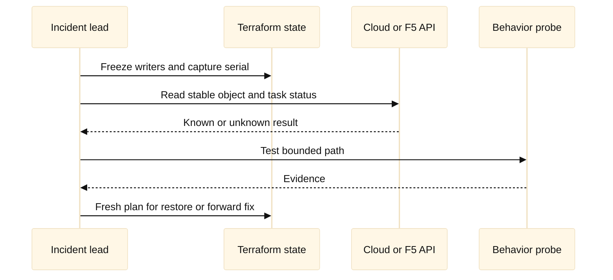
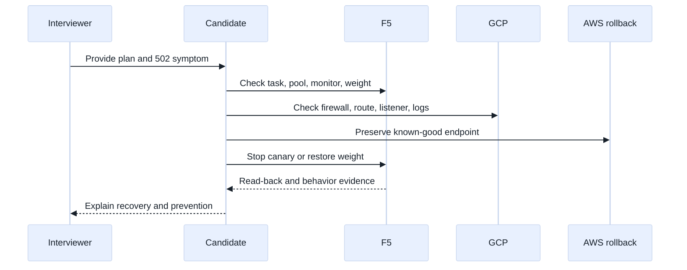

# 12. Debugging, Rollback, Cost, and Interview Loops

## A. Learning objectives

This capstone module combines Terraform debugging with SDE2 and Staff-level
communication. You will classify failures as configuration, provider/API,
state, permission, eventual-consistency, capacity/cost, or data-plane failures.
You will decide when to refresh, re-plan, import, restore, forward-fix, or
stop. The scenarios span AWS networking, GCP drift, and an F5 AS3/resource
ownership conflict. You will also practice cost reasoning without inventing
current prices and explain how to lead a safe incident when an apply has an
ambiguous result.

## B. Prerequisites

Complete modules 01–11 or understand Terraform execution, provider aliases,
remote state, locking, modules, imports, AWS/GCP networking, F5 LTM/AS3,
CI/policy, and rollback. Review repository [interview dialogue exercises](../docs/interview-dialogue-exercises.md)
and [staff design review pack](../docs/staff-design-review-pack.md). All
examples use fictional names, documentation addresses, and placeholder IDs.
They are interview labs, not instructions to mutate a real environment.

## C. Portable mental model

The first debugging question is not “which command should I run?” It is “what
state transition did we intend, what actually happened, and which evidence can
separate those hypotheses?” Terraform has configuration state, provider
state, remote control-plane state, and data-plane behavior. Costs and quotas
form a fifth boundary: a plan may be syntactically correct and still exceed a
budget or limit.

When a command times out, the result is unknown, not automatically failed.
Inspect stable identifiers, task status, state lock, audit events, and remote
read-back before retrying. A rollback should be selected from the last
known-good state and current dependencies; it is not necessarily the inverse
of the last API call.





## D. AWS, GCP, and F5 mapping

| Debug dimension | AWS | GCP | F5 |
| --- | --- | --- | --- |
| Target identity | Account, role, Region | Project, service account, region | Device, user, partition |
| Control evidence | CloudTrail/API read, state | Audit/API read, state | Task, audit, object read-back |
| Data evidence | Flow logs, target health, probe | Flow logs, backend health, probe | Monitor, client/server logs, VIP probe |
| Cost pressure | NAT, cross-AZ, LB, IP/egress | NAT, egress, LB, cross-region | Throughput, licenses, capacity, pool members |
| Recovery boundary | Route/security/LB and workload | Firewall/route/LB and workload | AS3 tenant/resource and device config |

**Fact:** pricing, quotas, provider schemas, and service behavior change; use
the selected provider and cloud pricing/quota source instead of remembered
numbers. **Vendor terminology:** CloudTrail, Cloud Audit Logs, AS3 tasks, and
flow logs identify different evidence systems. **Inference:** evidence should
be correlated by time, request, object, and owner before a recovery decision.

## E. AWS setup and use

The AWS debugging lab uses a provider alias and a deliberately visible route
change. The values are placeholders and the code is for plan review only.

```hcl
provider "aws" {
  alias               = "lab"
  region              = var.aws_region
  allowed_account_ids = [var.training_account_id]
  assume_role { role_arn = var.training_role_arn }
}

resource "aws_route" "egress" {
  route_table_id         = var.private_route_table_id
  destination_cidr_block = "0.0.0.0/0"
  nat_gateway_id         = var.nat_gateway_id
}

resource "aws_cloudwatch_log_group" "training" {
  name              = "/training/terraform-network"
  retention_in_days = 7
}
```

The read-only sequence is `aws sts get-caller-identity`,
`aws ec2 describe-route-tables --route-table-ids RTB_PLACEHOLDER`,
`aws ec2 describe-nat-gateways --nat-gateway-ids NAT_PLACEHOLDER`, and the
appropriate flow/target evidence query. The plan must show the intended
account, table, destination, and next hop. Do not infer from a route that the
private workload has a usable path; inspect association, security policy,
NACL return behavior, NAT health, and the bounded probe.

## F. GCP setup and use

GCP debugging must make project and resource scope explicit. This example
uses a firewall change whose effect depends on target selection.

```hcl
provider "google" {
  project = var.training_project_id
  region  = "us-west1"
}

resource "google_compute_firewall" "debug_allow" {
  name          = "training-debug-allow"
  network       = var.training_network
  direction     = "INGRESS"
  priority      = 1100
  source_ranges = ["198.51.100.0/24"]
  target_tags   = ["training-debug"]
  allow { protocol = "tcp" ports = ["8443"] }
}
```

Use `gcloud config get-value project`,
`gcloud compute firewall-rules describe training-debug-allow
--project=PROJECT_PLACEHOLDER`, and the appropriate flow/log query. Confirm
the VM target tag, route, listener, and return path. A firewall change may
restore reachability but violate least privilege; rollback must consider both
health and security.

## G. F5 setup and use

For F5, an ambiguous AS3 result requires task and tenant inspection before
retrying. A narrow resource example illustrates the ownership conflict that a
debugger must detect:

```hcl
provider "bigip" {
  address  = var.lab_bigip_address
  username = var.lab_bigip_username
  password = var.lab_bigip_password # Runtime injection only.
}

resource "bigip_ltm_pool" "legacy" {
  name                = "/Common/legacy_pool"
  load_balancing_mode = "round-robin"
  monitors            = ["/Common/tcp"]
}
```

If `/Common/legacy_pool` is inside an AS3-owned tenant or declaration, this
resource is not a safe fix. Use `tmsh -q list ltm pool /Common/legacy_pool`
or a read-only API request on a disposable device, inspect the AS3 task and
tenant, then compare state addresses. A provider timeout should lead to a
task/read-back check, not an automatic second POST. A client request through
the VIP, monitor status, and backend log are separate evidence.

## H. Debugging and cost analysis

Use a hypothesis matrix. “The provider failed” is too broad: credentials may
be denied, a field may be immutable, the API may be rate-limited, state may be
stale, a remote object may have been changed manually, or the data plane may
be broken despite a successful API call. For each hypothesis, choose the
cheapest safe observation that can falsify it. Preserve timestamps, state
serial, plan digest, identity, provider version, API request ID, and remote
object identifiers.

Cost analysis should use variables rather than false precision. For a NAT or
egress design, estimate bytes, peak concurrent flows, number of gateways,
cross-zone or cross-region transfer, logging volume, and retention. For F5,
consider throughput/license capacity, pool growth, and telemetry overhead. For
AWS/GCP load balancers, identify hourly/resource and data-processing dimensions
and consult current pricing. A cheaper design that destroys SLO headroom is
not necessarily cheaper for the service.

## I. Worked scenario and failure evidence

### I.1 AWS rollout loop

An AWS route plan applied successfully, but instances cannot reach the update
service. Confirm account and route table, then NAT subnet and public path,
security group egress, NACL return behavior, DNS, NAT port/capacity, and flow
evidence. If the route is wrong, restore the prior route from a fresh plan. If
the route is correct but NAT capacity is exhausted, stop creating gateways and
escalate a capacity change with cost and resilience analysis.

### I.2 GCP drift loop

A console change widened a firewall during an incident. Preserve audit logs,
identify the incident owner, compare remote rule to state, and decide whether
the change is temporary or should be codified. A fresh plan can restore the
rule, but only after verifying the emergency dependency and maintaining a
safe path. Add a post-incident control to prevent unreviewed drift.

### I.3 F5 ownership loop

An AS3 declaration reports failure while a Terraform individual resource
reports a pool drift. Stop both pipelines, inspect task state, tenant ownership,
partition, and effective members. Choose one source of truth. Restore the last
known-good declaration or reconcile a narrow resource only after ownership is
settled. Then test monitor and VIP behavior.

| Hypothesis | Evidence | Falsifier |
| --- | --- | --- |
| Wrong target | identity, aliases, project/account/device, plan | all target identifiers match |
| State drift | lock, serial, refresh-only plan, audit event | state and remote agree |
| API success, data failure | read-back, logs, monitor, probe | correlated success path |
| Capacity/cost limit | quota, port/throughput, usage, pricing source | headroom remains at peak |
| Competing owner | state addresses, AS3 tenant, change audit | exactly one lifecycle owner |

## J. Safe rollback

Classify the outcome, freeze competing writers, preserve evidence, and name an
incident authority. A known bad route or rule may be restored from a reviewed
configuration. An unknown F5 task or cloud API result must be reconciled first.
An imported or deleted object may not have an inverse operation. If rollback
would create a larger outage, prefer a forward fix with a canary and an
explicit stop condition. After any recovery, run a fresh plan, reconcile state,
verify provider objects, test the data path, and document cost/security impact.

## K. Exercises

1. **Debugging loop (40 minutes):** Pick one AWS, GCP, and F5 failure from the
   tables. For each, state the first safe observation, two competing
   hypotheses, a falsifier, an owner, and a rollback/forward-fix decision.
2. **Mock Staff review (45 minutes):** Lead a migration where AWS remains the
   rollback backend, GCP is the canary target, and F5 owns the edge. Explain
   how you handle a partial apply, stale DNS, rising cost, and a monitor that
   disagrees with the cloud health check. Invite the interviewer to challenge
   your assumptions.

## L. Interview questions and direct answers

### J.1 What is your first move after a timeout?

**Answer:** Classify it as unknown, preserve the operation and identity, check
state lock and stable request/task identifiers, and read the remote object
before retrying.

**SDE2 focus:** Prevent duplicate mutation and gather concrete evidence.

**Staff extension:** Define incident authority, deadlines, customer impact,
and the policy for resolving ambiguous outcomes across providers.

### J.2 How do you choose rollback versus forward fix?

**Answer:** Compare the last known-good state, current dependencies, data
effects, and risk of each action. Roll back only when the inverse is safe and
tested; otherwise stop or forward-fix with a canary.

**SDE2 focus:** Explain plan and dependency evidence.

**Staff extension:** Include SLO, security, cost, communication, and decision
rights in the recovery choice.

### J.3 How do you debug drift without blindly applying?

**Answer:** Refresh/read remote state, identify the actor and intended change,
compare configuration and state, check ownership, then make a fresh plan. A
console change may be an emergency control that must be codified or deliberately
reverted.

**SDE2 focus:** Distinguish refresh-only from a mutating apply.

**Staff extension:** Design drift policy, emergency exceptions, audit review,
and controls that preserve service ownership.

### J.4 How would you discuss cloud cost in an interview?

**Answer:** Name cost drivers and variables: bytes, requests, concurrent flows,
regions, zones, gateways, logging, retention, and capacity. State that current
prices and quotas must be verified rather than recalled.

**SDE2 focus:** Build a simple variable-based estimate.

**Staff extension:** Balance cost against SLO headroom, failure domains,
operational load, and customer value; define an owner for the budget.

### J.5 What if AWS and GCP health checks disagree?

**Answer:** Compare source location, protocol, TLS, path, headers, timeout,
interval, and backend identity. A check can be healthy from one network path
while clients fail from another. Use correlated logs and a representative probe.

**SDE2 focus:** Trace the exact health-check path.

**Staff extension:** Establish a common health contract and ownership for
false positives, false negatives, and release gates.

### J.6 How do you communicate during a Staff-level incident?

**Answer:** State impact, scope, known facts, unknowns, hypotheses, current
containment, decision owner, next evidence, and update time. Avoid claiming
success until control-plane and data-plane evidence agree.

**SDE2 focus:** Be precise and action-oriented.

**Staff extension:** Align teams, protect decision quality, manage customer
expectations, and turn the recovery into a durable platform improvement.

## M. Extended integrated mock loop and interviewer calibration

### M.1 Scenario: canary migration with a partial apply

The candidate is told that an AWS service currently sits behind F5. The team
created a GCP canary backend with Terraform, changed an F5 pool member, and
then observed elevated 502 responses. The AWS backend is still available. The
candidate has 35 minutes to reason aloud, 10 minutes to sketch the request
path, and 10 minutes to propose recovery. The configuration is fictional and
must not be applied:

```hcl
locals {
  release = "example-canary-42"
  contract = {
    aws_address = "10.42.10.20"
    gcp_address = "10.52.10.20"
    port        = 8443
    path        = "/readyz"
  }
}

module "f5_canary_pool" {
  source = "./f5-edge"
  pool_members = [
    { address = local.contract.aws_address, port = local.contract.port, weight = 90 },
    { address = local.contract.gcp_address, port = local.contract.port, weight = 10 },
  ]
  health_path = local.contract.path
  release     = local.release
}
```

Assumptions to surface: F5 can route to both private addresses; TLS
certificates and Host headers are compatible; the GCP service expects the
same request path; health checks may originate from a different self-IP than
clients; and Terraform state is split between AWS, GCP, and F5. The candidate
should ask whether the 502s correlate only with the 10% canary, whether the
F5 monitor is green, whether the backend sees the expected source, and whether
the GCP service has a route back to F5.

The interviewer provides this plan fragment:

```text
  ~ pool member gcp: weight 0 -> 10
  ~ monitor send string changed: Host example.aws.invalid -> example.gcp.invalid
  ~ cloud firewall source: 10.42.10.0/24 -> 0.0.0.0/0
```

The strong candidate identifies three independent risks. Weight change alters
traffic allocation; a Host-header change can make the monitor green or red
without matching client behavior; and the firewall widening is a security
regression that should not be a debugging shortcut. They preserve evidence,
stop the rollout, and choose between reducing the canary to zero, restoring
the prior F5 member, or forward-fixing the GCP path after proving it. They do
not claim that the F5 task or GCP API response proves request success.



The calculation follow-up is: baseline traffic is 4,000 requests/minute,
the canary receives 10%, each request opens 2 backend connections, and retries
add 15%. Estimated canary connections are `4,000 * 0.10 * 2 * 1.15 = 920
connections/minute`, or about 15.3 per second before burst factor. The
candidate should say that this is an estimate, ask about connection reuse,
timeouts, peak burst, F5 limits, GCP NAT/flow capacity, and error-budget
impact. Cost follow-up includes cross-cloud egress, F5 license/capacity,
health-check traffic, logs, and temporary duplicate infrastructure.

Rollback edge cases: restoring F5 weight may not undo requests already sent to
GCP; Terraform may have recorded a successful apply while the behavior is
still bad; a stale saved plan can reintroduce the faulty member; and deleting
the GCP canary before DNS, logs, and evidence are retained can destroy the
ability to diagnose. The safe boundary is to stop new exposure, retain the
canary long enough to collect evidence, restore the known-good path, then
remove only named disposable resources under their owners.

### M.2 Interviewer calibration

An SDE2-level pass explains state versus remote reality, traces the request
through F5 and GCP, identifies the widened firewall as unsafe, and proposes a
bounded stop or rollback with verification. A Staff-level pass additionally
defines decision rights, customer impact, error-budget threshold, evidence
retention, cross-team contract, cost owner, and how the platform prevents
future co-ownership or stale-plan application. The interviewer should reward
falsifiable hypotheses and explicit uncertainty, not a list of remembered CLI
commands.

Follow-up interview questions:

### M.3 Would you roll back immediately or investigate first?

**Answer:** If the canary is clearly correlated with customer errors and the
known-good AWS path is available, I would stop new exposure immediately using
the smallest reversible control, then investigate with preserved evidence. I
would not delete resources or run a broad Terraform rollback before classifying
current state.

### M.4 What would make you continue forward instead of restoring AWS?

**Answer:** A reproducible GCP failure with a low-risk fix, sufficient capacity,
an unchanged customer SLO, a tested rollback point, and an owner who can prove
the fix with representative probes. Otherwise I restore the known-good path
and schedule a new canary.

### M.5 What is the Staff-level prevention item?

**Answer:** Create a versioned cloud-to-F5 contract, provider-aware policy for
public exposure and monitor changes, expiring plan approvals, independent
state ownership, canary gates tied to customer SLOs, and a recorded recovery
playbook. The goal is to make the safe decision easy and the ambiguous retry
hard.

## M. References and evidence labels

- **Fact:** [Terraform state](https://developer.hashicorp.com/terraform/language/state)
  and [import](https://developer.hashicorp.com/terraform/language/import)
  describe state ownership and adoption; verify the selected CLI release.
- **Fact:** [AWS pricing](https://aws.amazon.com/pricing/), [GCP pricing](https://cloud.google.com/pricing),
  and provider quota documentation must be checked for current estimates.
- **Vendor terminology:** [F5 provider](https://registry.terraform.io/providers/F5Networks/bigip/latest/docs)
  and [AS3 documentation](https://clouddocs.f5.com/products/extensions/f5-appsvcs-extension/latest/)
  document provider/declaration behavior; verify device and release compatibility.
- **Inference:** The hypothesis-and-falsifier method is an engineering practice;
  adapt evidence retention and recovery thresholds to the service SLO.
