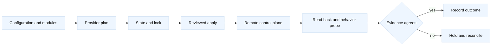
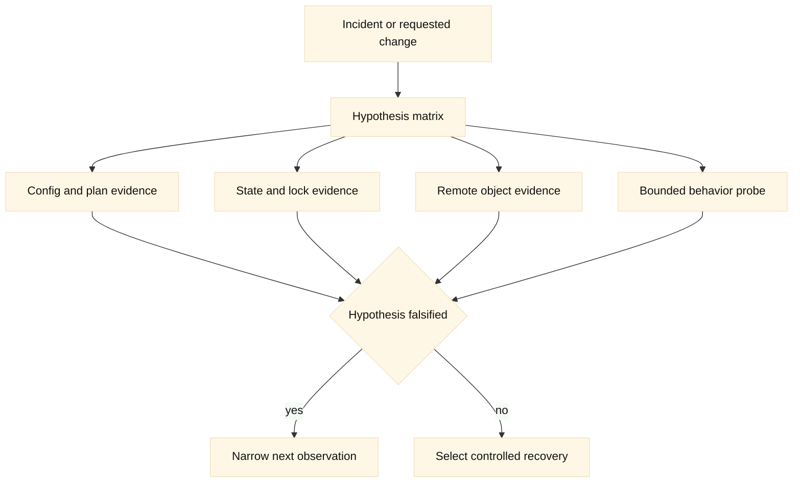
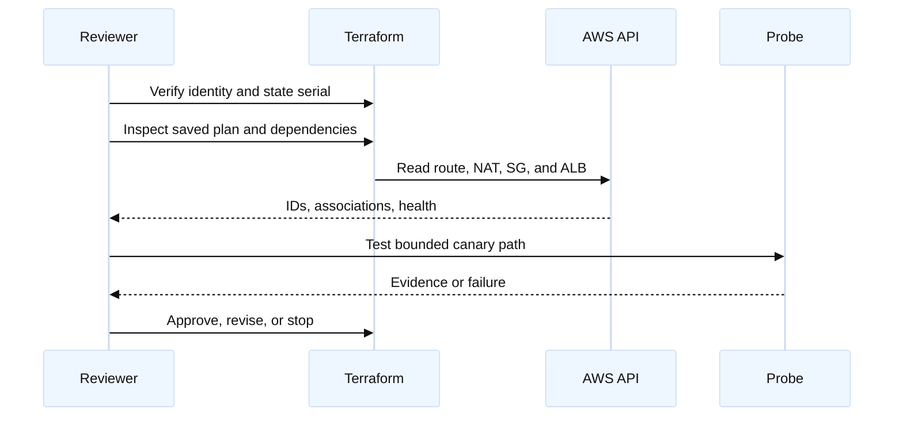
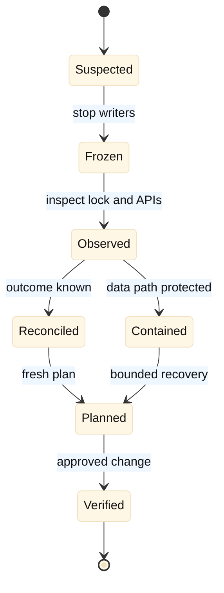

# Real-World Terraform Interview Exercises

## A. How to use this practice pack

This pack is a deliberately demanding practice set for engineers who need to
reason about Terraform as an ownership and change-management system, not only
as a way to write HCL. It assumes that a candidate can read basic Terraform,
AWS, Google Cloud, and F5 BIG-IP documentation. The exercises use fictional
accounts, projects, hostnames, addresses, and partitions. They are not
commands to run against a production system.

Work in the order shown. For a 60-minute interview, choose one primary design
exercise and one shorter debugging exercise. For a take-home, write the
deliverables, draw the architecture, and annotate every command with whether
it is read-only, plan-only, or mutating. A strong answer keeps four questions
separate: what configuration says, what Terraform state records, what the
provider control plane accepted, and whether the data path is healthy.

**Safety boundary:** examples may create NAT gateways, load balancers, public
addresses, F5 configuration, and other billable or mutable resources if copied
without modification. Use disposable AWS accounts, GCP projects, and a lab
BIG-IP partition. Inject credentials at runtime. Never put secrets in HCL,
`.tfvars`, shell history, screenshots, state, or plan artifacts. Never use
`-auto-approve` in an interview answer unless you first define a tightly
bounded, non-production control boundary. A plan is not a behavioral test.

## B. Common interview contract

For every exercise, begin by stating assumptions and asking clarifying
questions. Identify the resource owners, state boundary, provider aliases,
blast radius, cost drivers, quota dependencies, and rollback point. Then draw
the request path and the Terraform control path. A useful answer distinguishes
an AWS account and Region, a GCP project and region, and an F5 device and
partition; similarly named objects are not automatically equivalent.

### Question 1: What makes an answer production-minded?

A production-minded answer does not start with a resource block. It starts
with ownership and a failure model. It explains how a change is proposed,
reviewed, serialized, applied with the intended identity, verified at both
control-plane and data-plane levels, and either rolled back or forward-fixed.
It names uncertainty: a timed-out API call may have succeeded, an imported
object may contain undocumented intent, and a successful load-balancer update
does not prove that a client can complete a request.

### Question 2: What should a candidate say about diagrams?

Draw two paths. The first is the user or workload path: DNS, edge, load
balancer, route, firewall or security group, NAT or private service endpoint,
and backend. The second is the Terraform path: source configuration, module
interfaces, provider alias, state backend and lock, cloud or F5 API, audit
event, and read-back. Mark boundaries where another team owns the resource or
where a provider cannot prove application health.

## C. Architecture vocabulary and evidence

The exercises use three evidence classes. **Fact** means a claim that should
be checked against the selected Terraform, provider, cloud, TMOS, or AS3
release. **Vendor terminology** means a product-specific name such as AWS
security group, GCP Cloud NAT, BIG-IP partition, or AS3 declaration.
**Inference** means a design recommendation derived from constraints. In an
interview, label these explicitly rather than presenting remembered provider
behavior as universal.

| Evidence | Useful question | Example artifact | What it cannot prove |
| --- | --- | --- | --- |
| Configuration | What did we intend? | HCL, variables, module contract | That the provider accepted it |
| Plan and state | What will Terraform address? | Saved plan, state serial, lock | That traffic works or pricing is safe |
| Control plane | What exists remotely? | AWS/GCP/F5 read-back and audit event | That the application is healthy |
| Data plane | Does the path work? | Bounded probe, target health, logs | That future plans are fresh |
| Governance | Is the change allowed? | Policy result, approval, quota, budget | That an operator cannot bypass it |

## D. Exercise 1: Design a dual-cloud application edge

### Scenario and assumptions

The fictional company Northstar Retail is moving `checkout.example.test` from
an on-premises BIG-IP edge to cloud-hosted services. During migration, AWS
hosts the primary API in account `111122223333`, GCP hosts a disaster-recovery
API in project `northstar-dr-lab`, and a lab BIG-IP at `bigip.training.test`
continues to serve the legacy path. The cloud workload needs private egress
for vendor APIs. The public path needs TLS termination, health checks, and a
controlled canary.

### Requirements and constraints

- Use Terraform, but separate state for AWS, GCP, BIG-IP, and shared DNS.
- The AWS VPC is `10.40.0.0/16`; GCP uses `10.50.0.0/16`; no overlap may be
  introduced with the on-premises `10.60.0.0/16` network.
- Use two AWS Availability Zones and two GCP regional subnet ranges.
- No module may manage an object owned by another state.
- F5 AS3 may own the new application tenant, while an individual F5 resource
  may not own objects inside that tenant.
- A rollback must preserve the legacy BIG-IP route until canary evidence is
  good. No global DNS cutover is allowed without an approval gate.

### Candidate deliverables and timebox

In 45 minutes, draw both control and data paths, define the state boundaries,
write the key module interfaces, describe AWS/GCP/F5 provider aliases, and
give a staged rollout and rollback. Include one cost or quota risk and five
verification observations.

### Hints, expected evidence, and follow-ups

Start by asking who owns DNS, certificates, the F5 partition, and the two
cloud accounts. Expected evidence includes the intended account/project,
route-table or GCP route scope, target health, F5 AS3 task status, DNS answer
and TTL, and a bounded request with a canary marker. A weak answer puts AWS,
GCP, F5, and DNS in one state and uses outputs as if they were an atomic
transaction.

For an SDE2 follow-up, explain how one request is routed and how a failed
health check prevents promotion. For a Staff follow-up, define an ownership
contract, organizational escalation, state recovery, and how a region or
provider outage changes the migration sequence.

## E. Exercise 2: Review an AWS plan with an unsafe network change

### Scenario and assumptions

The plan for `northstar-aws-edge` proposes an `aws_route` replacement, a new
NAT gateway in `us-west-2b`, a security-group rule from `0.0.0.0/0` to TCP
8443, and replacement of an application load balancer because its name changed
from `checkout-edge` to `checkout-public`. The state was last refreshed 11
hours ago. The pull request was opened by a role intended for the training
account, but the plan output does not show the account identity.

### Requirements and constraints

Decide whether the plan can be approved. Preserve existing connectivity during
the review. Separate a route replacement from a load-balancer replacement,
identify possible NAT cost and port-capacity effects, and propose a least-
privilege alternative to the public 8443 rule. Explain when `create_before_destroy`
helps and when it cannot solve an immutable-name or quota problem.

### Candidate deliverables and timebox

Take 30 minutes. Mark each proposed change as approve, revise, defer, or stop.
Write five read-only commands, a review checklist, one safe HCL correction,
and a rollback or recovery decision. Do not run apply commands.

### Hints, expected evidence, and follow-ups

Look for provider alias/account guardrails, subnet route-table associations,
NAT gateway availability and route next hop, ALB target health, listener
dependencies, and security-group source scope. Evidence should include a fresh
plan digest, caller identity, state lock ownership, remote object IDs, audit
events, and a test from an allowed source. A plan with a replacement is not
itself evidence that the replacement is safe.

The SDE2 follow-up asks which plan lines indicate replacement and why. The
Staff follow-up asks how to prevent wrong-account plans and how to make cost,
quota, and replacement risks visible before approval.

## F. Exercise 3: Build and troubleshoot a GCP private service path

### Scenario and assumptions

The fictional analytics team uses a global GCP VPC called `analytics-lab-vpc`
in project `analytics-net-lab`. Its workloads run in a regional subnet in
`us-central1`. They need private egress to an external vendor and inbound
access from a test runner. A candidate created a firewall rule with priority
1000 and target tag `runner`, but the VM has tag `runners`; Cloud NAT exists
in the wrong region. The plan also adds a new subnet to a network that a
platform team owns.

### Requirements and constraints

Explain the difference between the global VPC object and regional subnet,
correct the target and NAT scope issue, and preserve platform ownership. The
solution must not use a broad `0.0.0.0/0` ingress rule. Identify a route,
firewall, NAT, quota, and state evidence item.

### Candidate deliverables and timebox

In 35 minutes, provide a corrected resource boundary, HCL fragments, a
read-only verification sequence, and a rollback if the subnet change was
already applied. Include a calculation for 1200 concurrent outbound TCP
connections with a stated address and port-headroom assumption.

### Hints, expected evidence, and follow-ups

Check project and region explicitly. Verify effective VM tags, firewall
priority, subnet association, Cloud Router/NAT region, and flow-log evidence.
State that provider success is not proof of vendor reachability. Use a module
output or remote-state contract for the platform-owned network rather than
recreating it.

The SDE2 follow-up asks why the firewall rule did not match. The Staff
follow-up asks how multiple product teams can consume a shared VPC without
letting application state own the network foundation.

## G. Exercise 4: Choose F5 individual resources versus AS3

### Scenario and assumptions

`edge-lab-01` runs TMOS version `X.Y` in partition `/Common` and tenant
`/Tenant/checkout`. The platform team currently manages the virtual server,
pool, and monitors in an AS3 declaration. A service team proposes adding a
`bigip_ltm_pool` resource for `/Tenant/checkout/api_pool` because one member is
unhealthy. At the same time, GTM wide-IP objects in `/Common` remain managed by
an older individual-resource state.

### Requirements and constraints

Choose an ownership model for LTM, GTM, AS3, and Declarative Onboarding.
Explain provider credentials, partition/RBAC, task state, version compatibility,
and why an API success response does not prove VIP behavior. Give a safe fix
for the unhealthy member without two controllers overwriting the same object.

### Candidate deliverables and timebox

Take 30 minutes. Draw the F5 control/data paths, write a minimal individual
resource and AS3-shaped example, identify the unsafe overlap, and give five
read-only observations. Include cleanup and rollback for a declaration that
partially succeeds.

### Hints, expected evidence, and follow-ups

Read the AS3 task, declaration tenant, pool/member state, monitor result, and
backend response. Treat the selected provider and BIG-IP releases as a
compatibility tuple. An SDE2 answer explains why the proposed resource can
fight AS3. A Staff answer defines service ownership, partition boundaries,
declaration promotion, drift policy, and how to recover from a partial task.

## H. Exercise 5: Import and recover drift without taking ownership blindly

### Scenario and assumptions

The `legacy-connectivity` team discovers an AWS VPC, a GCP subnet, and an F5
pool that were created manually. A new Terraform repository contains partial
configuration for all three. The AWS VPC has an undocumented route to a
partner, the GCP subnet has secondary ranges used by a cluster, and the F5
pool is inside an AS3 tenant. State is empty. A manager asks the candidate to
run imports and apply the generated configuration immediately.

### Requirements and constraints

Design an adoption process that proves ownership, records intent, backs up
state, imports one bounded object at a time, and detects drift before changing
anything. Explain why generated configuration is not design intent and why
importing an F5 object into an individual-resource state may be unsafe.

### Candidate deliverables and timebox

In 40 minutes, write an import runbook outline, address map, evidence checklist,
sample `import` blocks or commands, and a stop condition. Include a recovery
plan if the first post-import plan proposes to delete the partner route or
replace the secondary ranges.

### Hints, expected evidence, and follow-ups

Expected evidence includes owner approval, remote IDs, dependencies, audit
history, state backup location, provider versions, and a no-op or refresh-only
plan. Use `terraform plan -refresh-only` as a diagnostic concept, not as proof
that application behavior is correct. SDE2 should explain import versus
create. Staff should explain organizational ownership, state migration, and
how to make adoption reversible.

## I. Exercise 6: Design a secure Terraform CI/CD pipeline

### Scenario and assumptions

The engineering organization runs GitHub Actions for AWS, Cloud Build for GCP,
and a self-hosted runner that can reach the lab BIG-IP. A proposed pipeline
stores a long-lived AWS key in repository secrets, writes `terraform.tfstate`
to the workspace, comments the full plan into a public pull request, uses
`-auto-approve` after a unit test, and lets a feature branch apply F5 changes.

### Requirements and constraints

Replace the design with a pipeline that uses short-lived identity, remote
state and locking, protected environments, plan freshness, secret redaction,
policy gates, provider pinning, and read-back verification. It must handle
concurrent pull requests and distinguish plan artifacts from credentials.

### Candidate deliverables and timebox

Take 35 minutes. Draw the stages, list minimum permissions, give pseudocode or
CLI fragments, and define four policy failures that block promotion. Include
an emergency path that is auditable but does not become the normal path.

### Hints, expected evidence, and follow-ups

Evidence should include the commit SHA, provider lock file, caller identity,
state lock, plan digest, policy results, approval identity, apply result, and
post-apply read-back. SDE2 should explain the order of validate, plan, policy,
approval, apply, and verify. Staff should explain trust boundaries between
repositories, runners, state, providers, and service owners.

```mermaid
%%{init: {"theme":"base","themeVariables":{"primaryColor":"#f4fbf4","primaryTextColor":"#111111","lineColor":"#333333","secondaryColor":"#eef6ff"}}}%%
flowchart LR
 G[Git change] --> V[Format validate test]
 V --> P[Fresh plan]
 P --> K[Policy and cost checks]
 K --> A[Protected approval]
 A --> X[Apply saved plan]
 X --> Q[Remote read-back]
 Q --> B[Bounded behavior probe]
 B --> M[Audit and handoff]
```

## J. Exercise 7: Migrate an F5 edge to a cloud load balancer

### Scenario and assumptions

Northstar has an F5 virtual server `checkout-vip` with GTM steering between
an on-premises pool and an AWS ALB. The target AWS service is fronted by an
ALB with private targets and NAT-based outbound calls. GCP hosts a standby
service behind a regional load balancer. DNS TTL is 60 seconds, but clients
include resolvers that cache longer. Certificate ownership is split between
security and application teams.

### Requirements and constraints

Create a phased migration with inventory, parallel operation, canary, DNS or
GTM decision points, certificate validation, session behavior, rollback, and
decommissioning. State must remain separated by ownership. Do not claim that
lowering TTL guarantees immediate client movement. Include health-check and
source-IP implications.

### Candidate deliverables and timebox

Take 45 minutes. Draw the before, during, and after architecture; list ten
dependencies; give three go/no-go gates; and describe rollback after 20% of
traffic has moved. Include one capacity calculation under regional loss.

### Hints, expected evidence, and follow-ups

Expected evidence includes route and firewall reachability, ALB/GCP backend
health, F5 monitor behavior, TLS chain, application logs, client error rate,
DNS observation, and replication/session state. SDE2 should explain a canary.
Staff should explain who can declare rollback, how state ownership changes,
and how to retire the F5 safely without losing an audit trail.

## K. Exercise 8: Respond to a partial apply and an active incident

### Scenario and assumptions

At 14:05 UTC, an apply updates an AWS security group and route, then times out
while creating a NAT gateway. At 14:09, the GCP service reports elevated
latency, and at 14:12 an F5 AS3 task is still marked in progress. The Terraform
lock is held by a runner that has stopped reporting. The plan was generated
from commit `abc123`, but the repository now contains commit `def456`.

### Requirements and constraints

Stop unsafe writers, classify known and unknown outcomes, preserve evidence,
restore service with the smallest safe action, and reconcile state before a
new apply. Explain what you would not do: do not blindly retry, delete a NAT
gateway, force-unlock without owner evidence, or apply the stale plan.

### Candidate deliverables and timebox

In 25 minutes, give the first 15 minutes of incident actions, a hypothesis
matrix, read-only commands for AWS/GCP/F5, a state-lock decision, and a
rollback or forward-fix choice. Include incident communication and a post-
incident prevention item.

### Hints, expected evidence, and follow-ups

Gather runner logs, state serial and lock metadata, provider request IDs,
CloudTrail or Cloud Audit Logs, F5 task status, route and NAT IDs, health
signals, and a bounded request trace. SDE2 should sequence safe observations.
Staff should define incident command, change authority, customer updates,
reconciliation ownership, and a policy that prevents stale-plan application.

## L. Cross-exercise scoring and reflection

| Dimension | Developing | Strong | Staff-level signal |
| --- | --- | --- | --- |
| Terraform model | Talks only about HCL | Separates config, state, API, behavior | Defines durable ownership and recovery contracts |
| Network reasoning | Names services | Traces forward and reverse paths | Quantifies blast radius, failure domains, and capacity |
| Provider use | Treats AWS/GCP/F5 as interchangeable | States scope and version caveats | Designs boundaries that survive team and provider change |
| Safety | Says “run apply” | Uses plan, approval, verification, rollback | Builds controls, escalation, and learning loops |
| Communication | Lists commands | Explains evidence and trade-offs | Aligns owners and makes uncertainty visible |

After each exercise, write what you would verify in official documentation,
what evidence would falsify your preferred design, and which assumption is
most dangerous. A good candidate can say “I do not know yet” and immediately
name the observation needed to know safely.

## M. Reference posture

Use the repository Terraform modules for state, lifecycle, imports, AWS/GCP
networking, and F5 ownership context. Consult the selected [Terraform
documentation](https://developer.hashicorp.com/terraform/docs), [AWS provider
documentation](https://registry.terraform.io/providers/hashicorp/aws/latest/docs),
[Google provider documentation](https://registry.terraform.io/providers/hashicorp/google/latest/docs),
and [F5 BIG-IP provider documentation](https://registry.terraform.io/providers/F5Networks/bigip/latest/docs)
for release-specific behavior. Treat pricing, quotas, provider schemas,
AS3/TMOS compatibility, and cloud defaults as facts requiring verification.

The companion [answer key](15-real-world-exercise-answer-key.md) provides one
defensible solution, not the only acceptable solution. Interviewers should
reward explicit assumptions, safe evidence collection, alternate designs,
provider caveats, and recovery reasoning more than memorized resource names.
