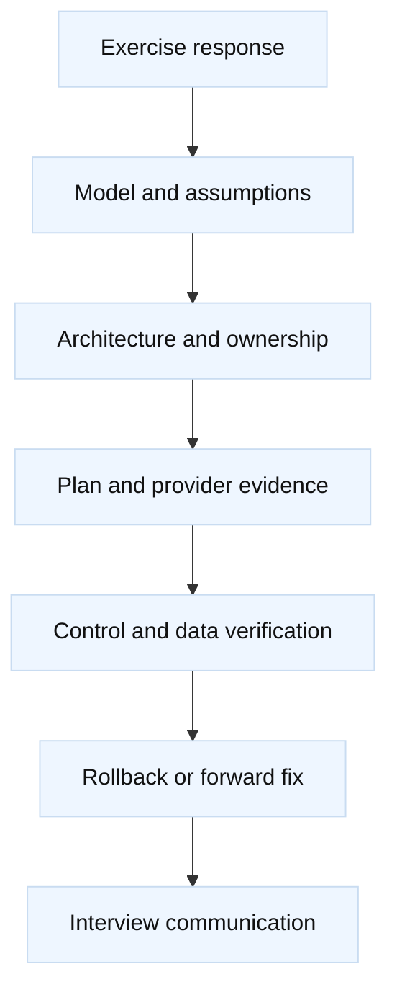
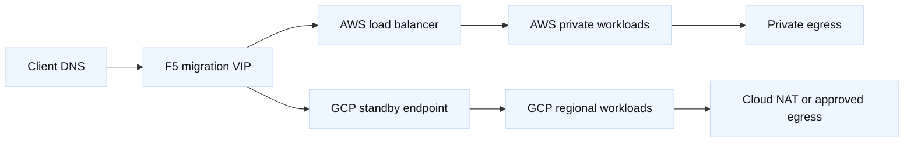
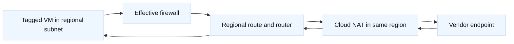
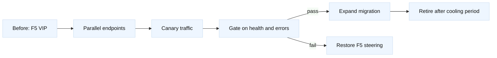
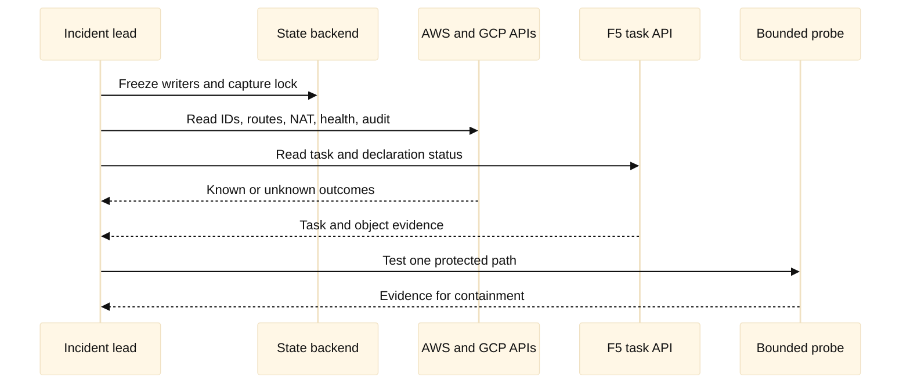

# Real-World Terraform Exercise Answer Key

## A. How to evaluate the answers

This key describes a defensible solution to the eight exercises in the
companion practice pack. It is not a single canonical architecture. A
candidate may choose another design if the design respects ownership,
provider semantics, security, evidence, cost, and recovery constraints. Give
credit for saying what is unknown and how it will be observed. Penalize an
answer that treats a green Terraform apply as proof that traffic works, treats
AWS, GCP, and F5 resources as interchangeable, or proposes a destructive
retry before determining the result of the first operation.

The scoring model has four layers. First, the candidate must understand the
Terraform control loop: configuration is evaluated by providers, state maps
addresses to remote objects, and the remote control plane performs the
mutation. Second, the candidate must trace the actual network path, including
return traffic, policy, DNS, health checks, and identity. Third, the candidate
must define a safe operating boundary: state owner, approval owner, read-back,
behavioral verification, cleanup, and rollback. Finally, a Staff-level answer
must turn those decisions into a repeatable platform contract rather than an
operator heroics story.



### Question 1: What evidence deserves the most credit?

Credit evidence that is specific enough to falsify a hypothesis. “Check the
logs” is weak; “compare the AWS route-table association, NAT ID, flow-log
rejects, and a request from the private subnet during the same five-minute
window” is strong. For F5, a task status, declaration tenant, monitor result,
VIP request, and backend response answer different questions. For GCP, a
global VPC route does not remove the need to check the regional subnet,
firewall target, Cloud NAT region, and return path.

### Question 2: What makes a rollback credible?

A credible rollback identifies a known-good configuration and a bounded
dependency order. It considers whether the original object still exists,
whether state is current, whether traffic has moved, whether data has been
written in the new location, and whether reversing the change would recreate
the incident. DNS TTL alone is not a rollback guarantee. Restoring a plan
file is not enough if provider state, certificates, route associations, or
F5 asynchronous tasks have changed.

## B. Cross-provider answer framework

**Fact:** provider schemas, resource replacement rules, quotas, pricing, and
service behavior depend on selected versions and accounts or projects.
**Vendor terminology:** an AWS route table, GCP global VPC, BIG-IP partition,
and AS3 declaration are different control-plane concepts. **Inference:** a
multi-provider design should use explicit contracts and separate state unless
there is a compelling, tested reason to couple the lifecycles.

| Layer | AWS answer | GCP answer | F5 answer |
| --- | --- | --- | --- |
| Scope | Account, Region, Availability Zone | Organization/project, global VPC, region/zone | Device, cluster, partition, tenant |
| Main control evidence | API read, audit event, state | API read, audit event, state | Task, declaration, object read, audit |
| Main data evidence | Target health, flow logs, probe | Backend health, flow logs, probe | Monitor, VIP request, backend log |
| Common ownership risk | Shared route or SG state | Shared VPC/subnet state | AS3 and `bigip_*` overlap |
| Recovery concern | Unknown API result and replacement | Wrong project or regional scope | Partial asynchronous task |

## C. Answer to Exercise 1: Design a dual-cloud application edge

### Recommended architecture and ownership

Create four states: `aws-network`, `gcp-network`, `f5-edge`, and `shared-dns`.
The AWS state owns the `10.40.0.0/16` VPC, two private subnets, route tables,
security groups, NAT or approved egress, and the AWS load-balancer attachment.
The GCP state owns the `analytics`-style global VPC equivalent, regional
subnets, firewall rules, Cloud Router or NAT-shaped resources, and the standby
load-balancing path. The F5 state owns the migration VIP, monitors, pools, or
one AS3 application tenant, but not both AS3-managed objects and equivalent
individual resources. The DNS state owns the public record and a documented
cutover gate.

The module boundary should pass stable outputs such as endpoint hostname,
listener port, health-check contract, and ownership metadata. It should not
pass a collection of hidden resource IDs and then let a consumer reach into
another state. Remote-state outputs are an interface, not an atomic
transaction. A failed AWS apply must not leave the F5 state believing that the
new endpoint is ready.



### Rollout, verification, and rollback

First inventory the legacy VIP, certificate chain, pool members, session
behavior, health checks, routes, security policies, and DNS ownership. Build
the cloud endpoints in parallel and verify their control-plane identities.
Then issue a bounded request using a canary header or synthetic transaction.
The evidence set should include DNS answers from representative resolvers,
TLS validation, load-balancer target health, route and policy observations,
F5 monitor status, backend logs, and application success rate.

Keep the legacy F5 route active. Move a small, observable percentage through
an F5 traffic rule or carefully gated DNS/GTM change. Promote only if latency,
errors, source identity, dependency calls, and logs meet the agreed window.
Rollback means restoring the previous F5 steering decision, not necessarily
destroying the AWS or GCP endpoint. If state is stale or an apply is
ambiguous, freeze the dependent state and reconcile before changing DNS.

An alternate design is to keep F5 as the permanent global edge and use cloud
load balancers only as regional backends. That may reduce migration risk but
retains appliance cost and ownership. Another is cloud-native global
steering, which can simplify operations but requires a deliberate replacement
for F5 monitor and policy semantics. The candidate should name the trade-off,
not claim product parity. Cleanup is staged: remove canary records and unused
test listeners only after the cooling period, detach old routes and pools in
dependency order, archive plans and evidence, and decommission the old
endpoint only after DNS, certificate, owner, and rollback sign-off.

### Scoring and follow-ups

Award 2 points for a usable request path, 2 for four explicit state owners, 2
for staged cutover, 2 for data/control verification, and 2 for rollback and
cost awareness. A Staff answer additionally defines a service contract,
escalation authority, provider-outage behavior, and an ownership transfer
plan. A common falsifier is a successful plan followed by a failed synthetic
transaction; that proves the plan was not a health check.

## D. Answer to Exercise 2: Review the unsafe AWS plan

### Plan decision

The correct first decision is **stop and revise**, not approve. The 11-hour
freshness window is material for a shared network. Verify the caller identity
with `aws sts get-caller-identity`, confirm the expected account
`111122223333`, and inspect the provider alias and account guard. Capture the
state serial, lock metadata, plan file digest, provider lock file, and commit
SHA. Re-run a fresh plan after remote read-back; do not reuse an unbounded
stale plan.

The NAT gateway addition has direct cost and capacity implications. A route
replacement may change every subnet associated with the table. The public
8443 rule is an exposure risk; replace it with an approved runner CIDR,
security-group reference, private endpoint, or controlled administrative
path. The ALB replacement is a high-blast-radius action: determine whether
only a name or an immutable identity changed, whether DNS or F5 points at its
hostname, whether certificates and listeners will be recreated, and whether
`create_before_destroy` is valid under quotas and name uniqueness.

### Example review fragments

```hcl
provider "aws" {
  alias               = "training"
  region              = var.aws_region
  allowed_account_ids = ["111122223333"]
  assume_role {
    role_arn = var.training_role_arn
  }
}

resource "aws_security_group_rule" "runner_8443" {
  type              = "ingress"
  security_group_id = var.alb_security_group_id
  protocol          = "tcp"
  from_port         = 8443
  to_port           = 8443
  cidr_blocks       = [var.approved_runner_cidr]
  description       = "Training runner only; expires with exercise"
}
```

The candidate should use read-only inspection such as `aws ec2 describe-route-
tables`, `describe-nat-gateways`, `describe-security-groups`, and the
load-balancer and target-health queries, with explicit placeholder IDs.
`terraform show -json` can help review a saved plan, but the plan must be
protected because it may disclose topology or sensitive values.

### Alternate designs, rollback, and scoring

If the NAT route is needed, create capacity in a separate approved change,
verify the gateway and route association, then test private egress before
changing the ALB. If the name change is cosmetic, preserve the ALB and change
the Terraform address or name only after confirming provider behavior. If a
replacement is truly required, create the new edge, attach verified targets,
exercise it, move the dependency, and retain the old ALB until the cooling
period ends. Rollback is a dependency reversal, not immediate deletion.
Cleanup requires confirming that no subnet route, DNS record, F5 monitor,
target, or audit investigation still references the old ALB or NAT path before
a separately approved destroy.

Award points for identity (2), plan interpretation (2), least privilege (2),
cost/capacity (1), evidence (2), and rollback (1). The Staff extension is a
preventive design: account allow-lists, protected state, mandatory fresh
plans, policy that blocks public ingress, quota checks, replacement warnings,
and an approval record tied to a plan digest.

## E. Answer to Exercise 3: Build and troubleshoot the GCP private path

### Diagnosis and corrected ownership

The GCP network is conceptually global, while the subnet and Cloud NAT are
regional. The firewall target tag mismatch (`runner` versus `runners`) means
the intended VM is not selected. The Cloud NAT in the wrong region cannot
serve instances in the target subnet. The application state should consume
the platform-owned network and subnet outputs; it should not add or mutate
the shared subnet without an explicit ownership transfer.

The correction uses an exact target tag or, preferably, a more constrained
identity mechanism supported by the selected provider and design. The source
range should be the test runner range, not the whole internet. Verify rule
priority and any higher-precedence deny or hierarchical policy. Confirm the
subnet region, VM NIC, route, Cloud Router, NAT region, and effective logging.

### Calculation and evidence

Assume each outbound TCP connection consumes one translated source port and
reserve 25% headroom for bursts, retries, and uneven distribution. The
planning quantity is `1200 / (1 - 0.25) = 1600` usable translated flows. This
is a sizing assumption, not a claim about a provider’s exact per-address
allocation. The candidate must look up the selected Cloud NAT port allocation,
address behavior, quotas, and pricing before deployment. More addresses,
port allocation, connection reuse, or a proxy are alternate solutions.



### HCL, rollback, and scoring

The answer may show a `google_compute_firewall` with `target_tags = ["runners"]`
and a Cloud NAT attached through the router in the correct region, but must
state that names and arguments require provider-version verification. Use
`gcloud config get-value project`, firewall describe, subnet describe, route
list, router/NAT describe, VM tags, and flow-log queries as read-only checks.

If the subnet was already changed, stop the application state, export the
current configuration and dependent secondary ranges, and ask the platform
owner whether the change is adopted or reverted. Reverting a subnet can harm a
cluster; do not destroy it to make the plan quiet. A strong answer scores 2
for global/regional scope, 2 for tag diagnosis, 2 for ownership, 2 for
evidence, 1 for the calculation, and 1 for safe recovery. The Staff answer
defines a shared-VPC product contract, consumer permissions, quota budgets,
and a change process for platform-owned ranges.

## F. Answer to Exercise 4: Choose F5 resources or AS3

### Ownership decision

The application tenant `/Tenant/checkout` should have one controller. Since
the platform already owns it through AS3, the service team must not add
`bigip_ltm_pool` for the same pool. The service team can propose a declaration
change through the AS3 repository, or the platform team can make the bounded
change after review. The older GTM state may continue to own `/Common` GTM
objects only if it does not overlap the AS3 tenant and the F5 provider supports
that object/version combination.

Individual `bigip_*` resources are appropriate for narrowly owned LTM or GTM
objects where Terraform owns the full lifecycle. `bigip_as3` is appropriate
for an application declaration whose tenant and object graph are owned as a
unit. Declarative Onboarding is a separate device-initialization boundary.
The selected F5 provider, TMOS, AS3, partition, RBAC, and TLS trust settings
must be tested together.

```mermaid
%%{init: {"theme":"base","themeVariables":{"primaryColor":"#fff7e6","primaryTextColor":"#111111","lineColor":"#333333","secondaryColor":"#f4fbf4"}}}%%
flowchart TD
 T[Terraform F5 state] --> D[AS3 declaration owner]
 D --> X[/Tenant/checkout]
 I[Individual resource state] --> G[/Common GTM objects]
 I -. forbidden overlap .-> X
 X --> M[Monitor and pool]
 M --> V[VIP data path]
```

### Recovery and evidence

For an unhealthy member, inspect the AS3 declaration, task result, pool,
member, monitor, partition, and backend health. If the member is a runtime
failure, fix the service or health contract rather than bypassing AS3 with a
second controller. If the declaration is wrong, submit a changed declaration
through its normal plan and approval path. For an ambiguous task, do not post
again until task status and object read-back establish whether the first task
completed. Preserve request IDs and timestamps.

An individual-resource example is useful only when it targets an independently
owned object, for example a legacy `/Common` GTM object. Cleanup must remove
the Terraform object only after owner approval and after traffic dependencies
are removed. A partial AS3 rollback may require restoring a known-good
declaration and checking task completion; it is not safe to delete a tenant
blindly. Cleanup means removing only the failed declaration or temporary
member after the task is terminal, preserving the known-good tenant, and
retaining task and monitor evidence. Any individual-resource state created
during diagnosis must be removed from ownership or migrated back under review;
destroying a resource merely to erase drift is not cleanup.

Award 2 points for the ownership decision, 2 for F5 boundaries, 2 for task
and data evidence, 2 for compatibility/RBAC, 1 for safe remediation, and 1
for rollback. The Staff answer adds a service catalog, partition policy,
declaration promotion model, drift ownership, and a device-failure strategy.

## G. Answer to Exercise 5: Import and recover drift

### Adoption sequence

The manager’s request is unsafe. Import does not discover intent, normalize
dependencies, or prove health. First obtain written ownership approval and
identify all consumers of the AWS route, GCP secondary ranges, and F5 pool.
Freeze competing writers, select provider versions, back up the empty and
eventual remote state securely, and build an address map from remote IDs to
configuration addresses.

Import the least risky bounded object first in a disposable or isolated state.
Review the generated or hand-written configuration, run format and validate,
then run a refresh-only or normal plan to understand differences. Do not
apply until every unexpected change has an owner and intended disposition.
Importing an F5 pool inside an AS3 tenant is a stop condition: either adopt
the entire AS3 ownership boundary or leave the pool in the AS3 state.

### Example workflow and evidence

```hcl
import {
  to = aws_vpc.legacy
  id = "vpc-0example123456789"
}

import {
  to = google_compute_subnetwork.legacy
  id = "projects/northstar-dr-lab/regions/us-central1/subnetworks/legacy"
}
```

These IDs are fictional. Use a configuration-driven import or the selected
Terraform CLI workflow appropriate to the installed release. Capture remote
tags/labels, routes, secondary ranges, audit history, F5 tenant/declaration,
state serial, state backup checksum, provider lock file, and owner approval.
The first successful plan should be close to no-op, but a no-op still does
not prove behavior.

If the AWS plan deletes a partner route, remove that action from the adoption
configuration, document the route as a dependency, and ask the partner/network
owner to decide whether it is adopted into this state or remains external. If
the GCP plan replaces secondary ranges, stop: cluster address ranges are not a
cosmetic diff. If an F5 import conflicts with AS3, withdraw the individual
import and work through the declaration owner. Recovery uses the state backup
and a controlled state migration, not deletion of remote objects. Cleanup is
administrative after adoption: close temporary credentials, remove generated
configuration that was not approved, delete only disposable lab resources,
and retain the import map, owner approval, state backup checksum, and drift
decision for audit. The legacy route, subnet ranges, and AS3 tenant are not
cleanup candidates merely because the import repository is new.

### Scoring and alternatives

Score ownership and discovery (3), state safety (2), import sequencing (2),
drift interpretation (2), and recovery (1). An alternate valid design is to
leave legacy infrastructure unmanaged while a new parallel environment is
built, then cut over and decommission intentionally. That costs more but may
be safer than adopting undocumented shared resources. Staff candidates should
define an adoption service, evidence retention, state migration review, and a
policy that blocks import into a state whose ownership contract is unclear.

## H. Answer to Exercise 6: Secure Terraform CI/CD

### Pipeline design

Use a protected workflow with these stages: checkout a trusted commit, verify
the Terraform and provider lock versions, format and validate, run module and
policy tests, create a fresh plan with short-lived AWS/GCP identity, scan the
plan and configuration for secrets and forbidden exposure, require approval,
apply the exact reviewed plan, perform remote read-back, run a bounded
behavior probe, and publish an audit record. The F5 runner should be isolated,
partition-scoped, and allowed to reach only the lab device or approved
management endpoint.

AWS can use an OIDC-to-role flow with an account allow-list; GCP can use
workload identity federation or an equivalent short-lived credential flow;
F5 should use runtime-injected credentials and a trusted CA. Minimum policy
should block public administrative ingress, unapproved regions/projects,
unlocked provider versions, state written to the workspace, missing owner
metadata, destructive replacement without approval, and AS3/individual
resource overlap.

```mermaid
%%{init: {"theme":"base","themeVariables":{"primaryColor":"#f4fbf4","primaryTextColor":"#111111","lineColor":"#333333","secondaryColor":"#eef6ff"}}}%%
flowchart LR
 C[Trusted commit] --> T[Format validate tests]
 T --> L[Lock and identity checks]
 L --> P[Fresh plan]
 P --> S[Secret policy and cost gate]
 S --> H[Protected human approval]
 H --> A[Apply saved plan]
 A --> W[Read back provider objects]
 W --> Z[Bounded probe and audit]
```



### Concurrency, emergency access, and scoring

Each state needs backend locking and an environment-level concurrency group.
A plan artifact is sensitive and should be access-controlled, retained only as
needed, and tied to commit, provider lock, state serial, and plan digest. A
feature branch must not apply F5 changes. An emergency path can use a
time-bound break-glass role, incident ticket, second approver, and mandatory
post-incident import or reconciliation; it must not silently become normal
delivery. Cleanup after a run includes revoking the short-lived session,
expiring the break-glass exception, deleting temporary plan artifacts from
runner storage, closing the environment reservation, and retaining the
minimum audit record required by policy. The state backend, lock history, and
approved evidence are not deleted as a shortcut.

Award 2 points for identity and secret handling, 2 for ordering, 2 for
locking/freshness, 2 for policy and approval, 1 for verification, and 1 for
emergency governance. The Staff answer explains trust relationships among
repository, runner, state backend, cloud APIs, F5 management plane, and
service owners, plus how policy exceptions expire.

## I. Answer to Exercise 7: Migrate the F5 edge

### Phased architecture

Phase one inventories the F5 VIP, GTM wide IP, certificates, monitors, pool
members, source-IP expectations, persistence, WAF or policy behavior, DNS
owners, route dependencies, and session/data replication. Phase two builds
AWS and GCP endpoints in parallel with separate state. Phase three proves
private routing, firewall/security-group behavior, health checks, TLS, backend
responses, and outbound dependency access. Phase four introduces a canary
through F5 steering or a controlled DNS decision. Phase five expands traffic
only after an observation window. Phase six retires F5 only after the
rollback period, certificate and audit retention, and owner sign-off.

The candidate must say that a 60-second DNS TTL is not a movement guarantee;
recursive resolvers, application caches, and clients may retain answers. F5
health checks may not match cloud load-balancer health checks. Source address
preservation, TLS termination, HTTP headers, persistence, and connection
draining must be tested explicitly.



### Capacity, rollback, and scoring

Assume current peak is 600 requests per second, a two-zone AWS design, and a
requirement to survive one-zone loss. If each remaining zone must carry 600
RPS plus 30% headroom, the design target is `600 * 1.30 = 780 RPS` in the
surviving zone. This is an interview assumption, not a provider limit. The
candidate must verify load-balancer target capacity, NAT connection behavior,
quota, cross-zone cost, and backend scaling. GCP standby capacity should be
defined by the RTO/RPO and promotion model rather than assumed to be active.

After 20% migration, rollback restores F5 steering to the old pool, keeps the
new endpoint available for evidence, and checks in-flight connections,
persistence, and writes. If the cloud service has accepted writes, data
reconciliation matters before failback. DNS should be changed only through
the shared DNS owner and a recorded approval. Score architecture and
inventory (3), canary and evidence (3), state ownership (2), capacity and
cost (1), and rollback (1). Staff answers include customer communication,
decommission criteria, and a durable platform migration pattern. Cleanup is
a separate gate: remove the old F5 pool and GTM record only after traffic is
demonstrably zero, certificates and logs are archived, the cloud owner accepts
the new endpoint, and the rollback window has expired. If the legacy path
remains a compliance or emergency fallback, document it as an intentional
retained resource with an owner and cost budget.

## J. Answer to Exercise 8: Partial apply and active incident

### First fifteen minutes

At 14:05, declare a change incident and freeze all normal writers. Preserve
runner logs, commit SHAs, Terraform version, provider lock, plan digest, state
serial, lock metadata, API request IDs, and timestamps. Do not apply `def456`
or the stale `abc123` plan. Determine whether the lock holder is alive and
whether it is safe to stop or recover it. Force-unlock is a last resort after
owner evidence and a durable record; it does not reconcile remote state.

Query AWS route, security group, NAT, and audit status; query GCP backend,
firewall, route, and flow signals; and inspect F5 AS3 task, tenant, declaration,
VIP, monitor, and backend state. Classify each operation as known success,
known failure, or unknown. A NAT creation timeout is unknown until its ID and
audit event are checked. The GCP latency may be related or independent; do not
assume causality from timing. The F5 in-progress task should be observed, not
duplicated.



### Recovery decision

If the route or security-group update caused the incident and the previous
known-good values are safe, a narrowly approved forward fix or rollback may
restore service. Do not delete the NAT gateway while private workloads may be
using it. If the NAT exists, attach or verify the route only after state and
dependencies are reconciled. If the F5 task is still progressing, wait for a
terminal result or use the documented F5 recovery procedure; do not submit a
second declaration blindly.

Communicate a short update: impact, known facts, unknowns, current mitigation,
next observation, and decision owner. Once contained, create a fresh plan from
the current commit and remote reality, reconcile state, and verify both
control-plane objects and a bounded customer path. Prevention includes stale
plan rejection, lock-owner heartbeat, provider request correlation, policy
against unsafe network exposure, and an apply workflow that records post-
apply probes. Cleanup after containment includes closing or renewing the lock
through the supported backend procedure, removing temporary diagnostic rules
only after their evidence is captured, revoking incident credentials, and
deleting no remote object until its dependency and ownership review is
complete. The incident record, state serials, plan digests, and audit events
remain available for the postmortem.

Score incident sequencing (3), known/unknown classification (2), safe
recovery (2), evidence (2), and communication/prevention (1). The Staff
answer adds an incident commander, change authority, customer update cadence,
provider-specific owners, and a postmortem action with a measurable control.

## K. Final interviewer rubric and alternate-design guidance

| Score | Candidate behavior | Hiring signal |
| --- | --- | --- |
| 1–2 | Lists Terraform commands and product names | Cannot yet control blast radius |
| 3–4 | Finds obvious route, scope, or ownership errors | Developing SDE2 reasoning |
| 5–6 | Uses state, plan, API, and behavior evidence | Solid SDE2 performance |
| 7–8 | Handles ambiguity, rollback, cost, and provider caveats | Strong senior performance |
| 9–10 | Builds durable ownership, policy, and incident contracts | Staff-level signal |

Accept alternate designs such as a permanent F5 global edge, cloud-native
global routing, active-active regions, or a slower manual adoption. Ask the
candidate to state what the alternate design costs, which team owns it, what
new failure mode it creates, and how it will be tested. The answer is stronger
when it includes a falsifier: a condition that would make the candidate stop,
revise, or choose the alternate design.

## L. Safe command and reference posture

Commands in these answers are intentionally read-oriented and use placeholder
IDs. Before any real use, verify the selected Terraform CLI, provider, cloud
service, TMOS, AS3, region, project, account, quota, and pricing behavior in
official documentation. Run `terraform fmt`, `terraform validate`, and a
reviewed plan. Protect state and plan artifacts. Never paste credentials into
examples, disable TLS verification, use `-auto-approve` as a shortcut, or use
`-target` as a normal deployment strategy.

The relevant references are the [Terraform documentation](https://developer.hashicorp.com/terraform/docs),
[AWS provider documentation](https://registry.terraform.io/providers/hashicorp/aws/latest/docs),
[Google provider documentation](https://registry.terraform.io/providers/hashicorp/google/latest/docs),
and [F5 BIG-IP provider documentation](https://registry.terraform.io/providers/F5Networks/bigip/latest/docs).
These sources describe vendor behavior; architecture choices and rollback
recommendations in this key are engineering inferences that must be tested in
the target environment.
