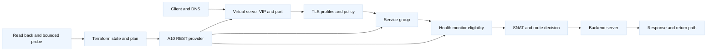
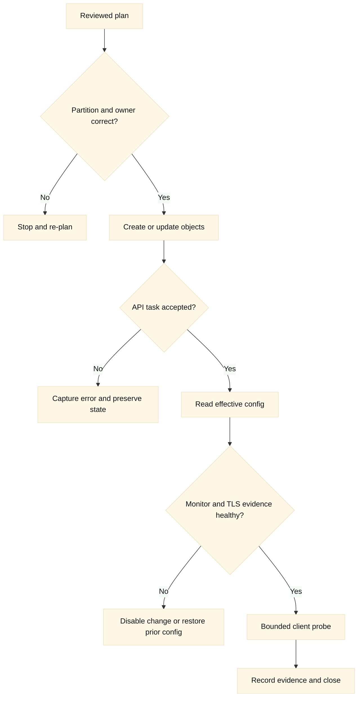
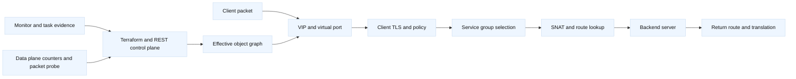

# 16. A10 Load Balancers and Terraform

## A. Learning objectives

This module teaches how to reason about an A10 Thunder ADC as an application
delivery system and how to put a safe Terraform boundary around it. By the end,
you should be able to draw the path through a virtual server, service group,
server, health monitor, SNAT policy, and TLS profiles; explain where Terraform
ends and A10's REST API or appliance data plane begins; and review a plan for
blast radius, ownership, and reversibility. The aim is interview preparation,
not a copy-and-paste production runbook. The best answer to an SDE2 question
usually connects configuration to a packet path. The best Staff answer also
names the owner, failure domain, rollout gate, evidence, cost, and recovery
decision.

The module deliberately compares A10 with cloud load balancers rather than
claiming that the products are interchangeable. A10 gives an organization a
device- or cluster-centered ADC control point with partitions, templates,
virtual ports, service groups, health monitors, SNAT, and TLS objects. AWS and
GCP often provide managed load-balancing control planes whose availability,
scaling, source-address behavior, and health semantics are different. **Fact:**
the exact Terraform resource schema and A10 API behavior depend on the selected
provider release, ACOS release, appliance mode, license, and RBAC permissions.
Treat version verification as part of the design.

## B. Prerequisites

Know TCP connection establishment, HTTP request routing, TLS termination,
reverse proxies, pool health, source NAT, DNS, VLANs, VRFs, and Terraform
configuration/state/plan concepts. Review the repository's [F5 LTM material](../docs/03-f5-ltm.md),
[F5 automation toolchain](../book/topics/33-f5-api-and-automation-toolchain.md),
[load-balancing module](../cloud-networking-interview/09-load-balancing-and-traffic-entry.md),
and [Terraform safe-change module](05-plan-apply-lifecycle-and-safe-change.md).

Use a disposable A10 virtual appliance, lab partition, or provider mock. The
addresses, hostnames, tokens, tenant names, and account identifiers below are
fictional. Never commit a real password, certificate private key, API token,
plan artifact, or customer topology. The command examples are inspection- or
plan-oriented. Any mutating command needs an explicit change window, approval,
read-back, bounded behavioral probe, and cleanup owner.

### B.1 Versioned lab contract

**Lab contract v1.0 (illustrative, 2026-08):** record the ACOS release,
appliance mode, selected provider or API adapter, Terraform version, license
features, and RBAC scope before starting. Use one disposable Thunder ADC
instance or simulator, an isolated `training` partition, two backend
endpoints, a test client, a non-routable DNS name, and a source-controlled
Terraform root with a dependency lock file. A mock can validate provider
state transitions, but cannot prove ACOS packet processing or HA behavior.

| Contract item | Required record | Why it matters in an interview |
| --- | --- | --- |
| Version matrix | ACOS, appliance mode, provider/API, Terraform | Object names, defaults, async tasks, and supported features vary. |
| Access | Least-privilege API user, trusted CA, partition/RBAC scope | Authentication success does not prove safe authorization. |
| Inventory | VIP, port, service group, members, monitor, SNAT, certificate reference | A finite inventory exposes dependencies and cleanup order. |
| Evidence | Saved plan, task ID, effective-config read-back, monitor state, counters, probe | It separates API acceptance from customer-visible health. |
| Cleanup | Owner, deletion order, DNS removal, certificate disposal, state policy | A lab must be reversible and not leak credentials or routes. |

**Validated in lab:** only the exact release/provider combination actually
tested. **Illustrative:** the resource names and API paths in this module.
**Inference:** use a complete application-edge module when one team owns the
listener graph; use narrow resources only when shared-object contracts and
import behavior are tested.

## C. Portable ADC model

An ADC request crosses several contracts. A client resolves a name and connects
to a virtual address and port. A virtual server accepts or rejects that flow,
selects profiles and policy, and chooses a service group. The service group
selects a server or node, possibly through a translation or route-domain
decision. A health monitor decides whether a member is eligible; it does not
prove that every customer request will succeed. TLS can terminate at the ADC,
pass through, or be re-encrypted to the backend. SNAT changes the source tuple
and therefore affects return routing, logging, and connection capacity.

Terraform sees configuration, state, provider schema, and API responses. It does
not automatically see packet captures, application logs, monitor body content,
or client experience. A successful provider operation proves only that an API
operation reached an accepted result. A complete diagnosis correlates at least
the Terraform plan, state, A10 effective configuration, monitor status, route
and SNAT evidence, TLS evidence, and a bounded request.

**Engineering inference:** the useful ownership unit is usually an application
edge contract rather than one arbitrary appliance object. If one team owns a
virtual server, its service group, monitor, profiles, and SNAT policy, that
team can reason about the entire path. If a shared platform owns the virtual
server while an application team owns the service group, the interface must be
explicit: names, allowed fields, health contract, deployment sequence, and
rollback authority.





## D. A10 architecture and object boundaries

| ADC concern | A10 concept | Interview boundary |
| --- | --- | --- |
| Listener identity | Virtual server and virtual port | The VIP is reachable only if routing, VLAN, policy, and listener state agree. |
| Backend membership | Service group and server | A healthy member is eligible according to the monitor; it is not a full application SLO. |
| Health | Health monitor | Probe protocol, source, URI, expected status, timeout, and interval are part of the contract. |
| Address translation | SNAT pool, automap, or policy | Translation changes return routing, observability, and port capacity. |
| Encryption | Client/server TLS templates and certificates | State the termination boundary and certificate owner. |
| Isolation | Partition, tenant, VRF, or shared object | Names alone do not prove isolation; verify RBAC and object scope. |
| Availability | HA pair, cluster, or scale-out design | Failover state and configuration synchronization need separate evidence. |

**Vendor terminology:** A10 documentation commonly uses Thunder ADC, ACOS,
virtual server, service group, server, template, partition, and VRRP-A or HA
terminology. Exact object names differ by ACOS release and API version. **Fact:**
the A10 REST API is the appliance control interface; a Terraform provider is an
adapter that models only the API operations implemented in that release.
**Inference:** an API resource gap is a design signal, not permission to put
opaque imperative shell calls inside every Terraform apply.

The most important A10 ownership decision is whether Terraform manages narrow
objects or an application declaration/module boundary. Narrow resources can be
appropriate for a shared ADC when a platform team has strict object-level
contracts. A declaration or module can be safer for an application team when it
owns the complete virtual-server-to-service-group graph. Mixing two owners on
the same VIP, service group, monitor, certificate, or SNAT pool creates drift:
one system changes an object and the other system later attempts to restore an
older value.

## E. Terraform provider, REST, and data-plane boundaries

The provider configuration should use an injected address and secret. The
version is illustrative and belongs in a lock-file review. A provider may not
model every A10 feature, and naming conventions for resource types vary. Check
the provider registry and its source code for the exact resource names before
using an example in a lab.

```hcl
terraform {
  required_version = ">= 1.6, < 2.0"

  required_providers {
    a10 = {
      source  = "example.invalid/training/a10"
      version = "~> 0.1" # Placeholder: select and verify a real provider.
    }
  }
}

provider "a10" {
  address  = var.a10_address
  username = var.a10_username
  password = var.a10_password # Inject at runtime; never commit.
  partition = var.a10_partition
  # Use the provider's trusted-CA setting; do not disable TLS verification.
}

# Resource names are illustrative. Verify the selected provider schema.
resource "a10_virtual_server" "training" {
  name        = "training-vip"
  ip_address  = "192.0.2.44"
  port        = 443
  protocol    = "https"
  partition   = "training"
  service_group = a10_service_group.training.name
  tls_profile = "clientssl-training"
}

resource "a10_service_group" "training" {
  name       = "training-backends"
  protocol   = "tcp"
  monitor    = a10_health_monitor.training.name
  partition  = "training"
}

resource "a10_health_monitor" "training" {
  name       = "training-https"
  type       = "https"
  path       = "/healthz"
  expect_code = "200"
  partition  = "training"
}
```

The provider boundary is not the same as the REST boundary. Terraform creates a
desired transition and records an address-to-object mapping in state. The
provider authenticates to A10 and translates the transition into REST calls,
possibly several calls and asynchronous tasks. A REST response may say that a
request was accepted while the device is still applying it. The device then
owns the effective configuration and traffic path. Read-only verification
should inspect the exact partition-qualified objects and task outcome, followed
by a bounded request that does not expose real data.

A safe lab workflow is:

```bash
terraform fmt -check
terraform init
terraform validate
terraform plan -out=training-a10.tfplan
terraform show -no-color training-a10.tfplan

# Read-only identity and API checks; use fictional placeholders.
curl --fail --silent --show-error \
  --cacert "$A10_CA_FILE" \
  -u "$A10_USER:$A10_PASSWORD" \
  "https://a10.example.invalid/api/v3/partition/training/slb/virtual-server"

# Apply only a reviewed saved plan in a disposable partition.
terraform apply training-a10.tfplan
```

Do not put the password in a command-line literal because shell history and
process inspection can expose it. The endpoint above is intentionally invalid
and the API path must be replaced using the selected ACOS/API release. If the
provider lacks a required object, use a read-only API fixture or an explicit,
reviewed integration tool outside the normal resource ownership path; do not
silently create an imperative side effect that Terraform cannot reconcile.

## F. Concrete A10 setup and use scenario

Assume a training application has a fictional DNS name `api.example.invalid`,
VIP `192.0.2.44`, two backend servers `198.51.100.21` and `198.51.100.22`,
HTTPS on the client side, HTTP on a protected backend segment, and a requirement
that backend logs see the ADC SNAT address `198.51.100.40`. The design needs a
virtual server, a service group, two server objects or members, an HTTPS health
monitor, a client TLS profile, and an explicit SNAT policy. The monitor should
test the same dependency that makes a request useful: method, path, host header,
expected response, timeout, and authentication assumptions.

The plan review asks five questions. Is the VIP in the intended partition and
route domain? Does the service group refer to the intended server objects rather
than duplicate names in `/Common`? Does SNAT have enough ports for peak
concurrency? Does the client certificate have a rotation owner and a safe
overlap period? Does HA synchronize the objects and preserve the listener path?
Those questions matter more than whether the plan says “six resources added.”

After apply, verify in layers: read the virtual server and service group;
confirm members are up under the intended monitor; inspect the client and server
TLS profile references; inspect SNAT counters and route selection; query the
device's HA/config-sync status; then send a request with a non-sensitive test
header and capture status, latency, selected backend, and correlation ID. A
200 response from one request is not an SLO. A monitor-up state is not proof
that the application dependency graph is healthy.

For a rough SNAT capacity conversation, assume 6,000 concurrent client flows,
each requiring one source port per backend destination tuple. If one SNAT
address has an effective usable range of approximately 60,000 ports for the
relevant tuple, one address has nominal capacity, but the design still needs
headroom for bursts, TIME_WAIT behavior, multiple destinations, failover, and
provider/device reservations. **Inference:** propose at least two addresses and
a measured alarm threshold rather than presenting the arithmetic as an A10
universal limit. Validate the actual ACOS release, mode, and traffic pattern.

## G. AWS and GCP comparison

| Design question | A10 | AWS example | GCP example |
| --- | --- | --- | --- |
| Who operates the appliance? | ADC owner operates device/HA/config sync | AWS operates the managed load-balancer control plane | Google operates the managed load-balancer control plane |
| Listener model | Virtual server, port, profiles, service group | ALB/NLB listener and target group | Forwarding rule, target proxy, backend service |
| Health evidence | Device monitor plus backend response | Target health plus LB logs/metrics | Backend health plus LB logs/metrics |
| Source behavior | SNAT/route/profile policy chosen by design | Depends on LB type and target path | Depends on proxy or passthrough LB type and path |
| State ownership | Terraform/provider or another ADC owner | AWS provider and service state | Google provider and service state |

Terraform may create a cloud backend, security policy, or DNS record while an
A10 module owns the edge. Keep the states separate and exchange only stable
outputs such as a backend endpoint contract, health path, listener port, and
certificate reference. Do not let an A10 module infer that a cloud target is
healthy merely because a resource exists. In a migration, a cloud load balancer
and A10 VIP may coexist, but DNS traffic shifting, client source preservation,
TLS semantics, and rollback ownership must be explicit.

## H. State, ownership, and safe lifecycle

State contains object identifiers, attributes, dependencies, and sometimes
topology or sensitive-looking metadata. Protect it with an encrypted backend,
least-privilege access, locking, retention, and an incident procedure. A10
partitions are not automatically separate Terraform states: choose whether each
partition, application, or device cluster is a state boundary, then make the
decision visible in the repository.

Import is an ownership transfer, not a discovery operation. Before importing a
VIP, identify the current owner, freeze competing automation, export a safe
device backup if the lab supports it, inspect dependencies, write matching
configuration, and plan for no unintended replacement. `terraform import` can
make Terraform responsible for an object whose dependencies remain unmanaged.
The follow-up is a full plan and an application-health check.

For rollout, create additive objects where possible, attach a disabled or
non-production listener, validate monitor behavior, then switch traffic through
a controlled DNS or upstream routing decision. `create_before_destroy` does not
solve a unique VIP collision. `prevent_destroy` is a guardrail, not a recovery
plan. A rollback may be a Terraform apply of a reviewed prior plan, an upstream
traffic shift, or a device configuration restore; select it based on the failed
boundary and preserve evidence before changing more state. Cleanup must remove
only the training partition objects after checking shared certificates, routes,
SNAT pools, and DNS records.

## I. Failure evidence and falsifiers

| Hypothesis | Evidence to seek | Falsifier |
| --- | --- | --- |
| VIP is unreachable because Terraform failed | Plan/apply logs and device object read-back | VIP and listener exist; packet evidence points to route or policy. |
| All members are healthy | Monitor state and monitor request details | Monitor uses the wrong host/path or backend logs show failures. |
| SNAT is exhausted | Translation counters, port allocation, concurrency, resets | Failures occur with low translations and only one TLS profile. |
| TLS is correct | Profile reference, certificate validity, handshake transcript | Client handshake fails before any backend connection. |
| HA has the new config | Config-sync/peer state and peer read-back | Active device has object; standby lacks it or has conflict. |
| Provider drift caused the incident | Refresh-only plan and device audit trail | Out-of-band change is absent and the application changed behavior. |

Label the statements in an interview. **Fact:** a monitor is a configured probe
with a defined result. **Vendor terminology:** the exact A10 endpoint and object
names are release-specific. **Inference:** a separate application state and
platform-owned partition usually reduces competing writes, but the right split
depends on team boundaries and failure isolation.

## J. Safe rollout, rollback, and cleanup

Before changing a listener, record the current VIP, object references, monitor
result, active/standby state, TLS certificate identifier, SNAT counters, route
and VLAN assumptions, and a bounded baseline request. Review the plan for
replacement, partition scope, certificate changes, and unexpected shared-object
updates. Apply a saved plan only after the owner confirms the target device and
partition.

If the monitor fails after deployment, do not immediately widen firewall rules
or disable certificate verification. Compare the monitor source and path with a
known-good client, inspect route/SNAT behavior, and restore the prior listener or
traffic path if the change introduced a clear regression. If the provider times
out after an accepted API task, do not blindly re-apply: read the task and
effective configuration first, then reconcile state. Cleanup requires a
destroy-plan review and confirmation that no other tenant references the
objects. Remove certificates and DNS records only when their dependency owners
approve.

## K. Exercises and answer guidance

### K.1 Exercise: design an A10 application edge

**Assumptions:** two AZ-like backend segments, one A10 HA pair, 4,000 peak
concurrent flows, HTTPS client termination, HTTP backend, and a `/healthz`
endpoint. **Timebox:** 25 minutes. **Deliverables:** an object graph, packet
path, Terraform ownership boundary, monitor contract, SNAT calculation
assumptions, and five post-apply verification checks.

**Answer guidance:** put the virtual server, service group, server members,
monitor, TLS profile, and SNAT policy in one application-owned module or one
exclusive declaration. State the partition and HA/config-sync owner. Explain
that a monitor checks eligibility, while a bounded request checks behavior. Use
the flow count only as a starting variable; ask about destination fan-out,
failover capacity, TIME_WAIT, and usable port reservations before sizing SNAT.
The verification sequence should include device read-back, monitor details,
TLS handshake evidence, SNAT/route evidence, and a safe request.

### K.2 Exercise: provider resource gap

**Scenario:** the selected Terraform provider can create a virtual server and
service group but cannot model the required HTTP template. **Timebox:** 15
minutes. **Deliverables:** three options, an ownership decision, and a rollback
plan.

**Answer guidance:** first verify whether a newer provider or API version
supports the feature. Second, use a provider-supported declarative boundary if
it can own the whole application safely. Third, use a separately reviewed API
automation step only when its lifecycle, idempotency, audit trail, and drift
reconciliation are explicit. Do not add an imperative call that creates an
untracked object inside an otherwise declarative module. Rollback must identify
which system removes or restores the template.

### K.3 Exercise: production-like failure without production access

**Scenario:** the plan applied, the VIP answers TCP, but HTTPS clients fail and
all monitors are green. **Timebox:** 20 minutes. **Deliverables:** ranked
hypotheses, evidence commands or API reads, one falsifier per hypothesis, and a
stop/rollback decision.

**Answer guidance:** inspect client TLS profile and certificate chain first,
then compare monitor protocol and host/path with real client behavior. Check
whether monitors bypass the failing TLS boundary. Verify the server-side
protocol, SNI, SNAT, route, and backend logs. A safe rollback is justified if a
known-good certificate/profile was replaced and the failure is customer-wide;
otherwise isolate with a disabled canary listener and preserve task/config
evidence.

## L. Interview questions and direct answers

### L.1 Why is a green health monitor insufficient?

**Answer:** A monitor proves only that a specific probe from a specific source
met its configured success rule. It may use a different host header, protocol,
TLS profile, route, authentication path, or response body than the customer
request. I would combine monitor details with device read-back, backend logs,
TLS evidence, SNAT/route evidence, and a bounded request.

**SDE2 focus:** Trace the difference between eligibility and end-to-end request
success. **Staff extension:** Define the health contract with service owners,
avoid a monitor that hides critical dependencies, and set an SLO-aligned
decision for when to drain or fail over.

### L.2 What should Terraform own on an A10?

**Answer:** It should own a clearly bounded set such as an application edge:
VIP, service group, members, monitor, profiles, and SNAT policy, or it should
own only platform objects under a documented interface. One object must have one
authoritative lifecycle owner.

**SDE2 focus:** Explain state addresses, dependencies, and drift. **Staff
extension:** Choose boundaries around team ownership, HA failure domains,
change frequency, compliance, and recovery speed; document how another system
requests an exception.

### L.3 How would you handle an accepted REST request followed by a timeout?

**Answer:** I would stop blind retries, identify the task or transaction if the
API exposes one, read the partition-qualified effective objects, inspect the
device audit/config-sync state, and compare Terraform state. Then I would decide
whether the operation completed, partially completed, or failed before
reconciling with a new plan.

**SDE2 focus:** Distinguish transport failure from remote mutation. **Staff
extension:** Build idempotency and observability into the provider workflow,
define an operator decision tree, and prevent concurrent automation from making
an ambiguous state worse.

### L.4 How do you reason about SNAT capacity?

**Answer:** Start with concurrent flows, backend destination fan-out, source
address count, port reuse rules, failover headroom, and connection lifetime. A
request-rate number alone is insufficient. Validate the estimate with device
counters, allocation failures, resets, and a load-test-like lab scenario.

**SDE2 focus:** Explain tuple uniqueness and port pressure. **Staff extension:**
Set capacity alarms, reserve loss-of-node headroom, price additional addresses
or alternative routing, and make the failure behavior visible to service owners.

### L.5 When would you compare A10 with an AWS or GCP load balancer?

**Answer:** I would compare the required packet behavior and ownership, not
product names: TLS boundary, source preservation, health semantics, policy,
private reachability, observability, HA, and migration control. A managed cloud
load balancer can remove appliance operations, while A10 may preserve existing
ADC features or on-premises topology.

**SDE2 focus:** Map listener, target, health, and routing concepts. **Staff
extension:** Include migration sequencing, data transfer cost, regulatory
boundaries, operational skill, failure domains, and the rollback traffic switch.

### L.6 What makes an A10 Terraform example educationally safe?

**Answer:** It uses placeholders and a disposable partition, injects secrets,
pins and verifies versions, shows plan/read-back/probe separation, avoids
`-auto-approve`, names shared-object risks, and explains cleanup. It does not
pretend a provider success or API response proves traffic health.

**SDE2 focus:** Identify the state and mutation boundaries. **Staff extension:**
Design policy gates for credentials, plan artifacts, provider upgrades, audit
evidence, and emergency rollback without turning the module into an operational
runbook.

## M. Deep implementation lanes and failure reasoning

### N.1 Packet processing, control plane, and data plane

For an interview, narrate one request in order. DNS returns the VIP; the
client creates a TCP flow; the virtual port matches the destination tuple; the
client-side TLS profile selects certificate, protocol, and SNI behavior; policy
selects a service group; the monitor has already marked a member eligible; the
ADC selects a server; SNAT and the routing table determine the source and
return path; and the server-side TLS or clear-text contract is applied. Each
step can succeed while the next step fails.

**Vendor terminology:** virtual server, virtual port, service group, server,
template, partition, SNAT, and VRRP-A are A10 ecosystem terms. Their precise
fields and defaults are release-specific. **Fact:** the control plane accepts
configuration, maintains object relationships, and reports health/task state;
the data plane handles packets, translations, TLS processing, persistence, and
forwarding. **Inference:** an interview answer is stronger when it identifies
the first layer whose evidence contradicts the hypothesis.



The control-plane/data-plane distinction changes the rollback decision. If a
REST task failed before object creation, a retry after checking the task ID may
be safe. If the object exists but the data plane is dropping new connections,
first drain or disable the affected listener according to the lab contract and
preserve counters. If existing flows are healthy but new flows fail, compare
listener matching, TLS, SNAT allocation, and route selection. If existing
flows also fail after an HA event, investigate synchronization, floating
addresses, peer reachability, and state replication rather than changing a
health monitor blindly.

### N.2 A10 implementation lanes

| Lane | Appropriate when | Required implementation evidence | Common trap |
| --- | --- | --- | --- |
| Narrow provider resources | A shared ADC platform owns stable object types | Import, read-back, dependency ordering, and partition-qualified identity | A resource silently omits a field the API defaults differently. |
| Application-edge module | One team owns VIP through backend policy | One input contract, deterministic names, destroy ordering, health probe | A module assumes certificates or SNAT pools are exclusive. |
| REST adapter or wrapper | Provider lacks a needed object | Authentication, idempotency, task polling, schema validation, and post-read | Imperative calls create state Terraform cannot reconcile. |
| ADC declaration/API | A10 supports a higher-level application declaration | Versioned declaration, diff, rollback, and partial-apply behavior | Treating declaration acceptance as traffic health. |
| Managed cloud LB | Cloud-native traffic and policy meet requirements | Cloud health, route, security, observability, and cost evidence | Replacing A10 without checking TLS, persistence, source IP, or migration needs. |

Before selecting a lane, ask whether the object is shared, whether its API has
a stable read operation, whether deletion is safe, and whether a provider
upgrade can change defaults. A Staff-level design also records the exception
path: who can change a shared certificate or SNAT pool, how that change is
reviewed, and which system imports or reconciles it afterward.

### N.3 Evidence matrix and rollback triggers

| Symptom | First evidence | Falsifier | Safer action |
| --- | --- | --- | --- |
| Monitor down, direct backend healthy | Monitor source, URI, host header, TLS, and expected response | Same probe from ADC source returns expected response | Fix the health contract or drain the member; do not widen the monitor to hide failure. |
| VIP accepts TCP but HTTP fails | Client TLS profile, SNI/certificate, policy, server-side protocol | Bounded request with correct SNI and backend correlation succeeds | Restore the prior TLS/profile attachment if customer impact is broad. |
| New flows reset under load | SNAT allocation, connection counters, ephemeral port pressure, backend logs | Capacity remains below threshold and resets reproduce without SNAT | Add capacity or change routing only after preserving a known-good traffic path. |
| HA changes state unexpectedly | Peer link, floating address, config sync, event log, active/standby role | Both peers show consistent state and no failover event | Freeze automation and use the documented failover/traffic-shift owner. |
| Apply times out | Request/task ID, audit log, effective config, state refresh | Device proves no task and no object mutation | Reconcile first; retry only with an idempotent operation and bounded lock. |

Rollback is not always “terraform destroy.” Destroying a service group before
restoring a listener can increase impact. Prefer a reversible traffic change:
restore the last known-good profile or policy, drain the changed member, shift
DNS or a route only when its propagation is understood, and then reconcile
state. **Inference:** if the change created an invalid object that is not
serving traffic, removal may be safe; if it changed a shared object, restore
the previous value and leave unrelated objects untouched.

## N. Concrete AWS and GCP setup patterns

### O.1 AWS workload behind a disposable A10 edge

**Prerequisites:** an AWS account dedicated to the lab, a region, a VPC with
private workload subnets, an A10 appliance or reachable A10 lab edge, an IAM
role limited to the VPC objects, a test AMI or container service, and a route
plan for the A10 VIP and SNAT addresses. Decide whether the A10 is in the VPC,
an attached network, or outside AWS. An A10 VIP that is not reachable from the
client subnet is a routing design error, not a load-balancer health issue.

The following is Terraform-shaped AWS scaffolding. It creates cloud-side
prerequisites; it does not claim to create an A10 appliance or configure a
particular A10 provider.

```hcl
provider "aws" {
  region = var.aws_region
  # Credentials come from the execution role or environment, never this file.
}

resource "aws_vpc" "training" {
  cidr_block           = "10.42.0.0/16"
  enable_dns_hostnames = true
  tags = { Name = "training-a10-vpc" }
}

resource "aws_subnet" "backend" {
  vpc_id            = aws_vpc.training.id
  cidr_block        = "10.42.20.0/24"
  availability_zone = var.aws_zone
  tags = { Name = "training-backend" }
}

resource "aws_security_group" "backend" {
  name   = "training-a10-backend"
  vpc_id = aws_vpc.training.id

  ingress {
    protocol    = "tcp"
    from_port   = 8080
    to_port     = 8080
    cidr_blocks = ["10.42.10.0/24"] # A10/SNAT segment in this lab.
  }
  egress { protocol = "-1", from_port = 0, to_port = 0, cidr_blocks = ["0.0.0.0/0"] }
}

output "a10_backend_subnet" { value = aws_subnet.backend.cidr_block }
```

The missing handoff is intentional: the A10 team receives the backend
addresses, security-group source range, listener contract, and route targets;
the AWS team owns VPC route tables, security groups, instance identity, and
flow logs. A managed ALB or NLB can be used as a comparison target, but do not
assume it preserves A10 persistence, TLS, header policy, or source-address
behavior. **Illustrative:** the source range and provider version. Confirm
security-group statefulness, appliance routing, and target health semantics in
the selected design.

Verify with `terraform plan`, AWS route-table and security-group read-back, a
test instance listening on the expected port, VPC Flow Logs, A10 monitor/task
state, and a bounded request carrying a test correlation header. Failure cases
include a missing route to the SNAT range, a security group that permits the
monitor but not the application port, asymmetric return through an IGW/NAT
path, and a healthy target that is unreachable from the A10 interface.

### O.2 GCP workload behind a disposable A10 edge

**Prerequisites:** a GCP project and region, a custom-mode VPC, a backend
subnet, a service account limited to the lab project, firewall rules for the
A10 source range, Cloud Logging/VPC Flow Logs, and a documented route for the
VIP/SNAT path. Determine whether the A10 edge is in the same VPC, connected by
Cloud VPN/Interconnect, or outside the project. GCP firewall direction and
priority are part of the test contract.

```hcl
provider "google" {
  project = var.gcp_project
  region  = var.gcp_region
  # Use workload identity or an injected service account outside source.
}

resource "google_compute_network" "training" {
  name                    = "training-a10-vpc"
  auto_create_subnetworks = false
}

resource "google_compute_subnetwork" "backend" {
  name          = "training-backend"
  ip_cidr_range = "10.52.20.0/24"
  region        = var.gcp_region
  network       = google_compute_network.training.id
  log_config { aggregation_interval = "INTERVAL_5_SEC", flow_sampling = 0.5, metadata = "INCLUDE_ALL_METADATA" }
}

resource "google_compute_firewall" "from_a10" {
  name    = "training-from-a10"
  network = google_compute_network.training.name
  allow { protocol = "tcp", ports = ["8080"] }
  source_ranges = ["10.52.10.0/24"] # Illustrative A10/SNAT range.
  target_tags   = ["training-backend"]
}

output "gcp_backend_subnet" { value = google_compute_subnetwork.backend.ip_cidr_range }
```

The GCP cloud team owns VPC, subnet, firewall, routes, instance or managed
backend, and logs. The ADC team owns the virtual server, monitor, service
group, TLS, and SNAT policy. Verify effective firewall priority, route lookup,
backend listener state, VPC Flow Logs, A10 counters, and a request from a
known test source. Failure cases include a firewall rule shadowed by a higher
priority deny, a route present in one region but not another, a monitor using
the wrong Host header, and return traffic selecting a different next hop.

## O. Additional exercises and detailed answer keys

### P.1 Exercise: recover from an HA failover with configuration drift

**Starting state:** Terraform state reports one virtual server, one service
group, one monitor, and a certificate reference in partition `training`. The
active A10 fails over. The VIP answers TCP, but 30 percent of new HTTPS
requests fail with certificate or backend-reset symptoms. The standby has a
different monitor timeout and lacks the newest SNAT address. No production
credentials or customer traffic are available.

**Deliverables:** draw the control/data-plane path; list five read-only checks
in order; classify configuration drift versus connection-state loss; propose a
rollback or forward-fix decision; and define the evidence to retain. **Rubric:**
2 points for partition-qualified object read-back, 2 for HA/config-sync
evidence, 2 for TLS/SNAT/route separation, 2 for a bounded probe, and 2 for a
safe recovery decision.

**Answer reasoning:** first confirm the active role, floating VIP ownership,
peer-link health, and config-sync/task history. Read the virtual server,
client/server TLS profiles, monitor, service group, and SNAT objects on the
active device and compare them with Terraform state and the prior saved plan.
Then compare certificate chain/SNI failures with backend resets; these may be
two different paths. Inspect SNAT allocation and the return route before
changing members. If the missing SNAT address or profile is a known recent
change and the active configuration is inconsistent, restore the last known
good shared configuration or temporarily drain the affected path while the
HA owner repairs synchronization. Do not destroy the service group or retry
Terraform blindly. After recovery, run a plan to reconcile state and test one
request per TLS/SNAT path.

**SDE2 follow-up:** which single observation would falsify a certificate
hypothesis? **Staff follow-up:** how would you prevent a future failover from
silently activating a stale configuration, and which team owns the gate?

### P.2 Exercise: choose A10 versus AWS/GCP managed load balancing

**Starting state:** a service uses A10 persistence, client TLS termination,
source preservation for an audit system, and private backends in AWS. A new
GCP deployment is proposed. The team wants lower appliance operations but has
not tested WebSocket timeout behavior, certificate rotation, DNS migration, or
cross-cloud egress cost.

**Deliverables:** compare A10, AWS, and GCP on eight decision dimensions;
provide a staged migration plan; define two go/no-go thresholds; and include a
rollback path. **Rubric:** 3 points for behavior mapping, 2 for ownership and
cost, 2 for test evidence, 2 for rollback, and 1 for explicit unknowns.

**Answer reasoning:** begin with requirements, not product names. Test whether
the managed options preserve source identity or require forwarded headers,
whether persistence is equivalent, where TLS and certificates live, what
health checks actually test, and how private connectivity and firewall policy
work in each cloud. Deploy a parallel canary with a separate hostname, mirror
or synthetic traffic where allowed, compare success rate, p95 latency, reset
rate, backend attribution, and cost. A go/no-go threshold could require no
increase in failed handshakes and no audit loss over a representative window;
the exact threshold is an **inference** owned by the service team. Shift DNS
gradually, retain the A10 listener, and roll back by lowering the canary weight
or restoring the prior record if the threshold is crossed.

**SDE2 follow-up:** how would you prove a persistence mismatch? **Staff
follow-up:** what becomes the platform contract if different teams need both
managed and appliance edges?

## P. Additional interview dialogue and follow-ups

### Q.1 Dialogue: “Why not preserve client IP by disabling SNAT?”

**Candidate:** “I would first ask how the backend returns traffic. Disabling
SNAT can preserve the source address, but it is safe only if the backend route
returns through the ADC or the design uses a supported one-arm or routed
topology. I would inspect the backend route table, asymmetric-flow counters,
security policy, and an end-to-end trace. If direct return is not guaranteed,
SNAT may be the safer correctness choice, with the original identity carried in
a trusted header or proxy protocol only if the application and security model
support it.”

**Interviewer follow-up:** “What would Staff-level ownership look like?”

**Candidate:** “The ADC, network, and application owners would define the
source-identity contract, trust boundary, logging format, and capacity budget.
The rollout would test both request and return paths, include a failover case,
and document who can change SNAT or header policy. I would not make source
preservation an isolated optimization that silently changes audit semantics.”

### Q.2 Dialogue: “A monitor is green, but users see intermittent 502s.”

**Candidate:** “Green means the configured probe passed; it does not prove the
user path. I would correlate the 502 time window with virtual-server counters,
selected member, TLS handshake results, SNAT allocation, backend connection
resets, and the monitor's exact source, Host header, URI, and timeout. I would
run a bounded test that follows the user SNI and request headers. If failures
cluster on one member, drain it after preserving evidence; if they cluster on
new flows under load, investigate SNAT or connection limits before changing
the monitor.”

**Interviewer follow-up:** “When do you roll back?”

**Candidate:** “Rollback depends on causality and blast radius. If a recent
profile or policy change correlates with customer-wide errors and the prior
version is known good, restore it through the owner and verify. If the monitor
is simply too weak, rollback may hide the defect; I would fix the health
contract, validate backend behavior, and use a canary. The decision is tied to
SLO impact, evidence, and reversibility.”

## Q. References and evidence labels

| Label | Use in this module | Verification boundary |
| --- | --- | --- |
| **Fact** | TCP/TLS, Terraform state concepts, and observed lab behavior | Check the selected Terraform, ACOS, and provider releases. |
| **Vendor terminology** | A10 Thunder ADC, ACOS, virtual server, service group, SNAT, partition | Confirm object names and API paths in the target release. |
| **Inference** | Ownership splits, capacity headroom, rollout and rollback recommendations | Validate with service owner, traffic profile, HA design, and tested recovery. |

Canonical starting points are the [A10 Networks documentation portal](https://www.a10networks.com/resources/documentation/),
[A10 Thunder ADC product information](https://www.a10networks.com/products/thunder-adc/),
and [Terraform provider development documentation](https://developer.hashicorp.com/terraform/plugin). A10 documentation
availability and API paths can require an account or product entitlement; use
the ACOS release guide and the selected provider's registry documentation as
the final authority. The repository's [F5 and ADC automation material](../book/topics/33-f5-api-and-automation-toolchain.md)
is useful for portable ownership and API reasoning, but F5 resource names and
semantics must not be copied into an A10 implementation without verification.
